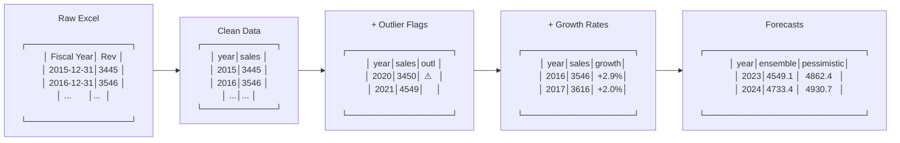
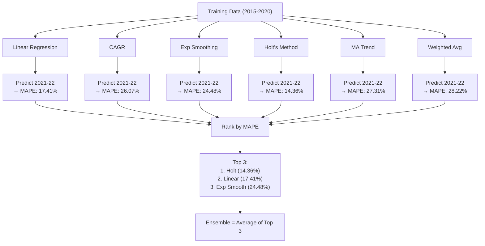
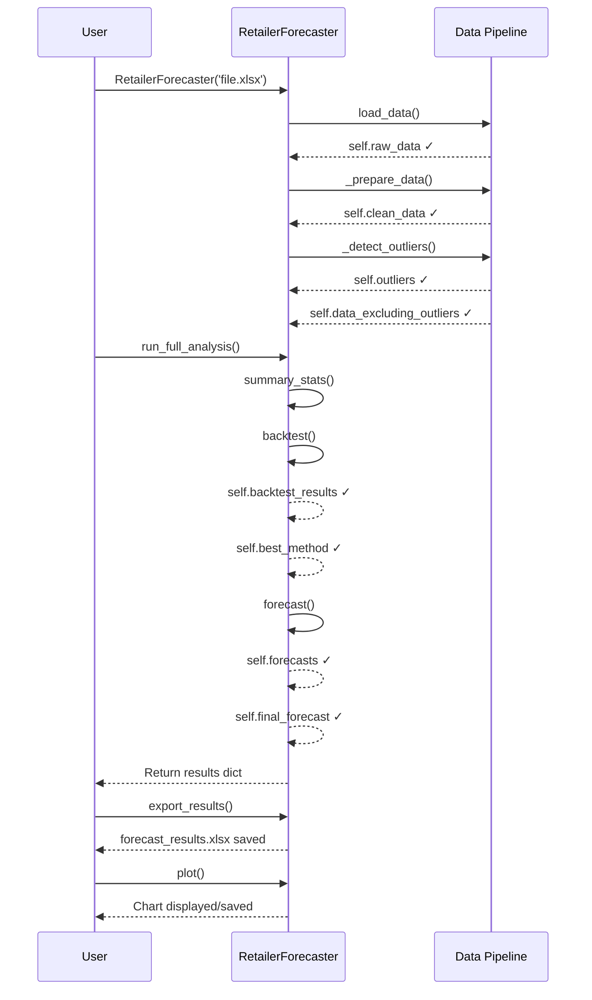
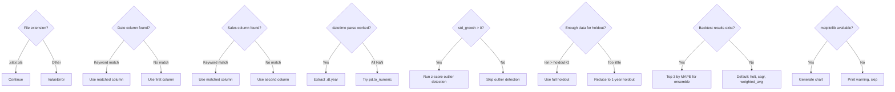
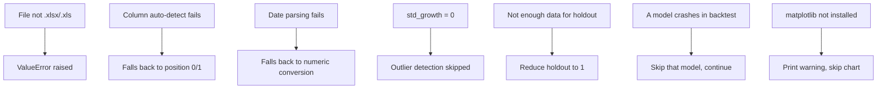

# Complete Flow Diagrams

[← Back to Overview](../README.md)

---

## Master Pipeline Flow

This diagram shows the **complete end-to-end execution** when you call `run_full_analysis()`.

```mermaid
flowchart TD
    START([User calls RetailerForecaster - file.xlsx]) --> INIT

    subgraph INIT["Stage 1: Initialization & Data Loading"]
        A1[load_data] --> A2{File is .xlsx/.xls?}
        A2 -->|Yes| A3[pd.read_excel]
        A2 -->|No| A3X[❌ ValueError]
        A3 --> A4[_prepare_data]
        A4 --> A5[Auto-detect date column]
        A5 --> A6[Auto-detect sales column]
        A6 --> A7[Convert to year + numeric sales]
        A7 --> A8[dropna → dedupe → sort → reset]
        A8 --> A9[self.clean_data ready]
    end

    A9 --> OUTLIER

    subgraph OUTLIER["Stage 2: Outlier Detection"]
        B1[Calculate YoY growth rates]
        B1 --> B2[Compute mean & std of growth]
        B2 --> B3[Z-score for each year]
        B3 --> B4{"|z| > 2.0?"}
        B4 -->|Yes| B5[Add to self.outliers]
        B4 -->|No| B6[Keep as normal]
        B5 --> B7[Create data_excluding_outliers]
        B6 --> B7
    end

    B7 --> ANALYSIS([run_full_analysis called])

    ANALYSIS --> STATS

    subgraph STATS["Stage 3: Summary Statistics"]
        C1[Calculate CAGR]
        C1 --> C2[Calculate avg/median growth]
        C2 --> C3[Calculate volatility, min, max]
        C3 --> C4[Print summary report]
    end

    C4 --> BACKTEST

    subgraph BACKTEST["Stage 5: Backtesting"]
        D1["Split: Train (N-2 yrs) / Test (2 yrs)"]
        D1 --> D2[Run all 6 models on train data]
        D2 --> D3[Predict holdout years]
        D3 --> D4[Calculate MAPE, Bias, RMSE]
        D4 --> D5[Rank by lowest MAPE]
        D5 --> D6[self.best_method selected]
    end

    D6 --> FORECAST

    subgraph FORECAST["Stages 4+6: Forecasting & Ensemble"]
        E1[Run all 6 models on FULL data]
        E1 --> E2[Select top 3 from backtest]
        E2 --> E3[Ensemble = avg of top 3]
        E3 --> E4[Calculate P25/P50/P75 scenarios]
        E4 --> E5[self.final_forecast DataFrame]
    end

    E5 --> GROWTH[Calculate implied YoY growth rates]

    GROWTH --> OUTPUT

    subgraph OUTPUT["Stage 7: Export & Visualization"]
        F1["export_results() → 4-sheet Excel"]
        F2["plot() → matplotlib chart"]
    end

    OUTPUT --> DONE([Analysis Complete - Return results dict])
```



---

## Data Transformation Flow

Shows how data is transformed at each stage.



---

## Model Competition Flow

How the 6 models compete in backtesting.



---

## Class Attribute Lifecycle

When each attribute gets set during execution.



---

## Decision Points in the Pipeline



---

## Object State at Each Stage

```
After __init__():
  ┌──────────────────────────────────────────┐
  │ raw_data            = DataFrame (raw)    │
  │ clean_data          = DataFrame (clean)  │
  │ data_excluding_out  = DataFrame          │
  │ outliers            = [2020] or []       │
  │ forecasts           = {}                 │ ← empty
  │ backtest_results    = {}                 │ ← empty
  │ best_method         = None               │
  │ final_forecast      = None               │
  └──────────────────────────────────────────┘

After run_full_analysis():
  ┌──────────────────────────────────────────┐
  │ raw_data            = DataFrame (raw)    │
  │ clean_data          = DataFrame (clean)  │
  │ data_excluding_out  = DataFrame          │
  │ outliers            = [2020] or []       │
  │ forecasts           = {6 model results}  │ ← populated
  │ backtest_results    = DataFrame          │ ← populated
  │ best_method         = 'holt'             │ ← selected
  │ final_forecast      = DataFrame          │ ← populated
  └──────────────────────────────────────────┘
```

---

## Error Handling Paths



---

[← Back to Overview](../README.md)
