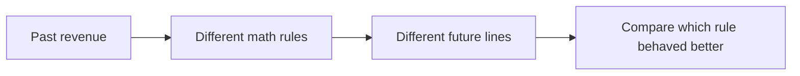

# 00 Start Here For New People

If you are new to AI/ML, start here.

This page is easier to understand if you think of it as:

- old revenue numbers go in
- a few different math rules look at those old numbers
- each rule gives a future estimate
- the page compares those rules

## The simplest possible picture



## New word: actuals

Before this word appears anywhere else:

- `actuals` means real historical numbers
- not guessed numbers
- not forecast numbers

On this page:

- actuals = historical annual revenue from the database

## New word: forecast

Before this word appears anywhere else:

- `forecast` means a future estimate
- not a fact yet
- a best guess made from a rule

On this page:

- forecast = future annual revenue generated by one of the models

## New word: model

Before this word appears anywhere else:

- `model` means one method or one rule
- not a human opinion
- not a manual edit

Examples on this page:

- Linear Regression
- CAGR
- Exponential Smoothing
- Holt's Linear Trend
- Moving Average Trend
- Weighted Average Growth

## New word: training data

Before this word appears anywhere else:

- `training data` means the old data the model looks at
- on this page it is the cleaned historical revenue series

This page does not train a large AI model.

It only feeds old revenue numbers into small forecasting methods.

## New word: backtest

Before this word appears anywhere else:

- `backtest` means pretending we are in the past
- hiding the latest real years
- asking each model to predict them
- then checking which model was closest

Think of it like this:

- cover the answer with your hand
- guess the answer
- uncover it
- see how close you were

## New word: ensemble

Before this word appears anywhere else:

- `ensemble` means a blend
- on this page it is the average of the top 3 better-performing models

Why use it:

- one model can be too high
- another can be too low
- a blend is often more balanced

## New word: scenario

Before this word appears anywhere else:

- `scenario` means a what-if path
- not the main model winner
- not a guarantee

On this page:

- pessimistic = lower-growth path
- baseline = middle path
- optimistic = higher-growth path

## New word: growth rate

Before this word appears anywhere else:

- `growth rate` means how much revenue changed from one year to the next

Formula:

```text
growth rate = (this year revenue - last year revenue) / last year revenue
```

Example:

- 2024 revenue = 100
- 2025 revenue = 110

Then:

```text
growth rate = (110 - 100) / 100 = 0.10 = 10%
```

## One simple worked example

Suppose a company had revenue:

| Year | Revenue |
| --- | --- |
| 2022 | 100 |
| 2023 | 110 |
| 2024 | 121 |

Things the page can do with this:

- CAGR sees steady compounding and may continue near 10%
- Linear Regression sees a straight upward trend
- Moving Average Trend sees recent growth is 10% and may continue 10%
- Weighted Average Growth gives more weight to the latest growth values

That is why one company can have multiple valid forecast lines.

## One real example from the current page

For `ANF` on the live page:

- latest actual revenue = `5.266B` in `2026`
- best model right now = `MA Trend`
- 2027 forecasts shown on the page are:

| Model | 2027 forecast |
| --- | --- |
| Linear Regression | 4.4B |
| CAGR | 5.4B |
| Exponential Smoothing | 4.8B |
| Holt's Linear Trend | 4.9B |
| Moving Average Trend | 5.9B |
| Weighted Average Growth | 5.5B |
| Ensemble | 5.6B |

This is the easiest way to explain the whole page:

- same history
- different rules
- different forecast lines

## What to tell a non-technical person

You can say:

> We take the company's real annual revenue history, run several simple forecasting methods, compare how they would have performed on recent years, and then show each method plus a blended view.
