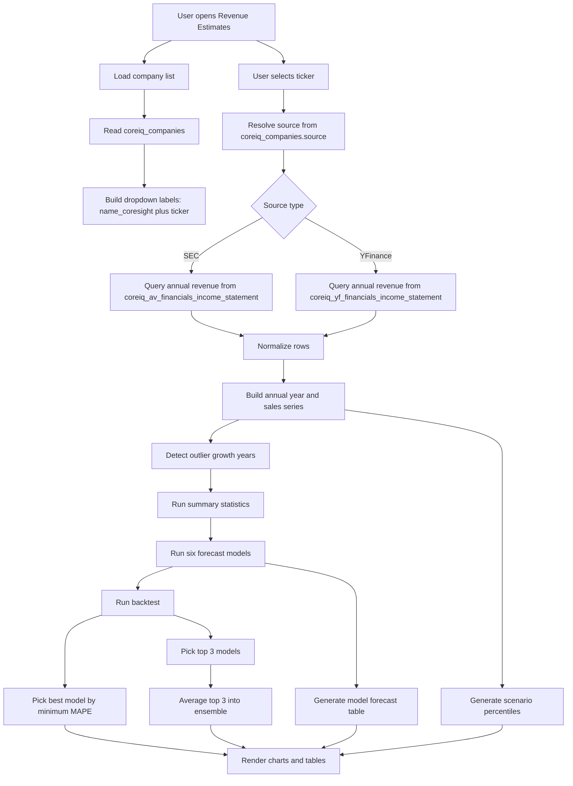
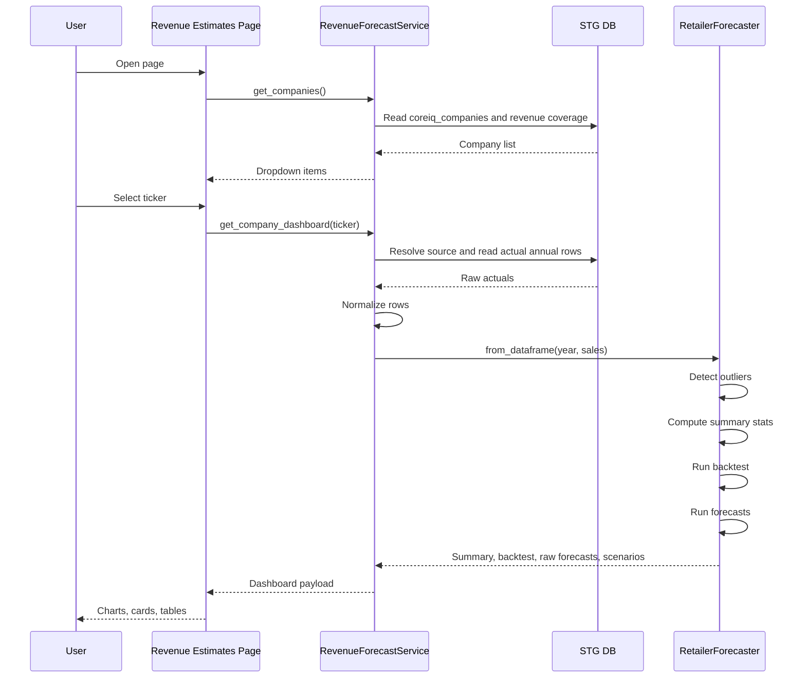

# 01 System Flow

This file explains the complete end-to-end runtime flow for the Revenue Estimates page.

## End-to-end architecture

## Runtime sequence

## Main components

### 1. Company list

Source:

- `coreiq_companies`

Used fields:

- `ticker`
- `name_coresight`
- `source`

Why:

- `ticker` is the unique identity
- `name_coresight` is the approved display label
- `source` decides whether the company should use SEC or YFinance actuals

### 2. Actual revenue retrieval

Source is chosen using `coreiq_companies.source`.

- `SEC` -> `coreiq_av_financials_income_statement`
- `YFinance` -> `coreiq_yf_financials_income_statement`

### 3. Forecast engine

The forecast engine is `RetailerForecaster`.

It expects a simple normalized dataset:

| Column | Meaning |
| --- | --- |
| `year` | fiscal year as integer |
| `sales` | annual revenue |

### 4. UI output

The page then renders:

- company summary cards
- actual revenue line
- individual model outputs
- backtest metrics
- ensemble projection
- scenario projections
- data lineage and calculation notes

## Why the system is structured this way

This design keeps the page:

- read-only against STG DB
- independent from Excel uploads
- reusable across SEC and non-SEC companies
- explainable because all model logic lives in one forecasting engine
- extensible because new models can be added in one place and surfaced in the UI
