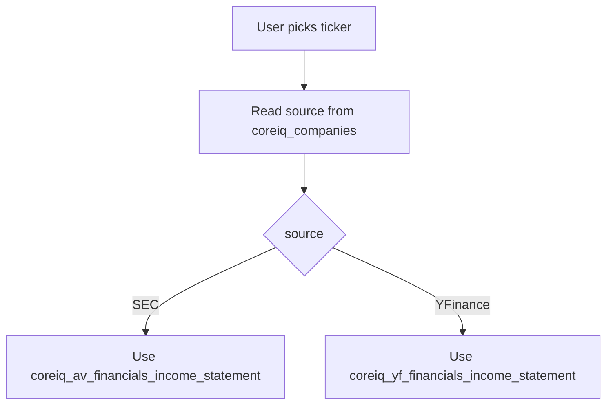

# 02 Data Sources And Preparation

This file explains the input side of the page in very plain language.

Before any model starts, the page must answer:

1. which company did the user pick
2. which table holds that company's actuals
3. how do we turn that raw table data into one clean yearly revenue line

## First new word: table

A `table` is:

- a named dataset in the database

Think of it like:

- one Excel sheet stored inside the database

## Second new word: column

A `column` is:

- one field inside a table

Examples:

- `ticker`
- `name_coresight`
- `total_revenue`

## Step 1. Find the company identity

The page first reads:

- `coreiq_companies`

Columns used:

- `ticker`
- `name_coresight`
- `source`

### What each column means

`ticker`

- the short market code like `ANF` or `ADS`

`name_coresight`

- the approved company label used in the UI

`source`

- tells us where the actual financial data lives

Possible values:

- `SEC`
- `YFinance`

## What the page shows in the dropdown

Display label format:

```text
name_coresight (ticker)
```

Real example:

```text
Abercrombie & Fitch Co. (ANF)
```

## Step 2. Decide which actuals table to use



## Step 3. If source is SEC

Table used:

- `coreiq_av_financials_income_statement`

Important columns:

- `ticker`
- `fiscal_date_ending`
- `total_revenue`
- `gross_profit`
- `operating_income`
- `net_income`
- `ebitda`
- `reported_currency`
- `report_type`

Filter used:

```text
report_type = annual
```

The main model input from this table is:

- year from `fiscal_date_ending`
- revenue from `total_revenue`

The other columns are extra financial context for the page.

## Step 4. If source is YFinance

Table used:

- `coreiq_yf_financials_income_statement`

Important columns:

- `ticker`
- `period_end`
- `frequency`
- `line_item`
- `value`

Filter used:

```text
frequency = annual
```

### One new phrase: line item

`line item` means:

- one financial metric name

Examples:

- `Total Revenue`
- `Gross Profit`
- `Net Income`

For YFinance data, revenue is not already in one dedicated column per year.

So the service rebuilds it using:

```text
line_item = Total Revenue
```

## Step 5. Build one yearly revenue line

After reading either source, the service creates normalized rows.

This means:

- both SEC and YFinance are reshaped into one common format

Important output fields include:

- `period_date`
- `fiscal_year`
- `total_revenue`
- `total_revenue_billions`
- `growth_pct`
- `source`
- `source_table`

## Step 6. Compute year-over-year growth

Formula:

```text
growth_pct = ((current_revenue - previous_revenue) / abs(previous_revenue)) * 100
```

Plain English:

- compare this year to last year
- turn the change into a percent

## Step 7. Build the tiny model input frame

The forecasting engine does not need every raw column.

It only needs:

| Column | Meaning |
| --- | --- |
| `year` | which fiscal year |
| `sales` | what revenue was in that year |

That is the key simplification step.

Many raw columns go in.

One clean yearly line comes out.

## Real example: ANF

For `ANF`:

- source = `SEC`
- table used = `coreiq_av_financials_income_statement`
- latest actual revenue on the page = `5.266B` for `2026`

## Real example: ADS

For `ADS`:

- source = `YFinance`
- table used = `coreiq_yf_financials_income_statement`
- latest actual revenue on the page = `24.811B` for `2025`

## Why this preparation matters

The models can only work properly if the data becomes:

- one row per year
- one revenue value per year
- no duplicate years
- no mixed quarterly and annual rows

That is why the preparation step is so important.
