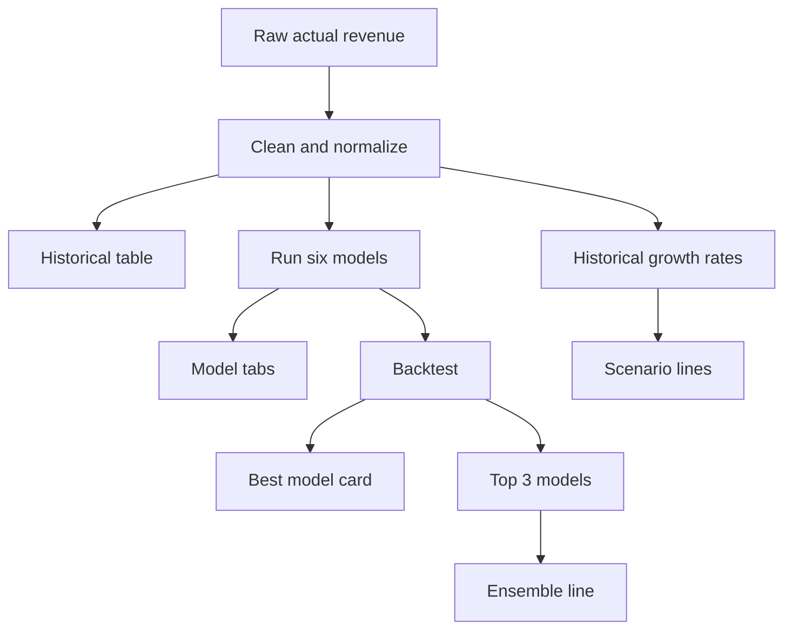

# 11 UI Number Mapping

This file answers one question:

- when a user sees a number on the Revenue Estimates page, where did it come from

## Top cards

### Historical years

Meaning:

- count of usable yearly revenue points after cleaning

Plain English:

- how many years of history the model had to learn from

### Forecast periods

Meaning:

- number of future years shown in the forecast table and charts

Current default:

- `5`

### Best model

Meaning:

- the model with the lowest backtest MAPE

Plain English:

- the model that missed the hidden test years by the smallest average percentage

### Source

Meaning:

- where the actual data came from

Possible values:

- `SEC`
- `YFinance`

## Historical data table

### Revenue

Meaning:

- real historical annual revenue from the database

### Growth %

Formula:

```text
growth % = ((current_revenue - previous_revenue) / abs(previous_revenue)) * 100
```

Plain English:

- how much this year changed versus last year

### Outlier flag

Meaning:

- whether that year's growth was unusually far from the normal growth pattern

## Model tabs

Each model tab shows:

- training actuals
- that model's future forecast line

For Linear Regression, the tab can also show:

- an interval band

## Backtest table

### MAPE

Meaning:

- average percentage miss

### Bias

Meaning:

- whether the model usually overpredicted or underpredicted

### RMSE

Meaning:

- average miss size, with larger misses punished more

## Ensemble line

Meaning:

- average of the top 3 backtested model forecasts

Example from current ANF page for 2027:

```text
(5.9 + 5.5 + 5.4) / 3 = 5.6
```

## Scenario lines

Meaning:

- planning paths based on historical growth percentiles

Not the same as:

- best model
- ensemble

## One full page reading example

For current `ANF`:

- latest actual revenue = `5.266B`
- best model = `MA Trend`
- 2027 MA Trend = `5.9B`
- 2027 Ensemble = `5.6B`

How to explain that:

- actual history ended at `5.266B`
- recent ANF growth was strong
- MA Trend leaned hardest into that recent momentum
- ensemble blended the top 3 models, so it came out a bit lower than MA Trend

## Flow chart



## What to say while presenting it

You can say:

> Every number on the page comes from either the real historical revenue table, one of the six model formulas, the backtest comparison, the ensemble average, or the scenario percentile calculation.
