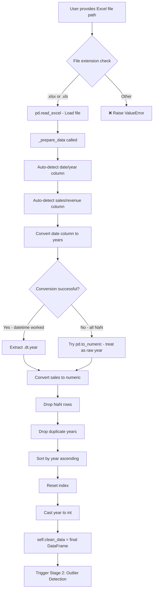

# Stage 1: Data Loading & Preparation

[← Back to Overview](../README.md) | [Next: Stage 2 — Outlier Detection →](stage_2_outlier_detection.md)

---

## Purpose

This is the **entry point** of the entire pipeline. When you create a `RetailerForecaster` object, Stage 1 runs automatically. Its job is to:

1. Read the raw Excel file from disk
2. Auto-detect which column is the date/year and which is the sales/revenue
3. Convert dates to years, clean invalid data
4. Produce a standardized 2-column DataFrame (`year`, `sales`)

---

## Flow Diagram



---

## Detailed Walkthrough

### Step 1: File Loading (`load_data`)

```python
def load_data(self, file_path: str) -> 'RetailerForecaster':
    if file_path.endswith('.xlsx') or file_path.endswith('.xls'):
        self.raw_data = pd.read_excel(file_path)
    else:
        raise ValueError("Only Excel files (.xlsx, .xls) are supported.")
    self._prepare_data()
    return self
```

**What happens**: 
- Checks the file extension — ONLY `.xlsx` and `.xls` are accepted
- Uses `pandas.read_excel()` to parse the entire workbook (first sheet by default)
- Stores raw data in `self.raw_data` before any cleaning
- Immediately calls `_prepare_data()` to clean and standardize

**Why Excel only?** The data team's workflow revolves around Excel files from CapIQ and internal sources. CSV support was intentionally omitted for simplicity.

---

### Step 2: Auto-Detect Date Column

```python
date_col = None
for col in df.columns:
    col_lower = col.lower()
    if any(term in col_lower for term in ['date', 'year', 'period', 'time']):
        date_col = col
        break

if date_col is None:
    date_col = df.columns[0]  # Assume first column is date
```

**What happens**:
- Loops through ALL column names in the Excel file
- Converts each name to lowercase and checks if it contains: `date`, `year`, `period`, or `time`
- Takes the **first match** it finds
- **Fallback**: If no column name matches, assumes the **first column** is the date

**Example — What column names would match?**

| Column Name | Matches? | Why |
|-------------|----------|-----|
| `Year` | ✅ | Contains "year" |
| `Fiscal Year` | ✅ | Contains "year" |
| `Date` | ✅ | Contains "date" |
| `Period End` | ✅ | Contains "period" |
| `Timestamp` | ✅ | Contains "time" |
| `FY` | ❌ | None of the keywords |
| `Quarter` | ❌ | None of the keywords → falls back to first column |

---

### Step 3: Auto-Detect Sales Column

```python
sales_col = None
for col in df.columns:
    col_lower = col.lower()
    if any(term in col_lower for term in ['sales', 'revenue', 'amount', 'value']):
        sales_col = col
        break

if sales_col is None:
    sales_col = df.columns[1]  # Assume second column is sales
```

**Same logic** as date detection but looks for: `sales`, `revenue`, `amount`, `value`.

**Fallback**: Second column is assumed to be sales.

---

### Step 4: Date-to-Year Conversion (Two-Pass Strategy)

```python
# Pass 1: Try parsing as datetime
df['year'] = pd.to_datetime(df[date_col], errors='coerce').dt.year

# Pass 2: If that failed, try treating as raw numbers
if df['year'].isna().all():
    df['year'] = pd.to_numeric(df[date_col], errors='coerce')
```

**Why two passes?**

| Input Format | Pass 1 Result | Pass 2 Needed? |
|-------------|---------------|----------------|
| `2022-12-31` | 2022 | No |
| `12/31/2022` | 2022 | No |
| `Jan 1, 2022` | 2022 | No |
| `2022` (number) | NaN (fails) | Yes → 2022 |
| `FY2022` | NaN (fails) | NaN (also fails) ⚠️ |

The `errors='coerce'` parameter means: if conversion fails for a row, put `NaN` instead of crashing.

---

### Step 5: Sales Conversion

```python
df['sales'] = pd.to_numeric(df[sales_col], errors='coerce')
```

Converts the sales column to numeric. Handles cases where sales might be stored as strings (e.g., `"3,445"` — though commas in Excel cells are usually handled by `read_excel`).

---

### Step 6: Cleaning Pipeline

```python
self.clean_data = (
    df[['year', 'sales']]
    .dropna()                          # Remove rows with NaN in year or sales
    .drop_duplicates(subset=['year'])   # Keep only one entry per year
    .sort_values('year')               # Chronological order
    .reset_index(drop=True)            # Clean 0-based index
)
self.clean_data['year'] = self.clean_data['year'].astype(int)
```

**Chain of operations:**

| Operation | Before | After | Why |
|-----------|--------|-------|-----|
| `dropna()` | 10 rows (2 have NaN) | 8 rows | Can't forecast with missing data |
| `drop_duplicates('year')` | 8 rows (duplicate 2020) | 7 rows | One value per year needed |
| `sort_values('year')` | Random order | 2015, 2016, ... | Time series must be ordered |
| `reset_index(drop=True)` | Index: [0,2,4,7...] | Index: [0,1,2,3...] | Clean sequential index |
| `.astype(int)` | 2015.0, 2016.0 | 2015, 2016 | Years should be integers |

---

### Step 7: Summary Print

```python
print(f"✓ Loaded {len(self.clean_data)} years of data")
print(f"  Period: {self.clean_data['year'].min()} - {self.clean_data['year'].max()}")
if self.outliers:
    print(f"  Detected outliers: {self.outliers}")
```

Gives immediate feedback so you know the data loaded correctly.

**Example output:**
```
✓ Loaded 8 years of data
  Period: 2015 - 2022
```

---

## What Gets Stored After Stage 1

| Attribute | Type | Content |
|-----------|------|---------|
| `self.raw_data` | DataFrame | Original unmodified Excel data |
| `self.clean_data` | DataFrame | Cleaned `[year, sales]` DataFrame |

---

## Edge Cases & Gotchas

1. **Non-English column names**: If columns are in another language (e.g., "Umsatz" for sales in German), the auto-detection fails silently and falls back to column position (first = date, second = sales)
2. **Multiple sheets**: Only the **first sheet** is read. If your data is on Sheet2, you'll need to modify the code
3. **Quarterly data**: If you have quarterly data (Q1 2022, Q2 2022...), multiple rows map to the same year — `drop_duplicates('year')` keeps only the **first one**, which is probably wrong. This system is designed for **annual data only**
4. **Negative sales**: No validation for negative values — they'll pass through and may cause mathematical errors in CAGR/growth calculations

---

[← Back to Overview](../README.md) | [Next: Stage 2 — Outlier Detection →](stage_2_outlier_detection.md)
