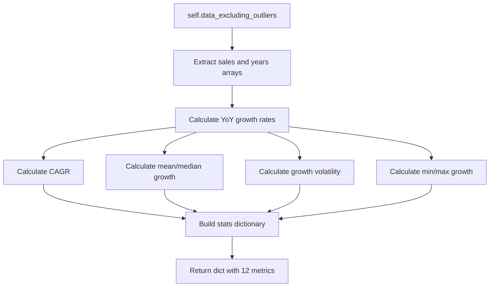

# Stage 3: Summary Statistics

[← Stage 2: Outlier Detection](stage_2_outlier_detection.md) | [Back to Overview](../README.md) | [Next: Stage 4 — Forecasting Models →](stage_4_forecasting_models.md)

---

## Purpose

Before any forecasting happens, you need to **understand your data**. This stage calculates a comprehensive set of descriptive statistics that characterize the retailer's historical revenue pattern — trend strength, growth consistency, volatility, and range.

These numbers also appear in the final printed report and exported Excel file.

---

## Flow Diagram



---

## Every Metric Explained

### 1. **n_years** — Number of Data Points

```python
n_years = len(sales)
```

Simply how many years of data you have. More years = more reliable forecasts.

| n_years | Data Quality |
|---------|-------------|
| 3-4 | Minimal — forecasts will be rough |
| 5-8 | Acceptable — most retailers |
| 10+ | Good — robust models |

---

### 2. **first_year / last_year** — Data Range

The earliest and latest year in the dataset.

---

### 3. **first_sales / last_sales** — Starting and Ending Revenue

The sales value for the first and last year. Used to calculate total growth.

---

### 4. **total_growth_pct** — Total Growth Over Entire Period

$$\text{Total Growth} = \left(\frac{\text{Last Sales}}{\text{First Sales}} - 1\right) \times 100$$

**Example**: (4795 / 3445 - 1) × 100 = **39.2%** total growth over 7 years.

---

### 5. **cagr_pct** — Compound Annual Growth Rate ⭐

This is the **most important single metric**. CAGR answers: "What constant annual growth rate would take you from the first value to the last?"

$$\text{CAGR} = \left(\frac{\text{Last Sales}}{\text{First Sales}}\right)^{\frac{1}{n-1}} - 1$$

```python
cagr = (np.power(sales[-1] / sales[0], 1 / (n_years - 1)) - 1)
```

**Example**: 
$$\text{CAGR} = \left(\frac{4795}{3445}\right)^{\frac{1}{7}} - 1 = 1.392^{0.143} - 1 = 0.048 = 4.8\%$$

**Think of it this way**: If the retailer grew at exactly 4.8% every single year starting from 3,445, they'd reach 4,795 after 7 years.

| CAGR | Interpretation (Retail) |
|------|------------------------|
| < 0% | Declining business |
| 0-3% | Stable / mature |
| 3-7% | Healthy growth |
| 7-15% | Strong growth |
| 15%+ | Hypergrowth (e-commerce, new entrants) |

---

### 6. **avg_annual_growth_pct** — Simple Average Growth

$$\text{Avg Growth} = \frac{1}{n-1}\sum_{t=1}^{n-1} g_t$$

Where $g_t$ is the growth rate for year $t$.

**Example**: (2.9 + 2.0 + 9.3 + 0.8 - 13.4 + 31.9 + 5.4) / 7 = **5.6%**

**Why is avg (5.6%) different from CAGR (4.8%)?** CAGR only looks at start and end points. Average includes every year's growth rate equally. When growth is volatile, these diverge — average is pulled up by the extreme 31.9% year.

---

### 7. **median_annual_growth_pct** — Middle Growth Rate

The **median** growth rate — more robust to outliers than the average.

**Example**: Sorted growth rates = [-13.4, 0.8, 2.0, **2.9**, 5.4, 9.3, 31.9] → Median = **2.9%**

**When median << average**, it signals that high growth years are pulling the average up (skewed distribution).

---

### 8. **growth_volatility_pct** — Standard Deviation of Growth

$$\text{Volatility} = \sigma(\text{growth rates}) \times 100$$

```python
growth_volatility_pct = np.std(growth_rates) * 100
```

**Example**: σ(growth rates) ≈ 0.126 → **12.6%**

| Volatility | Interpretation |
|-----------|----------------|
| < 3% | Very stable (grocery, utilities) |
| 3-8% | Normal retail |
| 8-15% | Volatile (fashion, discretionary) |
| 15%+ | Highly unpredictable |

**Why it matters for forecasting**: High volatility means wider confidence intervals — forecasts are less certain.

---

### 9. **min_growth_pct / max_growth_pct** — Extremes

The worst and best single-year growth rates.

**Example**: min = **-13.4%** (2020), max = **+31.9%** (2021)

---

### 10. **outliers_excluded** — Which Years Were Removed

List of years that were identified as outliers in Stage 2 and excluded from this calculation.

---

## Complete Example Output

```python
stats = forecaster.summary_stats()
```

```python
{
    'n_years': 8,
    'first_year': 2015,
    'last_year': 2022,
    'first_sales': 3445.0,
    'last_sales': 4795.0,
    'total_growth_pct': 39.2,
    'cagr_pct': 4.8,
    'avg_annual_growth_pct': 5.6,
    'median_annual_growth_pct': 2.9,
    'growth_volatility_pct': 12.6,
    'min_growth_pct': -13.4,
    'max_growth_pct': 31.9,
    'outliers_excluded': []
}
```

---

## How These Stats Feed Into Later Stages

| Statistic | Used In | How |
|-----------|---------|-----|
| CAGR | Stage 4 (CAGR model) | Direct projection basis |
| Growth volatility | Stage 6 (Scenarios) | Determines scenario spread |
| Median growth | Stage 6 (Baseline scenario) | Used as baseline growth rate |
| Growth rates | Stage 4 (MA Trend, Weighted Avg) | Input to growth-based models |

---

## `exclude_outliers` Parameter

```python
def summary_stats(self, exclude_outliers: bool = True) -> dict:
    df = self.data_excluding_outliers if exclude_outliers else self.clean_data
```

By default, stats are calculated on the **outlier-excluded** dataset. Pass `exclude_outliers=False` to include all years.

**Why exclude by default?** If 2020 (COVID) is in the data, it drags down CAGR and inflates volatility, making the stats less representative of the retailer's "normal" trajectory.

---

[← Stage 2: Outlier Detection](stage_2_outlier_detection.md) | [Back to Overview](../README.md) | [Next: Stage 4 — Forecasting Models →](stage_4_forecasting_models.md)
