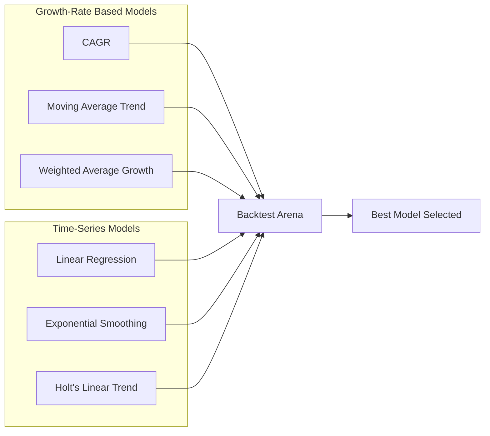

# Stage 4: Forecasting Models (6 Methods)

[← Stage 3: Summary Statistics](stage_3_summary_statistics.md) | [Back to Overview](../README.md) | [Next: Stage 5 — Backtesting →](stage_5_backtesting.md)

---

## Purpose

This is the **core analytical engine** of the system. Six different forecasting methods are applied to the same historical data. Each method makes different assumptions about how revenue will grow. Later (Stage 5), they compete against each other to determine which is most accurate.

---

## Why 6 Methods?

No single forecasting method works best for all retailers. A mature grocery chain with steady 2% growth behaves very differently from a fast-fashion brand with volatile swings. By running **multiple models** and letting **backtesting pick the winner**, the system adapts automatically.

---

## All 6 Methods at a Glance



---

## Method 1: Linear Regression (`_forecast_linear`)

### How It Works

Fits a straight line through the historical data using **Ordinary Least Squares (OLS)** regression.

$$\text{Sales}_t = \beta_0 + \beta_1 \times \text{Year}_t$$

Where:
- $\beta_0$ = y-intercept (theoretical sales at year 0)
- $\beta_1$ = slope (average annual increase in sales **in absolute terms**)

```python
slope, intercept, r_value, _, std_err = stats.linregress(years, sales)
forecast = intercept + slope * future_years
```

### Worked Example

With our sample data (2015-2022):

```
Linear Regression: Sales = -380,245 + 190.5 × Year

slope = 190.5  →  Sales increase ~190.5 units per year
r² = 0.72      →  72% of variance explained by time
```

**Forecast:**

| Year | Calculation | Forecast |
|------|------------|----------|
| 2023 | -380,245 + 190.5 × 2023 | 5,139 |
| 2024 | -380,245 + 190.5 × 2024 | 5,329 |
| 2025 | -380,245 + 190.5 × 2025 | 5,520 |

### Confidence Intervals

```python
se_forecast = std_err * np.sqrt(1 + 1/n + (future_years - np.mean(years))**2 / np.sum((years - np.mean(years))**2))
ci_90_lower = forecast - 1.645 * se_forecast * np.sqrt(n)
ci_90_upper = forecast + 1.645 * se_forecast * np.sqrt(n)
```

Uses the standard prediction interval formula. The `1.645` corresponds to a **90% confidence interval** (z-value for 95th percentile, one-tailed).

### When Linear Works Best

✅ Steady, consistent growth/decline  
✅ Revenue that increases by a roughly **constant dollar amount** each year  
❌ Poor for accelerating or decelerating growth  
❌ Poor for cyclical patterns  

### Visual Intuition

```
Sales
  │         ╱ ← forecast line extends
  │       ╱
  │     ● ●
  │   ●     ← actual data with scatter
  │  ●  ●
  │ ●
  │●
  └──────────────── Year
```

---

## Method 2: CAGR Projection (`_forecast_cagr`)

### How It Works

Calculates the **Compound Annual Growth Rate** from historical data and applies it forward.

$$\text{CAGR} = \left(\frac{\text{Last Value}}{\text{Base Value}}\right)^{\frac{1}{n}} - 1$$

$$\text{Forecast}_t = \text{Last Sales} \times (1 + \text{CAGR})^t$$

```python
cagr = np.power(sales[-1] / base, 1 / n) - 1
forecast = [sales[-1] * np.power(1 + cagr, i) for i in range(1, periods + 1)]
```

### Optional Lookback Window

The `lookback` parameter lets you calculate CAGR from only the last N years instead of the full history:

```python
if lookback and lookback < len(sales):
    base = sales[-lookback]  # Start from N years ago
    n = lookback - 1
```

**Why?** A retailer that grew 15% in 2015-2018 but only 3% in 2019-2022 — using full history CAGR gives ~8%, but the recent trend (3%) is more representative.

### Worked Example

```
CAGR = (4795/3445)^(1/7) - 1 = 4.8%

Forecast:
  2023: 4795 × 1.048¹ = 5,025
  2024: 4795 × 1.048² = 5,266
  2025: 4795 × 1.048³ = 5,519
```

### When CAGR Works Best

✅ Stable, compounding growth businesses  
✅ When you want a "what if growth continues" baseline  
❌ Ignores recent acceleration/deceleration  
❌ Very sensitive to start/end point choice  

---

## Method 3: Simple Exponential Smoothing with Trend (`_forecast_exp_smoothing`)

### How It Works

Exponential smoothing is a **weighted moving average** where recent observations get more weight. The `alpha` parameter controls how much weight goes to the most recent data.

**Level update equation:**

$$L_t = \alpha \times \text{Sales}_t + (1 - \alpha) \times L_{t-1}$$

Then a simple trend is added:

$$\text{Trend} = L_{\text{last}} - L_{\text{second-to-last}}$$

$$\text{Forecast}_t = L_{\text{last}} + \text{Trend} \times t$$

```python
smoothed = [sales[0]]
for i in range(1, len(sales)):
    smoothed.append(alpha * sales[i] + (1 - alpha) * smoothed[-1])

trend = smoothed[-1] - smoothed[-2]
forecast = [smoothed[-1] + trend * i for i in range(1, periods + 1)]
```

### Understanding Alpha (α)

| Alpha | Behavior | Name |
|-------|----------|------|
| **0.1** | Very smooth — slow to react to changes | Conservative |
| **0.3** | Balanced (default) | Moderate |
| **0.5** | Responds quickly to recent changes | Responsive |
| **0.9** | Almost no smoothing — follows last observation | Reactive |

### Worked Example (α = 0.3)

```
Year  Sales  Smoothed (α=0.3)    Calculation
2015  3445   3445.0               (first value = actual)
2016  3546   3475.3               0.3 × 3546 + 0.7 × 3445 = 3475.3
2017  3616   3517.5               0.3 × 3616 + 0.7 × 3475.3 = 3517.5
2018  3951   3647.6               0.3 × 3951 + 0.7 × 3517.5 = 3647.6
2019  3984   3748.5               0.3 × 3984 + 0.7 × 3647.6 = 3748.5
2020  3450   3658.9               0.3 × 3450 + 0.7 × 3748.5 = 3658.9
2021  4549   3925.9               0.3 × 4549 + 0.7 × 3658.9 = 3925.9
2022  4795   4186.7               0.3 × 4795 + 0.7 × 3925.9 = 4186.7

Trend = 4186.7 - 3925.9 = 260.8 per year

Forecast:
  2023: 4186.7 + 260.8 × 1 = 4,447.5
  2024: 4186.7 + 260.8 × 2 = 4,708.3
  2025: 4186.7 + 260.8 × 3 = 4,969.1
```

### Visual Intuition

```
Sales
  │     ●          ● ← actual (volatile)
  │    ● ●      ●
  │   ●     ●  
  │  ●        ●     
  │ ━━━━━━━━━━━━━━━━ ← smoothed line (much smoother)
  │
  └──────────────── Year
```

### When Exp Smoothing Works Best

✅ Data with noise/irregularities you want to smooth out  
✅ When recent trend direction is important  
❌ The trend calculation here is simplistic (only last two smoothed points)  
❌ Can lag behind sudden shifts  

---

## Method 4: Holt's Linear Trend Method (`_forecast_holt`) ⭐

### How It Works

Holt's method is an **improvement over simple exponential smoothing**. It tracks TWO components separately:
1. **Level** ($L_t$) — the current "base" value
2. **Trend** ($T_t$) — the current rate of change

**Two update equations:**

$$L_t = \alpha \times \text{Sales}_t + (1 - \alpha) \times (L_{t-1} + T_{t-1})$$

$$T_t = \beta \times (L_t - L_{t-1}) + (1 - \beta) \times T_{t-1}$$

**Forecast:**

$$\text{Forecast}_{t+h} = L_t + T_t \times h$$

```python
level = sales[0]
trend = sales[1] - sales[0]

for i in range(1, len(sales)):
    prev_level = level
    level = alpha * sales[i] + (1 - alpha) * (level + trend)
    trend = beta * (level - prev_level) + (1 - beta) * trend

forecast = [level + trend * i for i in range(1, periods + 1)]
```

### Understanding Alpha and Beta

| Parameter | Controls | Default | Effect |
|-----------|----------|---------|--------|
| **α (alpha)** | Level responsiveness | 0.3 | Higher → faster reaction to level changes |
| **β (beta)** | Trend responsiveness | 0.1 | Higher → faster reaction to trend changes |

**Low β (0.1)** = trend changes slowly → more stable forecasts  
**High β (0.5)** = trend reacts quickly → can be volatile  

### Worked Example (α=0.3, β=0.1)

```
Initial: Level = 3445, Trend = 3546 - 3445 = 101

Year 2016 (Sales = 3546):
  Level = 0.3 × 3546 + 0.7 × (3445 + 101) = 1063.8 + 2482.2 = 3546.0
  Trend = 0.1 × (3546.0 - 3445) + 0.9 × 101 = 10.1 + 90.9 = 101.0

Year 2017 (Sales = 3616):
  Level = 0.3 × 3616 + 0.7 × (3546 + 101) = 1084.8 + 2552.9 = 3637.7
  Trend = 0.1 × (3637.7 - 3546) + 0.9 × 101 = 9.17 + 90.9 = 100.1

... (continues for each year)

Final: Level ≈ 4550, Trend ≈ 184

Forecast:
  2023: 4550 + 184 × 1 = 4,734
  2024: 4550 + 184 × 2 = 4,918
  2025: 4550 + 184 × 3 = 5,102
```

### Why Holt Often Wins

In the sample output, Holt had the **lowest MAPE (14.36%)** in backtesting. This is because:

1. It adapts to both level shifts AND trend changes
2. The low beta keeps the trend stable (doesn't overreact to COVID)
3. It naturally recovers after disruptions

### When Holt Works Best

✅ Data with a clear upward or downward trend  
✅ When the trend might be changing over time  
✅ Most general-purpose time series method  
❌ Can't handle seasonality (for that you'd need Holt-Winters)  

---

## Method 5: Moving Average Trend (`_forecast_ma_trend`)

### How It Works

Calculates growth rates for each year, then takes the **simple average of the last N growth rates** (default: last 3 years). Projects forward using this average growth.

```python
growth_rates = np.diff(sales) / sales[:-1]
avg_growth = np.mean(growth_rates[-window:])  # Last 3 years

forecast = []
last = sales[-1]
for _ in range(periods):
    last = last * (1 + avg_growth)
    forecast.append(last)
```

### Worked Example (window=3)

```
Last 3 years' growth rates:
  2020: -13.4%
  2021: +31.9%
  2022: +5.4%

Average = (-13.4 + 31.9 + 5.4) / 3 = +7.97%

Forecast:
  2023: 4795 × 1.0797 = 5,177
  2024: 5177 × 1.0797 = 5,589
  2025: 5589 × 1.0797 = 6,034
```

### Window Size Impact

| Window | What It Captures |
|--------|-----------------|
| **2** | Very recent momentum |
| **3** (default) | Short-term trend |
| **5** | Medium-term average |
| **All** | Full history average (when window > data length) |

### When MA Trend Works Best

✅ When recent growth momentum is the best predictor  
✅ Simple and intuitive  
❌ Very sensitive to the window — includes/excludes one year can change everything  
❌ The COVID dip in the window here makes avg growth misleadingly high  

---

## Method 6: Weighted Average Growth (`_forecast_weighted_avg`)

### How It Works

Similar to MA Trend but gives **linearly increasing weights** to more recent years. Year 1 gets weight 1, Year 2 gets weight 2, etc.

$$\text{Weighted Growth} = \frac{\sum_{t=1}^{n} w_t \times g_t}{\sum_{t=1}^{n} w_t}$$

Where $w_t = t$ (linear weights).

```python
growth_rates = np.diff(sales) / sales[:-1]
weights = np.arange(1, len(growth_rates) + 1)
weighted_growth = np.average(growth_rates, weights=weights)
```

### Worked Example

```
Year  Growth    Weight    Weighted
2016  +2.9%     1         2.9
2017  +2.0%     2         4.0
2018  +9.3%     3         27.9
2019  +0.8%     4         3.2
2020  -13.4%    5         -67.0
2021  +31.9%    6         191.4
2022  +5.4%     7         37.8

Sum of weights = 1+2+3+4+5+6+7 = 28
Weighted growth = (2.9+4.0+27.9+3.2-67.0+191.4+37.8) / 28 = 200.2 / 28 = 7.15%

Forecast:
  2023: 4795 × 1.0715 = 5,138
  2024: 5138 × 1.0715 = 5,505
  2025: 5505 × 1.0715 = 5,899
```

### Why Weighted > Simple Average?

Recent years are generally more representative of current business conditions. A retailer that grew 15% five years ago but only 3% recently — simple average says ~9%, weighted says closer to 5%.

### When Weighted Avg Works Best

✅ When recent performance is most predictive  
✅ Better than simple MA for evolving businesses  
❌ Still affected by outliers (the high 2021 weight=6 pulls it up)  
❌ Linear weights are arbitrary — exponential weights might be better  

---

## Method Comparison Summary

| Method | Type | Key Assumption | Strengths | Weaknesses |
|--------|------|----------------|-----------|------------|
| **Linear** | Regression | Constant $ increase/year | Confidence intervals, R² | Misses compounding |
| **CAGR** | Growth rate | Constant % growth | Simple, intuitive | Ignores recent trends |
| **Exp Smoothing** | Time series | Smooth level + simple trend | Filters noise | Simplistic trend |
| **Holt** | Time series | Adaptive level + trend | Best general-purpose | Two params to tune |
| **MA Trend** | Growth rate | Recent growth continues | Captures momentum | Window sensitivity |
| **Weighted Avg** | Growth rate | Recent years matter more | Recency bias | Still affected by outliers |

---

## All Methods Applied to Sample Data — Forecast Comparison

| Year | Linear | CAGR | Exp Smooth | Holt | MA Trend | Weighted Avg |
|------|--------|------|-----------|------|----------|-------------|
| 2023 | 5,139 | 5,025 | 4,448 | 4,734 | 5,177 | 5,138 |
| 2024 | 5,329 | 5,266 | 4,709 | 4,918 | 5,589 | 5,505 |
| 2025 | 5,520 | 5,519 | 4,970 | 5,102 | 6,034 | 5,899 |

Notice how methods disagree — this is WHY we need backtesting (Stage 5) to pick the best one.

---

[← Stage 3: Summary Statistics](stage_3_summary_statistics.md) | [Back to Overview](../README.md) | [Next: Stage 5 — Backtesting →](stage_5_backtesting.md)
