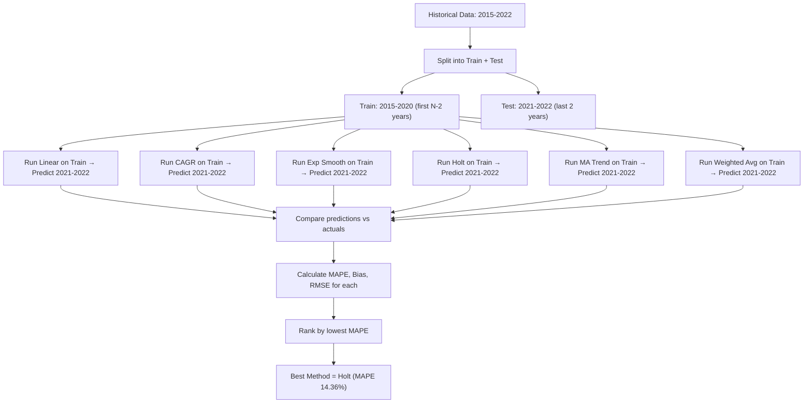

# Stage 5: Backtesting & Model Selection

[← Stage 4: Forecasting Models](stage_4_forecasting_models.md) | [Back to Overview](../README.md) | [Next: Stage 6 — Ensemble & Scenarios →](stage_6_ensemble_scenarios.md)

---

## Purpose

You have 6 forecasting methods, each giving different predictions. **Which one should you trust?** Backtesting answers this by simulating what would have happened if you used each model in the past.

Think of it as a **competition**: each model gets the same training data, makes predictions, and then we check who was closest to reality.

---

## Flow Diagram



---

## How Backtesting Works

### Step 1: Split the Data

```python
holdout_years = 2  # Default

train = df.iloc[:-holdout_years]  # Everything except last 2 years
test = df.iloc[-holdout_years:]   # Last 2 years only
```

**With our sample data:**

```
TRAIN SET (what the model sees):
  2015: 3,445
  2016: 3,546
  2017: 3,616
  2018: 3,951
  2019: 3,984
  2020: 3,450

TEST SET (what we check against):
  2021: 4,549  ← model doesn't see this
  2022: 4,795  ← model doesn't see this
```

The model must predict 2021 and 2022 using ONLY 2015-2020 data. Then we check how close it got.

### Minimum Data Guard

```python
if len(df) <= holdout_years + 2:
    holdout_years = 1  # Fall back to leave-one-out
```

If there's too little data (e.g., 4 years with 2-year holdout leaves only 2 training points), it reduces holdout to 1 year.

---

### Step 2: Run Each Model on Training Data

```python
methods = {
    'linear': self._forecast_linear,
    'cagr': self._forecast_cagr,
    'exp_smoothing': self._forecast_exp_smoothing,
    'holt': self._forecast_holt,
    'ma_trend': self._forecast_ma_trend,
    'weighted_avg': self._forecast_weighted_avg
}

for name, method in methods.items():
    result = method(train_years, train_sales, holdout_years)
    predicted = result['forecast']
```

Each model receives 2015-2020 data and produces 2 predictions (for 2021 and 2022).

---

### Step 3: Calculate Error Metrics

Three metrics are computed for each model:

#### MAPE — Mean Absolute Percentage Error ⭐ (Primary metric)

$$\text{MAPE} = \frac{1}{n} \sum_{i=1}^{n} \left|\frac{\text{Predicted}_i - \text{Actual}_i}{\text{Actual}_i}\right| \times 100$$

```python
mape = np.mean(np.abs(predicted - actual) / actual) * 100
```

**Interpretation**: "On average, the forecast was off by X%"

| MAPE | Quality |
|------|---------|
| < 5% | Excellent |
| 5-10% | Good |
| 10-20% | Acceptable |
| 20-50% | Poor |
| 50%+ | Unusable |

**Example**: If actual = [4549, 4795] and predicted = [3877, 3973]:
```
MAPE = mean(|3877-4549|/4549, |3973-4795|/4795) × 100
     = mean(0.1478, 0.1714) × 100
     = 15.96%
```

#### Bias — Directional Error

$$\text{Bias} = \frac{1}{n} \sum_{i=1}^{n} (\text{Predicted}_i - \text{Actual}_i)$$

```python
bias = np.mean(predicted - actual)
```

**Interpretation**:
- **Negative bias** = model consistently **under-predicts** (conservative)
- **Positive bias** = model consistently **over-predicts** (optimistic)
- **Zero bias** = balanced (but individual errors could still be large)

#### RMSE — Root Mean Square Error

$$\text{RMSE} = \sqrt{\frac{1}{n} \sum_{i=1}^{n} (\text{Predicted}_i - \text{Actual}_i)^2}$$

```python
rmse = np.sqrt(np.mean((predicted - actual) ** 2))
```

**Interpretation**: Like MAPE but in absolute dollar terms, and penalizes large errors more heavily (because of squaring).

---

### Step 4: Rank and Select Winner

```python
self.best_method = self.backtest_results.loc[
    self.backtest_results['mape'].idxmin(), 'method'
]
```

The model with the **lowest MAPE** wins. MAPE is used because:
- It's percentage-based (scale-independent)
- Easy to interpret
- Standard in financial forecasting

---

## Sample Backtest Results Explained

From the actual notebook output:

```
       method  mape    bias   rmse
       linear 17.41  -815.4  821.4
         cagr 26.07 -1220.5 1226.6
exp_smoothing 24.48 -1147.4 1159.6
         holt 14.36  -672.6  677.1    ← WINNER
     ma_trend 27.31 -1278.8 1286.6
 weighted_avg 28.22 -1321.4 1330.6
```

### Analysis of Results

**All methods have NEGATIVE bias** — meaning every model under-predicted. Why? Because the training data ends in 2020 (COVID year, sales = 3,450). The models didn't "know" about the massive 2021 recovery (+31.9%).

**Holt won (MAPE = 14.36%)** because:
- Its adaptive level component partially caught the declining trend
- The low beta kept the trend from going too negative
- It was the least fooled by the COVID dip

**CAGR/MA/Weighted struggled most** because:
- CAGR used the full 2015-2020 range where 2020 was the endpoint (lowest point)
- MA Trend used recent growth rates heavily influenced by 2019→2020 decline
- Weighted Average gave the most weight to the 2020 decline

### Visual: What Each Model Predicted vs Reality

```
Sales
  │
5000│                        ●──● ← ACTUAL (4549, 4795)
  │                     ╱
4500│                  ╱    ▲──▲ ← Holt (closest)
  │               ╱   
4000│  ●──●──●──●──●  ◆──◆ ← Linear
  │ ╱              ╲
3500│●               ●   ■──■ ← CAGR (worst)
  │                  (2020 dip)
3000│
  └────────────────────────── Year
     15  16  17  18  19  20  21  22
     └──── TRAINING ────┘  └ TEST ┘
```

---

## Key Insight: Why Backtesting Matters

Without backtesting, you'd have to **guess** which model to use. Look at how different the forecasts are:

| Year | Holt (best) | CAGR (worst) | Difference |
|------|-------------|-------------|-----------|
| 2023 | 4,734 | 5,025 | 291 (6.1%) |
| 2027 | 5,470 | 6,337 | 867 (15.8%) |

Over 5 years, choosing the wrong model could lead to a **15% error** in your revenue estimate. For a $5B retailer, that's a $750M mistake.

---

## Configuring Backtesting

### `holdout_years` Parameter

```python
forecaster.backtest(holdout_years=2)  # Default
forecaster.backtest(holdout_years=3)  # More rigorous but needs more data
forecaster.backtest(holdout_years=1)  # Minimal test
```

| holdout_years | Training Set | Test Set | Best For |
|-------------|-------------|---------|----------|
| 1 | N-1 years | 1 year | Small datasets (4-5 years) |
| 2 (default) | N-2 years | 2 years | Most cases |
| 3 | N-3 years | 3 years | Large datasets (10+ years) |

### `exclude_outliers` Parameter

```python
forecaster.backtest(exclude_outliers=True)   # Default: remove outlier years
forecaster.backtest(exclude_outliers=False)  # Include everything
```

---

## What Gets Stored After Stage 5

| Attribute | Type | Content |
|-----------|------|---------|
| `self.backtest_results` | DataFrame | All methods with MAPE, bias, RMSE |
| `self.best_method` | str | Name of winning method (e.g., `'holt'`) |

---

## Error Handling

```python
for name, method in methods.items():
    try:
        result = method(train_years, train_sales, holdout_years)
        # ... calculate errors
    except Exception as e:
        print(f"  Method {name} failed: {e}")
```

If any method crashes (e.g., division by zero with constant sales), it's silently skipped rather than stopping the whole pipeline.

---

[← Stage 4: Forecasting Models](stage_4_forecasting_models.md) | [Back to Overview](../README.md) | [Next: Stage 6 — Ensemble & Scenarios →](stage_6_ensemble_scenarios.md)
