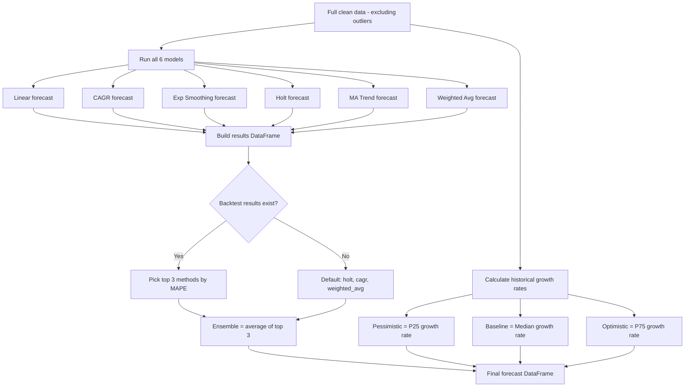

# Stage 6: Ensemble Forecasting & Scenario Analysis

[← Stage 5: Backtesting](stage_5_backtesting.md) | [Back to Overview](../README.md) | [Next: Stage 7 — Export & Visualization →](stage_7_export_visualization.md)

---

## Purpose

Individual models can be wrong. An **ensemble** (average of multiple models) is typically more robust than any single model. This stage:

1. Runs all 6 forecasting models on the **full dataset** (not the train split)
2. Combines the **top 3 models** (from backtesting) into a blended "ensemble" forecast
3. Creates **3 scenario projections** (pessimistic, baseline, optimistic) for risk analysis

---

## Flow Diagram



---

## Part 1: Running All Models on Full Data

```python
self.forecasts = {
    'linear': self._forecast_linear(years, sales, periods),
    'cagr': self._forecast_cagr(years, sales, periods),
    'exp_smoothing': self._forecast_exp_smoothing(years, sales, periods),
    'holt': self._forecast_holt(years, sales, periods),
    'ma_trend': self._forecast_ma_trend(years, sales, periods),
    'weighted_avg': self._forecast_weighted_avg(years, sales, periods)
}
```

**Important difference from backtesting**: In Stage 5, models only saw 2015-2020. Now they see **all years** (2015-2022, minus any outliers). This gives more accurate forecasts because they have more data and the most recent observations.

---

## Part 2: Building the Ensemble

### How Top Models Are Selected

```python
if self.backtest_results is not None and len(self.backtest_results) > 0:
    top_methods = self.backtest_results.nsmallest(3, 'mape')['method'].tolist()
else:
    top_methods = ['holt', 'cagr', 'weighted_avg']  # Defaults
```

**From our sample backtest results:**

| Rank | Method | MAPE |
|------|--------|------|
| 1st | holt | 14.36% |
| 2nd | linear | 17.41% |
| 3rd | exp_smoothing | 24.48% |
| 4th | cagr | 26.07% |
| 5th | ma_trend | 27.31% |
| 6th | weighted_avg | 28.22% |

→ **Top 3**: `holt`, `linear`, `exp_smoothing`

### Ensemble Calculation

```python
results['ensemble'] = np.round(
    results[top_methods].mean(axis=1), 1
)
```

For each forecast year, the ensemble is the **simple average** of the top 3 models:

$$\text{Ensemble}_t = \frac{\text{Holt}_t + \text{Linear}_t + \text{ExpSmooth}_t}{3}$$

### Why Simple Average and Not Weighted?

| Approach | Pros | Cons |
|----------|------|------|
| **Simple average (used)** | Easy, robust, no overfitting | Doesn't reward the best model more |
| Weighted by 1/MAPE | Better models get more influence | Risk of overfitting on backtest period |
| Only use #1 model | Simplest | No diversification benefit |

Simple average was chosen because with small datasets, weighted schemes can overfit to the backtest period.

---

## Part 3: Scenario Analysis

### How Scenarios Are Calculated

```python
growth_rates = np.diff(sales) / sales[:-1]
scenarios = {
    'pessimistic': np.percentile(growth_rates, 25),    # P25
    'baseline': np.median(growth_rates),                # P50 (median)
    'optimistic': np.percentile(growth_rates, 75)       # P75
}
```

The scenarios use **percentiles of historical growth rates** to create three "what-if" projections.

### Understanding Percentiles

If you sort all historical growth rates from worst to best:

```
Sorted growth rates: [-13.4%, +0.8%, +2.0%, +2.9%, +5.4%, +9.3%, +31.9%]
                        ↑              ↑                ↑
                       P25            P50 (median)      P75

P25 = +1.4%   → "In a bad year, we grow about 1.4%"
P50 = +2.9%   → "In a typical year, we grow about 2.9%"  
P75 = +7.4%   → "In a good year, we grow about 7.4%"
```

### Scenario Projection

Each scenario applies its constant growth rate year after year:

$$\text{Scenario}_t = \text{Last Sales} \times (1 + g)^t$$

```python
for scenario, growth in scenarios.items():
    scenario_forecast = []
    last = sales[-1]
    for _ in range(periods):
        last = last * (1 + growth)
        scenario_forecast.append(last)
```

### Worked Example

Starting from 4,795 (2022):

| Year | Pessimistic (1.4%) | Baseline (2.9%) | Optimistic (7.4%) |
|------|-------------------|-----------------|-------------------|
| 2023 | 4,862 | 4,934 | 5,150 |
| 2024 | 4,930 | 5,077 | 5,531 |
| 2025 | 4,999 | 5,224 | 5,940 |
| 2026 | 5,069 | 5,376 | 6,380 |
| 2027 | 5,141 | 5,532 | 6,852 |

**After 5 years:**
- Pessimistic: +7.2% total growth
- Baseline: +15.4% total growth
- Optimistic: +42.9% total growth

---

## Complete Output DataFrame

The final `self.final_forecast` DataFrame has these columns:

| Column | Source | Description |
|--------|--------|-------------|
| `year` | — | Forecast year |
| `linear` | Model #1 | Linear regression forecast |
| `cagr` | Model #2 | CAGR projection |
| `exp_smoothing` | Model #3 | Exponential smoothing |
| `holt` | Model #4 | Holt's method |
| `ma_trend` | Model #5 | Moving average trend |
| `weighted_avg` | Model #6 | Weighted average growth |
| `ensemble` | **Top 3 avg** | **Primary forecast** |
| `scenario_pessimistic` | P25 growth | Downside case |
| `scenario_baseline` | Median growth | Expected case |
| `scenario_optimistic` | P75 growth | Upside case |

---

## Visual: Ensemble vs Scenarios

```
Sales
  │
7000│                              ╱ ← Optimistic
  │                           ╱
6000│                        ╱
  │                     ╱
5500│                 ╱──────── ← Baseline
  │              ╱    ─────── ← Ensemble
5000│           ╱  ──────────── ← Pessimistic
  │        ╱╱
4500│  ●──●
  │ ╱
4000│●
  │
  └──────────────────────────── Year
     2021  2022  2023  2024  2025  2026  2027
     └ Actual ┘  └──── Forecast Period ────┘
```

---

## Why Ensemble ≠ Baseline Scenario

This is a common source of confusion:

| | Ensemble | Baseline Scenario |
|---|---------|-------------------|
| **What it is** | Average of top 3 model forecasts | Median historical growth projected forward |
| **How it's calculated** | Each model has its own logic (regression, smoothing, etc.) | Simple compound growth at median rate |
| **Adapts to** | Trend changes, level shifts, smoothing | Only the median growth rate |
| **Typically better for** | Primary forecast | Sanity check / comparison |

---

## Implied Growth Rates (Bonus Output)

The `run_full_analysis()` method also calculates the year-over-year growth rates implied by the ensemble forecast:

```python
last_actual = self.clean_data['sales'].iloc[-1]
all_values = [last_actual] + forecast['ensemble'].tolist()
growth_rates = [(all_values[i+1]/all_values[i] - 1) * 100 for i in range(len(all_values)-1)]
```

**Sample output:**

| Year | Ensemble Forecast | YoY Growth |
|------|------------------|------------|
| 2023 | 4,549.1 | -5.1% |
| 2024 | 4,733.4 | +4.1% |
| 2025 | 4,917.7 | +3.9% |
| 2026 | 5,102.0 | +3.7% |
| 2027 | 5,286.3 | +3.6% |

Note: The 2023 forecast (-5.1%) is **lower than 2022 actual** — the ensemble predicts a slight pullback before resuming growth. This is because the Holt and Exp Smoothing models account for the COVID dip and its partial recovery.

---

## What Gets Stored After Stage 6

| Attribute | Type | Content |
|-----------|------|---------|
| `self.forecasts` | dict | All 6 model results with details |
| `self.final_forecast` | DataFrame | Complete forecast table (6 models + ensemble + 3 scenarios) |

---

[← Stage 5: Backtesting](stage_5_backtesting.md) | [Back to Overview](../README.md) | [Next: Stage 7 — Export & Visualization →](stage_7_export_visualization.md)
