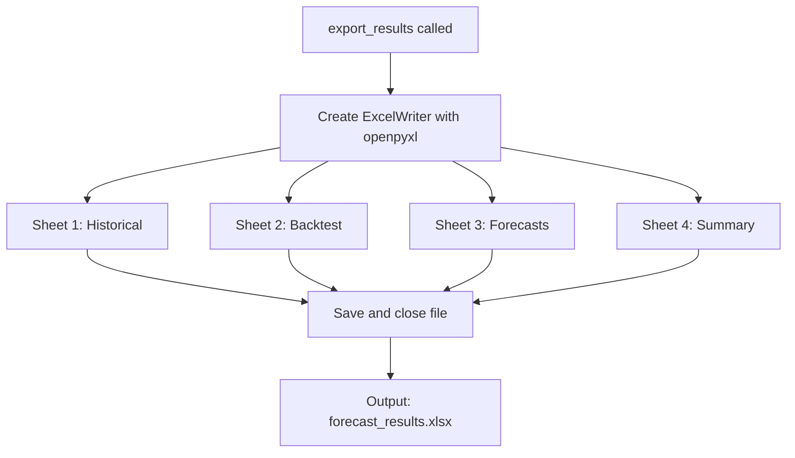
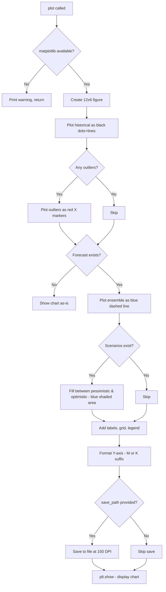
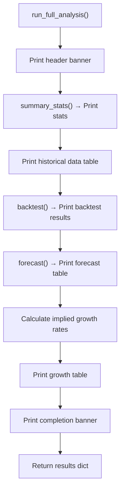

# Stage 7: Export & Visualization

[← Stage 6: Ensemble & Scenarios](stage_6_ensemble_scenarios.md) | [Back to Overview](../README.md)

---

## Purpose

This is the **output stage**. All the analysis from Stages 1-6 is packaged into:
1. A **multi-sheet Excel workbook** for stakeholders and further analysis
2. A **matplotlib chart** showing historical data and forecast with scenarios

---

## Part 1: Excel Export (`export_results`)

### Flow Diagram



### What's in Each Sheet

#### Sheet 1: "Historical"

The cleaned historical data with calculated growth rates.

```python
historical = self.clean_data.copy()
historical['growth_pct'] = (historical['sales'].pct_change() * 100).round(1)
historical.to_excel(writer, sheet_name='Historical', index=False)
```

| year | sales | growth_pct |
|------|-------|-----------|
| 2015 | 3445 | NaN |
| 2016 | 3546 | 2.9 |
| 2017 | 3616 | 2.0 |
| 2018 | 3951 | 9.3 |
| 2019 | 3984 | 0.8 |
| 2020 | 3450 | -13.4 |
| 2021 | 4549 | 31.9 |
| 2022 | 4795 | 5.4 |

#### Sheet 2: "Backtest"

Model comparison results from Stage 5.

| method | mape | bias | rmse |
|--------|------|------|------|
| linear | 17.41 | -815.4 | 821.4 |
| cagr | 26.07 | -1220.5 | 1226.6 |
| exp_smoothing | 24.48 | -1147.4 | 1159.6 |
| holt | 14.36 | -672.6 | 677.1 |
| ma_trend | 27.31 | -1278.8 | 1286.6 |
| weighted_avg | 28.22 | -1321.4 | 1330.6 |

#### Sheet 3: "Forecasts"

Complete forecast table with all models + ensemble + scenarios.

| year | linear | cagr | exp_smoothing | holt | ma_trend | weighted_avg | ensemble | scenario_pessimistic | scenario_baseline | scenario_optimistic |
|------|--------|------|--------------|------|----------|-------------|----------|---------------------|------------------|-------------------|
| 2023 | ... | ... | ... | ... | ... | ... | 4549.1 | 4862.4 | 4935.6 | 5146.8 |
| ... | ... | ... | ... | ... | ... | ... | ... | ... | ... | ... |

#### Sheet 4: "Summary"

One-row summary statistics from Stage 3.

| n_years | first_year | last_year | cagr_pct | avg_annual_growth_pct | ... |
|---------|-----------|----------|---------|---------------------|-----|
| 8 | 2015 | 2022 | 4.8 | 5.6 | ... |

---

## Part 2: Visualization (`plot`)

### Flow Diagram



### Chart Elements

```
┌─────────────────────────────────────────────────────────────┐
│  Retailer Revenue: Historical & Forecast                     │
│                                                              │
│  Sales                                                       │
│  5.5M│                              ╱ ← Optimistic bound    │
│      │                     ▓▓▓▓▓▓▓╱  ← Scenario range      │
│  5.0M│              □───□▓╱▓▓▓▓╱     (blue shaded area)     │
│      │           □╱    ▓▓▓▓╱                                 │
│  4.5M│     ●──●╱╱   ▓╱   ← Pessimistic bound               │
│      │    ╱  ╱                                               │
│  4.0M│ ●●●                                                   │
│      │╱  ╲                                                   │
│  3.5M│    X ← Outlier (red X)                                │
│      │                                                       │
│  3.0M├───┬───┬───┬───┬───┬───┬───┬───┬───┬───┬              │
│      2015  16  17  18  19  20  21  22  23  24  25            │
│                                                              │
│  ● Historical  □ Ensemble Forecast  ▓ Scenario Range  X Out  │
└─────────────────────────────────────────────────────────────┘
```

### Y-Axis Formatting

```python
max_val = ax.get_ylim()[1]
if max_val >= 1_000_000:
    ax.yaxis.set_major_formatter(lambda x, p: f'{x/1e6:.1f}M')
elif max_val >= 1_000:
    ax.yaxis.set_major_formatter(lambda x, p: f'{x/1e3:.0f}K')
```

| Sales Range | Format | Example |
|-------------|--------|---------|
| ≥ 1,000,000 | Millions with 1 decimal | 4.8M |
| ≥ 1,000 | Thousands with 0 decimals | 4800K |
| < 1,000 | Raw numbers | 480 |

### Connection Line

The ensemble forecast line **connects to the last historical point**, not starting from a gap:

```python
years = np.concatenate([[last_year], forecast['year'].values])
ensemble = np.concatenate([[last_sales], forecast['ensemble'].values])
```

This ensures visual continuity between historical and forecast.

---

## `run_full_analysis` — The Orchestrator

This is the **main entry point** that runs everything in sequence and prints a formatted report:

```python
def run_full_analysis(self, forecast_periods: int = 5, holdout_years: int = 2) -> dict:
```

### Execution Order



### Return Value

```python
return {
    'summary_stats': stats,          # dict with 12 metrics
    'historical_data': historical,   # DataFrame
    'backtest_results': backtest,    # DataFrame
    'forecasts': forecast,           # DataFrame
    'best_method': self.best_method  # str
}
```

This lets you programmatically access any result:

```python
results = forecaster.run_full_analysis()

# Access specific outputs
print(results['best_method'])           # 'holt'
print(results['summary_stats']['cagr_pct'])  # 4.8
print(results['forecasts']['ensemble'])      # Series of forecasted values
```

---

## Complete Console Output (What You See)

```
============================================================
RETAILER REVENUE FORECASTING ANALYSIS
============================================================

 DATA SUMMARY
----------------------------------------
  Period: 2015 - 2022 (8 years)
  Sales range: 3,445 → 4,795
  CAGR: 4.8%
  Avg annual growth: 5.6%
  Growth volatility: 12.6%

 HISTORICAL DATA
----------------------------------------
 year  sales  growth_pct outlier
 2015   3445         NaN        
 2016   3546         2.9        
 2017   3616         2.0        
 ...

 BACKTESTING
----------------------------------------
 Backtest complete (holdout: 2 years)
  Best method: holt
       method  mape    bias   rmse
       linear 17.41  -815.4  821.4
         ...

 FORECASTS
----------------------------------------
 Generated 5-year forecast
  Forecast period: 2023 - 2027
 year  ensemble  scenario_pessimistic  scenario_baseline  scenario_optimistic
 2023    4549.1                4862.4             4935.6               5146.8
 ...

 IMPLIED GROWTH RATES
----------------------------------------
 year  forecast  yoy_growth_pct
 2023    4549.1            -5.1
 ...

============================================================
ANALYSIS COMPLETE
============================================================
```

---

## File Output Summary

| File | Content | Generated By |
|------|---------|-------------|
| `forecast_output.xlsx` | 4-sheet Excel workbook | `export_results()` |
| `forecast_chart.png` | 1200×600 chart at 150 DPI | `plot(save_path=...)` |

---

[← Stage 6: Ensemble & Scenarios](stage_6_ensemble_scenarios.md) | [Back to Overview](../README.md)
