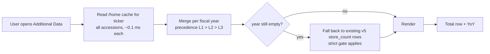

# Store Count Pipeline — free-first, LLM-last, permanently cached

Date: 2026-07-31 · Design doc · No code changed yet

---

## 0. Cost — the headline

Rates **validated against the real July invoice**, not assumed:

| From the OpenAI dashboard (Jul 16–31) | Value |
|---|---|
| Spend | $49.05 |
| Requests | 231,489 |
| Input tokens | 222,054,087 |

222.054M × $0.15/1M = **$33.31** input. Residual $15.74 ÷ $0.60/1M = **26.2M**
output ≈ 113 tokens/request. That reconciles to `gpt-4o-mini` list pricing of
**$0.15 / 1M input, $0.60 / 1M output**. Batch API is −50%.

(That $88/month is the data team's **news segregation** job — unrelated to this
work and not touched by this design. The portal's own LLM path has never run:
`filing_llm_cache` is empty and v5 holds **zero** `source='llm'` rows.)

Token measurements — 25 real filings from our container, `tiktoken` `o200k_base`:

| | Tokens/filing |
|---|---|
| Whole filing | median **106,492** · max 184,464 |
| Top-3 keyword windows | median **1,381** · mean 1,449 |

**Cost per windowed call: $0.000327 → $0.000163 with Batch.**

### Total one-off cost, 1,000 companies

| Share of filings reaching the LLM | 11,000 filings (11 yr) | 15,000 filings (15 yr) |
|---|---|---|
| 100% — worst case, every free layer fails | **$1.80** | **$2.45** |
| 60% | $1.08 | $1.47 |
| 40% | **$0.72** | $0.98 |
| 25% | $0.45 | $0.61 |
| 15% — best case | $0.27 | $0.37 |

**Your ceiling is $1.80 for 1,000 companies × 11 years, ever.** Even if every
single free layer failed on every filing. Steady state after backfill —
~1,000 new 10-Ks a year — is **$0.07–0.18/year**.

For contrast: sending whole filings instead of windows would cost **$176.10**,
a 98× penalty, and would not even fit the 128k context for the largest filings.

---

## 1. Source ladder — free first, paid last

| Layer | Source | Cost | Speed | Notes |
|---|---|---|---|---|
| **L0** | `/home` cache, keyed by accession | $0 | ~0.1 ms | immutable; the steady-state path |
| **L1** | **XBRL facts already in `coreiq_filing_metrics_v5`** | $0 | ~5 ms indexed | issuer-tagged, exact |
| **L2** | Table + prose parse of `filing.html` from Azure | $0 | ~1–2 s | one-off, offline |
| **L3** | LLM on windowed context, Batch API | **$0.000163** | offline | only the residue |

**L1 is the discovery that changes the economics.** The app currently fetches
`us-gaap:NumberOfStores` from EDGAR over the network (`_edgartools_store_totals`,
4-second bounded wait, seconds when cold). Those exact facts are **already in our
own DB**, going back to 2014:

| Ticker | Concept | Rows | Years |
|---|---|---|---|
| ULTA | `us-gaap:NumberOfStores` | 1,241 | 2016–2027 |
| COST | `us-gaap:NumberOfStores` | 464 | 2015–2026 |
| SHAK | `us-gaap:NumberOfRestaurants` | 194 | 2015–2026 |
| ROST | `us-gaap:NumberOfStores` | 155 | 2016–2026 |
| TSCO | `us-gaap:NumberOfStores` | 137 | 2015–2026 |
| FND | `us-gaap:NumberOfStores` | 80 | 2017–2026 |
| ORLY | `us-gaap:NumberOfStores` | 36 | 2014–2025 |

One indexed SQL query replaces a live EDGAR round-trip. Free, and ~1000× faster.

---

## 2. Build-time flow (offline, runs once per filing — ever)

```mermaid
flowchart TD
    A[Filing: ticker + accession] --> B{L0: /home cache<br/>{ACCESSION}.json exists<br/>and extractor_version current?}
    B -->|hit| Z[Done — $0, no work]
    B -->|miss| C[L1: query v5 for<br/>us-gaap:NumberOfStores &amp; siblings<br/>indexed on ticker]
    C --> D{fact found for<br/>this fiscal year?}
    D -->|yes| V[VERIFY]
    D -->|no| E[Fetch filing.html from Azure blob<br/>via archive_blob pointer]
    E --> F[L2: locate store table<br/>row-label OR column-header match<br/>anchor on FYE date<br/>+ prose 'we operated N stores']
    F --> G{candidate found?}
    G -->|yes| V
    G -->|no| H{any keyword window at all?<br/>unit word + total cue + number}
    H -->|no| Y[Non-retail — record 'no store concept'<br/>NEVER call LLM. $0]
    H -->|yes| I[L3: LLM on top-3 windows<br/>~1,700 tok in / 120 out<br/>Batch API]
    I --> V
    V[VERIFY: value must appear literally<br/>in the stored evidence block] --> W{verified?}
    W -->|yes| X[Write /home/filing_extract/store_counts/{ACCESSION}.json<br/>value + evidence_text + source_rule + fye_date + confidence]
    W -->|no| N[Record rejected + reason.<br/>Show '-' in UI, never a guess]
```

The verifier is the part that makes this trustworthy. Measured on all 659
existing rows: values that pass a filing-based check are **100% present in the
filing**; the 35 that aren't present were all correctly rejected. Verification
against the *full evidence block* — not one stored sentence — is what fixes the
28 correct-but-hidden values without admitting the 35 bad ones.

---

## 3. Runtime flow (page render — no network, no LLM, ever)



Runtime **never** calls EDGAR, never calls the LLM, never parses HTML. Worst case
is a disk read on the persistent share (~0.1 ms warm, ~2.4 ms cold). This is what
makes it lightning fast — today's 4-second bounded EDGAR wait disappears entirely.

---

## 4. New company onboarding — same path, no special case

```mermaid
flowchart TD
    A[New ticker added] --> B[List {TICKER}/*/10-K/filing.html in Azure]
    B --> C[For each accession not in /home cache]
    C --> D[Run the build-time ladder L1 → L2 → L3 → verify]
    D --> E[Write JSON per accession]
    E --> F[Served from cache forever after]
    F --> G[Same JSON handed to data team<br/>for v5 ingestion — one source of truth]
```

A brand-new company with 12 filings costs at most **12 × $0.000163 = $0.002**
and is permanent thereafter.

---

## 5. Why the cache never needs refreshing

A 10-K is immutable once filed. Keying on **accession number** (not ticker+year,
not a date) means:

- an existing entry can never go stale — the document behind it cannot change;
- a new fiscal year simply appears as a new accession, and only that one is processed;
- a 10-K/A amendment is a *different* accession, so it is picked up naturally;
- the only thing that forces recomputation is bumping `extractor_version`.

Storage: 4,816 filings × ~4 KB ≈ **20 MB**. `/home` has ~499 GB free and survives
restart and deploy. Requires `WEBSITES_ENABLE_APP_SERVICE_STORAGE=true`
(also needed for the still-unset `EDGAR_CACHE_DIR` — separate standing issue).

---

## 6. Why not regex alone (measured)

A naive two-rule extractor scored **22/45 = 49%** against known-good values:

- **TGT FY2020** — truth 1,868 sits in a row labelled only `Total | 1,868 | 240,516`;
  "stores" appears in the *column header*.
- **CAL FY2021** — truth 1,086; candidates 13 / 50 / 69 / 916 (segment splits).
- **KSS FY2021** — truth 1,174; picked 1,162 (adjacent year's column).

So L2 must be table-structure aware (headers, not just row labels, anchored on the
FYE date), and L3 exists for the genuine residue. That residue is what the $0.27–$1.80
buys.

---

## 7. Rollout order

1. **Revert the corroboration fallback** — it is currently displaying 10 values
   that are provably absent from their filings (WMT ×3, SHW ×4, TJX, LEVI, UPBD).
2. Build L1+L2 offline and **score them** against the 596 known-good values.
   This is free and tells us the true L3 residue before a cent is spent.
3. Run L3 over the residue via Batch API. Expected **$0.27–$1.80**.
4. Ship the runtime cache read; delete the live EDGAR call from the render path.
5. Hand the JSON to the data team for v5 ingestion.
