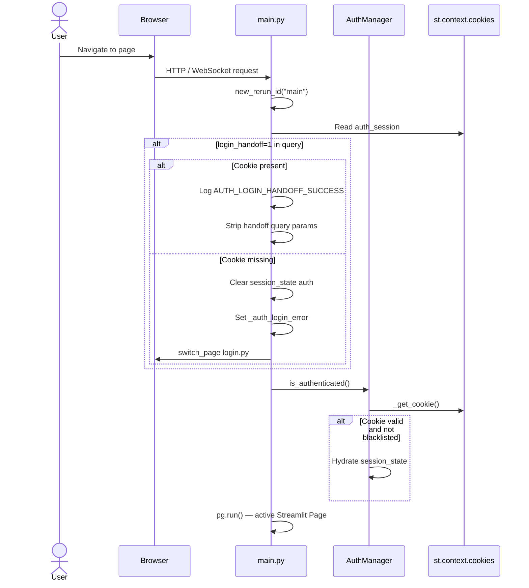
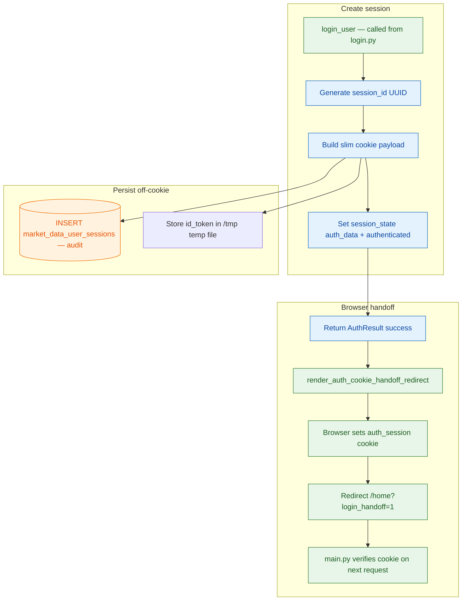
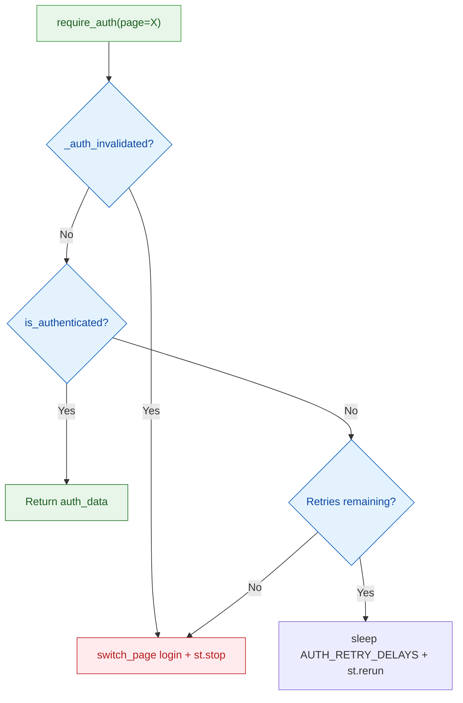
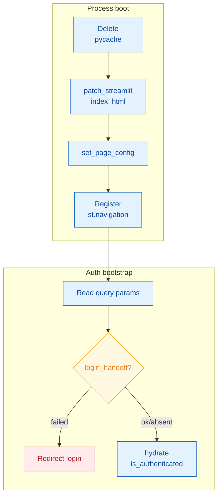
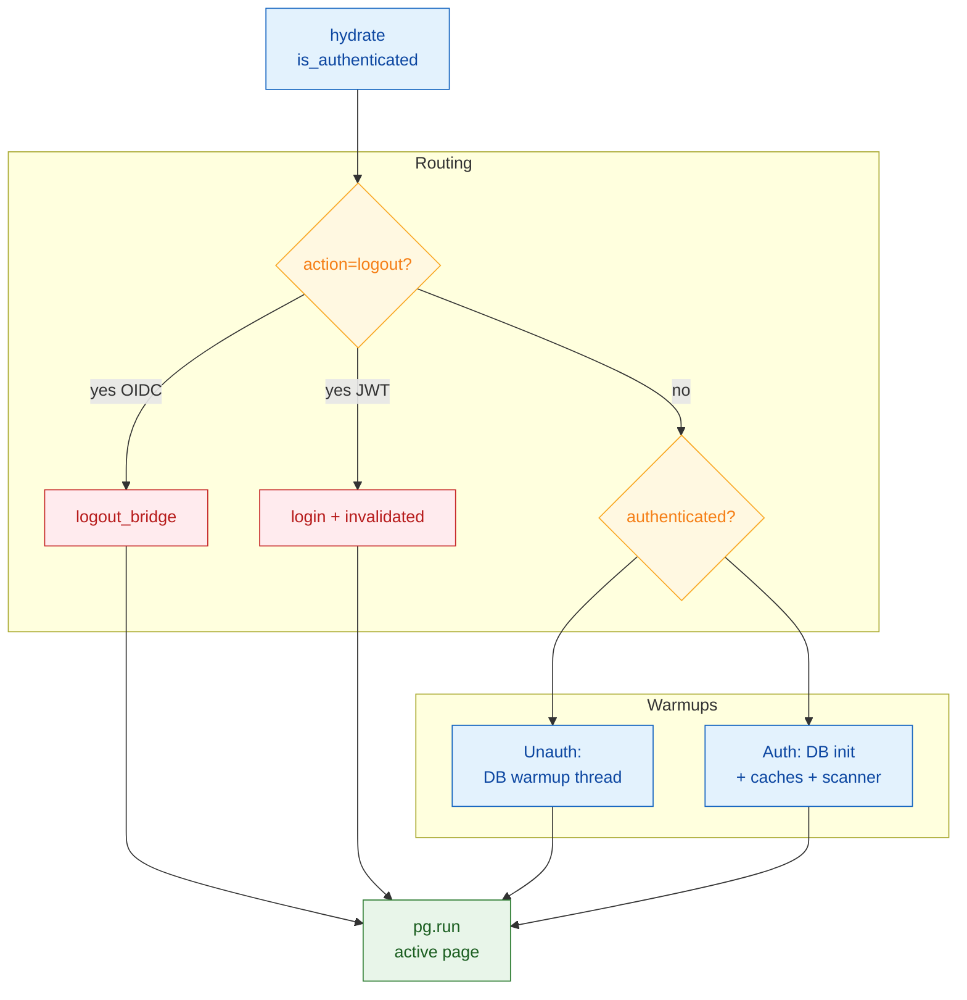
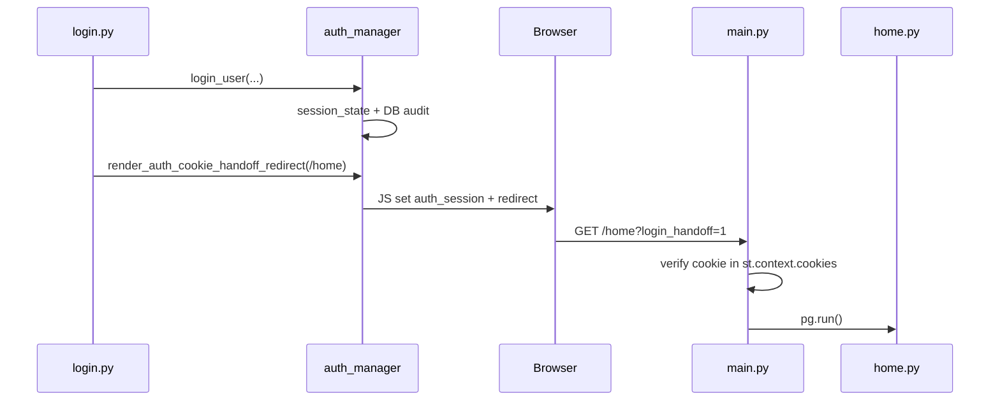

# App Bootstrap, Page Registration, and Central Authentication

**Scope:** `app/main.py`, `app/core/auth_manager.py`, `app/core/auth_environment.py`  
**Application:** Market Data Portal (MDP)  
**Stack:** Streamlit multipage app, SQLAlchemy 2, Azure MySQL, OpenID Connect (OIDC) via Coresight Identity Provider (IdP)

---

## Overview

`app/main.py` is the single Streamlit entry point for every page request. Before any page script runs, it:

1. Configures the Python/runtime environment (no bytecode cache, path setup, boot overlay).
2. Registers all multipage routes via `st.navigation`.
3. Hydrates authentication from HTTP cookies into `st.session_state`.
4. Routes logout requests to `logout_bridge.py` (OIDC) or `login.py` (legacy JSON Web Token (JWT) path).
5. Starts conditional background warmups (Database (DB), screening tables, caches, scanners) only when the user is authenticated.
6. Invokes `pg.run()` to execute the active page module.

`auth_manager.py` implements the session-token authentication pattern: **cookie is the source of truth** for auth checks; the database (`market_data_user_sessions`) is used for audit only. `auth_environment.py` is the environment gate that historically chose OIDC vs JWT; as of the current codebase, **OIDC is always enabled**.

---

## URL / Route Model

Streamlit multipage navigation is configured in `main.py` via `_PAGES_CONFIG`. Each tuple is `(file_path, title, url_path, is_default)`.

| File | Title | URL path | Default? |
|------|-------|----------|----------|
| `pages/login.py` | Login | `/login` | **Yes** (landing) |
| `pages/logout_bridge.py` | Logout | `/logout_bridge` | No |
| `pages/home.py` | Home | `/home` | No |
| `pages/market_data.py` | Market Data | `/market_data` | No |
| … | … | … | … |

The default page is **Login** (`is_default=True`). Unauthenticated users hitting `/` land on login.

**Global query parameters handled in `main.py`:**

| Parameter | Handler | Effect |
|-----------|---------|--------|
| `action=logout` | Logout routing block | OIDC → `logout_bridge.py`; else clear session → `login.py` |
| `login_handoff=1` | Auth bootstrap | Verifies `auth_session` cookie was written after login |
| `auth_flow_id` | Auth bootstrap | Correlation ID for login journey logging |
| `browser_cookie_ok` | Auth bootstrap | `1` = handoff success, `0` = cookie write failed |

---

## Dependencies

### `main.py` imports

| Module | Purpose |
|--------|---------|
| `core.boot_overlay.patch_streamlit_index_html` | Patches Streamlit `index.html` to hide grey skeleton, show branded loader |
| `utils.server_logger` | `log_error`, `log_exception`, `log_timing`, `new_rerun_id` — **no stdlib logging** |
| `core.ssl_setup.ensure_ca_cert` | Azure MySQL SSL CA setup |
| `core.database.init_database` | Engine/pool initialization (authenticated path) |
| `core.auth_manager` | Cookie hydration, logout stash, handoff verification |
| `core.auth_environment.is_oidc_enabled` | Logout routing decision |
| `utils.cache_manager.start_background_warmup` | Background data cache warmup |
| `utils.background_scanner` | Filing blob cache purge + scanner |
| `utils.non_sec_blob_fallback` | Non-U.S. Securities and Exchange Commission (SEC) filing cache warmup thread |
| `utils.earnings_alert_dispatcher` | Earnings alert email dispatch tick + background thread |
| `data.repository.warmup_ec_caches` | Earnings calendar cache warmup |
| `data.watchlist_service`, `saved_criteria_service`, `portal_users_service`, `earnings_alert_service` | Screening-related table ensures (background thread) |

### `auth_manager.py` imports

| Module | Purpose |
|--------|---------|
| `streamlit` / `st.context.cookies` | Sync cookie read from HTTP headers |
| `streamlit_cookies_controller.CookieController` | Fallback cookie read (same WebSocket session) |
| `core.database.db_manager` | `market_data_user_sessions` INSERT on login |
| `utils.server_logger` | Structured errors and timing |

### `auth_environment.py`

| Function | Behavior |
|----------|----------|
| `is_production_deploy()` | True if `ENV`, `ENVIRONMENT`, or `APP_ENV` equals `production` |
| `is_oidc_enabled()` | **Always returns `True`** (JWT disabled; OIDC for all deploys) |
| `IS_OIDC_ENV` | Module-level snapshot: `is_oidc_enabled()` at import time |

---

## Startup Sequence (`main.py`)

### Phase 1 — Process hygiene

- `sys.dont_write_bytecode = True` and `PYTHONDONTWRITEBYTECODE=1`
- One-time `__pycache__` tree deletion (guarded by `APP_PYCACHE_CLEANED`)
- `sys.path.insert(0, app_dir)` so `core.*`, `pages.*`, `components.*` resolve

### Phase 2 — Boot overlay

`patch_streamlit_index_html()` modifies Streamlit's static `index.html` before the server serves it, injecting CSS/JS to suppress `[data-testid="stSkeleton"]` and show a Coresight-branded boot overlay. This runs at **process start**, before any page CSS can load.

### Phase 3 — Streamlit config

```python
st.set_page_config(
    page_title="Market Data Portal",
    page_icon="https://coresight.com/.../favico-32x32.png",
    layout="wide",
    initial_sidebar_state="collapsed",
)
```

Early skeleton-suppression CSS is also injected via `st.markdown`.

### Phase 4 — Optional cookie reset

If `AUTH_CLEAR_COOKIES_ONCE=1`, injects JS that clears `auth_session` and `auth_logout_bridge` once per browser (`localStorage` marker `__csr_cookie_reset_v1`), then reloads.

### Phase 5 — Page registration

All page files are verified to exist; missing files cause `FileNotFoundError`. Pages are wrapped in `st.Page(..., position="hidden")` and composed into `st.navigation(_st_pages, position="hidden")`.

### Phase 6 — Central auth bootstrap

See [Authentication Bootstrap](#authentication-bootstrap) below.

### Phase 7 — Logout routing

If `?action=logout`:

- **OIDC:** `stash_logout_context()` → `st.switch_page("pages/logout_bridge.py")`
- **Non-OIDC (legacy):** Clear `auth_data`/`authenticated`, set `_auth_invalidated`, → `login.py`

### Phase 8 — Conditional warmups

| Condition | Work started |
|-----------|--------------|
| **Not authenticated** | Background DB warmup thread only (`APP_DB_WARMUP_STARTED`) — speeds OIDC callback |
| **Authenticated** | `init_database`, screening table prewarm thread, Alpha Vantage (AV) fulltext warmup, EC cache warmup, `start_background_warmup`, background scanner, non-SEC blob warmup thread, earnings alert dispatch |

Environment flags: `ENABLE_BG_WARMUP`, `ENABLE_BG_SCANNER`, `ENABLE_EC_WARMUP`, `EARNINGS_ALERT_DISPATCH`, `EARNINGS_ALERT_DISPATCH_THREAD`.

### Phase 9 — Run page

`pg.run()` executes the routed page module.

---

## Authentication Bootstrap

On every request, before `pg.run()`:

`main.py` reads the `auth_session` cookie, handles login handoff verification, and hydrates `session_state` before routing to the active page.



**Key behaviors:**

1. **`login_handoff=1` verification** — After `render_auth_cookie_handoff_redirect()` from login, the browser navigates to `/home?login_handoff=1&auth_flow_id=...&browser_cookie_ok=1`. `main.py` confirms the server sees `auth_session` in `st.context.cookies`. If not, auth state is cleared and user is sent back to login with an error.

2. **`is_authenticated()` side effect** — Calling `get_auth_manager().is_authenticated()` populates `st.session_state.authenticated` and `auth_data` from the slim cookie if not already present. This is **not** a redirect; individual pages call `require_auth()` for enforcement.

3. **Logging** — `MAIN_AUTH_BOOTSTRAP_ENTRY` and `MAIN_AUTH_BOOTSTRAP` timing events include host, referer, origin, query param keys, cookie presence, and routing target.

---

## Shared Auth Flow (`auth_manager.py`)

### Design principles

| Principle | Implementation |
|-----------|----------------|
| Fast auth check | No DB read on `is_authenticated()` |
| Slim cookie | `auth_session` holds only `session_id`, `user_email`, `user_display_name`, `login_at` (< 4 KB) |
| `id_token` storage | Temp file `/tmp/_oidc_idtok_{hash}.json` + full `auth_data` in session_state |
| Logout authority | Server-side session blacklist file `/tmp/_oidc_invalid_{hash}.json` |
| Cookie write | Parent-frame JS injection (not CookieController.set) via `render_auth_cookie_handoff_redirect` |

### Cookie: `auth_session`

**Shape (JSON, URL-encoded in browser):**

```json
{
  "session_id": "<32-char hex uuid>",
  "user_email": "user@coresight.com",
  "user_display_name": "Display Name",
  "login_at": "2026-06-26T12:00:00+00:00"
}
```

**Attributes:** `path=/`, `SameSite=Lax`, `Secure` on HTTPS non-localhost, **host-only** (no `Domain` attribute on set), 7-day expiry (`COOKIE_MAX_AGE_DAYS`).

### Cookie: `auth_logout_bridge`

Short-lived (~120s, `AUTH_LOGOUT_BRIDGE_MAX_AGE_SECONDS`) bridge cookie holding `{id_token, user_email, created_at}` for `logout_bridge.py` to recover OIDC logout hint after navigation.

### Login flow (`AuthManager.login`)

`AuthManager.login` creates a session, writes an audit row, stores `id_token` off-cookie, and hands off a slim `auth_session` cookie to the browser.



**Database write (audit only):**

```sql
INSERT INTO market_data_user_sessions
    (user_email, user_nicename, user_display_name, token, login_at, last_activity)
VALUES
    (:user_email, :user_nicename, :user_display_name, :token, NOW(), NOW())
```

Login **succeeds even if DB insert fails** — cookie/session_state remain authoritative.

### Auth check (`is_authenticated`)

**Order:**

1. If `_auth_invalidated` in session_state → `False`
2. If `authenticated` + `auth_data` in session_state → `True`
3. Read `auth_session` from `st.context.cookies` (fast path)
4. Fallback: `CookieController.get("auth_session")`
5. Reject if `session_id` is in server-side blacklist (`_is_session_invalidated`)

### Protected pages (`require_auth`)

Page modules call `require_auth()` to enforce identity — retry cookie mount on handoff, or redirect to login when the session is invalid or absent.



### Page-level `require_auth` enforcement

Identity is always established by `main.py` auth bootstrap (`is_authenticated()` hydrates session from the `auth_session` cookie on every request). Individual pages may additionally call `require_auth()` to redirect unauthenticated visitors to `/login`. Pages without an active `require_auth()` call rely on navigation flow and upstream network controls.

| Page module | `require_auth` enforcement |
|-------------|---------------------------|
| `home.py`, `market_data.py`, `newsroom.py`, `earnings_calls.py`, `live_earnings_transcript.py`, `screening.py`, `company_filings.py`, `forecasting.py`, `logs.py`, `earnings_calendar.py` | Cookie hydrate only at module level |
| `access_management.py`, `forecasting_admin.py`, `admin_iam.py`, `audit.py`, `reports.py`, `settings.py`, `company_filings_add_files.py` | Cookie hydrate; `require_auth()` inside `main()` guard when enabled |
| `retailer_adding.py` | **Active** — `auth_user = require_auth()` |
| `login.py`, `logout_bridge.py` | N/A (public / logout bridge) |

**Security note:** `/logs` is a hidden route without page-level `require_auth()` or ACL. Restrict reachability via network controls and monitor access in production.

**Environment overrides:**

| Variable | Effect |
|----------|--------|
| `AUTH_RETRY_DELAYS` | Comma-separated seconds (default `0.15,0.35`) |
| `AUTH_FLOW_VERBOSE=1` | Extra auth timing logs |

### Cookie handoff (`render_auth_cookie_handoff_redirect`)

Injected parent-frame JS:

1. Clears stale `auth_session` and `auth_logout_bridge` (host + legacy `.coresight.com`)
2. Sets new host-only `auth_session`
3. Polls `document.cookie` up to 20×50ms
4. `window.location.replace` to success URL (`/home?login_handoff=1&...`) or fail URL (`/login?auth_error=cookie_write_failed`)

### Logout stash (`stash_logout_context`)

Called from `main.py` before routing to `logout_bridge.py`:

1. Recover `id_token` from `auth_data`, cookie, or temp file
2. **`invalidate_session(session_id)`** — blacklist before cookie clear
3. Store `__logout_bridge_data` in session_state
4. Set short-lived `auth_logout_bridge` cookie via JS injection

### Session state keys (auth-related)

| Key | Set by | Purpose |
|-----|--------|---------|
| `authenticated` | `login`, `is_authenticated`, fast-restore | Boolean auth flag |
| `auth_data` | `login`, cookie restore | Full user payload (+ `id_token` in memory) |
| `auth_flow_id` | `get_or_create_auth_flow_id` | Login journey correlation ID |
| `_auth_invalidated` | Logout (JWT path), denied flows | Block cookie restore |
| `_auth_retry_count` | `require_auth` | Cookie mount retry counter |
| `_auth_retry_in_progress` | `require_auth` | Retry rerun marker |
| `_auth_cookie_source` | `_get_cookie` | `st.context.cookies` or `CookieController` |
| `__auth_cookie_controller` | `_get_controller` | Cached CookieController instance |
| `__logout_bridge_data` | `stash_logout_context` | OIDC logout handoff payload |
| `_auth_login_error` | `main.py` handoff failure | Surfaced on login page |

### External integrations

| Integration | Role |
|-------------|------|
| Coresight OIDC IdP (`https://coresight.com/csr-idp/`) | Authorization, token, logout (via login/logout_bridge) |
| Azure MySQL | `market_data_user_sessions` audit insert |
| Browser cookies | `auth_session`, `auth_logout_bridge` |
| `/tmp` ephemeral files | Exchange cache, id_token cache, session blacklist, return-origin handoff |

---

## Error Handling

| Location | Failure | Behavior |
|----------|---------|----------|
| Missing page file | `FileNotFoundError` at startup | App won't start; logged as FATAL |
| SSL setup | Exception | Logged; app continues |
| Auth bootstrap | Exception | Swallowed (`pass`); page may run unhydrated |
| Logout routing | Exception | `log_exception`; re-raise |
| `pg.run()` | Exception | `log_exception` FATAL; re-raise |
| DB init (authenticated) | Exception | Logged; warmups may be skipped |
| Background threads | Exception | Logged inside thread; non-blocking |

---

## Access Control List (ACL) / Permissions

`main.py` does **not** perform page-level ACL. ACL is enforced per-page via `AccessControlManager.check_access(page_name, user_email)` on gated pages (e.g. `access_management`, `retailer_adding`). Auth bootstrap only establishes **identity**, not **authorization**.

Hardcoded admin emails (used elsewhere): `mohdsaeedafri@coresight.com`, `philipmoore@coresight.com`, `shashankgupta@coresight.com`.

---

## Flowcharts

### Full request lifecycle

Every HTTP request passes through boot, auth hydrate, optional logout routing, conditional warmups, then the active Streamlit page.

**Figure 1 Part A — Process boot and auth hydrate**



**Figure 1 Part B — Routing, warmups, and page run**



### Login → Home cookie handoff (cross-module)

After OIDC login, the browser sets `auth_session` via JS and `main.py` verifies the cookie before rendering Home.



---

## Key Code References

| Concern | File | Lines (approx.) |
|---------|------|-----------------|
| Page registration | `app/main.py` | 175–228 |
| Auth bootstrap | `app/main.py` | 236–345 |
| Logout routing | `app/main.py` | 350–380 |
| Authenticated warmups | `app/main.py` | 414–553 |
| OIDC env gate | `app/core/auth_environment.py` | 18–33 |
| Login + cookie handoff | `app/core/auth_manager.py` | 347–429, 473–548 |
| `require_auth` | `app/core/auth_manager.py` | 800–1002 |
| Cookie read + blacklist | `app/core/auth_manager.py` | 1004–1156 |
| Logout stash | `app/core/auth_manager.py` | 635–718 |

---

## Environment Variables (auth & bootstrap)

| Variable | Default | Purpose |
|----------|---------|---------|
| `APP_ENV` | `staging` | Deployment environment; footer staging links |
| `DEBUG` | — | Verbose diagnostics when `true`/`1`/`yes` |
| `AUTH_CLEAR_COOKIES_ONCE` | `0` | One-time browser cookie reset |
| `AUTH_RETRY_DELAYS` | `0.15,0.35` | `require_auth` cookie wait retries |
| `AUTH_COOKIE_SYNC_WAIT_MS` | `350` | Cookie sync budget |
| `AUTH_FLOW_VERBOSE` | `0` | Verbose auth logging |
| `AUTH_LOGOUT_BRIDGE_MAX_AGE_SECONDS` | `120` | Bridge cookie TTL |
| `ENABLE_BG_WARMUP` | `1` | Background cache warmup |
| `ENABLE_BG_SCANNER` | `1` | Filing background scanner |
| `ENABLE_EC_WARMUP` | `1` | Earnings calendar cache warmup |
| `EARNINGS_ALERT_DISPATCH` | `1` | Alert dispatch tick |
| `EARNINGS_ALERT_DISPATCH_THREAD` | `1` | Background alert thread |

---

*Generated from source analysis of Market Data Portal (MDP).* MCP `code-review-graph` was unavailable in this environment; documentation is based on direct file reads.*
