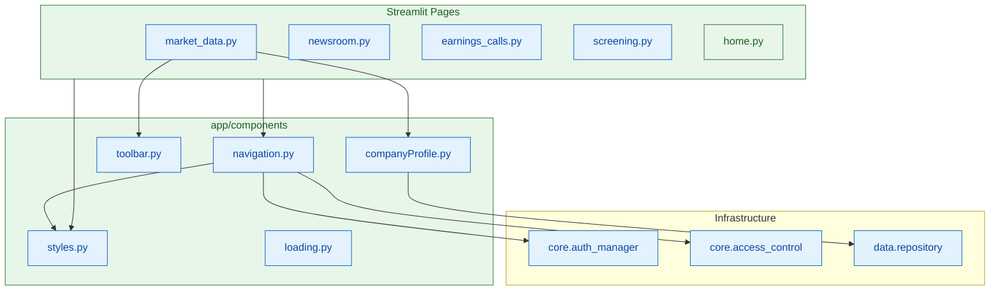
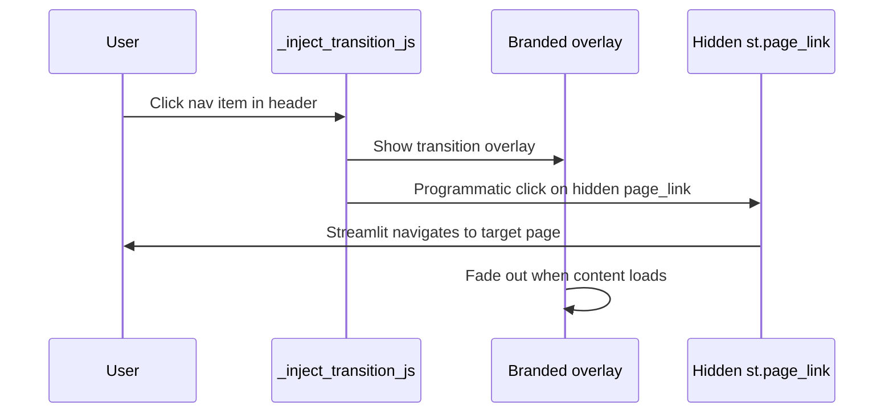
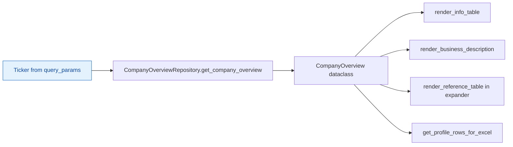

# Shared User Interface (UI) Components (`app/components/`)

**Application:** Market Data Portal (MDP)  
**Stack:** Streamlit multipage app with custom HyperText Markup Language (HTML)/CSS branding  
**Scope:** All modules under `app/components/` — navigation, styles, charts, tables, toolbar, loading, layout, company profile, auth utilities

---

## Overview

The `app/components/` package provides reusable Streamlit UI primitives that give every page a consistent Coresight look and feel. Components hide Streamlit chrome (sidebar, default header), inject global CSS design tokens, render the branded site header/footer, and supply Market Data–specific building blocks (company header, tab bar, profile tables).

Shared UI modules sit between Streamlit pages and core infrastructure — pages import components; components call auth, Access Control List (ACL), and repositories as needed.



### Typical page bootstrap sequence

Every authenticated page follows this pattern:

1. `hide_sidebar()` — immediately after `st.set_page_config()` (or at page top)
2. `render_styles()` + `set_page_layout()` — global CSS and content width
3. `render_header(current_page="...")` — sticky Coresight header
4. Page-specific content
5. `render_coresight_footer()` — four-column footer

Market Data adds: `render_company_header()` → `render_tabs()` → tab content.

---

## Module Index

| File | Lines (approx.) | Status | Primary consumers |
|------|-----------------|--------|-------------------|
| `styles.py` | 729 | **Active — core** | 17 pages, 2 utils |
| `navigation.py` | 1,234 | **Active — core** | 15 pages, 2 utils |
| `toolbar.py` | 218 | **Active** | `market_data.py` |
| `companyProfile.py` | 617 | **Active** | `market_data.py` |
| `loading.py` | 439 | **Active** | `company_filings.py`, `forecasting*.py` |
| `tables.py` | 446 | Library (unused by pages) | — |
| `charts.py` | 410 | Library (unused by pages) | — |
| `layout.py` | 313 | Library (unused by pages) | — |
| `auth_utils.py` | 517 | **Legacy / dead** | — |
| `login_header.html` | — | **Static asset** | `login.py` only |
| `login_footer.html` | — | **Static asset** | `login.py` only |
| `login_layout.css` | — | **Static asset** | `login.py` only |
| `header_logout.html` | — | **Static asset** | Unused (legacy logout snippet) |
| `__init__.py` | 2 | Package marker | — |

Login static assets are loaded via `Path.read_text()` in `login.py` and injected with `st.markdown(..., unsafe_allow_html=True)`. See [login.md](../pages/login.md) for the full login chrome layout.

---

## `styles.py` — Design System & Global CSS

**Purpose:** Single source of truth for Coresight design tokens and global CSS injection. Hides Streamlit sidebar/header, applies card shadows, smooth content animations, and page layout constraints.

### Design token exports

| Constant | Contents |
|----------|----------|
| `COLORS` | Primary (`#D62E2F`), semantic (success/warning/danger/info), neutrals, chart palette |
| `TYPOGRAPHY` | Font families (Inter), sizes, weights, line heights |
| `SPACING` | `space_0` … `space_16` rem scale |
| `BORDER_RADIUS` | `rounded_sm` … `rounded_full` |
| `SHADOWS` | `shadow_sm` … `shadow_card` |

### Public Application Programming Interface (API)

| Function | Signature | Purpose |
|----------|-----------|---------|
| `get_global_css` | `() -> str` | Returns ~9KB global CSS string; cached in `st.session_state` |
| `render_styles` | `()` | Injects global CSS via `st.markdown(unsafe_allow_html=True)` |
| `set_page_layout` | `(header_full_width=True, footer_full_width=True, body_padding="0 20px", max_content_width="1350px", remove_top_padding=True, footer_at_bottom=True)` | Adjustable content width and padding CSS |
| `hide_sidebar` | `()` | Hides Streamlit sidebar and `stHeader`; **must run right after `set_page_config()`** |

### Usage by pages

| Page | Imports |
|------|---------|
| `admin_iam.py`, `access_management.py`, `audit.py`, `reports.py`, `settings.py` | `hide_sidebar`, `render_styles`, `set_page_layout` |
| `company_filings.py`, `screening.py` | `hide_sidebar`, `set_page_layout`, `render_styles` |
| `earnings_calls.py`, `newsroom.py` | Above + `COLORS`, `TYPOGRAPHY`, `SPACING` for inline HTML |
| `market_data.py` | `hide_sidebar`, `render_styles`, `set_page_layout`, `COLORS` |
| `home.py`, `earnings_calendar.py` | `hide_sidebar`, `render_styles` |
| `login.py` | `hide_sidebar` only |
| `logs.py` | `hide_sidebar`, `render_styles`, `set_page_layout` (no header/footer) |

**Pages not using styles:** `company_filings_add_files.py`, `retailer_adding.py`, `logout_bridge.py`

### Dependencies

- `utils.server_logger.log_structured_error` only

---

## `navigation.py` — Header, Footer, Company Selector

**Purpose:** Coresight-branded site header and footer, client-side page transitions, company selector header for Market Data, and legacy sidebar helpers.

### Key exports

| Name | Type | Description |
|------|------|-------------|
| `Page` | `Enum` | Legacy: `MARKET_DATA`, `NEWSROOM` |
| `PAGE_CONFIG` | `dict` | Labels/icons for `Page` enum |

### Public API

| Function | Purpose |
|----------|---------|
| `render_header(full_width=True, current_page="market_data", ticker="M")` | Figma-matched sticky header; active nav highlighting; hidden `st.page_link` targets for client-side navigation; injects transition JS |
| `render_coresight_footer(full_width=True, stick_to_bottom=True)` | Four-column footer; staging-only admin links; Access Management for admins |
| `render_company_header(company_name, ticker, exchange="NYSE")` | "CORESIGHT MARKET DATA" title + invisible company `st.selectbox` + Company Documents link |
| `render_logo`, `render_user_state`, `render_divider`, `render_footer`, `render_top_bar` | Legacy sidebar helpers |
| `get_page_title(page: Page) -> str` | Icon + label for page enum |

### Client-side navigation flow

Header navigation uses parent-frame JavaScript to click hidden Streamlit page links while showing a branded transition overlay.



The transition overlay prevents the grey Streamlit skeleton flash during multipage navigation. Navigation targets: `market_data`, `earnings_calls`, `earnings_calendar`, `screening`, `newsroom`.

### ACL in footer

- **Staging links** (`APP_ENV=staging` + email allowlists): Retailer admin, Forecast admin
- **Access Management:** `_can_access_mgmt(user_email)` via `UserRolesManager.is_admin_or_super_user()` with hardcoded fallback admins

### Session state side effects

- Sets `st.session_state["_active_page"]`
- Company selector updates `active_ticker` and `st.query_params["ticker"]`

### Usage by pages

All authenticated pages except `login.py`, `logs.py`, `company_filings_add_files.py`, `retailer_adding.py`, `logout_bridge.py` import `render_header` + `render_coresight_footer`. `market_data.py` also imports `render_company_header`.

### Dependencies

- `components.styles` — design tokens
- `core.auth_manager` — `is_authenticated`, `get_current_user`
- `core.access_control.UserRolesManager` — footer ACL (lazy import)
- `data.forecast_admin_service.is_forecast_admin` — staging forecast admin link
- `data.repository.CompanyRepository` — company list for selector (lazy in `render_company_header`)

---

## `toolbar.py` — Market Data Tab Bar

**Purpose:** Horizontal tab bar for the Market Data page (10 tabs). Active tab renders as a styled label; inactive tabs are `st.button` widgets that set `st.query_params["tab"]`.

### Public API

| Function | Purpose |
|----------|---------|
| `render_tabs(selected_tab: str) -> str` | Renders tab row; returns selected tab key |

### Tab keys

| Key | Label | Notes |
|-----|-------|-------|
| `company_profile` | Company Profile | |
| `key_stats` | Key Stats | |
| `income_statement` | Income Statement | |
| `balance_sheet` | Balance Sheet | |
| `cash_flow` | Cash Flow | |
| `ratios` | Ratios | |
| `estimates` | Estimates | |
| `forecasting` | Forecasting | "Testing in Progress" badge |
| `segment_data` | Segment Data | "Testing in Progress" badge |
| `ratings` | Ratings | "Testing in Progress" badge |

### Tab selection flow

Market Data tab changes persist in query params and local storage, then rerun the page to load the selected tab content.

```mermaid
flowchart LR
%%{init: {'flowchart': {'nodeSpacing': 50, 'rankSpacing': 60, 'curve': 'basis'}}}%%
    A[User clicks tab button] --> B[on_click sets query_params tab]
    B --> C[set_marketdata_tab in local_storage]
    C --> D[st.rerun]
    D --> E[market_data.py reads tab param]
    E --> F[render_tabs highlights active tab]

    classDef ui fill:#e8f5e9,stroke:#2e7d32,color:#1b5e20
    classDef db fill:#fff3e0,stroke:#ef6c00,color:#e65100
    classDef ext fill:#f3e5f5,stroke:#7b1fa2,color:#4a148c
    classDef process fill:#e3f2fd,stroke:#1565c0,color:#0d47a1
    classDef start fill:#e8f5e9,stroke:#43a047,color:#1b5e20
    classDef error fill:#ffebee,stroke:#c62828,color:#b71c1c
    classDef decision fill:#fff8e1,stroke:#f9a825,color:#f57f17
    class A start
```



### Consumers

- `pages/market_data.py` — primary
- `utils/market_data.py` — deprecated duplicate

### Dependencies

- `utils.local_storage.set_marketdata_tab`

---

## `companyProfile.py` — Company Profile Tab Content

**Purpose:** Renders the Company Profile tab on Market Data — Figma-matched info table, business description, reference expander, and Excel export row builder.

### Public API

| Function | Purpose |
|----------|---------|
| `get_company_css() -> str` | Page-scoped CSS for profile tables |
| `render_info_table(company: CompanyOverview) -> str` | 4-column HTML info table (hides sector/industry in main table) |
| `render_business_description(description) -> str` | Business description HTML block |
| `render_reference_table(company) -> str` | Sector/Industry reference table (in expander) |
| `get_profile_rows_for_excel(company) -> list` | `[(label, plain_value), ...]` for Excel export |
| `render_company_profile_content(company)` | Streamlit render: info + description + "For Reference" expander |
| `render_company_profile(ticker="M")` | Standalone page path (header + Database (DB) fetch) |
| `object_to_dict`, `company_to_label_value`, `format_market_cap`, `to_title_case` | Formatting helpers |

### Internal constants

- `HIDDEN_FIELDS` — sector, industry, CIK, etc. excluded from main table
- `LABEL_MAP` — display overrides (e.g. `"Pe Ratio"` → `"P/E Ratio"`)

### Data flow

Company Profile loads overview data from the repository layer and renders HTML table blocks for the active ticker.



### Consumers

- `pages/market_data.py` — primary integration hub
- `utils/market_data.py`, `utils/companyProfile.py` — legacy duplicates

### Dependencies

- `data.models.CompanyOverview`
- `data.repository.CompanyOverviewRepository`
- `utils.constants` — currency, exchange, country formatters

---

## `loading.py` — Branded Spinners & Overlays

**Purpose:** Coresight-red (`#D62E2F`) spinner CSS, full-screen overlays, skeleton placeholders, and Azure filing scan progress overlay.

### Public API

| Function | Purpose |
|----------|---------|
| `inject_red_spinner_css()` | Global CSS override for `stSpinner` |
| `show_loading_overlay(message, submessage, show_progress, progress_percent)` | Full-screen branded overlay |
| `hide_loading_overlay()` | No-op placeholder (overlay clears on rerun) |
| `show_inline_loading(message)` | Inline spinner row |
| `show_skeleton_card()` / `show_skeleton_text(lines)` | Placeholder skeletons |
| `show_progress_bar(label, percent, show_percent)` | Styled progress bar |
| `show_red_spinner(text)` | Context manager wrapping `st.spinner` |
| `render_scan_progress_overlay(progress: dict)` | Azure filing scan progress from `background_scanner` |

### Consumers

| Page | Usage |
|------|-------|
| `company_filings.py` | Lazy import; `inject_red_spinner_css()` |
| `forecasting.py` | `inject_red_spinner_css()` |
| `forecasting_admin.py` | `inject_red_spinner_css()` (2 call sites) |

---

## `tables.py` — Reusable Data Tables (Library)

**Purpose:** Typed `st.dataframe` wrappers with column formatting presets. **Not currently imported by any page** — pages build tables inline.

### Formatters

| Function | Output example |
|----------|----------------|
| `format_currency(value, decimals=2)` | `$1,234.56` |
| `format_percentage(value, decimals=2)` | Colored HTML `+/-X.XX%` |
| `format_number(value, decimals=0)` | Thousand separators |
| `format_volume(value)` | K/M/B suffix |
| `format_market_cap(value)` | `$X.XXB/T/M` |
| `format_datetime` / `format_date` | Date formatting |

### Table builders

| Function | Preset for |
|----------|------------|
| `create_data_table(data, columns_config, ...)` | Generic styled dataframe |
| `create_sec_filings_table(filings_data, ...)` | U.S. Securities and Exchange Commission (SEC) filings |
| `create_market_data_table(market_data, ...)` | Market data quotes |
| `create_news_table(articles, ...)` | News articles |
| `render_sortable_header(columns, sort_column, sort_order, on_sort)` | Clickable sort header row |

---

## `charts.py` — Plotly Chart Builders (Library)

**Purpose:** Plotly `go.Figure` factories with design-system colors. **Not currently imported by any page** — pages build Plotly charts inline.

### Constants

- `CHART_CONFIG` — mode bar config (no logo, no lasso)
- `CHART_LAYOUT` — transparent bg, Inter font, margins

### Public API

| Function | Chart type |
|----------|------------|
| `create_candlestick_chart(metrics, title, height)` | OHLC + volume subplots |
| `create_line_chart(data, x_column, y_columns, ...)` | Multi-line |
| `create_bar_chart(...)` | Bar (horizontal option) |
| `create_pie_chart(...)` | Pie/donut (`hole=0.4`) |
| `create_area_chart(...)` | Area with gradient fill |
| `render_chart(fig, width, key)` | `st.plotly_chart` wrapper |

**Dependency:** `data.models.MarketMetric`

---

## `layout.py` — Layout Primitives (Library)

**Purpose:** Generic cards, metrics, badges, empty states, tabs, filters, pagination. **Not currently imported by any page.**

| Function | Purpose |
|----------|---------|
| `render_card(content, title, ...)` | Styled HTML card |
| `render_metric_card(label, value, change, ...)` | KPI metric card |
| `render_badge(text, variant, icon)` | Pill badge |
| `render_empty_state(title, description, icon, action_label, action_callback)` | Centered empty state |
| `render_loading_skeleton(height)` | Pulsing placeholder |
| `render_tabs(tabs_config, default_tab)` | `st.tabs` with render callbacks (**different from `toolbar.render_tabs`**) |
| `render_filter_bar(filters, on_change)` | Filter bar shell |
| `render_pagination(current_page, total_pages, on_page_change)` | Prev/Next pagination |

---

## `auth_utils.py` — Legacy Auth (Dead Code)

**Purpose:** Pre-OpenID Connect (OIDC) cookie-based auth via `streamlit_cookies_controller`. **Superseded by `app/core/auth_manager.py`.** No imports from `app/pages/` or `app/utils/`.

| Function | Notes |
|----------|-------|
| `require_auth(redirect_to="login.py")` | Legacy guard |
| `login_user(...)`, `logout()` | Cookie + DB session |
| `restore_session_from_cookie()` | Cookie hydration |
| `create_db_connection()` | Direct `mysql.connector` (legacy env vars) |

**Do not use for new code.** Uses stdlib `logging` (violates `server_logger` convention).

---

## `__init__.py`

Package marker: `"""UI components module."""`

---

## Cross-Cutting Patterns

### 1. Design tokens in inline HTML

Content-heavy pages (`newsroom`, `earnings_calls`, `market_data`) import `COLORS`, `TYPOGRAPHY`, `SPACING` directly for bespoke HTML blocks rather than using `layout.py`.

### 2. Market Data integration hub

Only `market_data.py` combines all three Market Data components:

```
render_company_header → render_tabs → render_company_profile_content (and other tab renderers)
```

### 3. Duplicate utility modules

`app/utils/market_data.py` and `app/utils/companyProfile.py` mirror page logic and import the same components. Treat as deprecated entry points.

### 4. Early skeleton suppression

`main.py` injects skeleton-hide CSS at the top of every run. `navigation._inject_transition_js()` adds the branded overlay. Together they eliminate Streamlit's grey loading flash.

---

## Component → Page Consumer Matrix

| Component | Pages using it |
|-----------|----------------|
| `styles.hide_sidebar` | 17 pages |
| `styles.render_styles` | 16 pages |
| `navigation.render_header` | 15 pages |
| `navigation.render_coresight_footer` | 15 pages |
| `toolbar.render_tabs` | `market_data` |
| `companyProfile.*` | `market_data` |
| `loading.inject_red_spinner_css` | `company_filings`, `forecasting`, `forecasting_admin` |
| `tables.*` | — |
| `charts.*` | — |
| `layout.*` | — |
| `auth_utils.*` | — |
