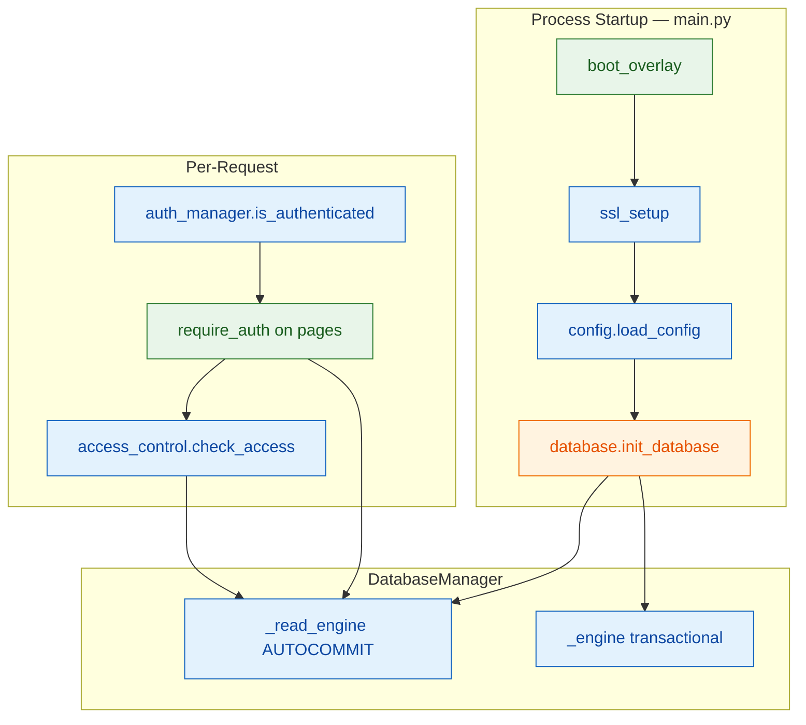
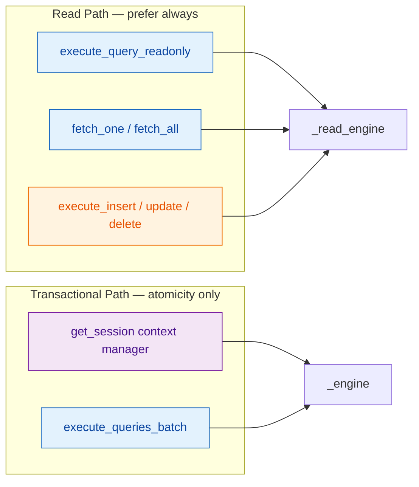
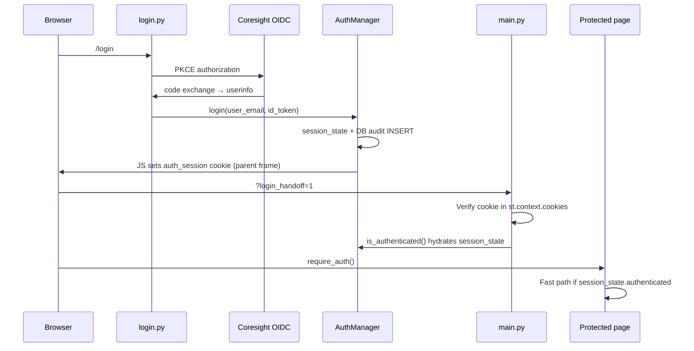
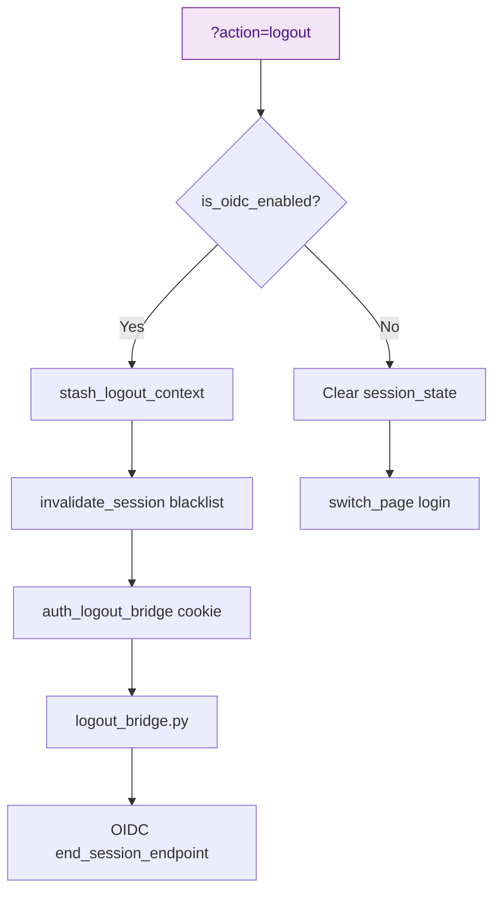
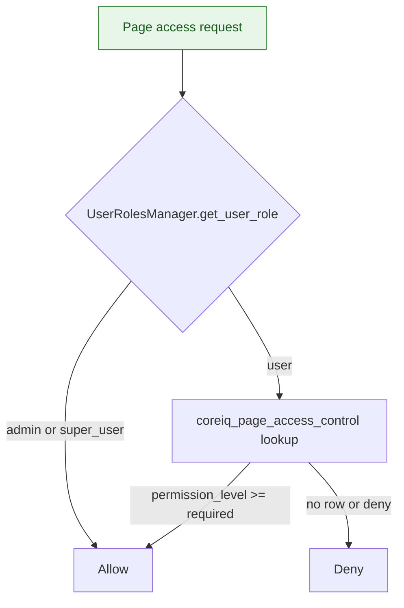
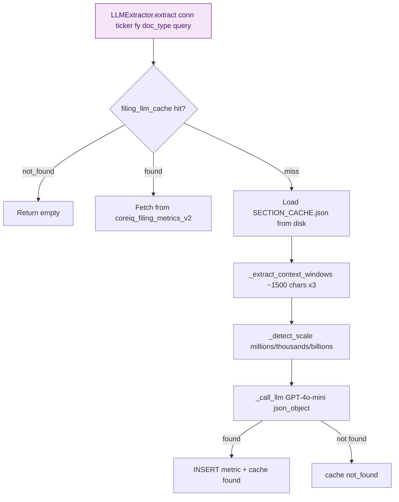
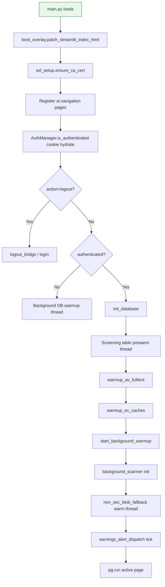

# Core Infrastructure (`app/core/`)

**Application:** Market Data Portal (MDP)  
**Stack:** Streamlit + SQLAlchemy 2 + Azure MySQL + OpenID Connect (OIDC)  
**Scope:** `app/core/` — configuration, database, authentication, access control, Large Language Model (LLM) extraction, search, SSL, boot overlay

---

## Overview

The `app/core/` package is the application infrastructure layer. It sits below pages (`app/pages/`) and the data layer (`app/data/`), providing:

- Environment-based configuration and SSL
- Dual-engine database access (read vs transactional)
- OIDC session-token authentication (cookie-first)
- Page-level and system-role access control
- On-demand LLM filing metric extraction
- In-memory Term Frequency-Inverse Document Frequency (TF-IDF) transcript search (utility, currently unwired)



---

## Module Index

| Module | Purpose | Primary consumers |
|--------|---------|-------------------|
| `config.py` | Env-based `AppConfig` / `DatabaseConfig` | `database.py` (indirect: entire app) |
| `database.py` | Singleton `DatabaseManager`, dual engines | 30+ modules across pages/data/utils |
| `auth_manager.py` | Cookie-first OIDC session auth | All protected pages, `navigation`, `main.py` |
| `access_control.py` | Page Access Control List (ACL) + system roles | ACL pages, `navigation`, `forecast_refresh_service` |
| `auth_environment.py` | OIDC/production flags | `auth_manager`, `main`, `login`, `logout_bridge` |
| `ssl_setup.py` | DigiCert CA provisioning | `main.py`, `config.py` |
| `boot_overlay.py` | Streamlit index.html patch | `main.py` |
| `llm_extractor.py` | GPT-4o-mini filing extraction | `repository.py`, `company_filings.py` |
| `search_engine.py` | TF-IDF segment search | **Unused** (orphan utility) |
| `__init__.py` | Package marker | — |

---

## `config.py` — Application Configuration

### Classes

| Class | Role |
|-------|------|
| `Environment` (Enum) | `LOCAL`, `STAGING`, `PRODUCTION` |
| `DatabaseConfig` (dataclass) | MySQL connection params, pool settings, SSL |
| `AppConfig` (dataclass) | `env`, `debug`, `database`, `secret_key`, session timeout, caching, pagination |

### Key functions

| Function | Role |
|----------|------|
| `load_config()` | Build `AppConfig` from environment |
| `DatabaseConfig.connection_string` | `mysql+pymysql://...` property |
| `DatabaseConfig.connect_args` | SSL `{"ssl": {"ca": path}}` with late-binding CA resolution |

### Environment variables

| Variable | Default / notes |
|----------|-----------------|
| `APP_ENV` | `local` → drives `Environment` enum |
| `DB_HOST`, `DB_PORT`, `DB_NAME`, `DB_USER`, `DB_PASSWORD` | Local fallbacks |
| `STG_DB_*` | Staging Azure MySQL |
| `PROD_DB_*` | Production Azure MySQL |
| `ENABLE_SSL` | `true` (stg/prod), `false` (local) |
| `SSL_CA` | Optional; late-bound via `ssl_setup` if missing |
| `DB_POOL_SIZE` | `5` |
| `DB_MAX_OVERFLOW` | `10` |
| `DEBUG` | `true` local; `false` prod |
| `SECRET_KEY` | Warns if default in non-local |
| `SESSION_TIMEOUT` | `3600` |
| `ENABLE_CACHING` | `true` |
| `CACHE_TTL` | `300` |
| `NAVIGATION_MODE` | `same` |

**Global singleton:** `config = load_config()` at module import.

---

## `database.py` — Dual-Engine Database Access

### Design philosophy

On Azure MySQL (~250ms round-trip per connection operation), minimizing RTTs is critical:

| Engine | Attribute | Isolation | Use when | Azure RTTs |
|--------|-----------|-----------|----------|------------|
| **Read** | `_read_engine` | `AUTOCOMMIT` + `skip_autocommit_rollback=True` | All SELECTs, single-statement writes | ~1 RTT |
| **Main** | `_engine` | Default (implicit BEGIN) | Multi-statement atomicity, `get_session()` | ~3 RTTs |



### `DatabaseManager` Application Programming Interface (API)

| Method | Engine | Returns | Notes |
|--------|--------|---------|-------|
| `connect()` | Both | — | Creates engines; parallel SSL warmup (6 conns on Azure) |
| `get_session()` | Main | Context manager | commit/rollback |
| `execute_query_readonly(query, params)` | Read | `List[Dict]` | Swallows errors → `[]` |
| `execute_query_readonly_raising(...)` | Read | `List[Dict]` | Raises on error (cache-safe) |
| `fetch_one` / `fetch_all` | Read | `Optional[Dict]` / `List[Dict]` | Thin wrappers |
| `execute_insert` / `execute_update` / `execute_delete` | Read (AUTOCOMMIT) | `int` rowcount | Single-statement writes |
| `execute_insert_returning_id` | Read | `Optional[int]` | `lastrowid` |
| `execute_scalar` | Main session | scalar | |
| `execute_queries_batch` | Main session | — | Multi-query, one connection |
| `health_check()` | Main | `bool` | `SELECT 1` |
| `_dispose_and_reconnect()` | Both | — | SSL recovery |

### Pool tuning (Azure)

- `pool_pre_ping=False` on Azure — avoids 250ms `SELECT 1` per checkout
- `pool_recycle=3600` — avoids 4s SSL re-handshake on stale connections

### Module-level exports

| Symbol | Role |
|--------|------|
| `db_manager` | Global `DatabaseManager()` singleton |
| `with_db_session` | Decorator injecting `session` kwarg |
| `init_database()` | `db_manager.connect()` — fail fast |
| `warmup_av_fulltext()` | Gated by `ENABLE_AV_FT_WARMUP=1`; warms FULLTEXT indexes |

### Usage pattern (from project conventions)

```python
# READ (1 RTT — always prefer):
rows = db_manager.execute_query_readonly(query, params)
row = db_manager.fetch_one(query, params)

# WRITE (1 RTT — AUTOCOMMIT):
db_manager.execute_insert(query, params)
db_manager.execute_update(query, params)

# TRANSACTIONAL (3 RTTs — only for atomicity):
with db_manager.get_session() as session:
    session.execute(text(query), params)
```

---

## `auth_manager.py` — Session-Token Authentication

### Design principle

**Cookie is the source of truth.** `is_authenticated()` never hits the database. `market_data_user_sessions` is audit-only on login.

### Constants

| Name | Value |
|------|-------|
| `COOKIE_NAME` | `"auth_session"` |
| `COOKIE_MAX_AGE_DAYS` | `7` |
| `LOGOUT_BRIDGE_COOKIE_NAME` | `"auth_logout_bridge"` |

### Classes

| Class | Role |
|-------|------|
| `AuthResult` | `success`, `session_id`, `user_email`, `error_message` |
| `AuthManager` | Login, auth check, logout, cookie I/O |

### Auth flow

End-to-end OIDC login: Identity Provider (IdP) authorization, cookie handoff via parent-frame JavaScript, and per-page identity checks.



### `require_auth()` check order

1. `st.session_state._auth_invalidated` → redirect login
2. `st.session_state.authenticated` + `auth_data` → fast path
3. `_get_cookie()` from `st.context.cookies` → `CookieController` fallback
4. Blacklist check (`_is_session_invalidated`)
5. Retry with `AUTH_RETRY_DELAYS` (default `0.15, 0.35` s) → `st.rerun()`
6. Exhausted → `st.switch_page(login)`

### Cookie design

**Slim cookie JSON only:** `session_id`, `user_email`, `user_display_name`, `login_at`

**Not in cookie:** `id_token` stored in `/tmp/_oidc_idtok_{hash20}.json` and `session_state.auth_data`

**Cookie write:** Parent-frame JS injection (proven on Azure STG; `CookieController.set` unreliable cross-frame)

### Logout flow

Logout routing branches on OIDC mode — stash context and RP-initiated IdP logout, or legacy session clear.



### Module-level exports

`get_auth_manager`, `login_user`, `stash_logout_context`, `require_auth`, `is_authenticated`, `logout`, `get_current_user`, `get_session_id`, `get_auth_data`, `get_current_domain`, `build_cookie_clear_js_lines`, `render_auth_cookie_handoff_redirect`

### Environment variables

| Variable | Role |
|----------|------|
| `APP_ENV` | Deployment environment (`LOCAL`, `STAGING`, `PRODUCTION`) |
| `DEBUG` | Verbose diagnostics |
| `AUTH_FLOW_VERBOSE` | Verbose auth timing logs |
| `AUTH_RETRY_DELAYS` | Cookie retry schedule |
| `AUTH_COOKIE_SYNC_WAIT_MS` / `AUTH_COOKIE_SYNC_POLL_MS` | Handoff timing |
| `AUTH_LOGOUT_BRIDGE_*` | Bridge cookie sync |

---

## `access_control.py` — Page ACL & System Roles

### Two-layer model

Access checks consult system role first (admin bypass), then page-level ACL rows in MySQL.



### `AccessControlManager`

| Method | Role |
|--------|------|
| `check_access(page_name, user_email, required_permission)` | Hierarchy check; admins bypass |
| `get_page_users(page_name)` | List ACL rows |
| `set_user_access(...)` | UPSERT permission |
| `remove_user_access(...)` | DELETE ACL row |

**Permission hierarchy:** `view_only(1) < upload_only(2) < edit(3) < delete_admin(4) = allow(4)`. Explicit `deny` blocks all.

**Table:** `coreiq_page_access_control`

### `UserRolesManager`

| Method | Role |
|--------|------|
| `get_user_role` / `set_user_role` / `delete_user` | Create, Read, Update, Delete (CRUD) on `coreiq_user_roles` |
| `is_admin` / `is_admin_or_super_user` / `can_delete_users` | Convenience checks |

**Roles:** `admin` > `super_user` > `user`

**Fallback admins** (if Database (DB) down): `mohdsaeedafri@coresight.com`, `philipmoore@coresight.com`, `shashankgupta@coresight.com`

### Consumers

- Pages: `access_management`, `forecasting`, `forecasting_admin`, `admin_iam`, `audit`, `reports`
- `components/navigation.py` — footer Access Management link
- `data/forecast_refresh_service.py`

---

## `auth_environment.py` — OIDC Gate

| Function | Current behavior |
|----------|------------------|
| `is_production_deploy()` | `True` if `ENV`/`ENVIRONMENT`/`APP_ENV` == `production` |
| `is_oidc_enabled()` | **Always `True`** (JSON Web Token (JWT) path disabled) |
| `IS_OIDC_ENV` | Snapshot at import |

---

## `ssl_setup.py` — Azure MySQL SSL CA

| Function | Role |
|----------|------|
| `ensure_ca_cert()` | Search bundled DigiCert G2 → Azure `$HOME/site/wwwroot/` → CWD → download |

Sets `os.environ["SSL_CA"]` on success. Called at startup (`main.py`) and lazily from `DatabaseConfig.connect_args`.

---

## `boot_overlay.py` — Streamlit Boot Loader

| Function | Role |
|----------|------|
| `patch_streamlit_index_html()` | Idempotent patch of Streamlit static `index.html` |

**Injects:**
- CSS to hide `[data-testid='stSkeleton']`
- Branded Coresight overlay HyperText Markup Language (HTML) + JS
- `MutationObserver` removes overlay when `stMain` contains real widgets
- 15s safety timeout

**Marker:** `cs-boot-overlay-v1` — re-applied on cold start after Streamlit upgrades.

---

## `llm_extractor.py` — GPT Filing Metric Extraction

### Purpose

On-demand GPT-4o-mini extraction for U.S. Securities and Exchange Commission (SEC) filing metrics missing from eXtensible Business Reporting Language (XBRL). Results cached in `filing_llm_cache` and persisted to `coreiq_filing_metrics_v2` with `source='llm'`.

### Extraction flow

LLM metric extraction checks caches first, then builds context windows and calls GPT-4o-mini before persisting results.



### Class

| Class | Method |
|-------|--------|
| `LLMExtractor` | `extract(conn, ticker, fy, doc_type, query) -> List[FilingMetricResult]` |

**Requires:** Open SQLAlchemy `conn` from caller (not `db_manager` directly).

**Env:** `OPENAI_API_KEY` (missing → empty results)

**Cost:** ~$0.00012 per unique query; $0 when cached.

### Consumers

- `data/repository.py` — `FilingMetricRepository.search_with_llm_fallback`
- `pages/company_filings.py` — on-demand extraction User Interface (UI)

---

## `search_engine.py` — TF-IDF Transcript Search

### Purpose

In-memory TF-IDF + cosine similarity over earnings call transcript segments (scikit-learn).

### Classes

| Class | Role |
|-------|------|
| `SearchResult` | `index`, `speaker`, `text`, `score`, `snippet` |
| `TranscriptSearchEngine` | `__init__(segments)`, `search(query, top_k, min_score)` |

### Algorithm

1. Fit `TfidfVectorizer` (unigrams+bigrams, 10k features, English stopwords)
2. Cosine similarity ranking
3. Guard: result must contain at least one query word
4. Fallback: keyword count if sklearn missing

### Status

**Not wired to any page.** `earnings_calls.py` uses MySQL `FULLTEXT` via `EarningsCallRepository.search_transcripts_fulltext()` instead.

---

## Startup Integration (`main.py`)



---

## Quick Reference: Import Map

| Module | Imported by |
|--------|-------------|
| `config` | `database.py` only |
| `database` | All data services, most pages, `auth_manager`, `access_control`, utils |
| `auth_manager` | All protected pages, `navigation`, `main`, `login`, `logout_bridge` |
| `access_control` | ACL pages, `navigation`, `forecast_refresh_service` |
| `llm_extractor` | `repository`, `company_filings` |
| `search_engine` | — (unused) |
| `auth_environment` | `auth_manager`, `main`, `login`, `logout_bridge` |
| `ssl_setup` | `main`, `config` |
| `boot_overlay` | `main`, `scripts/patch_streamlit_boot.py` |
