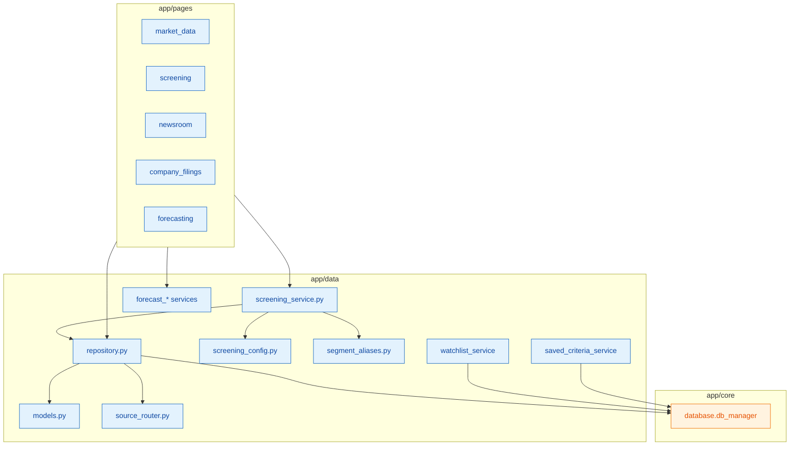
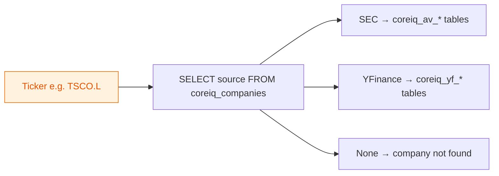
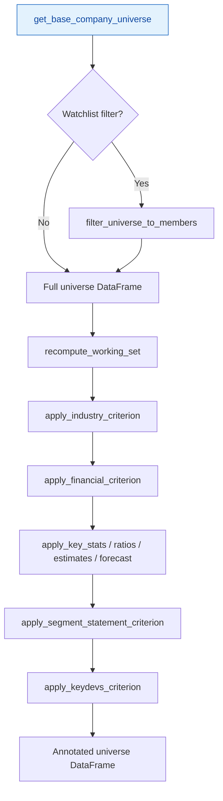
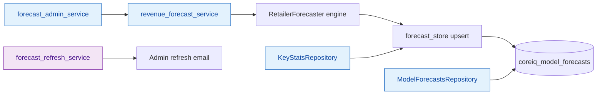

# Data Layer (`app/data/`)

**Application:** Market Data Portal (MDP)  
**Stack:** SQLAlchemy 2 via `core.database.db_manager`, Streamlit `@st.cache_data`  
**Scope:** Models, repositories, screening engine, source routing, segment aliases, user persistence, forecasting pipeline

---

## Overview

`app/data/` is the domain and data-access layer between Streamlit pages and Azure MySQL. All persistent tables use the `coreiq_` prefix. Reads prefer `db_manager.execute_query_readonly` (AUTOCOMMIT, 1 RTT on Azure).

---

## Module Index

| File | Role |
|------|------|
| `models.py` | Dataclasses + fiscal calendar helpers |
| `repository.py` | 19 repository classes — primary Database (DB) read layer (~11k lines) |
| `screening_config.py` | Screening constants (zero DB calls) |
| `screening_service.py` | Screening SQL/pandas engine |
| `source_router.py` | U.S. Securities and Exchange Commission (SEC) vs YFinance per ticker |
| `segment_aliases.py` | Geographic segment canonicalization |
| `watchlist_service.py` | Watchlist Create, Read, Update, Delete (CRUD) + Access Control List (ACL) |
| `saved_criteria_service.py` | Saved screening criteria + ACL |
| `portal_users_service.py` | Internal user registry for ACL pickers |
| `earnings_alert_service.py` | Earnings email alert prefs + dedupe |
| `earnings_alert_store.py` | Re-export shim → `earnings_alert_service` |
| `forecast_store.py` | `coreiq_model_forecasts` read/write cache |
| `forecast_admin_service.py` | Admin bulk forecast sync |
| `forecast_refresh_service.py` | Forecast refresh popup + email |
| `revenue_forecast_service.py` | Revenue Estimates / Forecasting page data |
| `revenue_estimates_service.py` | Alias: `RevenueEstimatesService = RevenueForecastService` |
| `live_earnings_transcript_store.py` | Live transcript upsert |
| `dummy_data.py` | **Legacy stub** — incompatible with current `models.py` |
| `__init__.py` | Package marker |

---

## `models.py` — Domain Dataclasses

### Dataclass catalog

| Class | Source / usage |
|-------|----------------|
| `TickerSentiment` | Per-ticker sentiment on news articles |
| `NewsArticle` | `coreiq_av_market_news_sentiment` (+ `source_tag`: `av` \| `yf`) |
| `Company` | `coreiq_companies` |
| `IncomeStatementLineItem` | Display row for income statement grid |
| `FiscalPeriod` | Column header (annual/quarterly, Calendar Quarter (CQ)/Fiscal Quarter (FQ), estimate/forecast flags) |
| `IncomeStatementData` | Company + periods + line items bundle |
| `CompanyOverview` | Alpha Vantage (AV)/Yahoo Finance (YF) company overview payload |
| `BalanceSheetLineItem` / `BalanceSheetData` | Balance sheet display |
| `CashFlowLineItem` / `CashFlowData` | Cash flow display |
| `EarningsCall` | `coreiq_av_earnings_call_transcripts` |
| `FilingMetricResult` | `coreiq_filing_metrics_v2` / v5 filing metrics |

### Key properties

- **`NewsArticle`:** `formatted_date`, `company_tickers`
- **`Company` / `CompanyOverview`:** `display_name`, `formatted_market_cap`, `website_display`
- **`EarningsCall`:** `display_title`, `formatted_quarter`, `speaker_sections` (transcript parser)
- **`FilingMetricResult`:** `formatted_value`, `display_label`, `display_statement_type`

### Fiscal calendar functions

| Function | Returns |
|----------|---------|
| `get_calendar_quarter(month)` | CQ1–4 |
| `get_fiscal_quarter(month, fiscal_year_end_month)` | FQ1–4 |
| `parse_fiscal_year_end(str)` | Month 1–12 |
| `FiscalPeriod.from_date(dt, period_type, fiscal_year_end)` | Labeled period column |

---

## `source_router.py` — SEC vs YFinance Routing

| Function | Returns | Cache |
|----------|---------|-------|
| `get_company_source(ticker)` | `'SEC'` \| `'YFinance'` \| `None` | `@st.cache_data(ttl=600)` |
| `is_sec_company(ticker)` | `bool` | |
| `is_yf_company(ticker)` | `bool` | |

**Table:** `coreiq_companies.source`  
**Composite tickers:** `TSCO.L` resolved via `exchange_acronym='L'`

Nearly every financial repository branches on `get_company_source(ticker)`.

---

## `segment_aliases.py` — Geographic Segment Canonicalization

### Purpose

Conservative US-only geographic grouping for screening segment filters.

### Constants

| Constant | Role |
|----------|------|
| `GEO_CANONICAL_GROUPS` | United States, Canada, UK, North America, Non-US, Americas |
| `GEO_ALIAS_TO_CANONICAL` | Case-insensitive raw label → canonical |
| `GEO_SUPPRESSED_DROPDOWN_LABELS` | Hide duplicate aliases in User Interface (UI) |
| `GEO_PENSION_SKIP_LABELS` | Exclude pension-plan contamination |
| `GEO_KNOWN_BIZ_LABELS` | Business labels incorrectly in geo presets |

### Functions

| Function | Role |
|----------|------|
| `canonicalize_geo_label(raw)` | Single label normalization |
| `expand_geo_canonical_segments(selected)` | Canonical → all raw aliases for Structured Query Language (SQL) `IN` |
| `is_geo_pension_label()` / `is_geo_known_biz_label()` | Filter guards |

**Consumers:** `screening_service.py`, `screening.py`, `repository.py` (`SegmentDataRepository`)

---

## `screening_config.py` — Screening Constants

**Rule:** Zero DB calls. All constants for UI and SQL generation.

### Core constants

| Constant | Meaning |
|----------|---------|
| `OPERATORS` / `OPERATOR_SQL` | UI operators → SQL (`Between` handled separately) |
| `PERIOD_TYPES` | `Fiscal Year (FY)`, `CQ`, `FQ` |
| `TRAILING_QUARTERS` (`TQ`) | Display-only last N quarters (4/8/12, default 8) |
| `DB_SCALE` | `1_000_000` — UI $mm ↔ raw DB dollars |
| `SCREENING_YEARS` | Historical FY range (current year → 2015) |
| `FORWARD_SCREENING_YEARS` | Includes future FY up to current+5 |

### `STATEMENT_CONFIG`

Maps statement types to DB tables/columns:

| Statement type | Data source |
|----------------|-------------|
| Income Statement, Balance Sheet, Cash Flow | AV + YF financial tables |
| Key Stats, Ratios | Repository tabular output (`metric_key`) |
| Business/Geographical Segments | `coreiq_filing_metrics_v5` |
| Estimates | AV wide + YF long earnings estimates |
| Forecasting | `coreiq_model_forecasts` `model_key` |

### News & Key Developments

- `NEWSDEV_TOPICS` — 15 AV NLP topic keys
- `NEWSDEV_TIMEFRAMES` — 7/30/90/365 days
- `KEYDEV_CATEGORIES` — 12-category CIQ taxonomy
- `KEYDEV_CATEGORIES_ALL` — 24 Excel-style DB categories
- `KEYDEV_TIMEFRAMES` — 1 day through All History

### Helpers

- `get_metric_labels(statement)`, `get_metric_info(statement, label)`

---

## `screening_service.py` — Screening Execution Engine

**Rule:** No Streamlit UI. Returns pandas DataFrames + debug metadata.

### Pipeline

Screening narrows the company universe through progressive criterion filters until the working set matches all active rules.

### Criterion applicators

| Function | Criterion type |
|----------|----------------|
| `apply_industry_criterion()` | Industry multi-select |
| `apply_geography_criterion()` | Country filter |
| `apply_financial_criterion()` | FY/CQ/FQ financial metrics |
| `apply_key_stats_criterion()` / `apply_ratios_criterion()` | Tabular market data |
| `apply_estimates_criterion()` / `apply_forecast_criterion()` | Forward-looking |
| `apply_segment_statement_criterion()` | Business/Geo segment statements |
| `apply_keydevs_criterion()` | Key developments events |
| `apply_biz_segments_criterion()` / `apply_geo_segments_criterion()` | Legacy segment filters |

### Segment cache tables

- `coreiq_screening_segment_member_cache`
- `coreiq_screening_segment_values_cache`

Functions: `build_segment_values_cache()`, `read_segment_member_options_cache()`, `get_segment_member_options()`, etc.

### Orchestration

| Function | Role |
|----------|------|
| `recompute_working_set(active_criteria, criterion_cache, allowed_tickers, allowed_members)` | Main pipeline; per-criterion fingerprint cache |
| `filter_universe_to_members()` | `(ticker, company_name)` composite key filter |
| `criteria_stack_fingerprint()` | Cache key for full stack |

**Scale rule:** User enters $mm; compared against raw DB dollars × `DB_SCALE` (1e6).

---

## `repository.py` — Repository Catalog

Central read layer. All classes use static methods, `db_manager`, `source_router`, and `@st.cache_data`.

### Repository classes

| # | Class | Primary tables | Key methods |
|---|-------|----------------|-------------|
| 1 | `CompanyRepository` | `coreiq_companies` | `get_companies_map`, `get_companies_rows`, `get_company_by_ticker`, `get_all_sectors` |
| 2 | `IncomeStatementRepository` | `coreiq_av/yf_financials_income_statement` | `get_income_statement_data`, `get_date_range`, `get_reported_currency` |
| 3 | `NewsRepository` | `coreiq_av/yf_market_news_sentiment` | `get_articles`, `get_yf_articles`, `get_news_tickers`, `get_sectors` |
| 4 | `CompanyOverviewRepository` | `coreiq_av/yf_company_overview` | `get_company_overview`, `company_exists` |
| 5 | `EarningsCallRepository` | `coreiq_av_earnings_call_transcripts` | `get_earnings_calls`, `search_transcripts_fulltext`, `get_non_sec_transcript_*` |
| 6 | `BalanceSheetRepository` | AV/YF balance sheet | `get_balance_sheet_data` |
| 7 | `CashFlowRepository` | AV/YF cash flow | `get_cash_flow_data` |
| 8 | `KeyStatsRepository` | Computed from statements + overview | `get_key_stats_data`, `extract_metric_value`, `get_estimated_data` |
| 9 | `AnalystEstimatesRepository` | AV/YF earnings estimates | `get_estimates_data` |
| 10 | `ModelForecastsRepository` | `coreiq_model_forecasts` | `get_forecasts_data` (ensemble + scenarios) |
| 11 | `RatiosRepository` | Computed in Python | `get_ratios_data` (liquidity, leverage, margins, ROA/ROE, P/E) |
| 12 | `ForexRepository` | `coreiq_av_forex_daily` | `get_conversion_rate`, `get_conversion_rates_bulk` |
| 13 | `StockQuoteRepository` | AV/YF time series daily | `get_latest_quote`, `get_price_history`, `get_market_cap_chart_data` |
| 14 | `FilingMetricRepository` | `coreiq_filing_metrics_v5` | `search_with_llm_fallback`, `get_header_metadata`, `SYNONYM_MAP` |
| 15 | `AVFinancialsEarningsRepository` | `coreiq_av_financials_earnings` | `get_earnings_date_pair_for_fiscal_quarter_ends` |
| 16 | `EarningsCalendarRepository` | NASDAQ + YF calendar, IR websites | `get_calendar_events`, `get_transcript_for_calendar_event`, `get_earnings_alert_preferences` |
| 17 | `SegmentDataRepository` | `coreiq_filing_metrics_v5` + edgartools | `get_segment_data`, `get_square_footage_data` |
| 18 | `RatingsDataRepository` | Filing metrics (credit_rating, store_count) | `get_ratings_data` |
| 19 | `ExecutiveCompensationRepository` | `coreiq_executives_compensation`, YF overview | `get_sec_latest_compensation`, `get_yf_latest_compensation` |

### Module-level helpers

- `normalize_title_for_dedupe(title)` — Unicode-safe news dedupe
- `_get_fiscal_year_end_cached(ticker)` — 30 min cache
- `warmup_ec_caches()` — Earnings calendar cache warmup (called from `main.py`)

### Caching TTL conventions

| TTL | Use |
|-----|-----|
| 60s | Earnings calls |
| 300s | Financial statements, quotes, segments |
| 600s | Company map, overview, source router |
| 3600s | Companies rows, fiscal year end, news reference |
| 43200s | News articles list |

---

## User Persistence Services

### `watchlist_service.py`

**Tables:** `coreiq_watchlists`, `coreiq_watchlist_access`, `coreiq_watchlist_companies`

| Function | Action |
|----------|--------|
| `ensure_tables()` | Idempotent DDL |
| `create_watchlist()` | Insert metadata |
| `get_user_watchlists()` | Own + granted (120s cache) |
| `get_watchlist_companies()` / `get_watchlist_tickers()` | Members |
| `add_companies_to_watchlist()` / `remove_company_from_watchlist()` | Membership |
| `grant_watchlist_access()` / `revoke_watchlist_access()` | ACL |

**Consumers:** `screening.py`, `newsroom.py`, `earnings_calls.py`, `earnings_calendar.py`

### `saved_criteria_service.py`

**Tables:** `coreiq_saved_criteria`, `coreiq_saved_criteria_access`

| Function | Action |
|----------|--------|
| `save_criteria()` / `get_user_criteria()` / `get_criteria_by_id()` | CRUD |
| `update_criteria()` / `delete_criteria()` | Soft delete |
| `grant_access()` / `revoke_access()` | ACL |

**Consumer:** `screening.py`

### `portal_users_service.py`

**Table:** `coreiq_portal_users` — seeded with ~40 Coresight team members

| Function | Role |
|----------|------|
| `get_all_portal_users(exclude_email)` | ACL user-picker dropdown |
| `upsert_portal_user()` | Add/update user |

**Consumers:** `screening.py`, `access_management.py`

---

## Earnings Alert Services

### `earnings_alert_service.py`

**Tables:**
- `coreiq_earnings_alert_preferences_history` — append-only; latest row = current settings
- `coreiq_earnings_alert_delivery_log` — unique `dedupe_key` per sent email

| Function | Role |
|----------|------|
| `load_preference(user_email)` / `save_preference(...)` | enabled, days_before, selection_mode, tickers, sectors |
| `list_enabled_preferences()` | Users with latest `enabled=1` |
| `delivery_exists(dedupe_key)` / `try_insert_delivery()` | Idempotent send guard |

**Consumers:** `earnings_calendar.py`, `utils/earnings_alert_dispatcher.py`

### `earnings_alert_store.py`

Re-export shim only — imports from `earnings_alert_service`.

---

## Forecasting Pipeline

Revenue forecasts flow from the forecasting engine into `coreiq_model_forecasts`, with admin sync and Key Stats consumption paths.

### `forecast_store.py`

| Function | Role |
|----------|------|
| `needs_update(ticker, last_actual_date)` | Staleness check (1 RTT) |
| `upsert_forecasts(...)` | `INSERT … ON DUPLICATE KEY UPDATE` |
| `get_forecasts(ticker, model_key='ensemble')` | Read for Key Stats F- columns |
| `delete_forecasts_beyond_horizon(max_periods_ahead=5)` | Cleanup |

**Model keys:** `ensemble`, `linear`, `cagr`, `exp_smoothing`, `holt`, `ma_trend`, `weighted_avg`  
**Scenario keys:** `scenario_pessimistic`, `scenario_baseline`, `scenario_optimistic`

### `revenue_forecast_service.py`

**Class:** `RevenueForecastService`

| Method | Description |
|--------|-------------|
| `get_companies()` | Companies with ≥3 annual revenue points |
| `get_company_dashboard(ticker, periods=5)` | Actuals, backtest, forecast, summary |

**Engine:** `utils.retailer_forecaster.RetailerForecaster`  
**Fast path:** Reconstructs forecast from `coreiq_model_forecasts` when `needs_update()` is false

### `forecast_admin_service.py`

| Function | Role |
|----------|------|
| `is_forecast_admin(email)` | Hardcoded admin allowlist (4 emails) |
| `sync_forecast_for_ticker(display_ticker, force, periods=5)` | Single-ticker sync |
| `sync_all_eligible(force, progress_callback)` | Bulk sync |
| `clear_revenue_forecast_caches()` | Clear Streamlit caches |

### `forecast_refresh_service.py`

| Function | Role |
|----------|------|
| `get_refresh_table_data(period_type)` | All-ticker refresh status table |
| `send_model_refresh_email()` | HyperText Markup Language (HTML) Simple Mail Transfer Protocol (SMTP) notification to admins |
| `validate_q4_reporting_dates()` | Q4 date consistency audit |
| `ensure_forecast_columns()` | DDL migrations |

---

## `live_earnings_transcript_store.py`

**Table:** `coreiq_earnings_call_live_transcripts`  
**Source tag:** `live_streamlit`  
**Unique key:** `(source, ticker, quarter)` where quarter = `2024Q1`

| Function | Role |
|----------|------|
| `export_period_key(fiscal_year, quarter)` | `2024Q1` format |
| `build_earnings_transcript_payload()` | JSON transcript structure |
| `upsert_live_transcript_row()` | INSERT … ON DUPLICATE KEY UPDATE |

**Consumer:** `live_earnings_transcript.py`

---

## `dummy_data.py` — Legacy Stub

**Status:** Broken — imports types (`SECFiling`, `MarketData`) that no longer exist in `models.py`. Production uses `repository.py`.

---

## Design Conventions

1. **Logging:** `utils.server_logger` only (`log_structured_error`, `log_db_timing`)
2. **No UI in services:** `screening_service.py` is pure data; pages own Streamlit
3. **ACL:** Watchlists and saved criteria enforce server-side grants
4. **Idempotent DDL:** Services use `CREATE TABLE IF NOT EXISTS` + threading locks
5. **Source routing:** SEC → `coreiq_av_*` wide tables; YFinance → `coreiq_yf_*` long/pivot; composite tickers use `yf_symbol` or `TICKER.EXCHANGE`

---

## Page → Data Module Map

| Page | Primary data imports |
|------|---------------------|
| `market_data.py` | `repository.*`, `models`, `source_router` |
| `screening.py` | `screening_config`, `screening_service`, `watchlist_service`, `saved_criteria_service`, `portal_users_service`, `segment_aliases` |
| `newsroom.py` | `repository.NewsRepository`, `models`, `watchlist_service` |
| `earnings_calls.py` | `repository.EarningsCallRepository`, `watchlist_service` |
| `company_filings.py` | `repository.FilingMetricRepository` |
| `forecasting.py` | `revenue_forecast_service`, `forecast_admin_service`, `forecast_refresh_service` |
| `live_earnings_transcript.py` | `live_earnings_transcript_store` |
| `access_management.py` | `portal_users_service` (via ACL UI) |
| `main.py` | `repository.warmup_ec_caches`, watchlist/saved_criteria/portal/earnings_alert `ensure_tables` |
