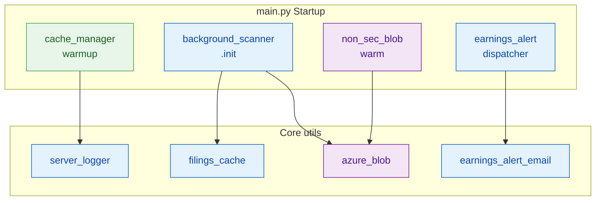
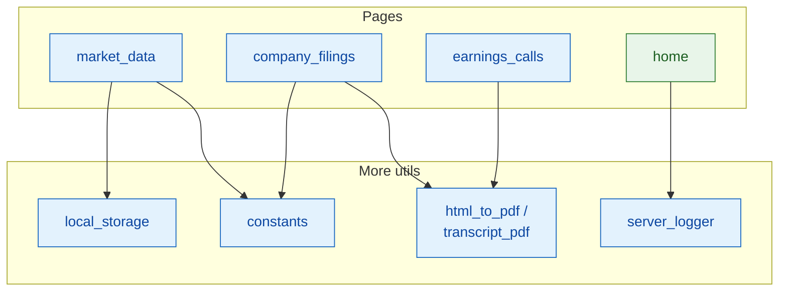
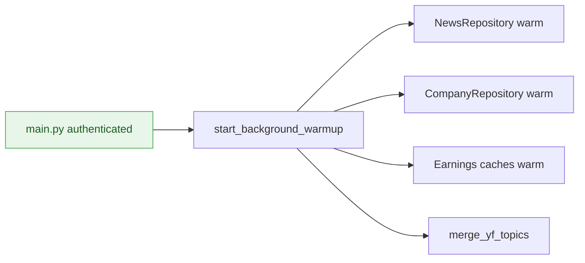
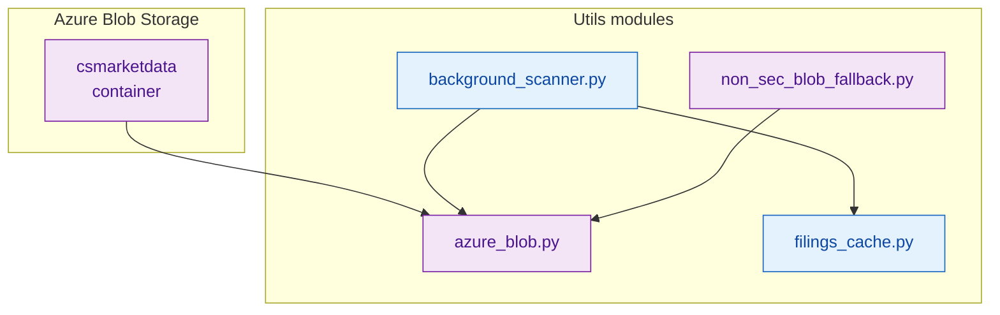
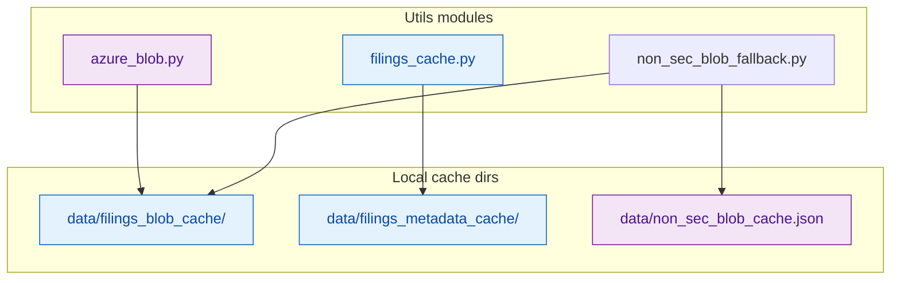
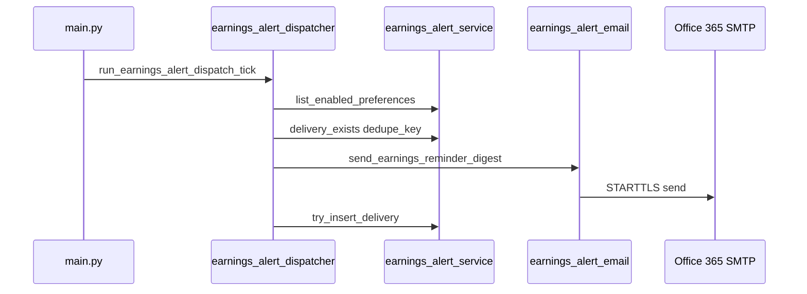
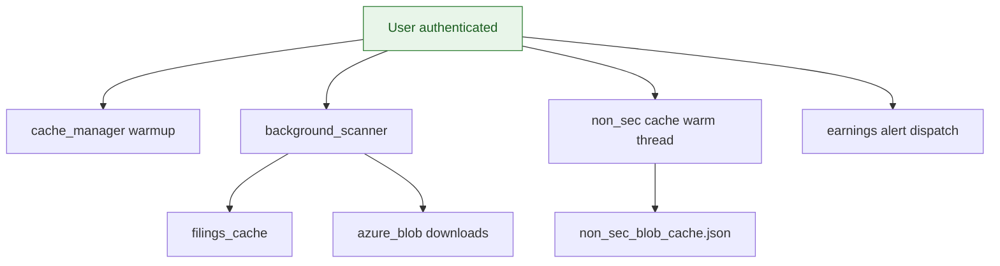

# Utilities & Caching (`app/utils/`)

**Application:** Market Data Portal (MDP)  
**Scope:** Logging, Streamlit cache management, Azure Blob, Portable Document Format (PDF) generation, email dispatch, market data helpers, background scanning, local storage, constants

---

## Overview

`app/utils/` provides cross-cutting infrastructure used by pages, core modules, data services, and components. Every module imports `server_logger` instead of stdlib `logging`. Each module exposes a consistent Application Programming Interface (API).

**Figure 1 Part A — Startup triggers and core utils**



**Figure 1 Part B — Pages consume utils**



---

## Module Index

| Module | Status | Purpose |
|--------|--------|---------|
| `server_logger.py` | **Core** | Central application logging |
| `cache_manager.py` | **Active** | Streamlit cache control + background warmup |
| `azure_blob.py` | **Active** | Azure Blob Storage helpers |
| `filings_cache.py` | **Active** | Persistent blob metadata cache |
| `background_scanner.py` | **Active** | Background Azure filing pre-fetch |
| `non_sec_blob_fallback.py` | **Active** | Non-U.S. Securities and Exchange Commission (SEC) filing local index |
| `html_to_pdf.py` | **Active** | SEC filing PDF (PyMuPDF) |
| `transcript_pdf.py` | **Active** | Earnings transcript PDF (fpdf2) |
| `earnings_alert_email.py` | **Active** | Simple Mail Transfer Protocol (SMTP) earnings alert emails |
| `earnings_alert_dispatcher.py` | **Active** | Background alert dispatch |
| `excel_export.py` | **Active** | Branded Excel export |
| `local_storage.py` | **Active** | Session-state preference keys |
| `local_storage_manager.py` | **Active** | Browser persistence via streamlit-local-storage |
| `ticker_utils.py` | **Active** | Ticker validation + fallback |
| `constants.py` | **Active** | Currency, exchange, country, topic lookups |
| `filing_units.py` | **Active** | Multi-filing document support (8-K, 6-K, etc.) |
| `retailer_forecaster.py` | **Active** | Revenue forecasting engine |
| `cache_cleaner.py` | **Active** | `__pycache__` purge on rerun |
| `blob_doc_type_discovery.py` | Standalone tool | Azure doc_type gap scanner |
| `filing_pdf.py` | **Dead** | Replaced by `html_to_pdf.py` |
| `market_data.py` | **Deprecated** | Legacy duplicate of `pages/market_data.py` |
| `companyProfile.py` | **Dead** | Replaced by `components/companyProfile.py` |
| `__init__.py` | Package marker | — |

---

## `server_logger.py` — Central Logging

**Output:** `server-logs/server-log.log`

**Format:** `{timestamp} | {level} | {rerun_id} | page={page} | {filename}:{funcName} | {message}`

### Core API

| Category | Functions |
|----------|-----------|
| Rerun correlation | `new_rerun_id`, `get_rerun_id`, `set_page_context` |
| Log levels | `log_info`, `log_debug`, `log_warning`, `log_error`, `log_exception`, `log_critical`, `log_structured_error` |
| Error handling | `error_boundary`, `safe_execute` |
| Performance | `log_timing`, `log_db_timing`, `log_render_timing`, `log_function_timing` |
| Context managers | `timed_operation`, `timed_db_query`, `timed_render`, `timed_function` |
| Page tracking | `PageTimer`, `PageLoadTracker`, `NavigationTracker`, `track_page_load` |
| Log admin | `get_log_content`, `clear_logs`, `download_logs`, `get_log_stats`, `analyze_slow_operations` |

### Environment variables

| Variable | Default | Role |
|----------|---------|------|
| `APP_LOG_LEVEL` | `WARNING` | Minimum log level |
| `APP_TIMING` | `1` | Timing-only filter mode |
| `APP_VERBOSE_LOGGING` | `0` | Verbose output |

**Rule:** Stdlib `logging` is forbidden project-wide. All code imports from `utils.server_logger` only.

---

## `cache_manager.py` — Streamlit Cache Control

### Purpose

Centralized `@st.cache_data` management: clear, stats, foreground/background warming for news, companies, earnings, Yahoo Finance (YF) topics.

### API

| Function | Role |
|----------|------|
| `clear_news_cache()` / `clear_company_cache()` / `clear_all_caches()` | Cache invalidation |
| `get_cache_stats()` | Hit/miss statistics |
| `warm_caches()` | Foreground warmup |
| `start_background_warmup()` | Daemon thread warmup |
| `render_cache_controls()` | Optional admin User Interface (UI) |

### Startup integration

Called from `main.py` when authenticated and `ENABLE_BG_WARMUP=1` (default).



**Warms:** `data.repository.NewsRepository`, `CompanyRepository`, earnings caches; calls `utils.constants.merge_yf_topics`.

---

## Azure Blob & Filing Cache Subsystem

### Architecture

Cross-cutting utilities consumed by pages, core modules, and background warmups.

**Figure 2 Part A — Azure source & utils modules**



**Figure 2 Part B — Local cache paths**



### `azure_blob.py`

| Function | Role |
|----------|------|
| `get_container_client()` | Azure SDK container client |
| `local_cache_path_for_blob(blob_name)` | Local filesystem path |
| `ensure_local_blob_for_transcript(blob_name)` | Download if missing |
| `download_blob_to_memory(blob_name)` | In-memory bytes |

**Env vars:**

| Variable | Default |
|----------|---------|
| `AZURE_STORAGE_ACCOUNT_NAME` | `csmarketdata` |
| `AZURE_STORAGE_ACCOUNT_KEY` | (required) |
| `AZURE_BLOB_CONTAINER` | `azure-storage-test` |
| `AZURE_BLOB_PREFIX` | (optional prefix) |

**Cache root:** `{repo}/data/filings_blob_cache/`

**Consumers:** `earnings_calls.py`, `non_sec_blob_fallback.py`

### `filings_cache.py`

| Class / Function | Role |
|----------------|------|
| `FilingsMetadataCache` | DiskCache/SQLite-backed metadata (24h TTL, ETag validation) |
| `InMemoryFallbackCache` | Fallback when DiskCache unavailable |
| `get_filings_cache()` | Singleton accessor |
| `generate_etag_from_blobs(blobs)` | ETag for cache invalidation |
| `invalidate_company_cache(ticker)` | Per-ticker purge |

**Consumers:** `background_scanner.py`, `company_filings.py`

### `background_scanner.py`

**Purpose:** Intelligent background pre-fetch of Azure filing blobs. Skips scan when cache sufficient; discovers years dynamically; parallel downloads.

| Function | Role |
|----------|------|
| `BackgroundFilingsScanner` | Main scanner class |
| `init_background_scanner(auto_start=True)` | Start daemon scanner |
| `ensure_cache_purge()` | One-time cache purge (`.cache_purge_v1_done`) |
| `get_scan_progress()` / `get_cache_audit()` | Progress for UI |
| `is_scan_complete()` | Completion flag |

**Startup:** `main.py` when `ENABLE_BG_SCANNER=1` (default) and authenticated.

**Consumers:** `main.py`, `home.py` (progress UI), `company_filings.py`

**Data dirs:** `data/filings_blob_cache/`, `data/filings_metadata_cache/`, `.blob_container_last_modified`

### `non_sec_blob_fallback.py`

**Purpose:** Local-first index of non-SEC filing PDFs (annual reports, half-yearly, interim). Azure only as fallback.

| Function | Role |
|----------|------|
| `get_non_sec_blob_data(ticker)` | Blob listing for ticker |
| `warm_non_sec_cache_at_startup(tickers, max_workers=32)` | Parallel warm |
| `get_non_sec_tickers_from_db()` | Tickers with non-SEC sources |
| `invalidate_non_sec_cache()` | Called when scanner downloads new blobs |
| `is_non_sec_source_company(ticker)` | Source check |

**Startup:** `main.py` daemon thread when authenticated.

**Consumer:** `company_filings.py`

---

## PDF Generation

### `html_to_pdf.py` — SEC Filings (Production)

| Function | Role |
|----------|------|
| `generate_filing_pdf(html_content, title, ticker, ...)` | PyMuPDF (fitz) render to PDF bytes |
| `_clean_sec_html(html)` | Strip iXBRL/eXtensible Business Reporting Language (XBRL) junk, wrap in branded CSS |

**Consumer:** `company_filings.py` (PDF download button)

### `transcript_pdf.py` — Earnings Transcripts

| Function | Role |
|----------|------|
| `generate_transcript_pdf(call, segments, ...)` | fpdf2 A4 branded PDF |

**Consumer:** `earnings_calls.py`

### `filing_pdf.py` — Legacy (Dead)

Simple fpdf2 plain-text generator. **Superseded by `html_to_pdf.py`.** No consumers.

---

## Earnings Alert Email Pipeline

Background dispatcher loads enabled preferences, dedupes deliveries, and sends SMTP alerts for upcoming earnings.



### `earnings_alert_email.py`

| Function | Role |
|----------|------|
| `send_earnings_alert_preferences_confirmation(...)` | User preference saved confirmation |
| `send_earnings_reminder_digest(...)` | Reminder email with upcoming earnings |

**Env vars:**

| Variable | Default |
|----------|---------|
| `SMTP_SERVER` | `smtp.office365.com` |
| `SMTP_PORT` | `587` |
| `FROM_EMAIL` | `dataautomation@coresight.com` |
| `EMAIL_PASSWORD` | Required — no-op if unset |

### `earnings_alert_dispatcher.py`

| Function | Role |
|----------|------|
| `run_earnings_alert_dispatch_tick()` | Throttled dispatch on each authenticated load |
| `start_background_dispatch_thread()` | Daemon thread for scheduled sends |

**Env vars:**

| Variable | Default |
|----------|---------|
| `EARNINGS_ALERT_DISPATCH` | `1` |
| `EARNINGS_ALERT_DISPATCH_THREAD` | `1` |
| `EARNINGS_ALERT_DISPATCH_MIN_INTERVAL_SEC` | `120` |
| `EARNINGS_ALERT_DISPATCH_HOUR_UTC` | `8` |
| `EARNINGS_ALERT_DISPATCH_LOOKBACK_DAYS` | `3` |
| `EARNINGS_ALERT_DISPATCH_THREAD_SLEEP_SEC` | `600` |

---

## Local Storage & State Persistence

### `local_storage.py`

Session-state–backed typed keys via `StorageKey` enum.

| Function | Stored value |
|----------|--------------|
| `get/set_sec_filing(...)` | SEC filing filter state |
| `get/set_date_range(...)` | Date range picker |
| `get/set_marketdata_tab(...)` | Active Market Data tab |
| `get/set_selected_company(...)` | Global company selection |
| `clear_selected_company()` | Reset selection |

**Consumers:** `market_data.py`, `home.py`, `components/toolbar.py`

### `local_storage_manager.py`

Browser persistence via `streamlit-local-storage` under key `sip_app_state`.

| Function | Role |
|----------|------|
| `sync_market_data_state()` / `save_market_data_state()` | Market Data state round-trip |
| `get_persistent_state()` / `set_persistent_state()` | Generic namespaced state |
| `load_earnings_calls_state()` / `save_earnings_calls_state()` | Earnings Calls filters |

**Consumers:** `market_data.py`, `home.py`, `earnings_calls.py`

**Note:** Degrades gracefully if `streamlit-local-storage` package missing.

---

## `ticker_utils.py` — Ticker Validation

| Function | Role |
|----------|------|
| `validate_and_get_ticker(ticker, source)` | Database (DB) lookup; fallback to `AMZN` if invalid |
| `get_ticker_from_source(source)` | Extract ticker from URL/session |
| `check_ticker_exists(ticker)` | Boolean existence check |

**Constant:** `DEFAULT_FALLBACK_TICKER = "AMZN"`

**Consumers:** `market_data.py`, `newsroom.py`, `company_filings.py`, `earnings_calls.py`, `earnings_calendar.py`

---

## `constants.py` — Lookup Tables & Formatters

### Key data exports

| Constant | Contents |
|----------|----------|
| `CURRENCY_NAMES` / `CURRENCY_SYMBOLS` | ISO currency display |
| `EXCHANGE_CODE_MAP` | Exchange acronym → display name |
| `COUNTRY_NAMES` | Country code → name |
| `AV_TOPIC_LABELS` / `NEWS_TOPIC_LABELS` | News topic display labels |
| `SEGMENT_METRIC_GROUPS` | XBRL segment groupings for screening |

### Key functions

| Function | Role |
|----------|------|
| `get_currency_symbol(code)` | `$`, `€`, etc. |
| `format_currency_full(value, code)` | Full formatted amount |
| `get_exchange_code(name)` / `format_exchange(code)` | Exchange formatting |
| `format_country(code)` | Country name |
| `merge_yf_topics(av_topics, yf_topics)` | Combined topic list |
| `get_topic_display_label(key)` | Human-readable topic |

**Consumers:** `market_data.py`, `newsroom.py`, `screening.py`, `forecasting.py`, `repository.py`, `components/companyProfile.py`, `excel_export.py`, `cache_manager.py`

---

## `excel_export.py` — Excel Export

| Function | Exports |
|----------|---------|
| `export_company_profile_excel(...)` | Company Profile tab |
| `export_company_profile_simple_excel(...)` | Simplified profile |
| `export_stock_quote_excel(...)` | Stock quote data |
| `export_company_full_excel(...)` | Full company workbook |
| `export_financial_excel(...)` | Income/Balance/Cash Flow tabs |

**Library:** openpyxl with Coresight branding  
**Consumer:** `market_data.py`

---

## `filing_units.py` — Multi-Filing Documents

Supports 8-K, 6-K, DEF14A, and other sub-document types within a filing year.

| Function | Role |
|----------|------|
| `get_filing_units(ticker, year, doc_type)` | List sub-folders from DB or filesystem |
| `get_default_filing_unit(...)` | Default unit for display |
| `build_filing_blob_path(...)` | Azure blob path builder |
| `get_local_filing_path(...)` | Local cache path |
| `has_filing_units(...)` | Boolean check |

**Constant:** `FILING_UNIT_DOC_TYPES = {"8-K", "6-K", "DEF14A", "DEFA14A", "DEF 14A", "PRE14A"}`

**Consumer:** `company_filings.py` (primary)

---

## `retailer_forecaster.py` — Revenue Forecasting Engine

### Class: `RetailerForecaster`

| Method | Role |
|--------|------|
| `from_dataframe(df)` | Construct from revenue history |
| `summary_stats()` | Descriptive statistics |
| `backtest()` | Holdout-year MAPE evaluation |
| `forecast(periods=5)` | Forward projections |
| `run()` / `run_full_analysis()` | Full pipeline |

**Models (6):** linear regression, CAGR, exponential smoothing, Holt, MA trend, weighted average. Best MAPE model selected; ensemble combines top performers.

**Consumers:** `revenue_forecast_service.py`, `forecast_admin_service.py`, `forecast_refresh_service.py`, forecast scripts

---

## `cache_cleaner.py` — Bytecode Purge

| Function | Role |
|----------|------|
| `clean_pycache()` | Delete `__pycache__` under `app/` |
| `ensure_fresh_code()` | Run once per page load |
| `clean_pycache_once()` | Idempotent single purge |

Sets `PYTHONDONTWRITEBYTECODE=1` at runtime.

**Consumer:** `earnings_calls.py` (`ensure_fresh_code` at page load)

**Note:** `main.py` also purges `__pycache__` on every startup.

---

## `blob_doc_type_discovery.py` — Maintenance Tool

Scans Azure blobs for `doc_type` folder names not in the app's known list. **Not wired into the app** — callable from scripts/REPL.

| Function | Role |
|----------|------|
| `discover_unknown_doc_types()` | Full scan with watermark |
| `get_last_scan_result()` | Last scan JSON |
| `format_discovery_report()` | Human-readable report |

**State file:** `data/blob_doc_type_scan_state.json`

---

## Legacy / Dead Modules

| Module | Replacement | Notes |
|--------|-------------|-------|
| `market_data.py` | `pages/market_data.py` | ~1,900-line deprecated duplicate (2025-07-10) |
| `filing_pdf.py` | `html_to_pdf.py` | Simple fpdf2 stub |
| `companyProfile.py` | `components/companyProfile.py` | No imports anywhere |

---

## Startup Orchestration Summary

| Utility | Trigger | Env gate |
|---------|---------|----------|
| `cache_manager.start_background_warmup` | Authenticated session | `ENABLE_BG_WARMUP=1` |
| `background_scanner.ensure_cache_purge` + `init_background_scanner` | Authenticated session | `ENABLE_BG_SCANNER=1` |
| `non_sec_blob_fallback.warm_non_sec_cache_at_startup` | Authenticated daemon thread | Once per process |
| `earnings_alert_dispatcher` tick + thread | Authenticated | `EARNINGS_ALERT_DISPATCH=1` |



---

## Dependency Graph (High Level)

```
server_logger  ← (used by almost everything)
constants      ← market_data, screening, newsroom, repository, excel_export
azure_blob     ← earnings_calls, non_sec_blob_fallback
filings_cache  ← background_scanner, company_filings
background_scanner → filings_cache, non_sec_blob_fallback
earnings_alert_dispatcher → earnings_alert_email → SMTP
local_storage  ← market_data, toolbar, home
retailer_forecaster ← revenue_forecast_service, forecast_admin_service
```
