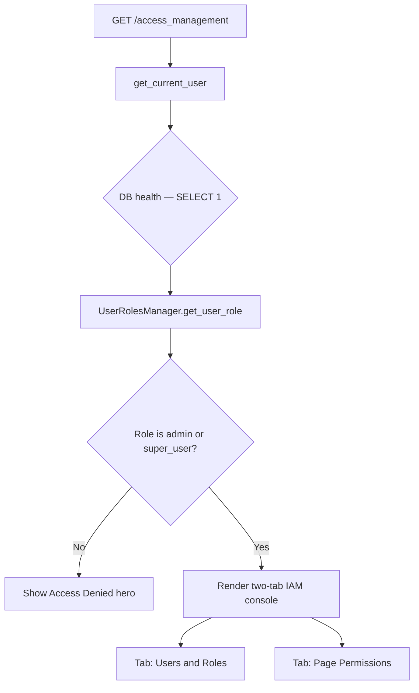
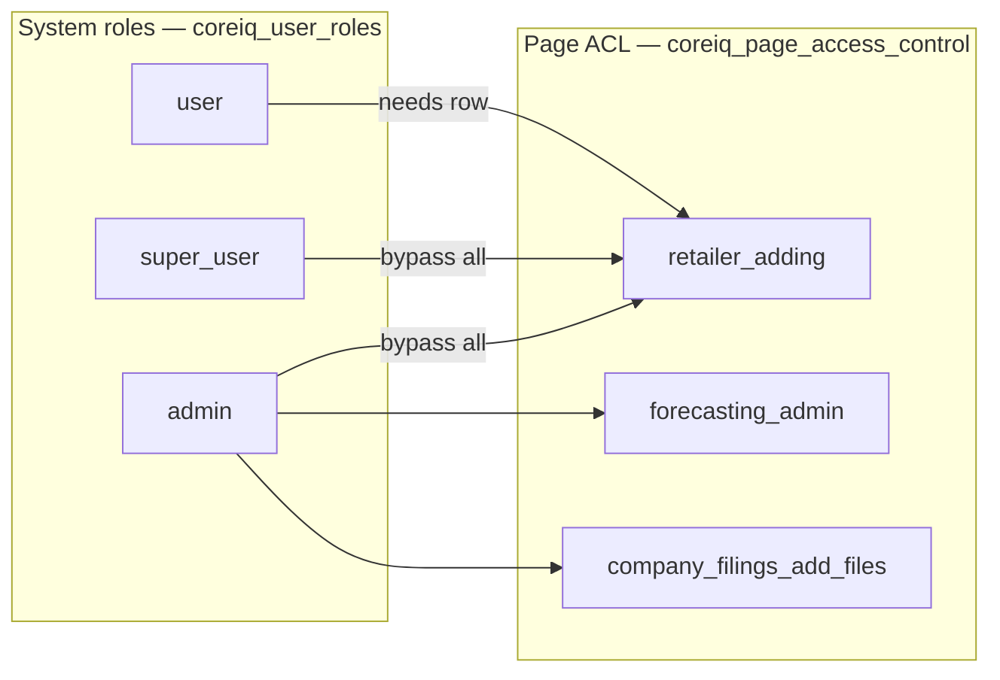
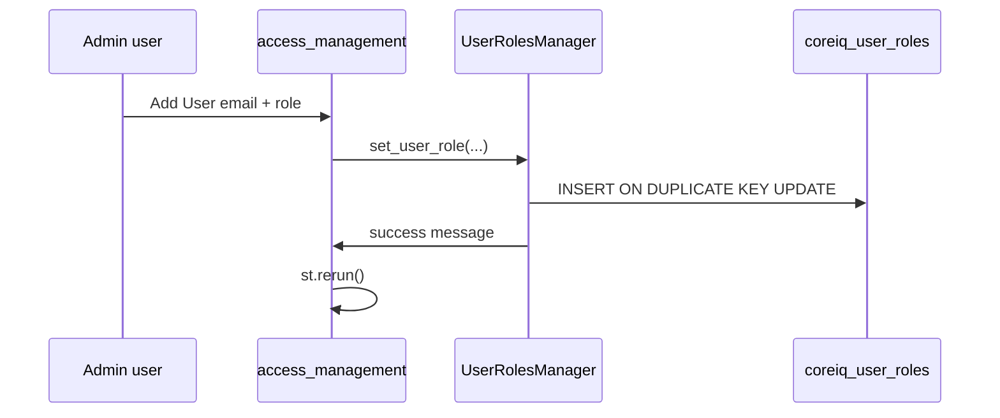
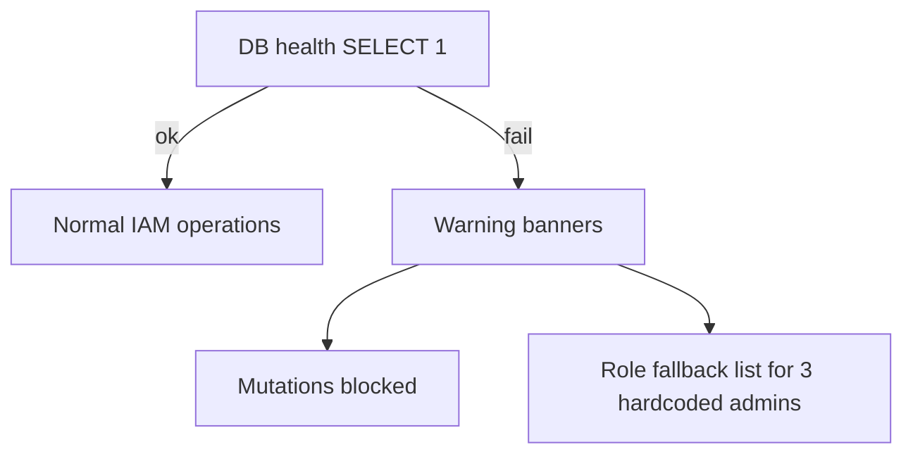
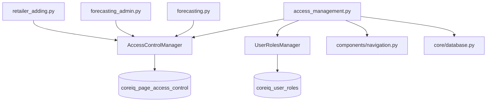

# Access Management Page — Technical Documentation

**Application:** Market Data Portal (MDP)  
**Source:** `app/pages/access_management.py`  
**URL path:** `/access_management`  
**Purpose:** Centralized Identity and Access Management (IAM) for **system roles** (`coreiq_user_roles`) and **page-level permissions** (`coreiq_page_access_control`).

---

## Overview

Access Management is the administrative console for who can use restricted portal pages and what **system role** each user holds. Only users with role **`admin`** or **`super_user`** may open the page. Within the page, **admins** have additional powers (create admin users, grant delete permission, delete users).

---

## Registration & Discovery

| Property | Value |
|----------|-------|
| `main.py` registration | Yes — `url_path=access_management` |
| Footer link | Shown when `_can_access_mgmt(user_email)` is true |
| Auth | `get_current_user()` — identity via `main.py` cookie hydrate |

Gate: only `admin` or `super_user` roles reach the Identity and Access Management (IAM) console; others see an access-denied hero.



---

## Core Modules

### `AccessControlManager` (`app/core/access_control.py`)

Manages **`coreiq_page_access_control`** — per-page, per-user permission rows.

| Method | Purpose |
|--------|---------|
| `check_access(page, email, required_permission)` | Runtime gate used by feature pages |
| `get_page_users(page)` | List Access Control List (ACL) rows for a page |
| `set_user_access(page, email, permission, created_by)` | Upsert Access Control List (ACL) row |
| `remove_user_access(page, email)` | Delete Access Control List (ACL) row |
| `get_permission_options()` | All valid permission strings |

### `UserRolesManager` (same file)

Manages **`coreiq_user_roles`** — global role per email.

| Method | Purpose |
|--------|---------|
| `get_user_role(email)` | Returns `admin`, `super_user`, `user`, or None |
| `get_all_users()` | Full user list ordered by role hierarchy |
| `set_user_role(email, role, display_name, created_by)` | Upsert user |
| `delete_user(email)` | Remove user (admin-only in UI) |
| `is_admin` / `is_admin_or_super_user` | Convenience checks |

---

## Database Tables

### `coreiq_page_access_control`

| Column | Purpose |
|--------|---------|
| `page_name` | Page identifier (e.g. `retailer_adding`) |
| `user_email` | Lowercased email |
| `permission_level` | See hierarchy below |
| `created_by` | Granting admin email |
| `created_at` / `updated_at` | Timestamps |

**Upsert:** `INSERT ... ON DUPLICATE KEY UPDATE permission_level, updated_at`

### `coreiq_user_roles`

| Column | Purpose |
|--------|---------|
| `user_email` | PK / unique |
| `display_name` | Optional friendly name |
| `role` | `admin` \| `super_user` \| `user` |
| `created_by` | Who added the user |
| `created_at` / `updated_at` | Timestamps |

---

## Permission Hierarchy (runtime)

Used by `AccessControlManager.check_access`:

| Level | Numeric rank | Meaning |
|-------|----------------|---------|
| `view_only` | 1 | Read-only |
| `upload_only` | 2 | Upload capability |
| `edit` | 3 | Edit content |
| `delete_admin`, `allow` | 4 | Full page access |
| `deny` | — | Explicit block (always false) |

**Bypass:** Users with role `admin` or `super_user` return `True` for any `check_access` call without reading Access Control List (ACL) table.



---

## Managed Pages (UI scope)

Configured in `MANAGED_PAGES`:

| `page_name` | Display label |
|-------------|---------------|
| `company_filings_add_files` | Company Filings File Manager |
| `retailer_adding` | Retailer Adding |
| `forecasting_admin` | Forecasting Admin |

**Note:** The public **forecasting viewer** (`forecasting` page) uses separate Access Control List (ACL) checks in `forecasting.py` but is **not** listed in Access Management UI.

---

## Tab 1 — Users & Roles

### Stats grid

Total users, Admins, Super Users, standard Users — computed from `get_all_users()`.

### Add / Update User form

| Field | Widget |
|-------|--------|
| Email | `st.text_input` key `am_u_email` |
| Display name | `am_u_name` |
| Role | `am_u_role` selectbox |
| Submit | **Add User** → `UserRolesManager.set_user_role` |

**Rules:**

- Only **admins** can assign role `admin` (super_users blocked with error).
- Mutations disabled when `db_ok=False`.

### Users table

- Filter: All Roles / Admin / Super User / User
- Columns: Email, Display Name, Role (pill), Since, Added By, Delete
- **Delete flow:** Two-step confirm (`🗑️` → `✓ Sure?`)
  - Cannot delete self
  - Only admins can delete
  - Calls `UserRolesManager.delete_user`

### Role legend cards

Describes `admin`, `super_user`, `user` capabilities from `ROLE_DESCS`.



---

## Tab 2 — Page Permissions

### Page selector

Dropdown of `MANAGED_PAGES` → loads `AccessControlManager.get_page_users(sel_page_id)`.

### Stats

Metrics: Total with Access, View Only, Edit, Delete (`delete_admin` count).

### Grant Access form

| Field | Notes |
|-------|-------|
| Email | Manual entry |
| Permission | `view_only`, `edit`, and `delete_admin` (admin only) |
| Quick-pick | Selectbox of known users from roles table |

**Super user limitation:** Can grant `view_only` and `edit` only — not `delete_admin`.

Calls `AccessControlManager.set_user_access(sel_page_id, email, perm, current_user)`.

### Current access table

Per user row:

- Email (read-only display)
- Permission selectbox — **auto-saves on change** (compares to current, calls `set_user_access`)
- Granted date, Granted by
- Revoke button → `remove_user_access`

### Permission legend

UI exposes simplified 3-tier model:

| UI label | DB value | Description |
|----------|----------|-------------|
| View Only | `view_only` | Read-only |
| Edit | `edit` | View + edit |
| Delete | `delete_admin` | Full admin on page |

Legacy values (`allow`, `deny`, `upload_only`) still exist in DB and `get_permission_options()` but are collapsed in display pills via `PERM_DISPLAY`.

---

## Database Health Check

On page load:

```python
db_manager.execute_query_readonly("SELECT 1", {})
```

If fails → `db_ok=False`:

- Warning banner on page
- Read operations show empty/cached states
- **All mutations disabled**
- Role fallback: hard-coded admin emails get `admin` role



---

## Session State Keys

| Key pattern | Purpose |
|-------------|---------|
| `am_u_email`, `am_u_name`, `am_u_role` | Add user form widgets |
| `am_u_filter` | Role filter selectbox |
| `_del_confirm_{email}` | Two-step delete confirmation |
| `am_p_sel` | Selected managed page index |
| `am_p_email`, `am_p_perm`, `am_p_pick` | Grant access form |
| `am_pp_{idx}_{email}_{page}` | Per-row permission selectbox |

Role cache busting on write: `UserRolesManager` pops `_urm_role_{email}` from session.

---

## Error Handling

| Failure | UX |
|---------|-----|
| DB health check fail | Warning banner; mutations blocked; role list falls back to 3 hardcoded admins |
| `set_user_access` / `remove_user_access` exception | `st.error` + `[Access Control List (ACL)]` log line |
| Invalid email on add user | Inline validation before DB write |
| Non-admin attempting admin-only action | Button hidden or `st.error` |

Page render wrapped in try/except at module level — failures log via `log_structured_error` with `page="access_management"`.

---

## Logging

Uses `log_timing` for:

- `ACCESS_MGMT_auth`
- `ACCESS_MGMT_db_health`
- `ACCESS_MGMT_role_check`
- `ACCESS_MGMT_total_page_render`

ACL mutations log via `log_error` in `access_control.py` with `[Access Control List (ACL)]` prefix.

---

## Relationship to Other Admin UIs

| Surface | Overlap |
|---------|---------|
| `forecasting_admin.py` expander | Duplicate mini-IAM for 3 pages — uses same `AccessControlManager` |
| `admin_iam.py` | Unregistered legacy IAM page |
| Feature pages | Call `check_access` at module top |

**Canonical management:** Access Management page is the primary full-featured IAM UI.

---

## Admin Capability Matrix

| Action | admin | super_user |
|--------|-------|------------|
| Open page | Yes | Yes |
| Add user (any role) | Yes | Yes except admin role |
| Delete user | Yes | No |
| Grant view/edit page perm | Yes | Yes |
| Grant delete_admin page perm | Yes | No |
| Revoke page access | Yes | Yes |

---

## Fallback Admins (DB unavailable)

`UserRolesManager._FALLBACK_ADMINS`:

- mohdsaeedafri@coresight.com
- philipmoore@coresight.com
- shashankgupta@coresight.com

Also used in `_can_access_mgmt()` footer helper and Access Management role check fallback.

---

## Dependency Graph



---

*Generated from source analysis of the Market Data Portal (MDP). Last reviewed against codebase structure as of project documentation pass.*
