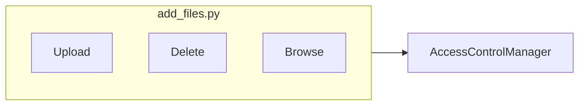
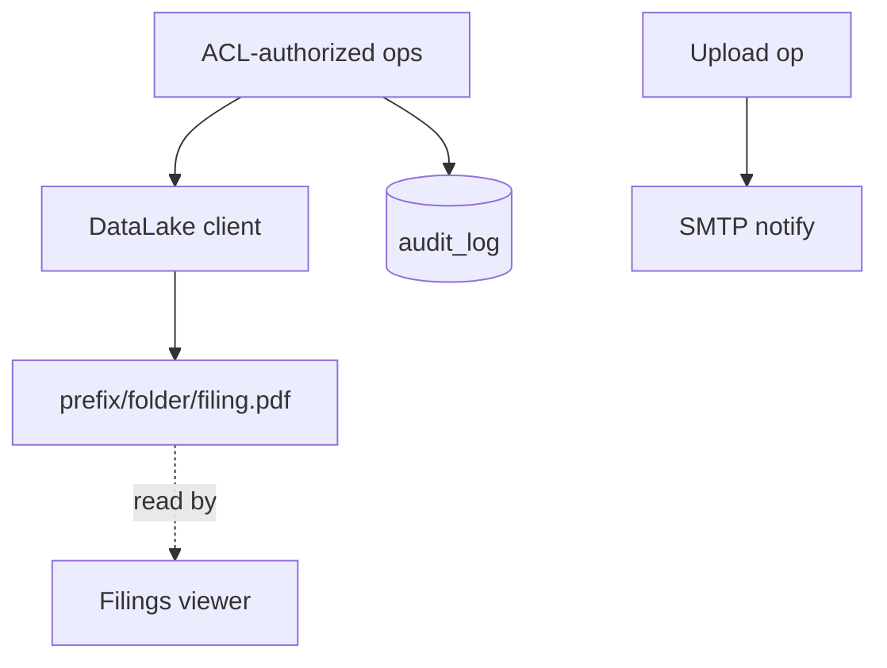
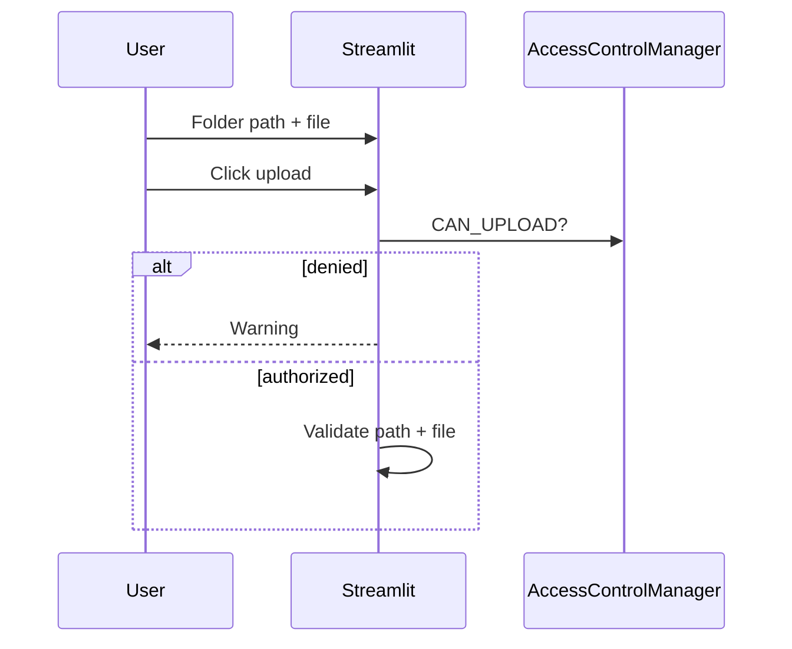
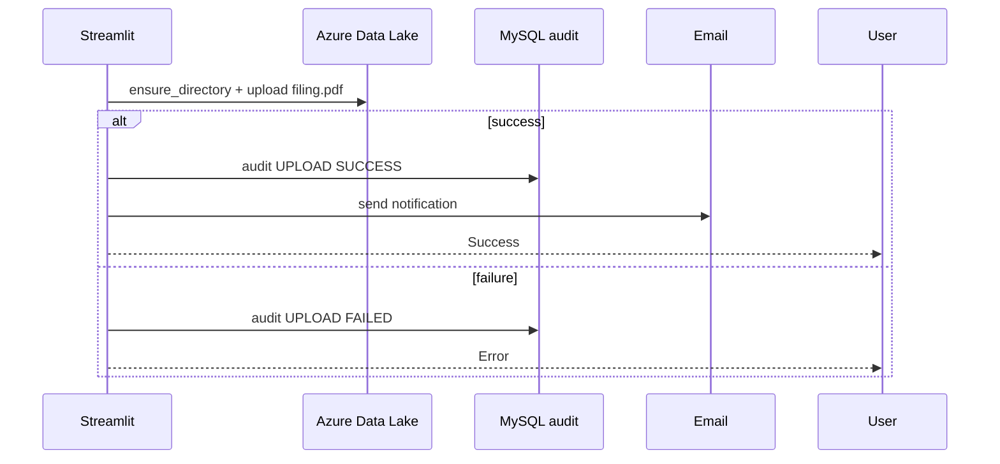
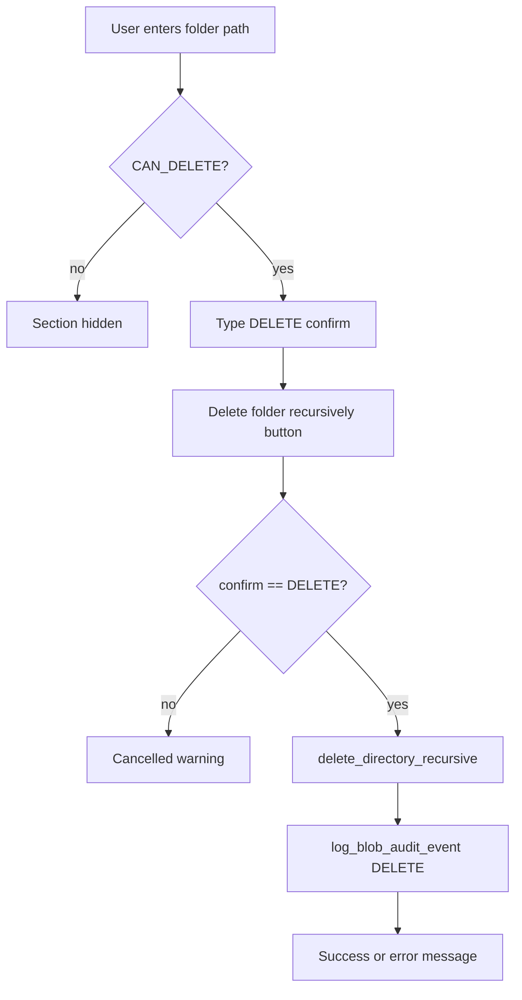
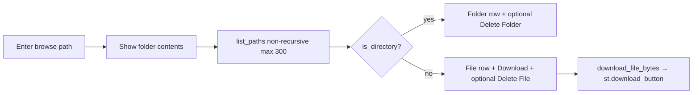
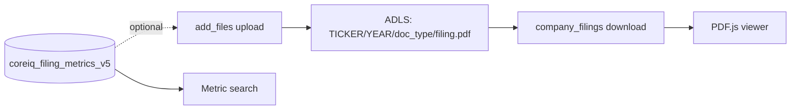

# Company Filings Add Files — Technical Documentation

**Application:** Market Data Portal (MDP)  
**Page module:** `app/pages/company_filings_add_files.py`  
**URL:** `/company_filings_add_files`  
**Registered in:** `app/main.py` as `("pages/company_filings_add_files.py", "Add Files", "company_filings_add_files", False)`  
**UI title:** Company Filings File Manager

---

## 1. Purpose and scope

This page is an **administrative Azure Data Lake Storage (ADLS Gen2) file manager** for company filing PDFs (primarily non-SEC / Capital Q documents). It allows authorized users to:

- Create folder hierarchies under a configured root prefix
- Upload files (always renamed to `filing.pdf`)
- Browse folder contents (list, download)
- Delete files or folders recursively (restricted role)
- Audit every upload/delete in MySQL
- Send SMTP email notifications on successful uploads

It complements `app/pages/company_filings.py`, which **reads** blobs the upload page **writes**. The filings viewer expects non-SEC paths like:

```text
{TICKER}/{YEAR}/{annual-report|interim-report-Q*}/filing.pdf
```

---

## 2. Environment and access guards

### 2.1 Environment restriction

```python
if config.env not in (Environment.LOCAL, Environment.STAGING):
    st.switch_page("pages/home.py")
    st.stop()
```

**Production is blocked** — this tool runs only in `LOCAL` and `STAGING`.

### 2.2 Authentication

- OIDC via `require_auth()` at page entry.

### 2.3 ACL model (`coreiq_page_access_control`)

| Capability | Minimum permission | Constant |
|------------|-------------------|----------|
| View page / browse / download | Authenticated (default) | — |
| Upload | `edit` | `AccessControlManager.check_access(..., "edit")` |
| Delete file/folder | `delete_admin` | `AccessControlManager.check_access(..., "delete_admin")` |

```python
CAN_UPLOAD = AccessControlManager.check_access("company_filings_add_files", LOGGED_IN_EMAIL, "edit")
CAN_DELETE = AccessControlManager.check_access("company_filings_add_files", LOGGED_IN_EMAIL, "delete_admin")
```

**Note:** Module docstring mentions `shashankgupta@coresight.com` for delete; actual enforcement is ACL-based `delete_admin`, not a hardcoded email.

---

## 3. High-level architecture

Admin upload page: ACL gate, Azure Blob storage, and audit logging for non-SEC filings.

**Architecture — Part A: UI and access control**



**Architecture — Part B: Storage, audit, and viewer**



**Important distinction:** This page uses `azure.storage.filedatalake.DataLakeServiceClient` (hierarchical namespace / ADLS Gen2). `company_filings.py` uses `azure.storage.blob.BlobServiceClient`. Both target the same storage account/container env vars but different SDK surfaces.

---

## 4. UI sections (no tabs)

The page is a **single vertical layout** with dividers — not tabbed.

| Section | Visible when | Controls |
|---------|--------------|----------|
| **Current User Context** (expander) | Always | Email, `CAN_UPLOAD`, `CAN_DELETE` |
| **Target Location** | Always | Folder path text input, disabled root prefix display, target path info |
| **Upload Files** | Always | File uploader, overwrite checkbox, primary upload button |
| **Delete Folder** | `CAN_DELETE` only | Folder path, type `DELETE` confirm, recursive delete button |
| **Browse Existing Folder** | Always | Browse path, "Show folder contents", per-item download/delete |

### 4.1 Upload section details

| Control | Key / behavior |
|---------|----------------|
| Folder path input | Free text, e.g. `BRBY/2025/annual-report` |
| Root prefix | Read-only display of `AZURE_BLOB_PREFIX` |
| Target preview | `info` box: `{container}/{full_path}/filing.pdf` |
| File uploader | `accept_multiple_files=False`, disabled if `!CAN_UPLOAD` |
| Overwrite | Checkbox, default `True` |
| Upload button | `"Create folder and upload file"`, `type="primary"` |

**Forced filename:** All uploads saved as `FORCED_UPLOAD_FILENAME = "filing.pdf"` regardless of original name.

### 4.2 Delete section details

- Recursive directory delete via `delete_directory_recursive()`
- Requires typing `DELETE` exactly in confirmation field
- Hidden entirely when `CAN_DELETE` is false

### 4.3 Browse section details

| Action | Permission | Behavior |
|--------|------------|----------|
| Show folder contents | All | Sets `show_folder_contents=True`, stores `last_browse_full_path` |
| List items | All | Up to 300 entries, non-recursive |
| Download file | All | `download_file_bytes()` → `st.download_button` |
| Delete folder/file | `CAN_DELETE` | Per-row buttons, `st.rerun()` on success |

---

## 5. Session state

| Key | Type | Purpose |
|-----|------|---------|
| `show_folder_contents` | bool | Whether browse results are shown |
| `last_browse_full_path` | str | Full ADLS path after `build_full_path()` |
| `delete_folder_input` | str | Widget key for delete path |
| `delete_confirm_text` | str | DELETE confirmation |
| `browse_path` | str | Widget key for browse path |

No ticker/doc_type session keys — paths are free-form strings.

---

## 6. Configuration

### 6.1 Environment variables

| Variable | Default / notes |
|----------|-----------------|
| `AZURE_STORAGE_ACCOUNT_NAME` | Required |
| `AZURE_STORAGE_ACCOUNT_KEY` | Required |
| `AZURE_BLOB_CONTAINER` | `azure-storage-test` — ADLS filesystem name |
| `AZURE_BLOB_PREFIX` | Optional root prefix inside filesystem |
| `SMTP_SERVER` | `smtp.office365.com` |
| `SMTP_PORT` | `587` |
| `FROM_EMAIL` | `dataautomation@coresight.com` |
| `EMAIL_PASSWORD` | SMTP auth |

Loaded via `load_dotenv(find_dotenv(usecwd=True))` plus `core.config.config` for DB.

### 6.2 Constants (in-module)

| Constant | Value |
|----------|-------|
| `AUDIT_TABLE_NAME` | `coreiq_azure_blob_audit_log` |
| `FORCED_UPLOAD_FILENAME` | `filing.pdf` |
| `UPLOAD_SUCCESS_RECIPIENTS` | Fixed list of 4 Coresight emails |

### 6.3 DB connection

`get_db_connection()` uses **PyMySQL** directly with `config.database.connect_args` (SSL/CA parity with main app). This page does **not** use `db_manager` singleton.

---

## 7. Azure helpers

### 7.1 Client initialization

```python
account_url = f"https://{AZURE_STORAGE_ACCOUNT_NAME}.dfs.core.windows.net"
service_client = DataLakeServiceClient(account_url=account_url, credential=AZURE_STORAGE_ACCOUNT_KEY)
filesystem_client = service_client.get_file_system_client(AZURE_BLOB_CONTAINER)
```

Endpoint uses **`.dfs.core.windows.net`** (Data Lake), not `.blob.core.windows.net`.

### 7.2 Path helpers

| Function | Behavior |
|----------|----------|
| `normalize_path_part(value)` | Strip slashes |
| `build_full_path(folder_path)` | `{AZURE_BLOB_PREFIX}/{folder}` or folder alone |
| `ensure_directory_exists(fs, path)` | Create each path segment; ignore `ResourceExistsError` |

### 7.3 File operations

| Function | SDK call |
|----------|----------|
| `list_paths(fs, prefix, max_items=200)` | `get_paths(recursive=False)` |
| `download_file_bytes(fs, path)` | `get_file_client().download_file().readall()` |
| Upload (inline) | `get_file_client(path).upload_data(bytes, overwrite=)` |
| `delete_file` | `get_file_client().delete_file()` |
| `delete_directory_recursive` | `get_directory_client().delete_directory()` |

---

## 8. Upload flow

Upload writes the PDF to Azure Blob, records metadata in MySQL, and logs the blob audit entry.

**Diagram 8.1 — Part A: Auth & validation**



**Diagram 8.1 — Part B: Azure write & audit**



### 8.1 Upload path resolution example

| User input | `AZURE_BLOB_PREFIX` | Resulting ADLS path |
|------------|---------------------|---------------------|
| `AAPL/2024/annual-report` | `(empty)` | `AAPL/2024/annual-report/filing.pdf` |
| `BRBY/2025/interim-report-Q1` | `filings` | `filings/BRBY/2025/interim-report-Q1/filing.pdf` |

### 8.2 Email behavior

- **TO:** `UPLOAD_SUCCESS_RECIPIENTS` (normalized, deduplicated)
- **CC:** Logged-in uploader (unless already in TO)
- **Subject:** `Company Filings Upload Success - 1 file`
- **Body:** uploader email, container, folder, overwrite flag, original vs saved filename, byte size, azure path
- Email failure → `st.warning` but upload still succeeds

---

## 9. Delete flow

Delete removes the blob object, soft-deletes metadata, and records an audit log row.



Browse-row deletes (single file or subfolder) follow the same audit pattern with `item_type` `FILE` or `FOLDER`.

`ensure_delete_access()` raises `PermissionError` if `CAN_DELETE` is false — defense in depth beyond UI hiding.

---

## 10. Browse / download flow

Browse lists non-SEC filings from the DB; download generates a time-limited blob SAS URL.



Downloads use `mime="application/octet-stream"` and basename as `file_name`.

---

## 11. Audit logging — `coreiq_azure_blob_audit_log`

### 11.1 Table bootstrap

`create_audit_table_if_not_exists()` runs on page load (`CREATE TABLE IF NOT EXISTS`). Failure → `st.error` + `st.stop()`.

### 11.2 Schema

| Column | Type | Description |
|--------|------|-------------|
| `id` | BIGINT AUTO_INCREMENT | Primary key |
| `event_time` | DATETIME | Default `CURRENT_TIMESTAMP` |
| `user_email` | VARCHAR(255) | Actor |
| `action_type` | VARCHAR(50) | `UPLOAD`, `DELETE` |
| `item_type` | VARCHAR(50) | `FILE`, `FOLDER` |
| `container_name` | VARCHAR(255) | Filesystem/container |
| `root_prefix` | VARCHAR(500) | `AZURE_BLOB_PREFIX` |
| `target_path` | TEXT | Full ADLS path |
| `target_name` | VARCHAR(500) | Filename or folder leaf |
| `file_size_bytes` | BIGINT | Upload size (nullable) |
| `overwrite_flag` | TINYINT(1) | Upload overwrite |
| `status` | VARCHAR(50) | `SUCCESS`, `FAILED` |
| `error_message` | TEXT | Failure detail |
| `created_at` | DATETIME | Insert timestamp |

**Indexes:** `idx_coreiq_blob_audit_time`, `idx_coreiq_blob_audit_user`, `idx_coreiq_blob_audit_action`

### 11.3 Failure isolation

`log_blob_audit_event()` catches all exceptions and shows `st.warning` — **audit failure never blocks** the primary Azure operation.

---

## 12. Components used

| Module | Usage |
|--------|-------|
| `components.styles.hide_sidebar` | Sidebar hidden |
| `components.styles.render_styles` | Global CSS |
| `components.styles.set_page_layout` | Layout |
| `components.navigation.render_header` | `"Company Filings File Manager"` |
| `components.navigation.render_coresight_footer` | Footer |
| `core.auth_manager.get_current_user` | `LOGGED_IN_EMAIL` |
| `core.access_control.AccessControlManager` | Upload/delete gates |
| `core.config.config`, `Environment` | Staging/local guard + DB config |
| `utils.server_logger.new_rerun_id` | Log correlation |

**Not used:** `app/utils/azure_blob.py`, `FilingMetricRepository`, `edgartools`, LLM extractor.

---

## 13. Relationship to Company Filings viewer



| Concern | add_files page | company_filings page |
|---------|----------------|----------------------|
| SDK | `filedatalake` | `storage.blob` |
| Write | Yes | No |
| Read/list | Browse section | Viewer + scanner |
| Filename | Always `filing.pdf` | Expects `filing.pdf` (non-SEC) or `filing.html` (SEC) |
| Metric DB | No | Yes |

Uploading via add_files **does not** insert rows into `coreiq_filing_metrics_v5`. Metric data requires separate ETL. The viewer can still show PDFs if blob exists; search may return empty until metrics are ingested.

---

## 14. Suggested folder conventions (non-SEC)

Align uploads with `VALID_DOC_TYPES` / `DOC_TYPE_TO_FOLDER` in `company_filings.py`:

| Document | Example folder segment |
|----------|-------------------------|
| Annual report | `{TICKER}/{YEAR}/annual-report` |
| Q1 interim | `{TICKER}/{YEAR}/interim-report-Q1` |
| Half-yearly | `{TICKER}/{YEAR}/half-yearly` |

Example: `LULU/2025/interim-report-Q3` → ADLS file `.../LULU/2025/interim-report-Q3/filing.pdf`

---

## 15. Security considerations

1. **Path injection:** User-supplied folder paths passed to ADLS APIs — rely on Azure ACLs; no `..` sanitization in this module (unlike `filing_units.build_filing_blob_path`).
2. **Secrets:** Azure key and SMTP password from environment only.
3. **Production guard:** Page redirects away on prod `config.env`.
4. **Delete:** Recursive delete is destructive; gated by `delete_admin` + `DELETE` confirmation for bulk folder delete.
5. **Auth:** OIDC via `require_auth()` at page entry.

---

## 16. Error handling patterns

| Scenario | User feedback |
|----------|---------------|
| Azure connection fail on init | `st.error` + `st.stop()` |
| Audit table setup fail | `st.error` + `st.stop()` |
| Upload validation (no path/file) | `st.warning` |
| Upload Azure error | `st.error` + audit FAILED row |
| Audit write fail | `st.warning` (action completed) |
| Email fail | `st.warning` (upload succeeded) |
| Browse list fail | `st.error` |
| Delete permission | `PermissionError` → `st.error` |

---

## 17. Function index

| Function | Responsibility |
|----------|----------------|
| `get_db_connection()` | PyMySQL with shared SSL config |
| `create_audit_table_if_not_exists()` | DDL for audit table |
| `log_blob_audit_event()` | Insert audit row (best-effort) |
| `get_datalake_clients()` | ADLS service + filesystem clients |
| `build_full_path()` | Prefix + user folder |
| `ensure_directory_exists()` | Recursive mkdir on ADLS |
| `list_paths()` | Non-recursive directory listing |
| `download_file_bytes()` | Full file read |
| `delete_directory_recursive()` | ACL-gated folder delete |
| `delete_file()` | ACL-gated file delete |
| `send_upload_success_email()` | SMTP TLS notification |
| `_normalize_email_list()` | Email list cleanup |

---

## 18. Dependencies (Python packages)

| Package | Usage |
|---------|-------|
| `streamlit` | UI framework |
| `azure-storage-file-datalake` | `DataLakeServiceClient` |
| `azure-core` | `ResourceExistsError` |
| `pymysql` | Audit DB writes |
| `python-dotenv` | Env loading |
| stdlib `smtplib`, `email.mime` | Upload notifications |

---

## 19. Operational checklist

1. Confirm `config.env` is `LOCAL` or `STAGING`.
2. Set Azure ADLS credentials and container name.
3. Grant `edit` on `company_filings_add_files` for uploaders.
4. Grant `delete_admin` only to trusted admins.
5. Upload to paths matching `company_filings` non-SEC conventions.
6. Verify blob appears in Company Filings viewer (select matching ticker/year/doc type).
7. Run metric ETL separately if search coverage is required.
