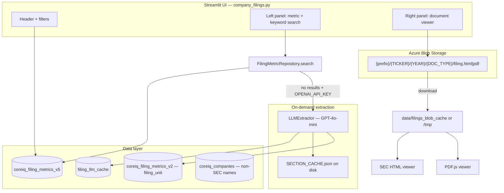
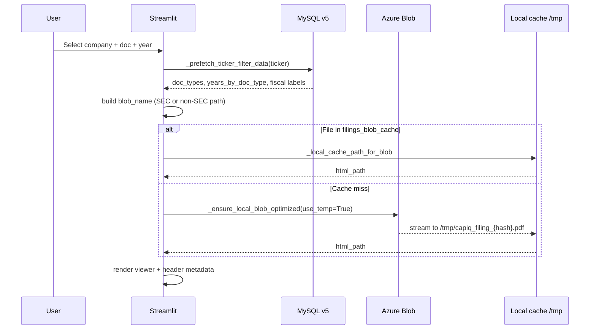
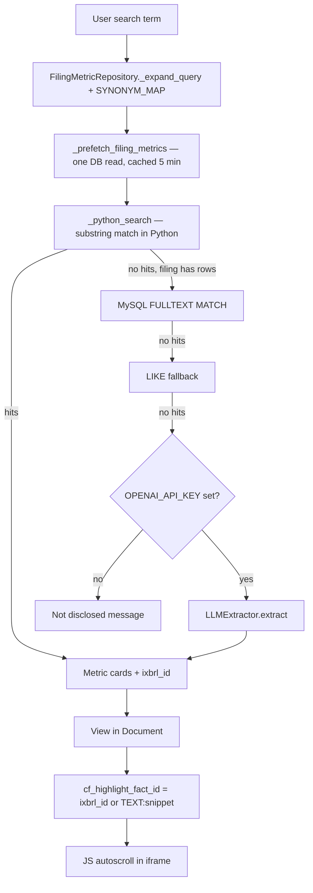
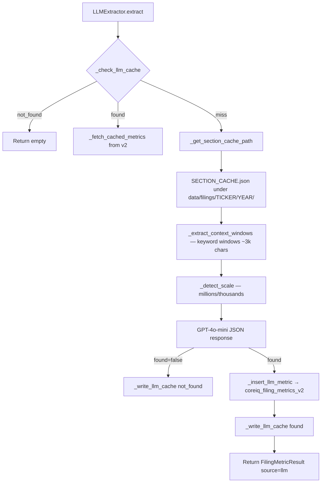
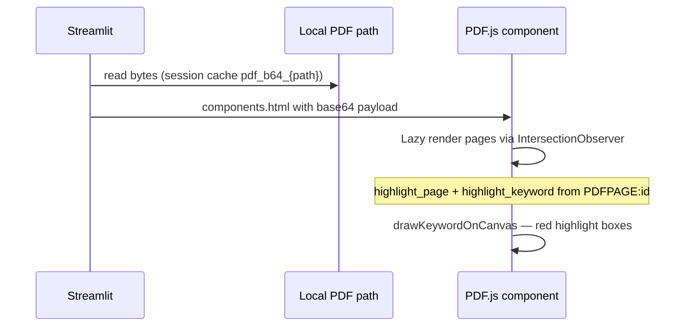
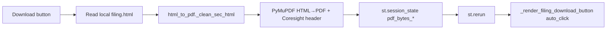

# Company Filings — Technical Documentation

**Application:** Market Data Portal (MDP)  
**Page module:** `app/pages/company_filings.py`  
**URL:** `/company_filings`  
**Registered in:** `app/main.py` as `("pages/company_filings.py", "Company Filings", "company_filings", False)`  
**Product name:** Company Filing Documents (Market Data Portal)

---

## 1. Purpose and scope

The Company Filings page is the primary SEC and non-SEC filing browser for the portal. It combines:

- **Filter-driven navigation** — company, document type, optional filing unit (8-K / 6-K / proxy), fiscal/storage year
- **Metric search** — pre-ingested eXtensible Business Reporting Language (XBRL) metrics from MySQL (`coreiq_filing_metrics_v5`)
- **Document viewing** — SEC ieXtensible Business Reporting Language (XBRL) HTML in a sandboxed iframe; non-SEC PDFs via PDF.js
- **Keyword search** — full-text hits in the loaded document (HTML or PDF)
- **LLM fallback** — GPT-4o-mini extraction when DB search returns no rows (`app/core/llm_extractor.py`)
- **Azure Blob Storage** — source of truth for filing HTML/PDF files

The page does **not** call `edgartools` at runtime. eXtensible Business Reporting Language (XBRL) data is ingested offline into `coreiq_filing_metrics_v5`; metrics with `source='edgartools'` are displayed with an EDGAR badge when present in the DB.

---

## 2. High-level architecture

Filing viewer architecture: SEC eXtensible Business Reporting Language (XBRL) path, non-SEC blob PDFs, and LLM fallback extraction.



---

## 3. UI layout and controls

### 3.1 Page structure

| Region | Width | Contents |
|--------|-------|----------|
| Global header | Full width | `render_header(..., current_page="company_filings")` |
| Title row | 1/3 + 2/3 | "Company Filing Documents" + four filter dropdowns |
| Main content | 30% / 70% | Search Metrics (left) + Document Viewer (right) |
| Footer | Full width | `render_coresight_footer(full_width=True, stick_to_bottom=True)` |

There are **no Streamlit tabs** on this page. Navigation is entirely via dropdowns plus the search panel.

### 3.2 Filter dropdowns

| # | Widget key | Session key | Callback | Data source |
|---|------------|-------------|----------|-------------|
| 1 | `cf_company_select` | `cf_company`, `active_ticker` | `_on_company_change` | `_load_companies_from_db()` → `coreiq_filing_metrics_v5` + non-SEC blob scan |
| 2 | `cf_doc_type_select` | `cf_doc_type` | `_on_doc_type_change` | `_get_available_doc_types_from_db(ticker)` |
| 3 | `cf_filing_unit_select` | `cf_filing_unit` | `_on_filing_unit_change` | `get_filing_units()` — only for `FILING_UNIT_DOC_TYPES` |
| 4 | `cf_year_select` | `cf_year` | `_on_year_change` | `_get_available_years_for_doc_type(ticker, doc_type)` |

**Filing unit doc types** (`app/utils/filing_units.py`): `8-K`, `6-K`, `DEF14A`, `DEFA14A`, `DEF 14A`, `PRE14A`.

Display numbers (1, 2, 3…) map to sorted `filing_N` folders; default is the **highest** filing number (most recent).

**Year display:** `format_func` uses `_fiscal_label_for()` to show DEI fiscal year while plumbing uses **storage/bucket year** (`COALESCE(storage_year, report_fiscal_year, fiscal_year)`).

### 3.3 Deep links (query params)

| Param | Example | Effect |
|-------|---------|--------|
| `ticker` | `?ticker=AAPL` | Resolved via `validate_and_get_ticker()` |
| `doc_type` | `?doc_type=10-Q-Q1` | Sets `cf_doc_type` if in `VALID_DOC_TYPES` |
| `year` | `?year=2025` | Sets `cf_year` if 4-digit |

`st.query_params["ticker"]` is kept in sync when the user changes the company dropdown.

### 3.4 Left panel — Search Metrics

1. **Text input** — key `cf_search_input_{cf_search_gen}`; placeholder `"eg., Revenue"`
2. **Metric results** — cards from `FilingMetricRepository.search()`; each has **View in Document**
3. **Keyword hits** — `_kw_search_document()` when local file exists; separate **KEYWORD** badge section

Source badges on metric cards:

| `source` value | Badge |
|----------------|-------|
| `calculated` | CALC (blue) |
| `llm` | AI (green) |
| `edgartools` | EDGAR (orange) |

### 3.5 Right panel — Document viewer

1. **Filing header** — company name, DEI fiscal year, period chip, filing date, fiscal period label (`FilingMetricRepository.get_header_metadata`)
2. **Download button** — SEC: `utils.html_to_pdf.generate_filing_pdf`; non-SEC: raw PDF bytes
3. **Viewer** — `render_sec_html_viewer()` or `_render_pdf_viewer()`

---

## 4. Session state reference

| Key | Type | Purpose |
|-----|------|---------|
| `cf_company` | str | Selected ticker |
| `cf_doc_type` | str | DB doc type (e.g. `10-Q-Q1`, `annual-report`) |
| `cf_year` | str | Storage/bucket year for blob path + DB filter |
| `cf_filing_unit` | str | e.g. `filing_94` for multi-filing docs |
| `cf_search` | str | Current search term |
| `cf_search_gen` | int | Incremented to reset search widget on filter change |
| `cf_highlight_fact_id` | str \| None | eXtensible Business Reporting Language (XBRL) element id, `TEXT:...`, or `PDFPAGE:n:hit` |
| `cf_view_metric` | str \| None | Display label for highlight banner |
| `cf_company_select` | str | Widget key for company selectbox |
| `cf_doc_type_select` | str | Widget key for doc type |
| `cf_year_select` | str | Widget key for year |
| `cf_filing_unit_select` | int | 1-based display index for filing unit |
| `active_ticker` | str | Global ticker used by header |
| `_highlight_just_set` | bool | Prevents clearing highlight on view-button rerun |
| `_view_button_click_time` | float | Performance timing for autoscroll |
| `_kw_highlight_keyword` | str | Keyword for PDF highlight overlay |
| `pdf_bytes_{ticker}_{year}_{doc_type}` | bytes | Generated PDF awaiting download |
| `pdf_ready_{...}` | bool | Triggers auto-download on next rerun |
| `pdf_b64_{path}` | str | Base64 PDF cached for PDF.js component |
| `_TIMING_DATA` | dict | Internal perf: reruns, searches, company changes |

**Filter change behavior:** When company, doc type, year, or filing unit changes, search is cleared and highlight state reset (unless `_highlight_just_set`).

---

## 5. Components and utilities

### 5.1 UI components (`app/components/`)

| Import | Usage |
|--------|-------|
| `styles.hide_sidebar` | Module load |
| `styles.render_styles`, `set_page_layout` | Page chrome |
| `navigation.render_header` | Top nav with ticker |
| `navigation.render_coresight_footer` | Bottom footer |
| `loading.inject_red_spinner_css` | Brand spinner (#D62E2F) when cache available |

### 5.2 Domain utilities

| Module | Role |
|--------|------|
| `utils.ticker_utils` | `validate_and_get_ticker`, `DEFAULT_FALLBACK_TICKER` |
| `utils.filing_units` | Filing unit list, blob path builder, `FILING_UNIT_DOC_TYPES` |
| `utils.filings_cache` | DiskCache metadata (`get_filings_cache`, ETag) |
| `utils.background_scanner` | Background blob scan, `ensure_cache_purge` |
| `utils.non_sec_blob_fallback` | Parallel Azure scan for non-SEC tickers |
| `utils.html_to_pdf` | SEC HTML → branded PDF (PyMuPDF) |
| `utils.server_logger` | Structured logging (`log_structured_error`, etc.) |

### 5.3 Data layer

| Module | Role |
|--------|------|
| `data.repository.FilingMetricRepository` | Metric search, header metadata, synonym expansion |
| `data.models.FilingMetricResult` | Search result dataclass |
| `core.llm_extractor.LLMExtractor` | On-demand LLM extraction |
| `core.database.db_manager` | Read-only queries, SQLAlchemy engine for LLM writes |

### 5.4 Azure helpers (in-page)

`company_filings.py` implements its own Azure Blob client (not `app/utils/azure_blob.py`) with performance tuning:

- `_get_azure_config()` — env: `AZURE_STORAGE_ACCOUNT_NAME`, `AZURE_STORAGE_ACCOUNT_KEY`, `AZURE_BLOB_CONTAINER`, `AZURE_BLOB_PREFIX`
- `_get_optimized_blob_service_client()` — 64MB single-get, 8MB chunks, pool size 50
- `_ensure_local_blob_optimized()` — parallel download `max_concurrency=4`, atomic temp→rename
- `_local_cache_path_for_blob()` — maps to `data/filings_blob_cache/{relative_path}`

`app/utils/azure_blob.py` mirrors cache layout for **other pages** (e.g. earnings transcripts) and is documented here for path consistency only.

---

## 6. Database tables

### 6.1 `coreiq_filing_metrics_v5` (primary)

**Role:** Company list, year/doc_type filters, metric search, filing header metadata.

| Column (conceptual) | Usage on page |
|---------------------|---------------|
| `ticker`, `company_name` | Company dropdown labels |
| `doc_type` | Document type filter |
| `storage_year` | Physical Azure folder year (blob path) |
| `fiscal_year`, `report_fiscal_year` | DEI display labels |
| `filing_unit` | 8-K/6-K sub-filings |
| `original_label`, `standard_concept`, `dimension_label` | Search targets |
| `numeric_value`, `unit_ref`, `value` | Display + formatting |
| `ixbrl_id` | HTML autoscroll target (`document.getElementById`) |
| `source` | `xbrl`, `calculated`, `llm`, `edgartools`, `store_count`, `credit_rating` |
| `llm_query` | Formula string (calculated) or JSON detail (store/credit) |
| `period_*`, `statement_type` | Card metadata |
| `filing_date`, `filing_date_sec` | Header metadata |

**Indexes referenced in code:** `idx_ticker_fiscal_doctype` (covering prefetch).

### 6.2 `coreiq_filing_metrics_v2`

Used by:

- `filing_units._get_filing_units_from_db()` — `DISTINCT filing_unit` for 8-K/6-K
- `llm_extractor._insert_llm_metric()` — inserts new LLM rows with `source='llm'`

Runtime search reads **v5**; LLM writes go to **v2** (legacy split).

### 6.3 `filing_llm_cache`

| Column | Purpose |
|--------|---------|
| `ticker`, `fiscal_year`, `doc_type`, `query_normalized` | Cache key |
| `status` | `found` \| `not_found` |
| `metric_id` | Link to inserted v2 row |
| `searched_at` | Timestamp |

### 6.4 `coreiq_companies`

Non-SEC company names via `get_non_sec_tickers_from_db()` in `utils.non_sec_blob_fallback`.

### 6.5 `coreiq_ir_websites` / `company_ir_websites`

**Not used directly on this page.** IR URLs are resolved in `EarningsCalendarRepository._build_ir_website_lookup()` (`app/data/repository.py`) for the earnings calendar. Documented here because filing metrics pipeline and IR discovery share the same company universe.

---

## 7. Document types and Azure blob layout

### 7.1 `VALID_DOC_TYPES`

**SEC:** `10-K`, `10-Q-Q1`…`10-Q-Q3`, `8-K`, `20-F`, `6-K`, `DEF14A`, `DEFA14A`, `DEF 14A`, `PRE14A`

**Non-SEC (Capital Q):** `annual-report`, `interim-report-Q1`…`Q5`, `half-yearly`

### 7.2 Blob path conventions

```text
{AZURE_BLOB_PREFIX}/{TICKER}/{YEAR}/{DOC_TYPE}/filing.html     # SEC default
{AZURE_BLOB_PREFIX}/{TICKER}/{YEAR}/{DOC_TYPE}/filing_94/filing.html   # 8-K unit
{AZURE_BLOB_PREFIX}/{TICKER}/{YEAR}/{annual-report}/filing.pdf  # non-SEC
```

Parser: `_parse_blob_path()` expects at least 4 path segments after prefix.

Scanner: `scan_filings_directory()` groups blobs by `(ticker, year, doc_type_dir)` and picks best file via `_pick_best_blob_for_docdir()` (prefers `filing.html` / `filing.pdf`).

### 7.3 SEC vs non-SEC routing

Routing is by **doc_type**, not company flag:

| Doc type set | File | Viewer |
|--------------|------|--------|
| `NON_SEC_DOC_TYPES` | `filing.pdf` | `_render_pdf_viewer` (PDF.js) |
| All other valid SEC types | `filing.html` | `render_sec_html_viewer` |

**10-Q storage year fallback:** If blob missing at `{year}`, retries `{year-1}` for non-December fiscal year ends (e.g. LULU).

---

## 8. Filing load flow

Selecting a filing loads metrics from XBRL tables, with optional LLM extraction on cache miss.



---

## 9. XBRL / iXBRL handling

### 9.1 Ingestion (offline)

XBRL facts are extracted during ETL into `coreiq_filing_metrics_v5` with `source='xbrl'`. Calculated metrics use `source='calculated'`. Some supplemental metrics use `edgartools` during batch jobs (see `app/data/repository.py` segment/ratings paths) — not invoked from this page.

### 9.2 iXBRL HTML processing (runtime)

`_load_and_process_html()` pipeline:

1. Read UTF-8 from local path
2. Strip XML declaration (force HTML5 mode)
3. Remove `<script>` tags (malformed SEC JS breaks iframe)
4. `_convert_ixbrl_to_spans()` — namespace tags → `<span>` with preserved `id` for `ixbrl_id` navigation
5. Inject `content-visibility: auto` CSS for lazy rendering
6. `_resolve_sec_edgar_base_url()` — rewrite relative links to SEC EDGAR absolute URLs
7. Inject click handler: hash links scroll in-iframe; external links open new tab

### 9.3 XBRL extract / metric search flow

Metric search checks filing tables first, then may invoke GPT-4o-mini extraction for missing values.



### 9.4 `FilingMetricRepository.search()` strategy

1. Expand query with **SYNONYM_MAP** (100+ financial terms)
2. **Fast path:** prefetch all numeric rows for `(ticker, year, doc_type)` → Python filter/dedup/sort (0ms after first call)
3. **DB fallback:** `MATCH ... AGAINST` on `(original_label, standard_concept, dimension_label)` then `LIKE`
4. Dedup: latest `period_end` / `period_instant` per `(label, dimension, dimension_label)`
5. Exclude `standard_concept LIKE '%Text Block'`

---

## 10. LLM extraction (`app/core/llm_extractor.py`)

Triggered from `main()` when `FilingMetricRepository.search()` returns empty and `OPENAI_API_KEY` is set.



**Cost note (from module docstring):** ~$0.00012 per unique query; cached queries $0.

**SECTION_CACHE.json** sections prioritized: `part_ii_item_8`, `part_ii_item_7`, `part_i_item_1`, etc.

---

## 11. PDF viewing flow (non-SEC)

Non-SEC PDFs stream from Azure Blob via SAS URL embedded in the Streamlit viewer.



**Why PDF.js:** Chrome blocks native PDF plugins inside Streamlit's sandboxed iframe. PDF.js renders to `<canvas>` without plugins.

**Text index:** `_build_doc_text_index()` uses PyMuPDF (`fitz`) per page; `_kw_search_document()` returns snippets with physical + printed page labels.

---

## 12. SEC HTML → PDF download flow

SEC HTML filings are converted server-side to PDF for download via the PDF utility.



Non-SEC downloads skip generation — existing `filing.pdf` bytes are served directly.

---

## 13. Caching and performance

| Layer | Mechanism | TTL / scope |
|-------|-----------|-------------|
| Streamlit `@st.cache_data` | Companies, prefetch, HTML process, text index, keyword search | 300–3600s |
| Streamlit `@st.cache_resource` | Azure clients, `scan_filings_directory` | Process lifetime |
| `filings_cache` DiskCache | Per-ticker blob metadata from background scanner | Disk-backed |
| `data/filings_blob_cache/` | Downloaded blobs (when not `use_temp`) | Filesystem + mtime vs blob `last_modified` |
| `/tmp/capiq_filing_*` | On-demand downloads (`use_temp=True`) | OS-managed |
| Session state | PDF base64, generated PDF bytes | Per session |

**Load order in `main()`:** Header renders first → companies load → session init → dropdowns → two-column content. Early spinner: "Loading filing data…".

---

## 14. Authentication and access

- Identity via `main.py` OIDC cookie hydrate; optional `require_auth(page="company_filings")` at page level.
- Page is registered without ACL flag `False` in `main.py` — default authenticated access.

---

## 15. Error handling

- Module-level `try/except` around `main()` shows generic Streamlit error
- Azure download failures: warning + retry button
- Missing filing: `st.error` with blob path + placeholder viewer
- All significant exceptions logged via `log_structured_error` with `page="company_filings"`

---

## 16. Environment variables

| Variable | Purpose |
|----------|---------|
| `AZURE_STORAGE_ACCOUNT_NAME` | Blob account (default `csmarketdata` in code) |
| `AZURE_STORAGE_ACCOUNT_KEY` | Blob credential |
| `AZURE_BLOB_CONTAINER` | Container name (default `azure-storage-test`) |
| `AZURE_BLOB_PREFIX` | Optional path prefix inside container |
| `OPENAI_API_KEY` | Enables LLM metric fallback |

---

## 17. Related files (quick index)

| Path | Relationship |
|------|--------------|
| `app/pages/company_filings_add_files.py` | Admin Azure upload for non-SEC PDFs |
| `app/utils/azure_blob.py` | Shared blob cache helpers (transcripts) |
| `app/utils/filing_units.py` | Multi-filing path logic |
| `app/data/repository.py` | `FilingMetricRepository` class |
| `app/core/llm_extractor.py` | LLM on-demand extraction |
| `app/utils/html_to_pdf.py` | SEC download PDF generation |
| `edgartools/` (repo root) | Offline SEC parsing; not imported by this page |

---

## 18. Key functions index (`company_filings.py`)

| Function | Responsibility |
|----------|----------------|
| `main()` | Page entry, session init, layout |
| `_on_company_change` / `_on_doc_type_change` / `_on_year_change` / `_on_filing_unit_change` | Filter callbacks |
| `_prefetch_ticker_filter_data` | Single-query filter data per ticker |
| `_get_non_sec_blob_path` | Non-SEC PDF blob path |
| `build_filing_blob_path` (filing_units) | SEC path with filing unit |
| `_ensure_local_blob_optimized` | Azure download |
| `FilingMetricRepository.search` | Metric search |
| `render_sec_html_viewer` | SEC HTML iframe + autoscroll |
| `_render_pdf_viewer` | PDF.js viewer |
| `_kw_search_document` | Keyword hits in document |
| `scan_filings_directory` | Full Azure inventory (fallback company list) |
