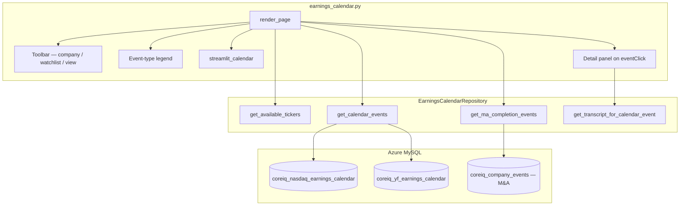
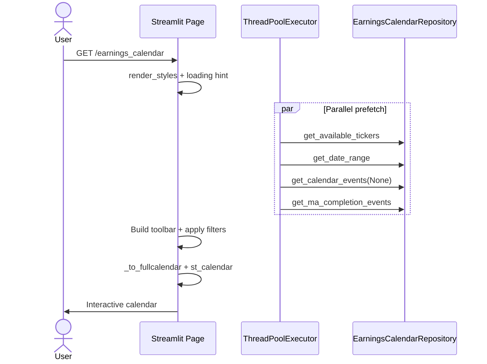
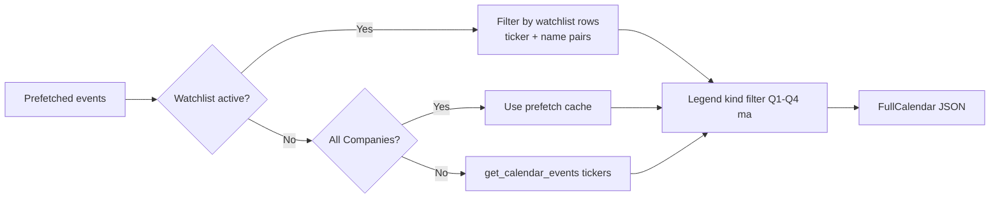
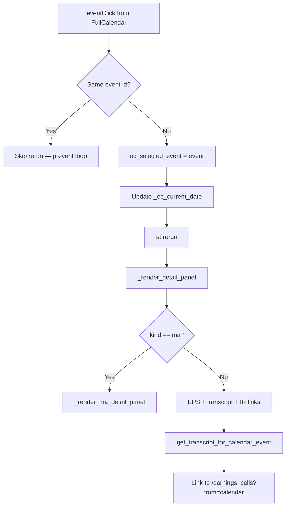
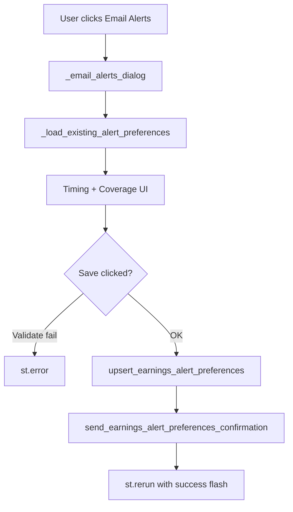

# Earnings Calendar — Technical Documentation

**Application:** Market Data Portal (MDP)  
**Page module:** `app/pages/earnings_calendar.py` (~2,127 lines)  
**URL route:** `/earnings_calendar`  
**Registered in:** `app/main.py` as `("pages/earnings_calendar.py", "Earnings Calendar", "earnings_calendar", False)`

---

## 1. Purpose and scope

The Earnings Calendar page is a **FullCalendar**-powered view of upcoming and historical earnings announcements across the Market Data Portal (MDP) universe. It also overlays **completed mergers and acquisitions (M&A)** closing events from key developments data.

Core capabilities:

- **Month view** (`dayGridMonth`) and **Year view** (`multiMonthYear`) with list-month toggle
- **Company filter** (All Companies or one ticker) with cross-page ticker synchronization via `?ticker=`
- **Watchlist filter** (from Screening watchlists) with ticker + company-name disambiguation
- **Event-type legend** — clickable chips for Fiscal Quarter 1–4 (Q1–Q4) and M&A Completion; combines with company/watchlist filters
- **Event detail panel** — Earnings per share (EPS) actual/forecast, surprise %, market cap, investor relations (IR) webcast link, deep link to Earnings Calls transcript
- **Email alert preferences** — modal dialog to schedule reminders (companies, sectors, or watchlist scope)
- **Parallel data prefetch** on page load (tickers, date range, all events, M&A events)

---

## 2. Architecture overview

Top-down: the page orchestrates toolbar filters, prefetches repository data in parallel, converts rows to FullCalendar JSON, and renders `streamlit_calendar` with click-to-detail.



---

## 3. URL, route, and deep links

| Entry | Behavior |
|-------|----------|
| `/earnings_calendar` | Default — All Companies, month view |
| `/earnings_calendar?ticker=AAPL` | Validates ticker via `validate_and_get_ticker`; dropdown still defaults to All Companies but URL ticker is preserved on company change |
| Navigation bar | `navigation.py` links with `?ticker={active_ticker}` |
| Detail panel → transcript | `/earnings_calls?ticker={T}&year={Y}&quarter=Q{Q}&from=calendar` |
| Earnings Calls → calendar | Reverse deep link documented in [earnings-calls.md](./earnings-calls.md) |

---

## 4. Dependencies

### 4.1 Python modules

| Module | Role |
|--------|------|
| `components/styles.py` | `render_styles()`, `hide_sidebar()` |
| `components/navigation.py` | `render_header()`, `render_coresight_footer()` |
| `core/auth_manager.py` | `require_auth()` optional; cookie hydrate via `main.py` |
| `data/repository.py` | `CompanyRepository`, `EarningsCalendarRepository` |
| `data/watchlist_service.py` | `get_user_watchlists`, `get_watchlist_companies` |
| `utils/ticker_utils.py` | `validate_and_get_ticker`, `DEFAULT_FALLBACK_TICKER` |
| `utils/earnings_alert_email.py` | `send_earnings_alert_preferences_confirmation` |
| `utils/server_logger.py` | Structured logging, `log_timing`, `new_rerun_id` |
| `streamlit_calendar` | FullCalendar widget (`st_calendar`) |

### 4.2 External libraries

| Library | Use |
|---------|-----|
| **FullCalendar** (via `streamlit-calendar`) | Month grid, multi-month year, list view |
| **ThreadPoolExecutor** | Parallel prefetch of 4 independent DB calls |

---

## 5. User Interface (UI) components

### 5.1 Toolbar

| Control | Session key | Notes |
|---------|-------------|-------|
| **Email Alerts** button | `ec_open_email_alerts` | Opens `@st.dialog` modal |
| Alert status pill | — | HTML badge: Alerts on / Alerts off |
| **Company** selectbox | `ec_company_filter` | `"All Companies"` or `"Name (TICK)"` labels |
| **Watchlist** selectbox | `ec_watchlist_filter` | Disabled when user has no watchlists |
| **Month Wise** / **Year Wise** | `ec_view` | Toggles `calendar` vs `year` FullCalendar mode |

### 5.2 Event-type legend

Five clickable chips (Q1, Q2, Q3, Q4, M&A Completion) using Coresight brand colors from `_KIND_COLORS`. Toggling a chip updates `ec_active_kinds`, clears `ec_selected_event`, and increments `ec_cal_version` to remount FullCalendar.

### 5.3 FullCalendar views

| Mode | `initialView` | Key options |
|------|---------------|-------------|
| Month | `dayGridMonth` | `height: 680`, `dayMaxEvents: 4`, list-month toggle |
| Year | `multiMonthYear` | `multiMonthMaxColumns: 3`, `dayMaxEvents: 3` |

Callbacks restricted to `["eventClick"]` only — avoids `eventsSet` rerun storms.

### 5.4 Detail panel

Shown in right column when `ec_selected_event` is set:

- **Earnings events** — EPS actual/forecast, surprise %, fiscal quarter end, market cap, report time, transcript link, IR webcast link
- **M&A events** — acquirer, target, deal type, transaction value, announce/close dates, source link

Close button clears selection and bumps `ec_cal_version`.

### 5.5 Email alerts dialog

`@st.dialog("Email alerts for upcoming earnings calls", width="large")` — coverage modes:

1. **Select Companies** — all calendar companies or specific multiselect
2. **Select Sectors** — all sectors or specific multiselect (matched in-memory against ticker metadata)
3. **Select Watchlist** — one watchlist; encoded in database (DB) as sentinel `watchlist_id:<id>`

Reminders sent at **08:00 UTC**; `days_before` 0–60.

---

## 6. Session state

| Key | Type | Purpose |
|-----|------|---------|
| `ec_view` | `str` | `"calendar"` or `"year"` |
| `ec_selected_event` | `dict \| None` | FullCalendar event object from click |
| `ec_cal_version` | `int` | Bumped to remount calendar widget (new `key`) |
| `_ec_current_date` | `str` (ISO) | `initialDate` for FullCalendar — updated on event click |
| `ec_active_watchlist_id` | `int \| None` | Active watchlist filter |
| `ec_active_watchlist_name` | `str` | Display name for caption |
| `ec_active_kinds` | `list[str]` | Active legend kinds: Q1–Q4, `ma` |
| `ec_company_filter` | `str` | Selectbox label value |
| `ec_watchlist_filter` | `str` | Watchlist selectbox label |
| `ec_alert_send_email` | `bool` | Checkbox in dialog |
| `ec_alert_days_before` | `int` | Number input |
| `ec_alert_company_scope` | `str` | Radio: Companies / Sectors / Watchlist |
| `ec_alert_save_in_progress` | `bool` | Disables Save during persist |
| `ec_alert_save_success` | `bool` | Flash success on next dialog open |
| `ec_alert_save_mailed` | `bool` | Whether confirmation email sent |
| `_active_page` | `str` | Used to reset filters on fresh navigation |
| `active_ticker` | `str` | Cross-page ticker sync |

Reset on fresh page entry (`_active_page != "earnings_calendar"`): clears `ec_company_filter`, `ec_watchlist_filter`, watchlist ids, resets `ec_active_kinds` to all.

---

## 7. Data layer

### 7.1 Primary tables

| Table | Source | Content |
|-------|--------|---------|
| `coreiq_nasdaq_earnings_calendar` | Nasdaq ingest | SEC-lineage earnings dates, EPS, fiscal quarter ending |
| `coreiq_yf_earnings_calendar` | Yahoo Finance (YF) ingest | Non-Nasdaq / supplemental earnings |
| `coreiq_company_events` | Key developments | M&A Closing rows (`event_subtype = 'M&A Closing'`, `ma_is_closed = 1`) |
| `coreiq_companies` | Company master | Names, sectors for filters |
| `coreiq_ir_websites` | IR URLs | Webcast links joined by ticker + source (SEC vs YFinance) |
| `coreiq_earnings_alert_preferences` | Alert prefs | Per-user email reminder configuration |
| `coreiq_earnings_alert_dedupe` | Dispatcher | Prevents duplicate sends |
| `coreiq_earnings_alert_delivery_log` | Dispatcher | Delivery audit trail |
| `coreiq_av_earnings_call_transcripts` | Transcripts | Mapped via `get_transcript_for_calendar_event` |

### 7.2 `EarningsCalendarRepository` key methods

| Method | Cache TTL | Description |
|--------|-----------|-------------|
| `get_available_tickers()` | 300s | Dropdown metadata: name, ticker, sector |
| `get_date_range()` | 300s | Min/max earnings dates across both feeds |
| `get_calendar_events(tickers)` | 300s | Union Nasdaq + YF, deduped per `(ticker, fiscal_quarter_ending)` — prefers latest `fetched_at_utc`, then Nasdaq over YF |
| `get_ma_completion_events()` | 300s | M&A completion overlay from `coreiq_company_events` |
| `get_transcript_for_calendar_event(ticker, date)` | 600s | Maps calendar date → transcript year/quarter |
| `get_earnings_alert_preferences(email)` | 120s session | Loads prefs via `earnings_alert_store` |
| `upsert_earnings_alert_preferences(...)` | — | Persists prefs; invalidates session cache |

### 7.3 Dedup and fiscal quarter logic

- `fiscal_quarter_ending` stored as `Mon/YYYY` (e.g. `Sep/2025`)
- Quarter derived: Jan–Mar = Q1 … Oct–Dec = Q4
- Event colors use Coresight palette: Q1 dark blue, Q2 green, Q3 plum, Q4 gold, M&A red (`#D62E2F`)

---

## 8. Page load and data fetch



Timing logged as `EC_PAGE_FETCH_*` and `EC_PAGE_RENDER_TOTAL` (see server logs).

---

## 9. Filter pipeline

Filters apply **in sequence** (each narrows the in-memory event lists):



**Watchlist disambiguation:** For shared tickers (e.g. JD, LULU, TSCO), when both watchlist row and event carry `company_name`, a `(ticker_variant, normalized_name)` match is required.

---

## 10. Event click and detail flow



---

## 11. Email alert preferences



**Watchlist encoding:** `selection_mode == "watchlist"` stores `tickers_json = ["watchlist_id:<id>"]`. The background dispatcher (`utils/earnings_alert_dispatcher.py`) resolves tickers at send time.

---

## 12. FullCalendar event shape

Earnings events (`_to_fullcalendar`):

```json
{
  "id": "12345",
  "title": "Apple Inc Q1",
  "start": "2025-01-30",
  "color": "#005F8F",
  "extendedProps": {
    "kind": "Q1",
    "ticker": "AAPL",
    "fiscal_q": 1,
    "fiscal_year": 2025,
    "eps_actual": 2.18,
    "beat_miss": "beat",
    "ir_website_url": "https://..."
  }
}
```

M&A events use `id` prefix `ma_` and `kind: "ma"`.

---

## 13. Error handling

| Area | Behavior |
|------|----------|
| Parallel fetch failure | Per-future `log_structured_error`; returns empty list / None |
| No calendar data | `st.error("No earnings calendar data found.")` |
| No events after filters | HTML message with hint to re-enable legend chips |
| Top-level render | `st.error("Earnings calendar is temporarily unavailable.")` |
| Alert save failure | `st.error(message)` from `_save_alert_preferences` |
| All exceptions | `log_structured_error(..., page="earnings_calendar", ...)` |

---

## 14. Authentication and access control

| Check | Status |
|-------|--------|
| `require_auth()` | Cookie hydrate via `main.py`; optional page-level enforcement |
| `main.py` cookie hydrate | Provides identity when auth active |
| Email alerts | Requires signed-in user email from `auth_data` / session |
| Page Access Control List (ACL) | No dedicated ACL gate — available to all authenticated portal users |

---

## 15. Performance notes

- **Parallel prefetch** — 4 workers on initial load; subsequent company-specific fetch hits `@st.cache_data` on repository methods
- **Warmup** — `cache_manager.py` pre-warms `get_available_tickers`, `_get_fiscal_year_end_map`, `get_calendar_events` on app boot
- **Calendar remount** — `ec_cal_version` in widget `key` prevents stale `eventClick` state loops
- **Navigation** — `navigation.py` queues page switch if calendar load is mid-run

---

## 16. Related files

| File | Role |
|------|------|
| `app/data/repository.py` | `EarningsCalendarRepository` — all SQL |
| `app/data/earnings_alert_store.py` | Alert preference persistence |
| `app/utils/earnings_alert_dispatcher.py` | Scheduled email delivery |
| `app/utils/earnings_alert_email.py` | Simple Mail Transfer Protocol (SMTP) confirmation |
| `app/pages/earnings_calls.py` | Transcript viewer (deep-link target) |
| `app/components/navigation.py` | Nav link with ticker param |
| `app/utils/cache_manager.py` | Background warmup |

---

## 17. Key code references

| Function | Lines (approx.) | Purpose |
|----------|-----------------|---------|
| `render_page()` | 1605–2118 | Main page orchestration |
| `_to_fullcalendar()` | 1252–1296 | Earnings → FullCalendar JSON |
| `_ma_to_fullcalendar()` | 1299–1345 | M&A → FullCalendar JSON |
| `_render_detail_panel()` | 1421–1521 | Earnings detail card |
| `_render_email_alert_preferences_inner()` | 880–1206 | Alert dialog body |
| `_filter_events_by_watchlist()` | 1594–1598 | Watchlist scope filter |
