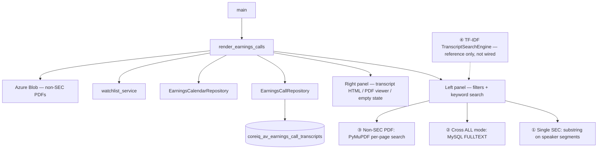
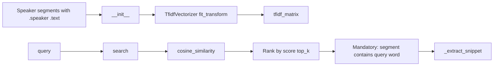
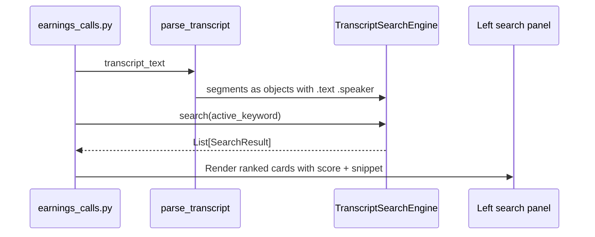
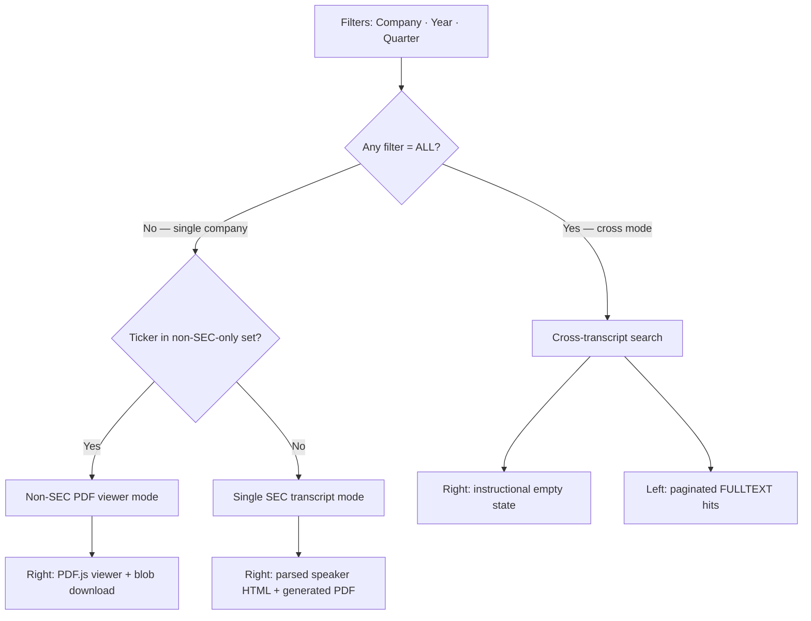
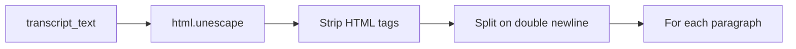
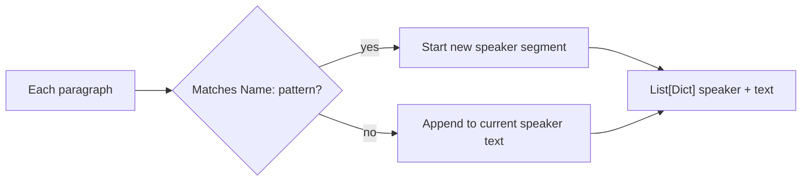
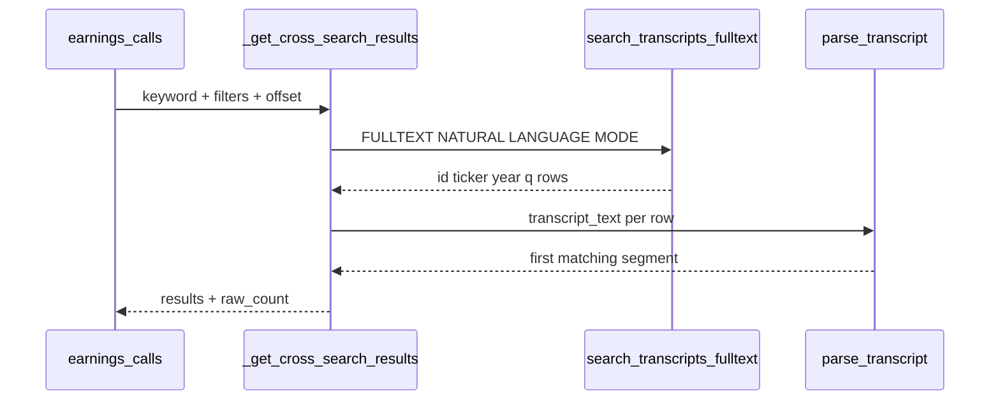
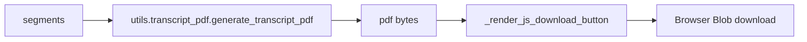
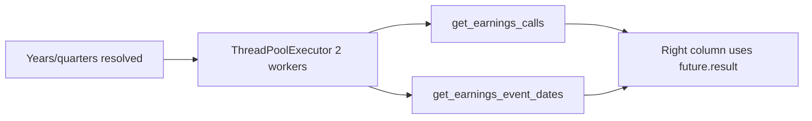
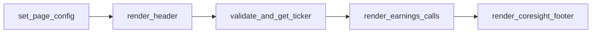

# Earnings Calls — Technical Documentation

**Application:** Market Data Portal (MDP)  
**Page module:** `app/pages/earnings_calls.py`  
**URL route:** `/earnings_calls`  
**Registered in:** `app/main.py` as `("pages/earnings_calls.py", "Earnings Calls", "earnings_calls", False)`

---

## 1. Purpose and scope

The Earnings Calls page lets users browse **earnings call transcripts** for SEC and select non-SEC companies. Capabilities include:

- **Company / Year / Quarter** filters with cross-transcript **"ALL"** mode
- **Keyword search** in three modes: single transcript, cross-transcript (MySQL FULLTEXT), non-SEC PDF
- **Transcript display** with speaker segmentation and keyword highlighting
- **PDF download** (generated for SEC text transcripts; blob PDF for non-SEC)
- **Excel export** of keyword hits (inline or background thread for large cross-search)
- **Watchlist-scoped** cross-transcript search
- Deep links from **Earnings Calendar** and cross-search result cards

---

## 2. Architecture overview

Top-down layout: page orchestration loads repositories and storage, then the left search panel dispatches to one of three active search paths (plus an unused Term Frequency–Inverse Document Frequency (TF-IDF) reference engine).



---

## 3. Term Frequency–Inverse Document Frequency (TF-IDF) search engine (`app/core/search_engine.py`)

### 3.1 Status in this page

`TranscriptSearchEngine` is **implemented and documented** as the project's Term Frequency–Inverse Document Frequency (TF-IDF) transcript search utility, but **`earnings_calls.py` does not import it** (as of current codebase). The page uses:

| Mode | Mechanism |
|------|-----------|
| Single transcript | Case-insensitive **substring** scan on parsed speaker segments |
| Cross-transcript | **MySQL FULLTEXT** (`search_transcripts_fulltext`) + segment extraction |
| Non-SEC PDF | **PyMuPDF** per-page text + substring search |

The Term Frequency–Inverse Document Frequency (TF-IDF) engine remains the canonical design for **relevance-ranked segment search** and is listed in `requirements.txt` (scikit-learn). Integrating it would replace or augment single-transcript `matches` loop with ranked `SearchResult` objects.

### 3.2 `TranscriptSearchEngine` design



**Class:** `TranscriptSearchEngine`  
**Dataclass:** `SearchResult(index, speaker, text, score, snippet)`

| Parameter | Value |
|-----------|--------|
| `stop_words` | `'english'` |
| `max_features` | `10000` |
| `ngram_range` | `(1, 2)` unigrams + bigrams |
| `min_df` | `1` |
| `sublinear_tf` | `True` |
| `min_score` default | `0.01` |
| `top_k` default | `20` |

**Fallback:** If sklearn missing or fit fails → `_fallback_search` counts substring occurrences normalized by word count.

**Snippet extraction:** Centers on full query or first matching word; adds `...` ellipses.

### 3.3 Hypothetical integration (not current code)



---

## 4. Database: `coreiq_av_earnings_call_transcripts`

Primary table for SEC-sourced (and ingested) transcript text.

| Column | Type role |
|--------|-----------|
| `id` | Primary key |
| `source` | Data provenance |
| `ticker` | Company symbol |
| `quarter` | Compact key e.g. `2025Q4` |
| `year` | Fiscal/report year |
| `q` | Quarter integer 1–4 |
| `transcript_text` | LONGTEXT body |
| `has_transcript` | Filter flag (`= 1` for UI lists) |
| `title` | Metadata |
| `event_datetime_utc` | Event time |
| `fetched_at_utc` | Ingest timestamp |

**Index:** `idx_transcript_fulltext_search` — FULLTEXT on `transcript_text` for cross-search.

### 4.1 `EarningsCall` model

```python
@dataclass
class EarningsCall:
    id: int
    source: Optional[str]
    ticker: str
    quarter: str
    year: int
    q: int
    transcript_text: Optional[str]
    has_transcript: bool
    title: Optional[str]
    event_datetime_utc: Optional[datetime]
    fetched_at_utc: datetime
```

### 4.2 Key repository methods

| Method | Cache TTL | Purpose |
|--------|-----------|---------|
| `get_companies_with_earnings()` | 600s | Distinct tickers with transcripts |
| `get_earnings_calls(ticker, year, quarter)` | 60s | Fetch transcript row(s) |
| `get_years_and_quarters(ticker)` | — | Combined year→quarters map |
| `get_all_available_years()` | — | For Company=ALL |
| `search_transcripts_fulltext(...)` | 120s | Cross-transcript keyword |
| `search_transcript_windows_for_export(...)` | — | Excel export (up to 10k rows) |
| `get_non_sec_transcript_companies()` | — | YFinance-only transcript tickers |
| `get_non_sec_transcript_years_and_quarters(ticker)` | — | Non-SEC period map |

---

## 5. Page modes

Filter combination determines which right-panel renderer runs. Cross mode keeps instructional empty state on the right while results populate the left panel.



### 5.1 Cross-transcript mode

Triggered when `company == 'ALL'` OR `year == 'ALL'` OR `quarter == 'ALL'`.

- Left panel: `_get_cross_search_results` (paginated, 15 per page)
- Right panel: `render_cross_search_panel` instructional empty state
- Watchlist dropdown shown **above** filter row when all three are ALL

### 5.2 Single SEC transcript mode

- Fetches `EarningsCallRepository.get_earnings_calls`
- Parses `transcript_text` → speaker segments
- Optional earnings calendar metadata: report date, fiscal period end, display period label
- Right: HTML transcript card + generated PDF download

### 5.3 Non-SEC transcript mode

Companies only in `get_non_sec_transcript_companies()` (not in SEC earnings table).

- PDF path: Azure blob `{ticker}/{year}/transcript-{quarter}/transcript.pdf`
- Local cache via `utils.azure_blob.ensure_local_blob_for_transcript`
- Right: `_render_ec_pdf_viewer` (PDF.js) + raw PDF download
- Search: page-level text extraction, not speaker parse

---

## 6. Transcript parsing

### 6.1 `parse_transcript(transcript_text)` — `@st.cache_data(ttl=600)`

**Part 1 — Normalize raw text**



**Part 2 — Speaker detection**



**Speaker regex:** `^([A-Z][a-zA-Z\s\.]+(?:\s+[A-Z][a-zA-Z]+)*):\s*(.*)$` — returns picklable `List[Dict]` with keys `'speaker'`, `'text'` for Streamlit cache.

### 6.2 Rendering

| Function | Output |
|----------|--------|
| `render_speaker_section` | HTML block `#seg-{index}` with optional `<mark>` highlights |
| `render_transcript_card` | Wrapper `.ec-transcript-body-wrap` + scrollable body |
| `_render_transcript_header_html` | Title, year, quarter, report/QE dates, fiscal period label |

---

## 7. Search implementations (actual)

### 7.1 Single-transcript keyword search

```python
for i, seg in enumerate(segments):
    if active_keyword.lower() in seg['text'].lower():
        # build snippet ±40 chars around first match
```

- Left panel cards link to `#seg-{index}` anchor in right column
- Max 30 cards displayed in loop (no pagination within single transcript)
- Excel: `_build_keyword_results_excel` when matches exist

### 7.2 Cross-transcript search



**Pagination session keys:**

| Key | Purpose |
|-----|---------|
| `ec_cross_sig` | `(keyword, company, year, quarter, watchlist_id)` |
| `ec_cross_acc` | Accumulated result list |
| `ec_cross_offset` | Next DB offset |
| `ec_cross_has_more` | `raw_count == page_size` |

**View → navigation:** `/earnings_calls?ticker=&year=&quarter=&highlight=`

### 7.3 FULLTEXT query strategy (`search_transcripts_fulltext`)

- Keywords ≥3 chars: `MATCH(transcript_text) AGAINST (:kw IN NATURAL LANGUAGE MODE)`
- Short keywords: `LIKE '%keyword%'`
- **Two-phase fetch:** light columns + sort/limit first; `transcript_text` lookup by `id` IN (…) second — avoids sorting LONGTEXT
- Watchlist: `allowed_tickers` → `ticker IN (...)` when `watchlist_id` set

### 7.4 Non-SEC PDF search

1. `_extract_pdf_text_by_page(pdf_path)` — PyMuPDF, cached 300s
2. `_search_pdf_pages` — substring per page, snippet ±60 chars
3. View link includes `pdf_page` and `keyword` query params
4. PDF viewer scrolls to `target_page` and highlights keyword on all rendered pages (red overlay boxes)

---

## 8. PDF download

### 8.1 SEC transcripts (generated)



- Avoids Streamlit `/media/` endpoint (proxy issues)
- Base64 embedded in `streamlit.components.v1.html` iframe button

### 8.2 Non-SEC transcripts (file)

- Reads cached blob file → `_render_js_download_button`
- Filename: `{ticker}_{year}_{quarter}_Transcript.pdf`

### 8.3 PDF viewer (`_render_ec_pdf_viewer`)

- PDF.js 3.11.174 from CDN
- Lazy page render via `IntersectionObserver`
- Keyword highlight on every visible page
- Session cache: `ec_pdf_b64_{pdf_path}`

---

## 9. Excel export

### 9.1 Cross-transcript (background)

```mermaid
%%{init: {'flowchart': {'nodeSpacing': 50, 'curve': 'basis'}}}%%
flowchart TD
    BTN[Excel button click] --> START[_ec_excel_job_start]
    START --> POOL[ThreadPoolExecutor max 2]
    POOL --> BUILD[_build_cross_excel_job]
    BUILD --> COMPUTE[_compute_all_cross_search_results_for_excel]
    COMPUTE --> XLS[_build_keyword_results_excel openpyxl]
    FRAG[@st.fragment run_every 1.2s poller] --> COLLECT[_ec_excel_jobs_collect]
    COLLECT --> AUTO[_render_excel_js_download auto_click]
```

- Module-level `_EC_EXCEL_JOBS` dict (survives reruns)
- Max 12 jobs retained
- Columns: Company, Ticker, Year, Quarter, Reporter Name, Whole Paragraph

### 9.2 Single-transcript

- Synchronous build cached in `ec_single_excel_bytes` / `ec_single_excel_sig`

---

## 10. Filters and session state

### 10.1 Filter row widgets

| Widget | Key | Callback |
|--------|-----|----------|
| Search | `ec_search_input` → `ec_search` | — |
| Company | `ec_company_select` | `on_company_change` |
| Year | `ec_year_select_{company}` | `on_year_change` |
| Quarter | `ec_quarter_select_{company}_{year}` | `on_quarter_change` |

**Dynamic widget keys** force Streamlit to reset dropdown display when company/year changes.

### 10.2 Session state reference

| Key | Purpose |
|-----|---------|
| `ec_company`, `ec_year`, `ec_quarter` | Filter values |
| `ec_search` | Keyword |
| `_ec_quarter_user_set` | Preserve user quarter vs auto-default |
| `_ec_nav_id` | One-time URL nav consumption |
| `_ec_last_url_ticker` | Fresh ticker detection |
| `ec_calls_active_watchlist_id` | Cross-search watchlist |
| `active_ticker` | Shared nav ticker |
| `ec_cross_*` | Cross-search pagination |
| `ec_single_excel_*` | Single Excel cache |
| `_earnings_cleanup_done` | One-time `cache_cleaner` flag |

### 10.3 Local storage persistence

`utils.local_storage_manager`:

- `load_earnings_calls_state()` — before widget init
- `save_earnings_calls_state()` — end of `render_earnings_calls` (not in callbacks — avoids header DOM glitch)

---

## 11. URL query parameters

| Param | Purpose |
|-------|---------|
| `ticker` | Set company |
| `year`, `quarter` | Set period |
| `highlight` | Keyword → `ec_search` |
| `keyword` | Preserved on PDF view links |
| `from=calendar` | Calendar navigation bundle |
| `pdf_page` | Scroll PDF to page (non-SEC) |
| `clear_cache=1` | Admin: `st.cache_data.clear()` |

---

## 12. Prefetch optimization

When not in cross-search and not non-SEC:



---

## 13. Company list construction

1. Parallel fetch: SEC companies + non-SEC transcript companies
2. Merge with dedupe by ticker and normalized name
3. `_non_sec_only_tickers` — routing for YQ map and PDF path
4. Dropdown: `('ALL', 'All Companies')` + sorted list

---

## 14. CSS and layout

- `get_earnings_css()` — extensive Streamlit overrides, 520px matched panels
- Left: `st.container(border=True, height=520)`
- Right: transcript card or PDF viewer (~820px iframe height)
- `PageLoadTracker` steps: `FETCH_COMPANIES`, `MERGE_COMPANIES`, `FETCH_YEARS_QUARTERS`, `FETCH_TRANSCRIPT`, `RENDER_CONTENT`

---

## 15. Module init: cache cleanup

On first session run per process:

- `utils.cache_cleaner.ensure_fresh_code()` removes stale `__pycache__`
- Results stored in `_earnings_cleanup_results`, timing in `_earnings_cleanup_time_ms`

---

## 16. Authentication and access control

| Check | Status |
|-------|--------|
| `require_auth(page="earnings_calls")` | Optional at page level; identity via `main.py` cookie hydrate |
| `AccessControlManager.check_access` | Not used — any authenticated portal user with nav access may view |
| Identity source | `main.py` cookie hydrate + optional `get_current_user()` for watchlist scoping |

Direct `/earnings_calls` URLs should be protected by enabling `require_auth()` so only valid OpenID Connect (OIDC) sessions can render the page.

---

## 17. Entry point, errors, and related files

`main()` runs at module import: `set_page_config` → `render_header` → ticker validation for nav → `render_earnings_calls` → footer. Errors use `log_structured_error` with `page="earnings_calls"`. PDF generation failures hide the download button; transcript prefetch futures fall back serially after a 30s timeout.



| File | Role |
|------|------|
| `app/core/search_engine.py` | Term Frequency–Inverse Document Frequency (TF-IDF) engine (reference, not wired) |
| `app/utils/transcript_pdf.py` | Securities and Exchange Commission (SEC) transcript PDF generation |
| `app/utils/azure_blob.py` | Non-SEC PDF local cache |
| `app/data/repository.py` | `EarningsCallRepository`, `EarningsCalendarRepository` |
| `app/utils/local_storage_manager.py` | Filter persistence across sessions |

---

## 18. Summary: search technology map

| User action | Technology | Ranked? |
|-------------|------------|---------|
| Search one SEC call | Python substring on segments | No |
| Search all calls (ALL mode) | MySQL FULLTEXT + first segment hit | DB relevance (NL mode) |
| Search non-SEC PDF | PyMuPDF + substring | No |
| *Available not used* | `TranscriptSearchEngine` Term Frequency–Inverse Document Frequency (TF-IDF) cosine | Yes |
