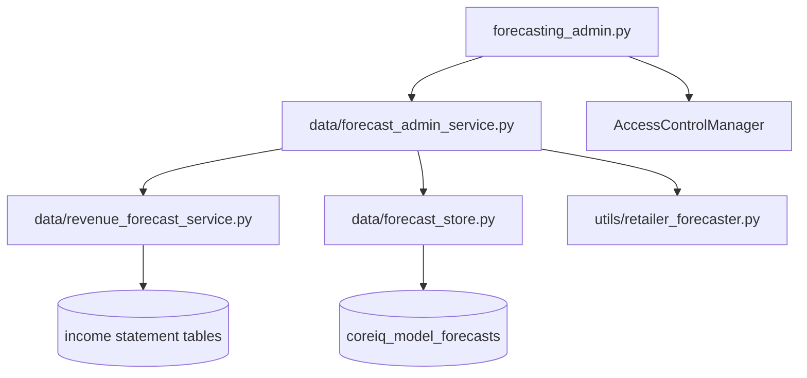
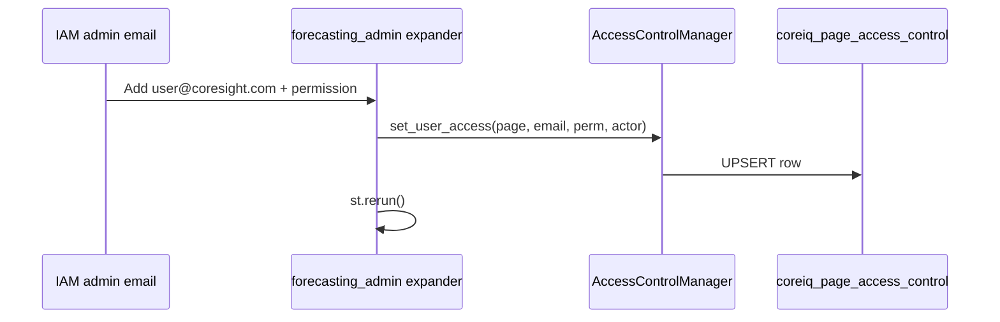
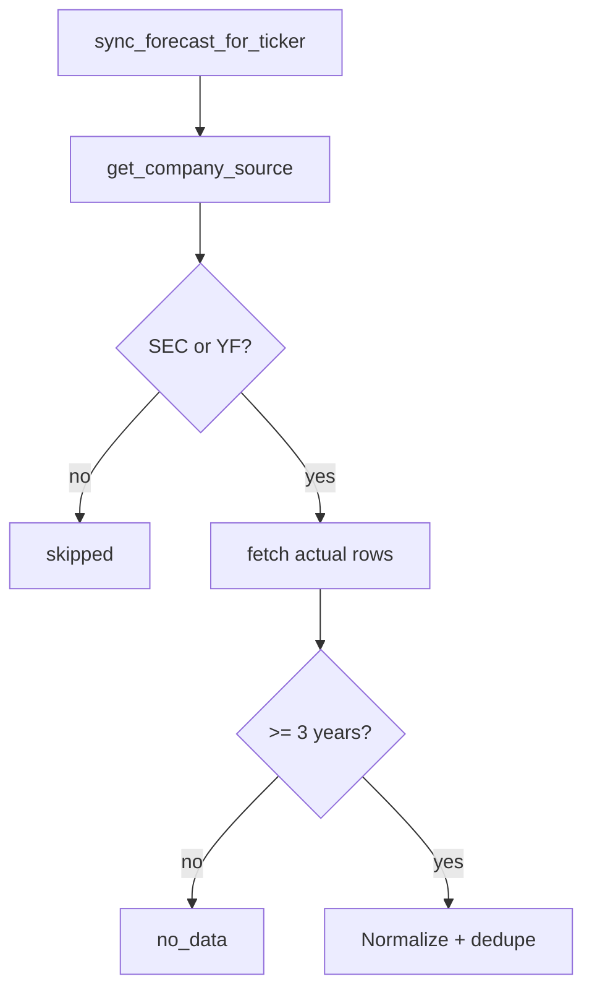
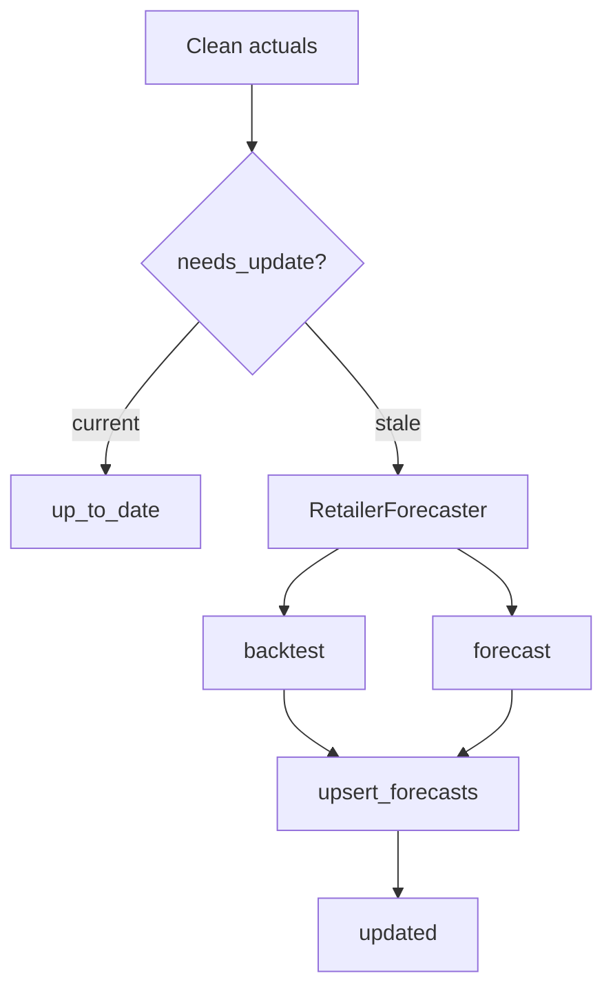
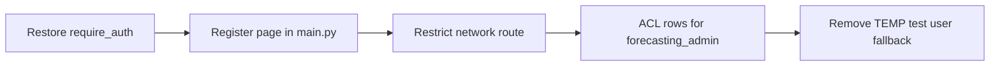
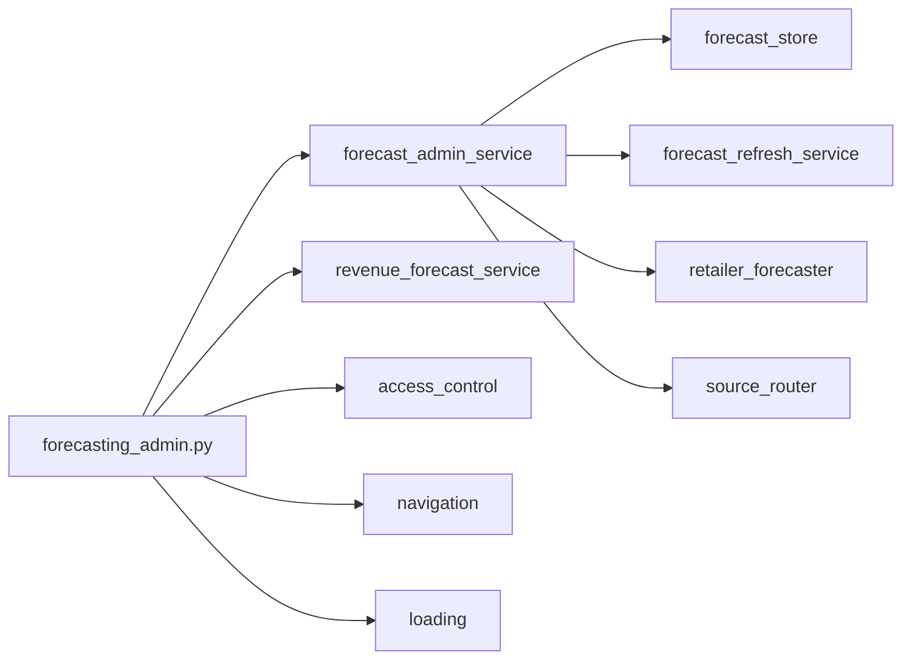

# Forecasting Admin Page — Technical Documentation

**Application:** Market Data Portal (MDP)  
**Source:** `app/pages/forecasting_admin.py`  
**Documented URL:** `/forecasting_admin` (per `CLAUDE.md`)  
**Purpose:** Bulk sync of stored revenue model forecasts into `coreiq_model_forecasts` when annual actuals are newer than cached forecasts.

---

## Registration Status

**Important:** `forecasting_admin.py` exists under `app/pages/` but is **not listed** in `app/main.py` `_PAGES_CONFIG` as of current source. The page is therefore **not registered in Streamlit navigation** unless added manually or loaded via an alternate entry point.

Related surfaces:

- `app/pages/admin_iam.py` — unregistered duplicate Identity and Access Management (IAM) patterns
- Embedded Identity and Access Management (IAM) expander **inside** `forecasting_admin.py` itself
- `access_management.py` — canonical Identity and Access Management (IAM) for `forecasting_admin` page Access Control List (ACL)

Operators may need to add:

```python
("pages/forecasting_admin.py", "Forecasting Admin", "forecasting_admin", False),
```

to `_PAGES_CONFIG` for `/forecasting_admin` to resolve.

---

## Overview

Forecasting Admin is an **internal write path** for the revenue forecasting pipeline (annual and quarterly). While `forecasting.py` is read-only for most users, this page triggers:

1. **Single-ticker sync** — `sync_forecast_for_ticker` (annual) or `sync_quarterly_forecast_for_ticker`
2. **Bulk stale sync** — `sync_all_eligible` or `sync_all_eligible_quarterly`
3. **Optional embedded IAM** — manage ACL for admin pages (hardcoded admin emails only)

After sync, `clear_revenue_forecast_caches()` invalidates Streamlit caches so Market Data / Estimates pick up new rows.



---

## Authentication & Access Control

### Auth

```python
user_email = get_current_user()
```

Identity is established via `main.py` cookie hydrate. Page-level `require_auth()` may be enabled for direct-route protection.

### Sync permission

```python
has_access = AccessControlManager.check_access("forecasting_admin", user_email, "allow")
```

Cached in session:

```python
_cache_key = f"fc_admin_access_{user_email.lower()}"
st.session_state[_cache_key] = has_access
```

Requires permission level ≥ `allow` (rank 4) **or** `admin`/`super_user` role bypass.

Users without access see warning: sync buttons hidden; IAM expander may still show for hardcoded admins.

### IAM expander admins

Separate from DB roles — hardcoded set:

| Email |
|-------|
| mohdsaeedafri@coresight.com |
| shashankgupta@coresight.com |
| risthavilinadsa@coresight.com |
| philipmoore@coresight.com |

When `is_admin` (email in set), expander **Access Control — Page Permissions** is visible.

### Legacy allowlist

`forecast_admin_service.FORECAST_ADMIN_EMAILS` (4 emails) + `is_forecast_admin()` — **not used** by current `forecasting_admin.py` UI (ACL replaced it).

---

## UI Layout

### Chrome

- `new_rerun_id("forecasting_admin")`
- `st.set_page_config(page_title="Forecasting Admin", layout="wide")`
- `hide_sidebar()`, `render_styles()`, `inject_red_spinner_css()`
- `render_header(current_page="forecasting_admin")`
- Custom CSS: `.fc-admin-hero`, cards, deny state, bold form labels

### Sections

1. **Hero** — "Internal · Forecast Store" / "Forecasting Admin"
2. **IAM expander** (admin emails only) — mini access management
3. **Sync controls** (if `has_access`)
4. **Results table + metrics** (after sync run)
5. **Page load diagnostics** expander — timing breakdown
6. `render_coresight_footer`

---

## Embedded IAM Expander

Duplicates patterns from `access_management.py` for three pages:

```python
MANAGED_PAGES = ["forecasting_admin", "retailer_adding", "company_filings_add_files"]
```

Features:

- Page selector → `get_page_users(selected_page)`
- Stats: Total Users, Allow Access, Delete Admin
- Add user form → `set_user_access`
- Per-user permission select + Save / Delete
- Permission legend (allow, deny, view_only, upload_only, edit, delete_admin)



---

## Sync Operations

### Sync all stale tickers

```python
run_all = st.button("Sync all stale tickers")
results = sync_all_eligible(force=False, periods=5, progress_callback=_cb)
clear_revenue_forecast_caches()
```

- Progress bar via callback `(cur, total, display_ticker)`
- `force=False` — respects `needs_update()` staleness check

### Sync single ticker

```python
run_one = st.button("Sync this ticker only")
row = sync_forecast_for_ticker(ticker.strip())
clear_revenue_forecast_caches()
```

Enriches result with `company_name` from `RevenueForecastService.get_companies()`.

### Result metrics

| Metric | Counts status |
|--------|---------------|
| Upserted | `updated` |
| Already current | `up_to_date` |
| Skipped / no data | `skipped`, `no_data` |
| Errors | `error` |

Dataframe columns: `ticker`, `company_name`, `status`, `rows_upserted`, `message`

---

## Service Layer — `forecast_admin_service.py`

### `sync_forecast_for_ticker(display_ticker, force=False, periods=5)`

**Diagram — Part A: Source gate & actuals prep**



**Diagram — Part B: Staleness check & forecast store**



**Return dict keys:** `ticker`, `status`, `message`, `rows_upserted`, `store_ticker`, `last_actual_date`, `company_name`, `exchange`

**Status values:**

| Status | Meaning |
|--------|---------|
| `updated` | Engine ran; DB upserted |
| `up_to_date` | `needs_update` false and not forced |
| `skipped` | Unsupported source or insufficient years |
| `no_data` | No revenue rows |
| `error` | Exception captured |

### `sync_all_eligible(force, periods, progress_callback, exclude_tickers)`

Iterates `RevenueForecastService.get_companies()` — same universe as Revenue Estimates (≥3 annual revenue points).

### `clear_revenue_forecast_caches()`

```python
RevenueForecastService.get_company_dashboard.clear()
RevenueForecastService.get_companies.clear()
```

---

## Database — `coreiq_model_forecasts`

Written by `forecast_store.upsert_forecasts()`.

### Staleness — `needs_update(ticker, last_actual_date)`

Compares latest annual actual `fiscal_date_ending` against `MAX(last_actual_date)` stored per ticker/metric.

Also forces recompute if `computed_at < 2026-05-11` (dedup fix cutoff `_DEDUP_FIX_DATE`).

### Key columns (conceptual)

| Column | Purpose |
|--------|---------|
| `ticker` | Composite for YFinance (e.g. `TSCO.L`) |
| `fiscal_year` | Forecast year |
| `model_key` | linear, cagr, ensemble, scenario_*, etc. |
| `value_millions` | Forecast value |
| `metric` | `total_revenue` |
| `mape` | Backtest accuracy |
| `last_actual_date` | Actuals snapshot used |
| `computed_at` | When forecast was stored |
| `company_name`, `exchange` | Denormalized (via `forecast_refresh_service`) |

### Source actuals tables

| Source | Table |
|--------|-------|
| SEC | `coreiq_av_financials_income_statement` |
| YFinance | `coreiq_yf_financials_income_statement` |

---

## Forecasting Engine

`utils.retailer_forecaster.RetailerForecaster`:

- Six models: linear, cagr, exp_smoothing, holt, ma_trend, weighted_avg
- `backtest(holdout_years=2)` — ranks by MAPE
- `forecast(periods)` — includes ensemble (top 3 MAPE) + scenario percentiles
- Data cleaning: duplicate year dedup, 10% of max revenue floor, outlier detection

---

## Session State

| Key | Purpose |
|-----|---------|
| `fc_admin_access_{email}` | Cached ACL boolean |
| `iam_page_select`, `iam_new_email`, `iam_new_perm` | IAM expander widgets |
| `iam_perm_{page}_{email}` | Per-user permission selectbox state |
| `fc_one_ticker` | Single ticker input |
| Widget keys for sync buttons | `fc_sync_all`, `fc_sync_one` |

---

## Performance Instrumentation

Page records `_timings` list:

- `hide_sidebar + render_styles`
- `get_current_user`
- `render_header`
- `check_access`
- `render_footer`

Displayed in expander: **Page load diagnostics — total Nms** with color-coded bars (>300ms red).

---

## Relationship to `forecasting.py`

| Aspect | forecasting.py | forecasting_admin.py |
|--------|----------------|----------------------|
| Primary mode | Read / visualize | Write / sync store |
| DB writes | Via refresh dialog (edit ACL) | Bulk admin sync |
| ACL page name | `forecasting` | `forecasting_admin` |
| Registered in main.py | Yes | **No (currently)** |
| Cache clear after write | Yes (`clear_revenue_forecast_caches`) | Yes |

The Estimates page **Refresh Data** dialog calls the same `sync_forecast_for_ticker` / `sync_all_eligible` for users with `edit` on page `forecasting`.

---

## Security Checklist



---

## File Dependencies



---

*Generated from source analysis of the Market Data Portal (MDP). Last reviewed against codebase structure as of project documentation pass.*
