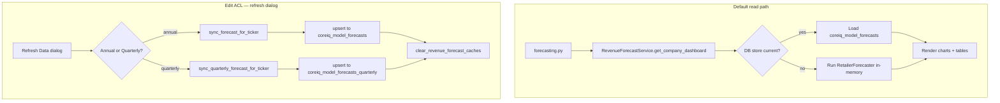
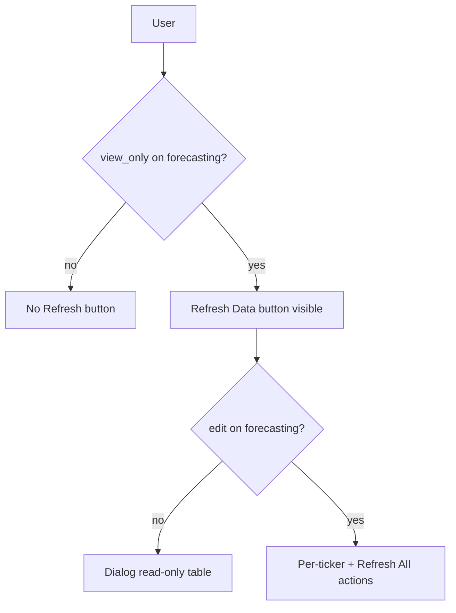
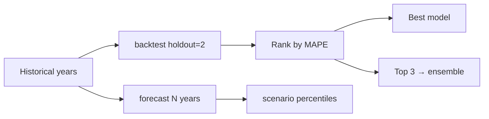
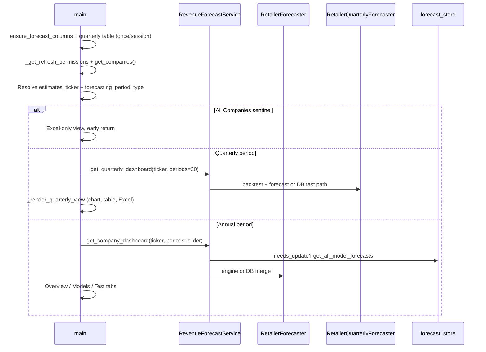
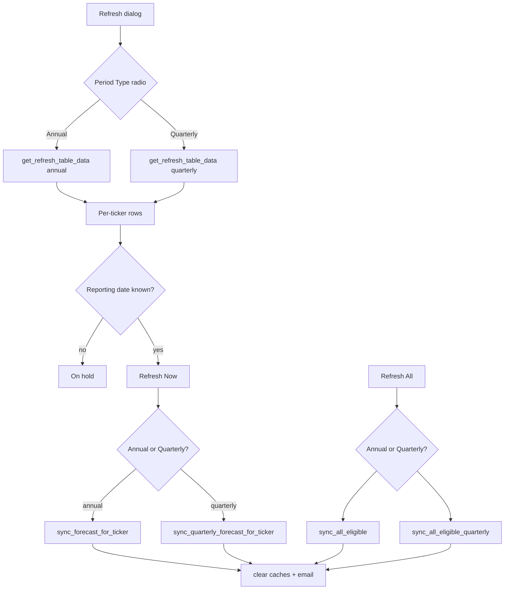
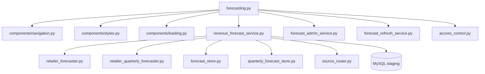

# Forecasting Page (Revenue Estimates) — Technical Documentation

**Application:** Market Data Portal (MDP)  
**Source:** `app/pages/forecasting.py`  
**URL path:** `/forecasting`  
**UI title:** Revenue Forecasting  
**Purpose:** Database-backed revenue forecast viewer — annual and quarterly modes, statistical models, ensemble, scenarios, backtesting, and Excel export.

---

## Overview

The Forecasting page is the primary **read-only analytics cockpit** for revenue projections at **annual** and **quarterly** cadence. It:

1. Loads historical actuals from staging income-statement tables (annual or quarterly frequency).
2. Runs (or loads from cache) `RetailerForecaster` (six annual models) or `RetailerQuarterlyForecaster` (seven models including seasonal naive).
3. Displays interactive Plotly charts, methodology popups (`st.dialog`), and exportable Excel workbooks.
4. Optionally allows authorized users to refresh stored forecasts via **Refresh Data** (writes to `coreiq_model_forecasts` or `coreiq_model_forecasts_quarterly` when `edit` Access Control List (ACL) is granted).

Typical viewers never write to the database; writes occur only through the refresh dialog.



---

## Registration

| Property | Value |
|----------|-------|
| `main.py` | `("pages/forecasting.py", "Forecasting", "forecasting", False)` |
| Header key | `current_page='forecasting'` |
| Auth | `get_current_user()` — no hard `require_auth()` at page top |

---

## Access Control

### Refresh dialog permissions — `_get_refresh_permissions(user_email)`

| Capability | Access Control List (ACL) check |
|------------|-----------|
| Can open Refresh dialog | `check_access("forecasting", email, "view_only")` |
| Can run Refresh Now / Refresh All | `check_access("forecasting", email, "edit")` |

`admin` / `super_user` bypass all checks via `AccessControlManager`.



Page viewing itself is **not Access Control List (ACL)-gated** in `forecasting.py` — any authenticated portal user with nav access can browse estimates (subject to global auth in `main.py`).

---

## Architecture Layers

| Layer | Module | Responsibility |
|-------|--------|----------------|
| Page UI | `app/pages/forecasting.py` | Layout, period toggle, charts, tabs, Excel, refresh dialog |
| Data service | `app/data/revenue_forecast_service.py` | Companies list, annual + quarterly dashboard payloads |
| Annual store | `app/data/forecast_store.py` | Staleness, upsert, read `coreiq_model_forecasts` |
| Quarterly store | `app/data/quarterly_forecast_store.py` | Table init, staleness, upsert `coreiq_model_forecasts_quarterly` |
| Admin sync | `app/data/forecast_admin_service.py` | Annual + quarterly write paths from refresh |
| Refresh metadata | `app/data/forecast_refresh_service.py` | Dialog table (annual/quarterly), schema migrations, email |
| Annual engine | `app/utils/retailer_forecaster.py` | Six models + ensemble + scenarios |
| Quarterly engine | `app/utils/retailer_quarterly_forecaster.py` | Seven models + seasonal decomposition + ensemble |
| Source routing | `app/data/source_router.py` | Securities and Exchange Commission (SEC) vs Yahoo Finance per ticker |

---

## Database Tables

### Actual revenue (read)

| Table | Source | Key filters |
|-------|--------|-------------|
| `coreiq_av_financials_income_statement` | SEC | `report_type='annual'`, `total_revenue IS NOT NULL` |
| `coreiq_yf_financials_income_statement` | YFinance | `frequency='annual'`, `line_item='Total Revenue'` |
| `coreiq_yf_company_overview` | YFinance | `payload_json` for `financialCurrency` |
| `coreiq_companies` | Master | Ticker, name, source, exchange |

### Stored annual forecasts (read/write via refresh)

**`coreiq_model_forecasts`** — one row per `(ticker, fiscal_year, model_key, metric)`; values in millions (`value_millions`); `last_actual_date` drives staleness; fast path for `get_company_dashboard` and Market Data Key Stats.

### Stored quarterly forecasts (read/write via refresh)

**`coreiq_model_forecasts_quarterly`** — managed by `quarterly_forecast_store.py`; created idempotently on first session via `ensure_quarterly_forecast_table()`; same staleness pattern as annual store; consumed by `get_quarterly_dashboard`.

### Company universe query

`RevenueForecastService.get_companies()` — cached 1 hour:

- Joins `coreiq_companies` with SEC/YF stats CTEs
- Requires ≥3 distinct annual revenue periods
- Builds **display ticker**: `TSCO.L` when `exchange_acronym` present

---

## Forecasting Models

### Annual — six core models (`MODEL_LABELS` / `RetailerForecaster`)

| Key | Display name | Approach |
|-----|--------------|----------|
| `linear` | Linear Regression | OLS trend line extended forward |
| `cagr` | CAGR | Compound growth from first to last historical year |
| `exp_smoothing` | Exponential Smoothing | Weighted toward recent years |
| `holt` | Holt's Linear Trend | Level + slope state space |
| `ma_trend` | Moving Average Trend | Mean of last 3 YoY growth rates |
| `weighted_avg` | Weighted Average Growth | Weighted historical growth rates |

### Quarterly — seven models (`RetailerQuarterlyForecaster`)

Same six annual method keys plus **`seasonal_naive`** (seasonal baseline). All methods run on a **de-seasonalised** series (ratio-to-trend / centred moving average), then re-apply seasonal indices (Q1–Q4). Requires **≥ 8 quarters** of revenue history. Ensemble still averages **top 3** by backtest mean absolute percentage error (MAPE).

| Key | Display name | Notes |
|-----|--------------|-------|
| `seasonal_naive` | Seasonal Naive | Quarter-over-quarter seasonal baseline |
| *(others)* | Same keys as annual | Applied after seasonal adjustment |

### Derived outputs (annual and quarterly)

| Key | Description |
|-----|-------------|
| `ensemble` | Average of **top 3** models by backtest MAPE (not all 6) |
| `scenario_pessimistic` | 25th percentile historical growth path |
| `scenario_baseline` | 50th percentile (median) growth path |
| `scenario_optimistic` | 75th percentile growth path |

### Backtesting

- Hold out **2 most recent years**
- Rank models by **MAPE** (mean absolute percentage error)
- Best model shown in summary card; top 3 feed ensemble



---

## Page Load Flow — `main()`

After company selection, flow branches on **Period** radio (`Annual` | `Quarterly`). Quarterly uses a dedicated `_render_quarterly_view()` path with no annual regression.



### Lazy schema init (session once)

```python
if not st.session_state.get("_forecast_schema_inited"):
    ensure_forecast_columns()
    backfill_company_info()
    ensure_quarterly_forecast_table()  # from quarterly_forecast_store
    st.session_state["_forecast_schema_inited"] = True
```

---

## Session State

| Key | Purpose |
|-----|---------|
| `_forecast_schema_inited` | One-time DB column + quarterly table init |
| `estimates_ticker` | Selected company (`_ALL_SENTINEL`, `_SELECT_SENTINEL`, or ticker) |
| `forecasting_period_type` | `Annual` or `Quarterly` — radio below header |
| `active_ticker` | Header breadcrumb ticker |
| `estimates_forecast_periods` | Annual slider 1–5 years |
| `_est_all_xl_bytes` | Cached all-companies Excel bytes |
| `_est_all_xl_just_built` | Auto-trigger download flag |
| `_est_sgl_xl_{ticker}_{periods}` | Per-ticker annual Excel cache |
| `refresh_dialog_period_type` | Annual/Quarterly radio inside refresh dialog |

Query params: `?ticker=TSCO` synced on company change; `?period_type=Quarterly` seeds `forecasting_period_type` on first visit only (never overrides user selection).

### Sentinel constants

- `_ALL_SENTINEL` — "All Companies" download-only mode
- `_SELECT_SENTINEL` — Placeholder "— Select Company —"

---

## UI Structure

### Header row

- Company selectbox (hidden label, custom styled title row with company name)
- **Period** radio — `Annual` | `Quarterly` (individual ticker only; hidden in All Companies mode)
- **Forecast Horizon** slider (1–5 years) — **annual mode only** (right column)
- **Refresh Data** button — if `can_view_popup`

### Annual hero metrics (5 cards)

1. Latest Actual Revenue (period ending date)
2. Ensemble — Next Year
3. Best Forecasting Model — clickable card opens `_model_popup` dialog (MAPE in meta)
4. Historical Years in Training
5. Forecast Horizon (years through end year)

### Annual main tabs

| Tab | Content |
|-----|---------|
| **Overview** | Combined chart, forecast table, implied growth, historical stats, per-model explore buttons |
| **Models** | Nested tab per model + Scenarios sub-tab with `_scenario_chart` |
| **Test** | Backtest chart/table, scenario analysis, implied growth table, MAPE/Bias/RMSE documentation panels |

### Quarterly view — `_render_quarterly_view()`

Self-contained path when `forecasting_period_type == 'Quarterly'`:

- Loads `RevenueForecastService.get_quarterly_dashboard(selected_ticker, periods=20)`
- Hero chips: historical quarter count, “Quarterly · seasonally adjusted”
- Five cards: Latest Actual Revenue (quarter label), Ensemble — Next Quarter, Best Model, Quarters in Training, Forecast Horizon (quarters)
- Plotly chart via `_build_quarterly_overview_chart` — historical + faint model lines + dashed ensemble + scenario band
- Forecast table (quarters × models) and backtest MAPE table
- Excel via `_build_quarterly_excel` → `{ticker}_Quarterly_Revenue_Forecasting.xlsx`
- Empty state when &lt; 8 quarters or no stored forecast — prompts **Refresh Data → Quarterly**

### Charts (Plotly)

| Function | Purpose |
|----------|---------|
| `_build_overview_chart` | Annual historical + all models + scenarios |
| `_build_quarterly_overview_chart` | Quarterly historical + models + ensemble + scenario band |
| `_build_model_chart` | Single model detail |
| `_build_backtest_chart` | MAPE comparison bars |
| `_scenario_chart` | Pessimistic / baseline / optimistic paths |

### Model popup — `_model_popup`

`@st.dialog('Model Details', width='large')` — methodology (`MODEL_BUSINESS_OVERVIEW`, `MODEL_NOTES`), chart, and metrics for one model key. Best-model hero card opens this dialog directly (reliable vs tab-jumping JS).

---

## All Companies Mode

When `estimates_ticker == _ALL_SENTINEL`:

- No per-ticker dashboard load
- **Excel** button builds `_build_forecast_excel_all(companies)` — 3 sheets, all tickers
- Early `return` after footer

---

## Excel Export

### Single company — `_build_forecast_excel_single`

Sheets include historical actuals, all model forecasts, scenarios, backtest, implied growth.

### Download mechanism — `_render_excel_js_download`

JavaScript blob download via `streamlit.components.v1.html` (same pattern as `market_data.py`) for one-click export without Streamlit's native download delay.

---

## Refresh Data Dialog — `_refresh_dialog`

`@st.dialog("Refresh Forecasting Models", width="large")` with **Period Type** radio (`Annual` | `Quarterly`). Backend routing:

| Period | Per-ticker sync | Bulk sync |
|--------|-----------------|-----------|
| Annual | `sync_forecast_for_ticker` | `sync_all_eligible` |
| Quarterly | `sync_quarterly_forecast_for_ticker` | `sync_all_eligible_quarterly` |

`get_refresh_table_data(period_type.lower())` supplies per-ticker company name, exchange, reporting date, fiscal period, last refresh. Tickers **without** a confirmed reporting date show **On hold** (excluded from Refresh All). After success: `clear_revenue_forecast_caches()`, `get_refresh_table_data.clear()`, and `send_model_refresh_email(..., period_type=...)`.



---

## Dashboard Payload Schema

`RevenueForecastService.get_company_dashboard()` returns dict including:

| Key | Content |
|-----|---------|
| `ticker`, `company_name` | Identifiers |
| `source`, `source_label`, `source_table` | Data provenance |
| `reported_currency`, `display_currency` | No FX conversion |
| `actual_rows`, `historical_rows` | Normalized annual series |
| `forecast_rows` / internal `forecast_df` | Model outputs |
| `backtest_rows` | MAPE rankings |
| `raw_forecasts` | Engine-native structure |
| `summary` | Latest actual, next ensemble, best method, periods |
| `best_method` | Winning model key |
| `outlier_years` | Excluded from training |
| `timings_ms` | Performance breakdown |
| `available_models` | Model keys present |

Cached: `@st.cache_data(ttl=86400 * 7)` on `get_company_dashboard`.

---

## Data Normalization Pipeline

1. `_fetch_actual_rows(ticker, source)` — raw DB rows
2. `_normalize_actual_rows` — fiscal year, revenue in billions, growth %, ancillary metrics
3. Build `model_df` — dedupe by year (max revenue), drop years < 10% of peak
4. `RetailerForecaster.from_dataframe(model_df)` — outlier detection + clean series

### DB fast path

If `not needs_update(forecast_ticker, last_actual_date)`:

- Load `get_all_model_forecasts` from store
- Reconstruct `forecast_df`
- Merge scenario columns from in-memory engine if missing from DB
- Approximate `backtest_df` from stored MAPE values
- Skip full engine recompute (~seconds saved per load)

---

## Formatting Helpers

| Function | Output |
|----------|--------|
| `_fmt_billions` | `$X.XXB` style |
| `_fmt_mm` | Millions with commas |
| `_fmt_pct` | Percentage display |
| `_fmt_year` | Fiscal year label |
| `get_currency_symbol` | From `utils.constants` |

Display currency stored in module global `_EST_DISPLAY_CURRENCY` per payload.

---

## Error Handling

| Failure | Behavior |
|---------|----------|
| `get_companies()` / dashboard load | `log_structured_error`; user sees empty state or error banner |
| Refresh dialog sync failure | Per-ticker error row in dialog; email still sent with partial results |
| Excel build failure | Warning toast; cached bytes not set |
| Schema backfill (`ensure_forecast_schema`) | Logged; page continues with best-effort columns |
| Pre-warm thread exception | Swallowed in daemon thread; logged at WARNING |

All exceptions use `utils.server_logger` (`log_structured_error`, `log_error`) with `page="forecasting"`. No bare `except:` blocks.

---

## Logging & Timing

Uses `log_timing` and `log_structured_error` with page=`forecasting`:

- `FORECASTING_schema_init`
- `FORECASTING_get_companies`
- `ESTIMATES_PAGE_LOAD_DASHBOARD`
- `ESTIMATES_PAGE_RENDER`

Service layer logs: `FORECAST_GET_COMPANIES`, `FORECAST_LOAD_ACTUALS`, `FORECAST_DB_FAST_PATH`, etc.

---

## Component Dependencies



---

## Model Methodology Reference (in-page)

The page embeds extensive documentation:

- `MODEL_BUSINESS_OVERVIEW` — plain-language per model
- `MODEL_NOTES` — formulas (OLS, CAGR, Holt, etc.)
- `_render_documentation_tab` / `_render_method_notes` — user-facing help
- Test tab — MAPE interpretation table, Bias/RMSE explainer

---

## Screening Integration

`coreiq_model_forecasts` is also consumed by:

- `screening_service.py` — forecasting criterion filters
- `repository.py` / Key Stats — F- columns on Market Data

Refreshing forecasts from this page updates downstream screening and market data after cache clear.

---

## Known Behaviors & Edge Cases

1. **YFinance composite tickers** — Store uses `TICKER.EXCHANGE` (e.g. `ADS.DE`); routing handled in service layer.
2. **Scenario rows** — May be absent in database store; merged from in-memory engine at read time.
3. **Quarterly mode** — Separate render path; fixed 20-quarter horizon in UI; requires ≥ 8 historical quarters.
4. **Quarterly refresh** — Fully supported in refresh dialog (same on-hold rules for missing reporting dates).
5. **Page view not ACL-gated** — Only refresh actions require Access Control List (ACL).
6. **Pre-warm thread** — Background `get_refresh_table_data("annual")` when user can open refresh dialog.
7. **Best model card** — Opens `_model_popup` via Streamlit button (not fragile DOM tab jump).

---

*Generated from source analysis of the Market Data Portal (MDP). Last reviewed against codebase structure as of project documentation pass.*
