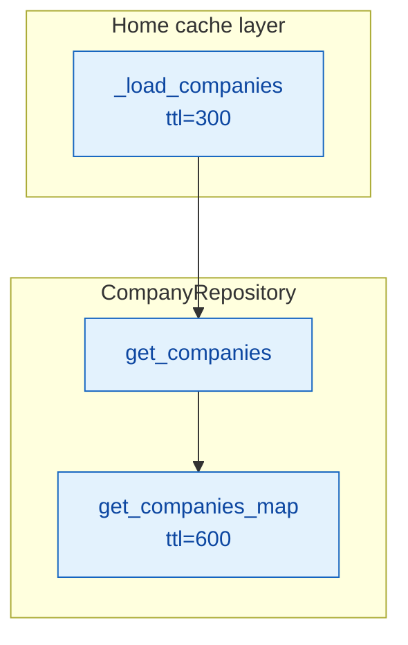
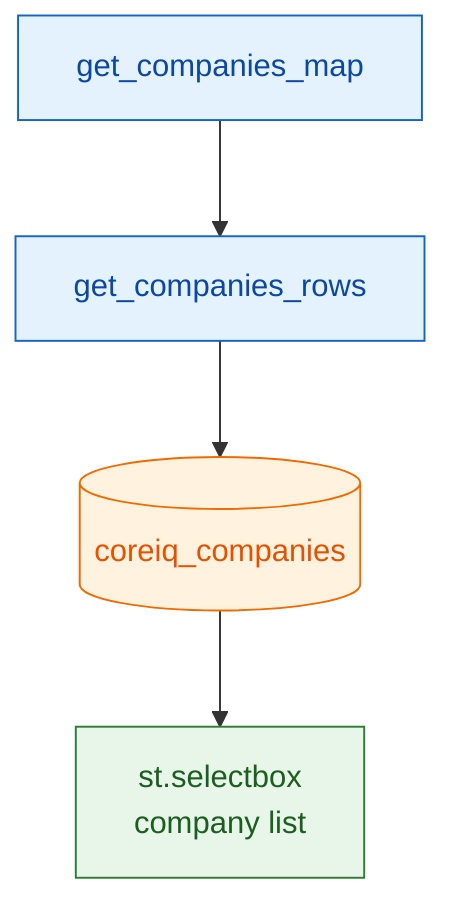
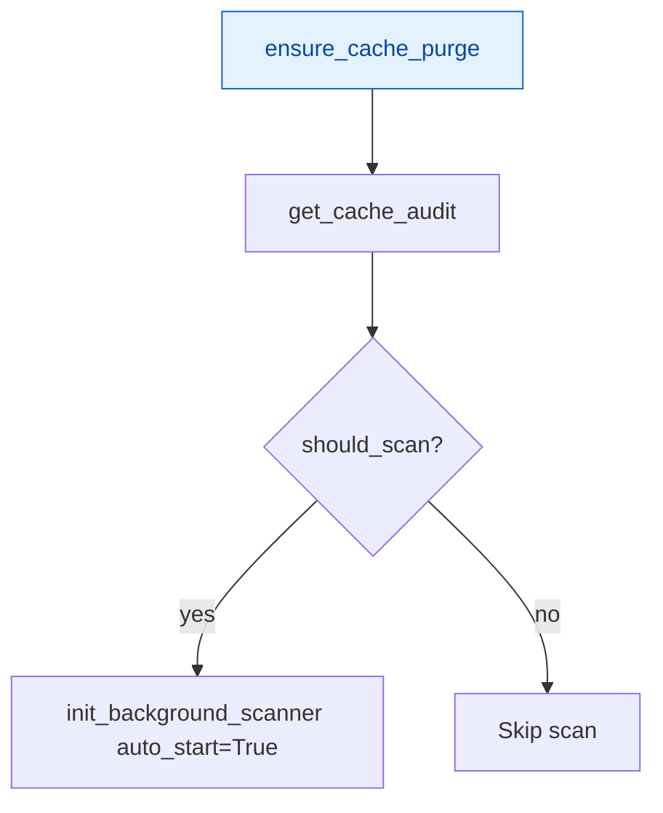
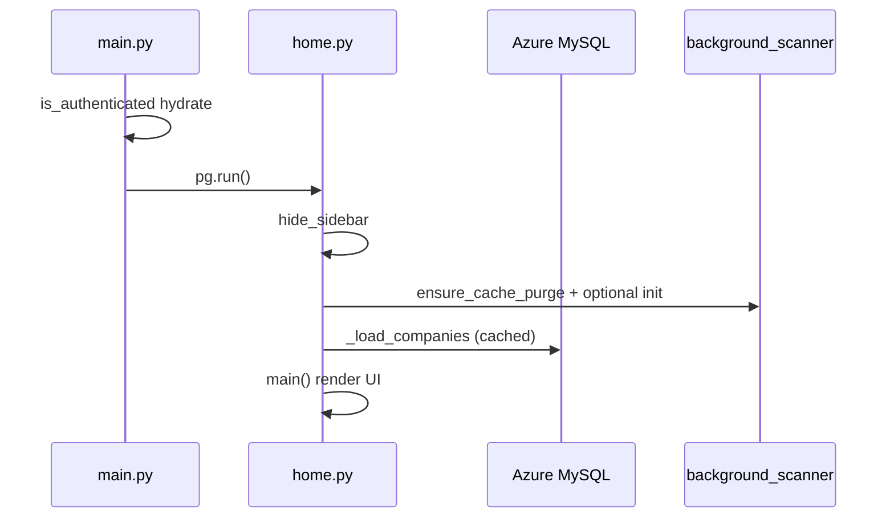
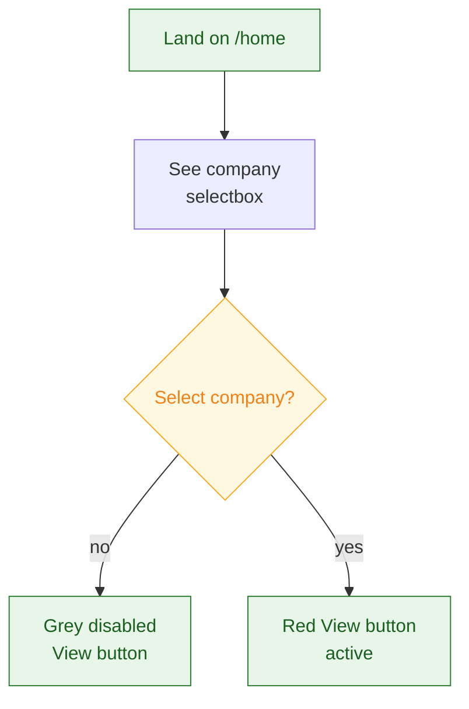
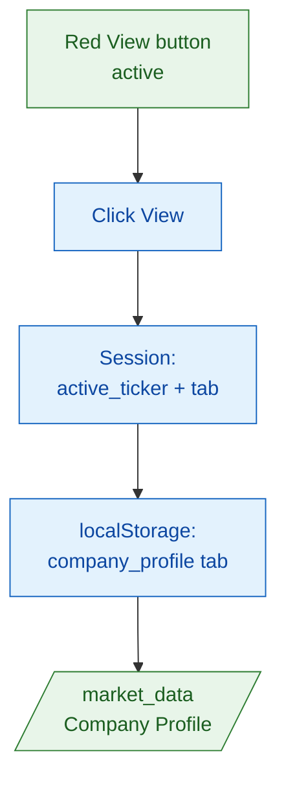
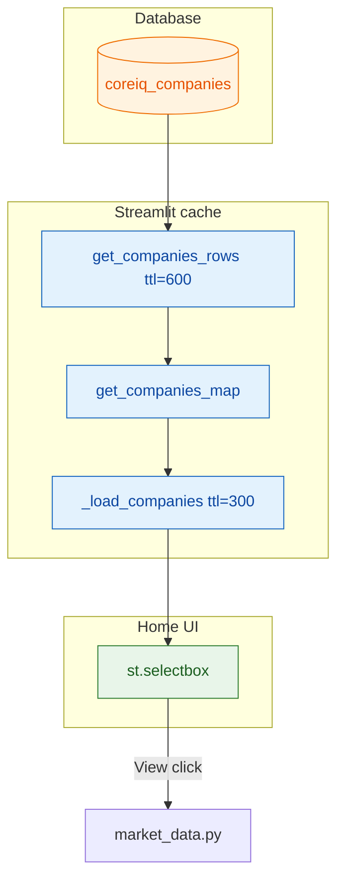

# Home Page — Technical Documentation

**Source:** `app/pages/home.py`  
**URL:** `/home`  
**Purpose:** Post-login landing dashboard — company/sector entry points to the Market Data portal. Primary navigation hub with "View by Company" (active) and "View by Sector" (coming soon).

---

## Overview

The home page presents the **CORESIGHT MARKET DATA** title and two side-by-side cards:

1. **View by Company** — selectbox of all companies from `coreiq_companies`; navigates to Market Data → Company Profile tab.
2. **View by Sector** — User Interface (UI) placeholder only; selectbox and button are **disabled** with "Coming Soon" tooltip.

On module load, the page also triggers **intelligent background filings scan** initialization (non-blocking) and loads the company list from the database (cached 5 minutes).

> **Auth note:** Authentication is enforced via `main.py` central bootstrap (`is_authenticated()` hydrates session from cookie) and the user's journey through login. Page-level `require_auth()` may be enabled for direct-route protection.

---

## URL / Route

| Route | Parameters | Behavior |
|-------|------------|----------|
| `/home` | — | Render home dashboard |
| `/home` | `login_handoff=1` | Handled by `main.py` before page runs; params stripped after cookie verify |

**Registered in `main.py`:** `st.Page("pages/home.py", title="Home", url_path="home", default=False)`

---

## Dependencies

### Python modules

| Import | Role |
|--------|------|
| `components.styles.hide_sidebar` | Hide Streamlit sidebar |
| `components.styles.render_styles` | Inject global design-token CSS |
| `components.navigation.render_header` | Coresight nav header (`current_page="home"`) |
| `components.navigation.render_coresight_footer` | Full-width footer with staging/admin links |
| `core.auth_manager.require_auth` | Available for page-level enforcement |
| `data.repository.CompanyRepository` | `get_companies()` for selectbox |
| `utils.local_storage.set_marketdata_tab` | Persist selected Market Data tab |
| `utils.local_storage_manager.set_persistent_state` | Imported (available for cross-session state) |
| `utils.local_storage_manager.save_market_data_state` | Sync session → local storage |
| `utils.server_logger` | `log_structured_error`, `log_error`, `error_boundary` |
| `utils.background_scanner` | `init_background_scanner`, `get_cache_audit`, `ensure_cache_purge` |

### Component deep-dive: `components/styles.py`

| Function | Used on home? | Behavior |
|----------|---------------|----------|
| `hide_sidebar()` | Yes (module level) | Cached CSS hides `[data-testid="stSidebar"]`, removes top padding |
| `render_styles()` | Yes (`main()`) | Injects `get_global_css()` once per session (`_cached_global_css`) |
| `COLORS`, `TYPOGRAPHY`, etc. | Indirect | Design tokens in global CSS |

### Component deep-dive: `components/navigation.py`

| Function | Parameters on home | Behavior |
|----------|------------------|----------|
| `render_header` | `full_width=True`, `current_page="home"` | 80px sticky header, logo, nav links (Market Data, Earnings Calls, Earnings Calendar, Screening, News), Logout (`?action=logout`) |
| `render_coresight_footer` | `full_width=True`, `stick_to_bottom=True` | 4-column footer; staging-only links (Azure File Storage, Add Retailers); Access Management for admins |

**Header side effects:**

- Sets `st.session_state["_active_page"] = "home"`
- Injects `_inject_transition_js()` for client-side nav overlay (parent document)
- Renders hidden `st.page_link` widgets for SPA-style navigation

**Footer Access Control List (ACL) (conditional links):**

| Link | Condition |
|------|-----------|
| Azure File Storage | `APP_ENV=staging` |
| Add Retailers | Staging + email in retailer allowlist |
| Access Management | `_can_access_mgmt(user_email)` — admin/super_user role |

---

## UI Components

### Page structure

```
hide_sidebar()                    [module init]
Background scanner init           [module init, try/except]
_load_companies() → COMPANIES     [module init, @st.cache_data 300s]

main():
  ├── Inline page-specific CSS (Montserrat/Roboto, cards, selectboxes)
  ├── render_styles()
  ├── render_header(current_page="home")
  ├── H1 "CORESIGHT MARKET DATA"
  ├── st.columns [1, 2, 2, 1]
  │   ├── col1: View by Company card
  │   └── col2: View by Sector card (disabled)
  ├── Spacer 100px
  └── render_coresight_footer(stick_to_bottom=True)
```

### Card 1 — View by Company

| Element | Widget / HyperText Markup Language (HTML) | Key / ID |
|---------|---------------|----------|
| Card title | HTML `<p>` | "View by Company" |
| Company select | `st.selectbox` | `company_select` |
| Options | `[ticker for (ticker, name) in COMPANIES]` | `format_func` shows `name` |
| Placeholder | "Select a Company" | `index=None` |
| View button | `st.button("View  ↗")` | `view_company_btn` — only if company selected |
| Disabled View | HTML grey button + SVG | Shown when no company selected |

**Selectbox styling:** White background, 40px height, red focus border `#D62E2F`.

**Button styling:** Red `#D62E2F`, Montserrat 700, 41px height, full width.

### Card 2 — View by Sector

| Element | State |
|---------|-------|
| Sector select | `disabled=True`, `key="sector_select"` |
| Options | `SECTORS` constant (4 retail sectors) |
| View button | Static HTML grey + "Coming Soon" hover tooltip |

**SECTORS constant:**

```python
["Apparel & Footwear", "Department Stores", "Discount Stores", "Luxury Goods"]
```

### Typography / layout CSS (inline in `main()`)

- Title: Montserrat 700, 39px, `#D62E2F`, centered, 96px top margin
- Cards: columns 2 & 3 get `#EBEBEB` background, 357px width, 8px radius
- Fonts loaded: Google Fonts Roboto + Montserrat

---

## Session State Keys

| Key | Set by | Purpose |
|-----|--------|---------|
| `home_company` | Selectbox change | Last selected company ticker (or `None`) |
| `home_sector` | Module init in `main()` | Default `SECTORS[0]` (sector UI unused) |
| `active_ticker` | When company selected | Cross-page ticker sync for header/nav |
| `selected_tab_market_data` | View button click | Set to `"company_profile"` before navigation |
| `company_select` | Streamlit widget state | Selectbox value |
| `sector_select` | Streamlit widget state | Disabled selectbox |
| `_active_page` | `render_header` | `"home"` |
| `_cached_global_css` | `render_styles` | Cached global CSS string |
| `_cached_sidebar_css` | `hide_sidebar` | Cached sidebar hide CSS |

### Local storage (browser)

| Function | Key / effect |
|----------|--------------|
| `set_marketdata_tab("company_profile")` | `StorageKey.MARKETDATA_SELECTED_TAB` via `utils.local_storage` |
| `save_market_data_state()` | Persists market data related session fields to local storage manager |

Ticker is **not** saved to local storage on home — comment notes it is passed via query params on navigation (`market_data.py` reads session `active_ticker`).

---

## Data Layer

### Primary query path

**Figure 1 Part A — Repository call chain**



**Figure 1 Part B — Database read**



### `CompanyRepository.get_companies()` 

- **Cache:** `@st.cache_data(ttl=600)` on `get_companies_map` / rows (home wraps with own `@st.cache_data(ttl=300)` on `_load_companies`)
- **Returns:** `List[Dict[str, str]]` with `ticker` and `name` (display = `name_coresight`)
- **Deduplication:** Skips base-ticker duplicates when composite ticker exists (e.g. prefers `ADS.DE` over `ADS`)
- **Sort:** Alphabetical by display name (case-insensitive)

### Underlying Structured Query Language (SQL) (`get_companies_rows`)

```sql
SELECT ticker,
       name,
       name_coresight,
       exchange,
       source,
       exchange_acronym,
       primary_industry_coresight,
       country_of_incorporation
FROM coreiq_companies;
```

**Table:** `coreiq_companies`  
**Access:** `db_manager.execute_query_readonly` (read engine, AUTOCOMMIT, 1 RTT)

### Home-level cache

```python
@st.cache_data(ttl=300)
def _load_companies():
    rows = CompanyRepository.get_companies()
    return [(r['ticker'], r['name']) for r in rows]
```

On Database (DB) failure: logs error, returns `[]` (empty selectbox).

---

## Business Logic

### Module init — background filings scanner



- **`ensure_cache_purge`:** One-time stale cache purge (marker file `.cache_purge_v1_done`)
- **`get_cache_audit`:** Checks local blob/metadata cache health
- **Non-blocking:** Runs in try/except; failure logged, page still renders

Also started from `main.py` when authenticated (`APP_BG_SCANNER_STARTED` guard) — home init is a **second intelligent entry point** for users landing here first.

### View by Company navigation

```mermaid
flowchart LR
%%{init: {'flowchart': {'nodeSpacing': 50, 'rankSpacing': 60, 'curve': 'basis'}}}%%
    A[User selects company] --> B[home_company + active_ticker set]
    B --> C[save_market_data_state]
    C --> D[User clicks View]
    D --> E[selected_tab_market_data = company_profile]
    E --> F[set_marketdata_tab company_profile]
    F --> G[switch_page market_data.py]

    classDef ui fill:#e8f5e9,stroke:#2e7d32,color:#1b5e20
    classDef db fill:#fff3e0,stroke:#ef6c00,color:#e65100
    classDef ext fill:#f3e5f5,stroke:#7b1fa2,color:#4a148c
    classDef process fill:#e3f2fd,stroke:#1565c0,color:#0d47a1
    classDef start fill:#e8f5e9,stroke:#43a047,color:#1b5e20
    classDef error fill:#ffebee,stroke:#c62828,color:#b71c1c
    classDef decision fill:#fff8e1,stroke:#f9a825,color:#f57f17
    class A ui
```



### Sector card

No business logic — purely presentational placeholder for future sector-level dashboards.

---

## Error Handling

| Location | Failure | User impact |
|----------|---------|-------------|
| `bg_scan_init` | Exception | Logged; page continues |
| `_load_companies` | DB error | Empty company list |
| Module `COMPANIES` load | Exception | `COMPANIES = []` |
| `main()` | Exception | `st.error` "An unexpected error occurred" + `st.stop()` |
| Outer `main()` call | Exception | `st.error` "Something went wrong" |

All errors use `log_structured_error` with `page="home"` and component/operation tags.

---

## ACL / Permissions

**Page-level:** Identity via `main.py` cookie hydrate; `require_auth()` optional at page level.  
**Footer / header:** Conditional admin/staging links per `navigation.py` (see above).  
**Data:** Company list is not filtered per-user on home — full `coreiq_companies` universe. Page-level ACL on other routes may restrict features after navigation.

---

## Flowcharts

### Page load sequence

Visual reference for cross-module authentication and request lifecycle flows.



### User interaction — company → market data

**Figure 2 Part A — Company selection**



**Figure 2 Part B — Navigate to market data**



### Data flow

Company Profile loads overview data from the repository layer and renders HTML table blocks for the active ticker.



---

### Key code references

| Concern | Lines (approx.) |
|---------|-----------------|
| Module imports and auth setup | 1–14 |
| Background scanner init | 16–41 |
| `_load_companies` + COMPANIES | 43–58 |
| `main()` UI + navigation | 60–248 |
| Sector placeholder | 198–241 |
| Error wrappers | 245–254 |

---

### Environment variables

| Variable | Effect on home |
|----------|----------------|
| `APP_ENV=staging` | Footer shows staging-only links |
| `ENABLE_BG_SCANNER` | Also gates scanner in `main.py` (redundant with home init) |

---

### Related pages

| Page | Relationship |
|------|--------------|
| `login.py` | Redirect target after auth (`/home`) |
| `market_data.py` | Destination on "View" click |
| `main.py` | Auth bootstrap, scanner warmup when authenticated |

---

*Generated from source analysis of `app/pages/home.py` and traced components.*
