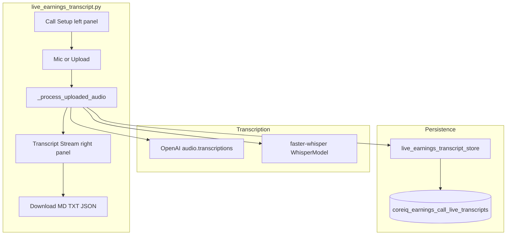
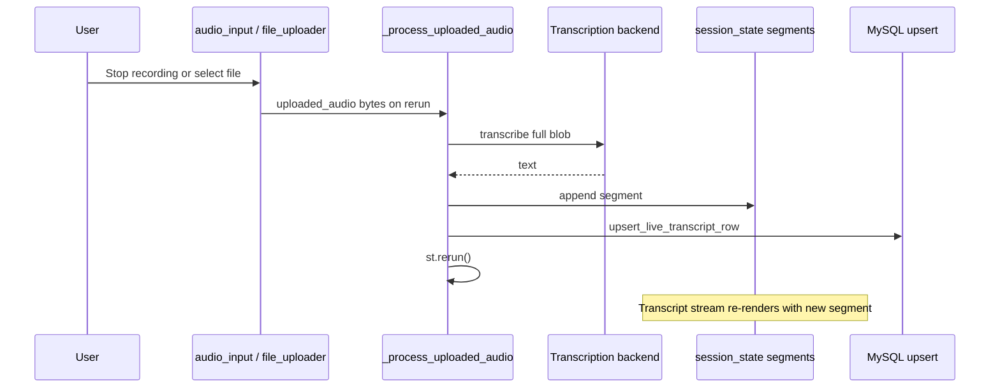
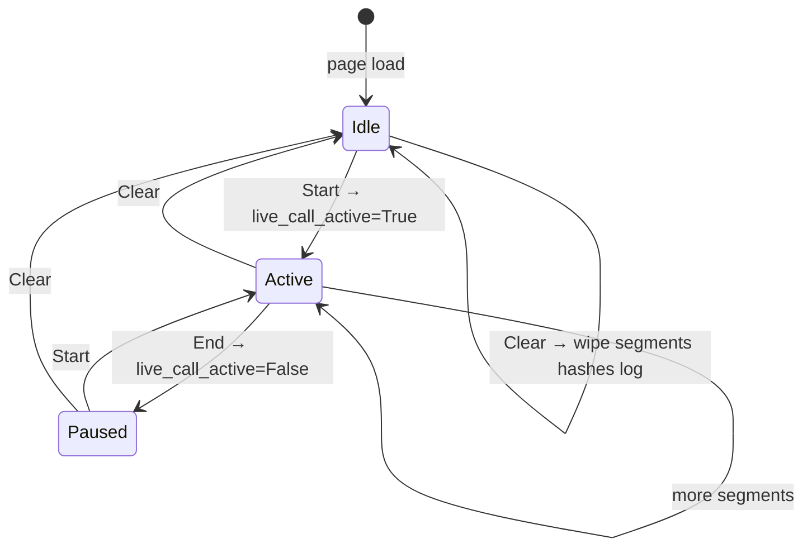
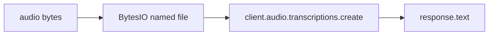
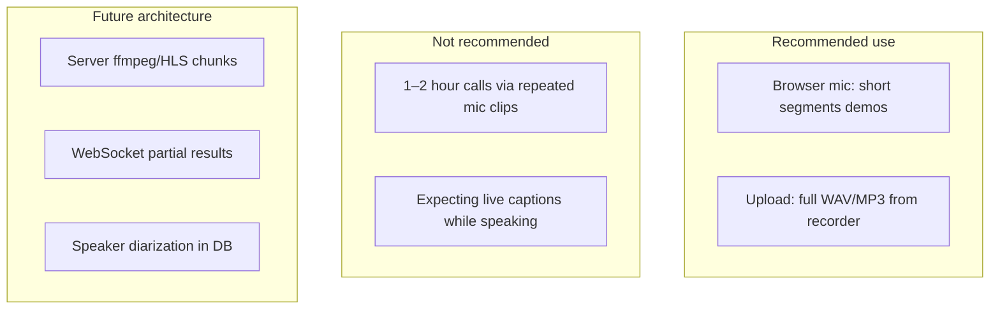
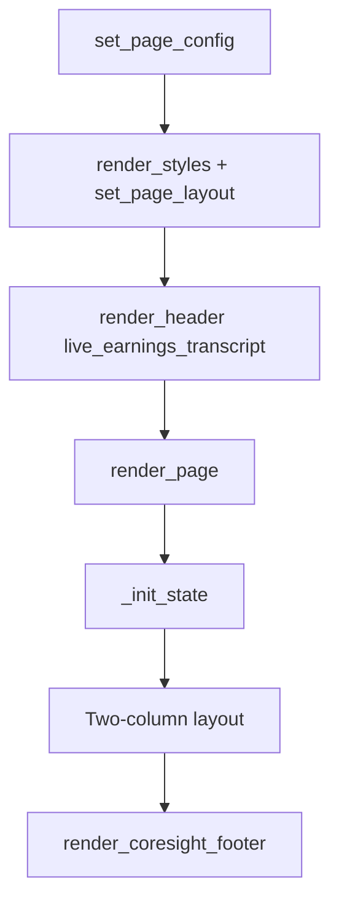

# Live Earnings Transcript — Technical Documentation

**Application:** Market Data Portal (MDP)  
**Page module:** `app/pages/live_earnings_transcript.py`  
**URL route:** `/live_earnings_transcript`  
**Registered in:** `app/main.py` as `("pages/live_earnings_transcript.py", "Live Transcript", "live_earnings_transcript", False)`

---

## 1. Purpose and scope

The Live Earnings Transcript page is a **chunked transcription workspace** for earnings calls. It:

- Accepts audio via **browser microphone** (`st.audio_input`) or **file upload**
- Transcribes each completed clip with **OpenAI API** or **local faster-whisper**
- Appends segments to an in-session transcript stream
- **Persists** structured JSON to MySQL (`coreiq_earnings_call_live_transcripts`)
- Exports **MD / TXT / JSON** downloads

**Important:** This is **not** a live captioning or polling UI. Text appears only **after** each audio blob finishes uploading and transcription completes. There is **no auto-refresh**, **no WebSocket**, and **no periodic `st.rerun` polling loop** for incoming transcript text.

---

## 2. Architecture overview

Page architecture: UI orchestration, data repositories, and external services for this feature.



---

## 3. Polling and refresh behavior

### 3.1 What the page does NOT do

| Expected "live" pattern | Actual behavior |
|-------------------------|-----------------|
| Poll DB for new transcript rows | **No** — only writes, no reads from DB on page |
| `st.fragment(run_every=…)` auto-refresh | **No** |
| Stream partial text while recording | **No** — mic must stop/upload first |
| Server-side HLS/ffmpeg chunking | **Planned** (documented in UI expander), not implemented |

### 3.2 What triggers UI updates



**Explicit reruns:**

1. `st.rerun()` after successful transcription
2. Start / End / Clear buttons
3. "Reload run" button (mic upload pickup)
4. Environment check / clear log buttons

**Timer display:** `live_call_started_at` updated on Start; elapsed shown in metrics but **does not** trigger periodic refresh.

---

## 4. Database: `coreiq_earnings_call_live_transcripts`

### 4.1 Table usage

Written exclusively via `app/data/live_earnings_transcript_store.py` → `upsert_live_transcript_row()`.

| Column | Value source |
|--------|----------------|
| `source` | `'live_streamlit'` (`LIVE_TRANSCRIPT_SOURCE`) |
| `ticker` | Normalized symbol (`normalize_ticker`) |
| `quarter` | Compact period e.g. `2024Q1` (`export_period_key`) |
| `year` | Fiscal year integer |
| `q` | 1–4 from `Q1`–`Q4` label |
| `transcript_text` | Plain text: segments joined `\n\n` |
| `has_transcript` | `1` if non-empty plain text |
| `title` | `{SYMBOL} {period} live transcript` (max 512) |
| `event_datetime_utc` | `NULL` (not set by Streamlit page) |
| `fetched_at_utc` | UTC naive timestamp |
| `raw_json` | Structured payload JSON |
| `raw_json_sha1` | SHA1 of `raw_json` |
| `last_error` | Cleared on successful upsert |

**Upsert key:** `(source, ticker, quarter)` — `ON DUPLICATE KEY UPDATE` refreshes all content fields.

### 4.2 `raw_json` schema

Built by `build_earnings_transcript_payload()`:

```json
{
  "symbol": "AAPL",
  "quarter": "2024Q1",
  "transcript": [
    {
      "speaker": "",
      "title": "",
      "content": "segment text",
      "sentiment": "0"
    }
  ]
}
```

Live page segments use keys: `id`, `recorded_at`, `company`, `quarter`, `fiscal_year`, `backend`, `model`, `text` in session — mapped to `content` in DB payload (speaker/title empty unless extended later).

---

## 5. Session state

Initialized in `_init_state()`:

| Key | Type | Purpose |
|-----|------|---------|
| `live_call_active` | `bool` | Timer pill "on" (not live captions) |
| `live_call_started_at` | `float` \| `None` | `time.time()` epoch for elapsed metric |
| `live_transcript_segments` | `List[Dict]` | All transcribed segments |
| `live_processed_audio_hashes` | `set` | SHA256 digest prefix dedupe |
| `live_audio_widget_version` | `int` | Bumps to reset audio widgets after success |
| `live_activity_log` | `List[str]` | Pipeline log (max 100 lines) |

### 5.1 Segment dict shape

```python
{
    "id": digest,           # sha256 hex[:20]
    "recorded_at": "YYYY-MM-DD HH:MM:SS",
    "company": "AAPL",
    "quarter": "Q1",
    "fiscal_year": 2024,
    "backend": "OpenAI API" | "Local faster-whisper",
    "model": "gpt-4o-transcribe" | "small.en" | ...,
    "text": "transcribed content",
}
```

---

## 6. Call setup (left panel)

### 6.1 Metadata inputs

| Field | Widget | Default |
|-------|--------|---------|
| Company / ticker | `st.text_input` | URL `ticker` or `active_ticker` |
| Quarter | `st.selectbox` Q1–Q4 | Q1 |
| Fiscal year | `st.number_input` | Current calendar year |
| Transcription backend | selectbox | `Local faster-whisper` |
| OpenAI model | conditional | `gpt-4o-transcribe` |
| faster-whisper model | conditional | `small.en` |
| Device | conditional | `auto` → cuda if torch else cpu |
| Compute type | conditional | `int8` |
| Language | text | `en` |
| Call context | textarea | Speaker/product hints for prompt |

### 6.2 Control buttons



| Button | Action |
|--------|--------|
| **Start** | `_start_call()` — sets active + started_at if missing; `st.rerun()` |
| **End** | `_end_call()` — active=False only |
| **Clear** | `_clear_call()` — full reset + increment widget version |

---

## 7. Audio ingestion

### 7.1 Modes

| Mode | Constant | Widget |
|------|----------|--------|
| Microphone | `INGESTION_MIC` | `st.audio_input` key `live_audio_input_{version}` |
| Upload | `INGESTION_UPLOAD` | `st.file_uploader` wav/mp3/m4a/webm/ogg/flac |

### 7.2 Processing gate

When `uploaded_audio is not None`:

1. Read bytes via `getvalue()`
2. Dedupe by `_audio_digest` (SHA256[:20])
3. Build domain prompt via `_build_transcription_prompt`
4. Run transcription inside `st.status` or `st.spinner`
5. On success: append segment, upsert DB, bump widget version, `st.rerun()`

**Note:** Transcription runs even if user clicked **End** before upload completed (comment in code — avoids dropping in-flight clips).

### 7.3 Format detection

`_guess_audio_suffix()` — extension from filename or magic bytes (RIFF/WAVE, OggS, ftyp → webm).

### 7.4 Large file warning

Clips > 40 MB log warning in pipeline (proxy/runtime limits).

---

## 8. Transcription backends

### 8.1 OpenAI API



- Requires `OPENAI_API_KEY`
- Models: `gpt-4o-transcribe`, `gpt-4o-mini-transcribe`, `whisper-1`
- Optional `language`, `prompt` kwargs

### 8.2 Local faster-whisper

```mermaid
%%{init: {'flowchart': {'nodeSpacing': 50, 'curve': 'basis'}}}%%
flowchart LR
    B[audio bytes] --> TMP[tempfile mkstemp]
    TMP --> WM[@st.cache_resource WhisperModel]
    WM --> TR[model.transcribe vad_filter=False]
    TR --> JOIN[join segment texts]
```

- `@st.cache_resource` on `_load_faster_whisper_model` — model loaded once per size/device/compute_type
- `vad_filter=False` — helps short browser chunks classified as non-speech
- Temp file required (BytesIO breaks webm format detection)

### 8.3 Shared prompt

`_build_transcription_prompt` instructs model to preserve financial terms, ticker symbols, KPIs, and optional company/quarter/context from UI.

---

## 9. Transcript stream (right panel)

### 9.1 Metrics bar

| Metric | Source |
|--------|--------|
| Segments | `len(segments)` |
| Words | sum of `_word_count` per segment |
| Elapsed | `_elapsed_label(live_call_started_at)` — static until rerun |

### 9.2 Segment rendering

`_render_transcript()` — HTML `.segment` blocks with meta:

`Segment NN | recorded_at | backend | model`

Empty state explains no live rolling transcript during recording.

### 9.3 Pipeline log

- Expander auto-expands if recent lines contain FAIL/EXCEPTION/ABORT/ERROR
- **Run environment check** — imports faster_whisper, av, OPENAI_API_KEY, `db_manager.health_check()`
- **Clear log** — resets `live_activity_log`

---

## 10. Export downloads

When `segments` non-empty:

| Button | Content | MIME |
|--------|---------|------|
| Download MD | `_transcript_markdown` | text/markdown |
| Download TXT | `_transcript_text` numbered blocks | text/plain |
| Download JSON | `build_earnings_transcript_payload` | application/json |

Filename base: `{TICKER}_{YYYYQn}_live_transcript`

---

## 11. Dependencies

| Module | Role |
|--------|------|
| `components.styles` | Layout, sidebar hide |
| `components.navigation` | Header, footer |
| `core.auth_manager` | `require_auth` optional at page level |
| `data.live_earnings_transcript_store` | DB upsert, payload builders |
| `core.database.db_manager` | Health check in env verify |
| `openai` | Optional OpenAI backend |
| `faster_whisper` | Optional local backend |
| `torch` | CUDA detection for device=auto |

---

## 12. CSS

`_render_css()` — `.live-wrap`, metrics grid, `.segment` left border brand red `#d62e2f`, responsive breakpoints at 900px.

Status pill:

- Inactive: "Timer off"
- Active: "Timer on (not live captions)" with green styling

---

## 13. Authentication and access control

| Check | Status |
|-------|--------|
| `require_auth(page="live_earnings_transcript")` | Optional at page level |
| `AccessControlManager.check_access` | Not used |
| DB writes | Any session user can upsert rows to `coreiq_earnings_call_live_transcripts` if the page is reachable |

Identity is established via `main.py` cookie hydrate. Enable `require_auth()` at page level if live-transcript ingestion should be restricted to authenticated analysts.

---

## 14. Error handling

| Failure | UX |
|---------|-----|
| Zero audio bytes | Warning + pipeline ABORT log |
| Duplicate digest | Info skip message |
| Empty model text | Warning with troubleshooting tips |
| DB upsert fail | Warning; segment kept in session |
| Exception in transcribe | `st.error` + traceback expander + `log_structured_error` |

`main()` top-level catch: generic refresh message.

---

## 15. Operational constraints (documented in UI)



---

## 16. Main entry flow

`main()` entry point: bootstrap UI, read session/query state, fetch data, and render widgets.



Header ticker: query `ticker` or `active_ticker` or fallback `"M"`.

---

## 17. Comparison with Earnings Calls page

| Aspect | `earnings_calls.py` | `live_earnings_transcript.py` |
|--------|---------------------|-------------------------------|
| Data source | Pre-ingested AV / Azure PDF | User audio → transcription |
| DB table | `coreiq_av_earnings_call_transcripts` | `coreiq_earnings_call_live_transcripts` |
| Display | Full historical transcript | Growing segment list |
| Search | Keyword / FULLTEXT | None |
| Polling | None | None |

---

## 18. Environment variables

| Variable | Required for |
|----------|----------------|
| `OPENAI_API_KEY` | OpenAI backend |
| `STG_DB_*` / `PROD_DB_*` | MySQL upsert (via app config) |

---

## 19. Related files

| File | Role |
|------|------|
| `app/data/live_earnings_transcript_store.py` | INSERT upsert SQL, JSON schema |
| `requirements.txt` | faster-whisper, openai optional deps |
| `app/core/database.py` | `db_manager.execute_insert` |

---

## 20. Testing checklist

1. Upload small WAV → segment appears, pipeline log shows byte count and timing
2. Repeat same file → duplicate skip message
3. **Clear** → segments and log empty
4. Run environment check → faster_whisper, av, MySQL lines
5. Verify row in `coreiq_earnings_call_live_transcripts` for ticker/quarter key
6. Download JSON matches `raw_json` column structure
