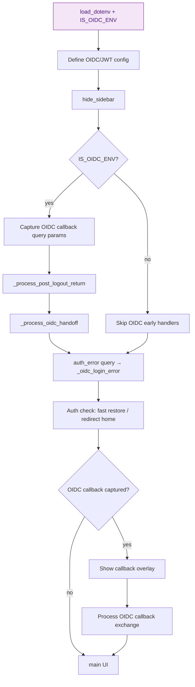
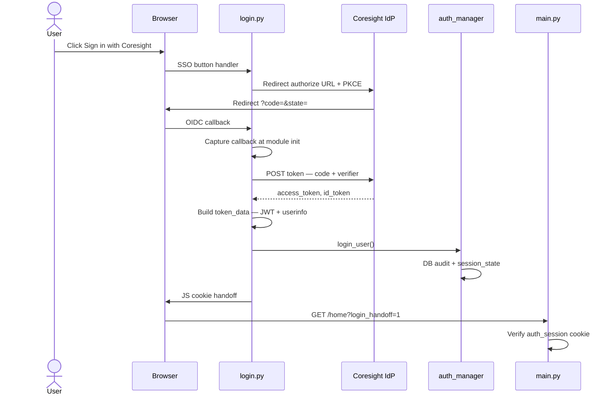
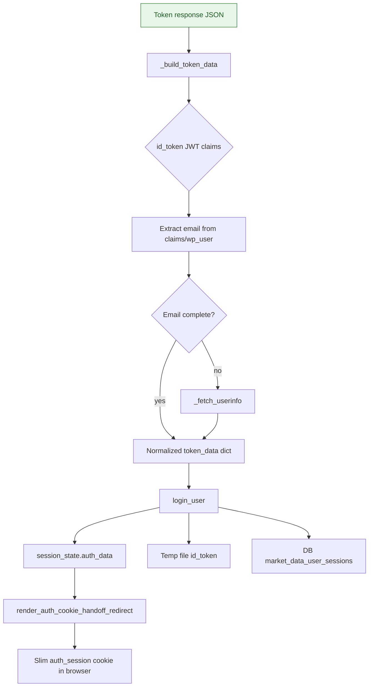

# Login Page — Technical Documentation

**Source:** `app/pages/login.py`  
**URL:** `/login` (default landing page)  
**Purpose:** Authenticate Coresight employees via OpenID Connect (OIDC) Single Sign-On (SSO) (all environments) or JSON Web Token (JWT) email/password (legacy production path when `IS_OIDC_ENV=False`)

---

## Overview

The login page is the application entry point and the OIDC authorization-code callback handler. It supports two authentication modes gated by `core.auth_environment.IS_OIDC_ENV`:

| Mode | When active | User experience |
|------|-------------|-----------------|
| **OIDC** | `IS_OIDC_ENV=True` (current default) | "Sign in with Coresight" → redirect to Identity Provider (IdP) → callback with `?code=` |
| **JWT** | `IS_OIDC_ENV=False` (legacy) | Email + password form → WordPress JWT endpoint |

**Domain restriction:** Only `@coresight.com` email addresses are accepted. Non-Coresight users are redirected to IdP logout to clear the SSO session.

The page performs substantial work at **module import time** (before `main()`): callback capture, handoff processing, fast cookie restore, and OIDC token exchange. The visible User Interface (UI) is only shown when the user is not already authenticated and no callback is in progress.

---

## URL / Route

| Route | Query params | Meaning |
|-------|--------------|---------|
| `/login` | — | Show login UI or fast-restore redirect |
| `/` (default) | Same as login | Default page in `main.py` |
| `/login` | `code`, `state` | OIDC authorization callback |
| `/login` | `error`, `error_description` | OIDC error callback |
| `/login` | `oidc_handoff=<key>` | Cross-host login token handoff |
| `/login` | `oidc_post_logout=<key>` | Post-logout return to original host |
| `/login` | `auth_error=cookie_write_failed` | Cookie handoff failure from `main.py` |

**Registered in `main.py`:** `st.Page("pages/login.py", title="Login", url_path="login", default=True)`

---

## Dependencies

### Python modules

| Import | Role |
|--------|------|
| `core.auth_environment` | `IS_OIDC_ENV`, `is_production_deploy()` |
| `core.auth_manager` | `login_user`, `is_authenticated`, `get_current_domain`, `get_or_create_auth_flow_id`, `get_auth_flow_id`, `render_auth_cookie_handoff_redirect`, `_auth_request_meta` |
| `components.styles.hide_sidebar` | Hide Streamlit sidebar/chrome |
| `utils.server_logger` | `log_structured_error`, `log_error`, `log_warning`, `log_timing` |
| `requests` | OIDC token exchange, userinfo, JWT auth POST |
| `streamlit` / `streamlit.components.v1` | UI, SSO button parent-frame navigation |
| `dotenv.load_dotenv` | Environment loading |

### HyperText Markup Language (HTML)/CSS components (`app/components/`)

Loaded via `load_html_component(filename)` from `APP_DIR / "components"`:

| File | Purpose |
|------|---------|
| `login_layout.css` | Page layout styles (wrapped in `<style>` if needed) |
| `login_header.html` | Fixed top header bar (Coresight branding, external links) |
| `login_footer.html` | Footer widgets (social, terms, contact) |

### External integrations

| Service | Endpoint / config | Usage |
|---------|-------------------|-------|
| Coresight OIDC IdP | `IDP_AUTHORIZE_URL` (default `https://coresight.com/csr-idp/authorize`) | SSO redirect |
| Coresight OIDC token | `IDP_TOKEN_URL` (default `.../csr-idp/token`) | Code → tokens |
| Coresight userinfo | `IDP_USERINFO_URL` (default `.../wp-json/csr-idp/v1/userinfo`) | Email/profile fallback |
| Coresight IdP logout | `https://coresight.com/csr-idp/logout/` | Access-denied cleanup |
| WordPress JWT (legacy) | `{wp-json}/jwt-auth/v1/token` via `AUTH_URL` / `AUTH_URL_PAID` | Production password login |
| Azure CDN | Coresight logo image URL in overlays | Loading spinners |

### OIDC configuration constants

| Constant | Value / source |
|----------|----------------|
| `OIDC_CLIENT_ID` | `market-data` |
| `OIDC_CLIENT_SECRET` | Hardcoded in source (also sent in token exchange) |
| `OIDC_REDIRECT_URI` | `marketdata.coresight.com` (prod) or `marketdata-stg.coresight.com` (non-prod) |
| `OIDC_SCOPE` | `openid profile email` (env override `OIDC_SCOPE`) |
| `OIDC_STATE_MAX_AGE_SECONDS` | 900 (15 min) |
| `OIDC_HANDOFF_MAX_AGE_SECONDS` | 180 |
| `POST_LOGIN_REDIRECT_DELAY_MS` | 300 |

---

## UI Components

### Layout structure (`main()`)

```
login_layout.css (global)
login_header.html (fixed header)
└── .content-wrapper.login-content
    └── st.columns [2, 5, 2]
        └── center column:
            ├── Welcome h4 + Portal h1
            ├── [OIDC] SSO section OR [JWT] form
            └── "Contact Us" trial access footer
login_footer.html
```

### OIDC mode UI elements

| Element | Type | Behavior |
|---------|------|----------|
| Welcome heading | HTML `<h4>` | "Welcome to the Coresight Research" |
| Portal title | HTML `<h1>` | "Coresight Market Data Portal" |
| Premium member copy | `st.markdown` | Markdown + link to coresight.com/research |
| **Sign in with Coresight** | HTML `<button id="csr-sso-btn">` | Click shows overlay, JS navigates to pre-built authorize URL |
| SSO overlay | `#csr-sso-overlay` | Logo + spinner + "Redirecting to SSO…" |
| `st.components.v1.html` | Hidden iframe script | Attaches click handler in **parent document** (bypasses iframe sandbox) |
| Error display | `st.error` | From `_oidc_login_error` session key (one-shot pop) |
| Trial access footer | HTML | Link to coresight.com/contact |

### JWT mode UI elements (legacy)

| Element | Streamlit widget | Key |
|---------|------------------|-----|
| Email | `st.text_input` | default key |
| Password | `st.text_input(type="password")` | default key |
| Log in button | `st.button` | `login_button` |
| Auth error | `st.error` | `auth_error` session (cleared after display) |

### Loading overlays (module-level)

| Overlay | Trigger | Message |
|---------|---------|---------|
| `_make_loading_overlay` | Fast restore, OIDC callback | "Loading your workspace…" / "Completing sign-in…" |
| Callback spinner | `__oidc_cb_captured` | "Completing sign-in…" |

### CSS side effects

- Hides `[data-testid="stHeaderActionElements"]`
- Full-width red SSO button (`#d32f2f` / hover `#b71c1c`)
- Hides `stCustomComponentV1` container (height-0 iframe)

---

## Session State Keys

### OIDC flow

| Key | Set when | Purpose |
|-----|----------|---------|
| `__oidc_cb_code` | Callback capture | Authorization code |
| `__oidc_cb_state` | Callback capture | Encoded state payload |
| `__oidc_cb_error` | Callback capture | IdP error code |
| `__oidc_cb_error_desc` | Callback capture | IdP error description |
| `__oidc_cb_captured` | Callback capture | Flag: callback params stored |
| `__oidc_processing_code` | Processing start | In-flight code guard |
| `__oidc_processing_started_at` | Processing start | Stale processing detection (>8s) |
| `__completed_oidc_code` | Success | Dedup processed codes |
| `__completed_oidc_token_data` | Success | Cached normalized token data |
| `__oidc_exchange_result` | Token exchange | Session cache of raw token response |
| `__oidc_denied_codes_dict` | Access denied | Map code → True; skip reprocessing |
| `__completed_oidc_handoff_key` | Host handoff | Dedup handoff keys |
| `__completed_oidc_handoff_token_data` | Host handoff | Cached handoff token data |
| `__failed_oidc_handoff_key` | Handoff failure | Prevent retry loops |
| `__completed_oidc_post_logout_key` | Post-logout return | Dedup post-logout redirects |
| `__force_prompt_login` | (pop on use) | Force `prompt=login` on authorize URL |
| `_oidc_login_error` | Handoff/cookie failures | User-visible error message |
| `__logout_guard` | After logout | Block auto-restore from cookie |
| `__just_logged_out` | (pop) | Sets logout guard |
| `auth_flow_id` | SSO journey | Correlation ID (via auth_manager) |

### JWT flow (legacy)

| Key | Purpose |
|-----|---------|
| `is_authenticating` | Button disabled + spinner label |
| `auth_error` | Display once then clear |

### Shared (post-login)

| Key | Purpose |
|-----|---------|
| `authenticated` | Set by `login_user` / fast restore |
| `auth_data` | Full auth payload |

---

## Data Layer

### Database

**Table:** `market_data_user_sessions`  
**Written by:** `auth_manager.login_user()` → `AuthManager._store_session_in_db()`  
**Not read during login page execution** — audit only.

```sql
INSERT INTO market_data_user_sessions
    (user_email, user_nicename, user_display_name, token, login_at, last_activity)
VALUES (:user_email, :user_nicename, :user_display_name, :token, NOW(), NOW())
```

### Ephemeral file caches (`/tmp`)

| Prefix | File pattern | TTL | Purpose |
|--------|--------------|-----|---------|
| `return` | `_oidc_return_{hash}.json` | `OIDC_RETURN_CONTEXT_MAX_AGE_SECONDS` | Original request origin for cross-host handoff |
| `handoff` | `_oidc_handoff_{hash}.json` | `OIDC_HANDOFF_MAX_AGE_SECONDS` | Token data for `oidc_handoff` query param |
| `logout_return` | `_oidc_logout_return_{hash}.json` | `OIDC_RETURN_CONTEXT_MAX_AGE_SECONDS` | Post-logout origin return |
| exchange | `_oidc_xch_{hash}.json` | 300s | Authorization code → token response dedup |

### In-process caches (OIDC only)

- `_oidc_exchange_lock` — threading lock (25s acquire timeout)
- `_oidc_exchange_cache` — dict keyed by authorization code

---

## Business Logic

### Module initialization order



### OIDC authorization URL (`_build_authorize_url`)

1. Generate `nonce`, `code_verifier` (`cv`), timestamp
2. Encode state: `{nonce, cv, ru: redirect_uri, ts, rk?: return_key}`
3. Stash request origin in `/tmp` if allowed (`_stash_return_origin`)
4. Proof Key for Code Exchange (PKCE): `code_challenge=cv`, `code_challenge_method=plain`
5. Optional `prompt=login` if `__force_prompt_login`

### OIDC callback processing

1. **Denied code check** — if code in `__oidc_denied_codes_dict`, meta-refresh to `/`
2. **Dedup** — if `__completed_oidc_code == code`, reuse cached token data
3. **In-progress** — if same code processing, wait/retry or complete from cache
4. **New code:**
   - Decode and validate state (`_decode_state_payload`, max age 900s)
   - `_exchange_code_for_tokens` with lock + triple cache (session, process, file)
   - `_build_token_data` — decode id_token JWT, optional userinfo fetch
   - `_maybe_redirect_oidc_handoff` if login started on different host (e.g. localhost)
   - `_complete_oidc_login`

### `_complete_oidc_login`

1. Reject non-`@coresight.com` → mark code denied, IdP logout redirect, `st.stop()`
2. `login_user(...)` with email, token, id_token, wp_user_id
3. On success: clear OIDC transient keys, `render_auth_cookie_handoff_redirect("/home")`, `st.stop()`

### Fast restore (already logged in)

Reads `auth_session` from `st.context.cookies` synchronously:

- Valid cookie → loading overlay → set session_state → `st.switch_page("pages/home.py")`
- Session_state auth without HTTP cookie → cookie handoff redirect
- OIDC: respects `__logout_guard` and `_auth_invalidated`

### Cross-host handoff

When OIDC redirect URI is STG but user started on `localhost`:

1. Login captures origin in state (`rk` key)
2. After token exchange on STG, if origins differ → write handoff file, redirect to `{origin}/?oidc_handoff={key}`
3. Origin host `_process_oidc_handoff` consumes file and completes login locally

### JWT authentication (legacy `_authenticate_user`)

Tries token endpoint with three payload encodings in order:

1. JSON wire with escaped quotes (`_send_json_wire`)
2. Raw JSON (`_send_json_raw`)
3. Form URL-encoded (`_send_form`)

Special handling for passwords containing quotes via `_escape_for_unslash`.

---

## Error Handling

| Scenario | User feedback | Log / recovery |
|----------|---------------|----------------|
| OIDC `error` query param | `st.error` with description | Clears callback session keys |
| Invalid/expired state | "Invalid login state" | Clears processing marker |
| Token exchange non-200 | `st.error` with payload | Retries file cache on `invalid_grant` |
| Exchange lock timeout | "Login timed out" | 25s lock wait |
| Missing PKCE verifier | "Missing PKCE verifier" | — |
| Unresolved email from tokens | Contact support message | — |
| Non-Coresight email | IdP logout redirect (no message) | Code marked denied |
| `login_user` failure | `result.error_message` | — |
| Handoff expired | `_oidc_login_error` | `__failed_oidc_handoff_key` |
| Cookie write failed | Via `auth_error` query | Set in `main.py` |
| Page render exception | "Something went wrong" | `log_structured_error` |
| JWT bad credentials | "Incorrect username or password" | — |
| JWT non-Coresight | "Access restricted to Coresight employees only" | — |

---

## Access Control List (ACL) / Permissions

The login page itself has **no page-level ACL** — it is public. Post-login, access to other pages may be gated by `coreiq_page_access_control` on individual pages.

**Hard gate at login:** `user_email.lower().endswith("@coresight.com")` in both OIDC and JWT paths.

---

## Flowcharts

### OIDC login (happy path)

Standard SSO journey from button click through token exchange to cookie handoff and server verification.



### User interaction — SSO button

The SSO button injects parent-frame JavaScript to navigate to the IdP authorize URL after a brief overlay.

```mermaid
flowchart LR
%%{init: {'flowchart': {'nodeSpacing': 50, 'rankSpacing': 60, 'curve': 'basis'}}}%%
    A[User clicks csr-sso-btn] --> B[Show csr-sso-overlay]
    B --> C[setTimeout 35ms]
    C --> D[Inject script in parent document]
    D --> E[window.location.href = authorize URL]
    E --> F[IdP login page]

    classDef ui fill:#e8f5e9,stroke:#2e7d32,color:#1b5e20
    classDef db fill:#fff3e0,stroke:#ef6c00,color:#e65100
    classDef ext fill:#f3e5f5,stroke:#7b1fa2,color:#4a148c
    classDef process fill:#e3f2fd,stroke:#1565c0,color:#0d47a1
    classDef start fill:#e8f5e9,stroke:#43a047,color:#1b5e20
    classDef error fill:#ffebee,stroke:#c62828,color:#b71c1c
    classDef decision fill:#fff8e1,stroke:#f9a825,color:#f57f17
    class A ui
```



### Data flow — token to session

Token response is normalized to user identity, written to session state and audit Database (DB), then slim cookie is set in the browser.



### Error handling — access denied

Non-@coresight.com emails trigger IdP logout and block reprocessing of the denied authorization code.

```mermaid
flowchart TD
%%{init: {'flowchart': {'nodeSpacing': 50, 'rankSpacing': 60, 'curve': 'basis'}}}%%
    A[_complete_oidc_login] --> B{@coresight.com?}
    B -->|no| C[Mark code in __oidc_denied_codes_dict]
    C --> D[Clear OIDC processing keys]
    D --> E[Build IdP logout URL + id_token_hint]
    E --> F[meta refresh to IdP logout]
    F --> G[st.stop]
    B -->|yes| H[login_user → handoff]

    classDef ui fill:#e8f5e9,stroke:#2e7d32,color:#1b5e20
    classDef db fill:#fff3e0,stroke:#ef6c00,color:#e65100
    classDef ext fill:#f3e5f5,stroke:#7b1fa2,color:#4a148c
    classDef process fill:#e3f2fd,stroke:#1565c0,color:#0d47a1
    classDef start fill:#e8f5e9,stroke:#43a047,color:#1b5e20
    classDef error fill:#ffebee,stroke:#c62828,color:#b71c1c
    classDef decision fill:#fff8e1,stroke:#f9a825,color:#f57f17
    class A ext
```

---

### Key code references

| Function / block | Lines (approx.) | Description |
|------------------|-----------------|-------------|
| OIDC config | 29–48 | IdP URLs, client, redirect |
| `_build_authorize_url` | 427–455 | SSO URL builder |
| `_exchange_code_for_tokens` | 469–563 | Locked token exchange |
| `_complete_oidc_login` | 672–769 | Domain check + login_user |
| Callback capture | 900–921 | Module-level query capture |
| Fast restore | 953–1087 | Cookie → home redirect |
| OIDC callback processing | 1109–1219 | Full exchange pipeline |
| `main()` UI | 1238–1501 | Visible login form |
| JWT `authenticate_user` | 863–893 | Legacy password auth |

---

### Related pages

| Page | Relationship |
|------|--------------|
| `main.py` | Default route, `login_handoff` verification, logout routing |
| `logout_bridge.py` | Clears session; may redirect back with `oidc_post_logout` |
| `home.py` | Post-login destination (`/home`) |

---

*Generated from source analysis of `app/pages/login.py`. MCP `code-review-graph` was unavailable; documentation based on direct file reads.*
