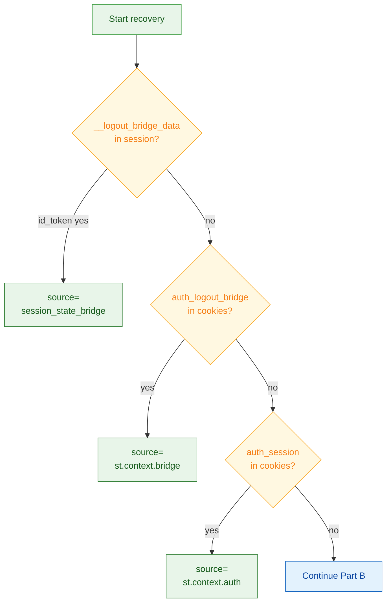
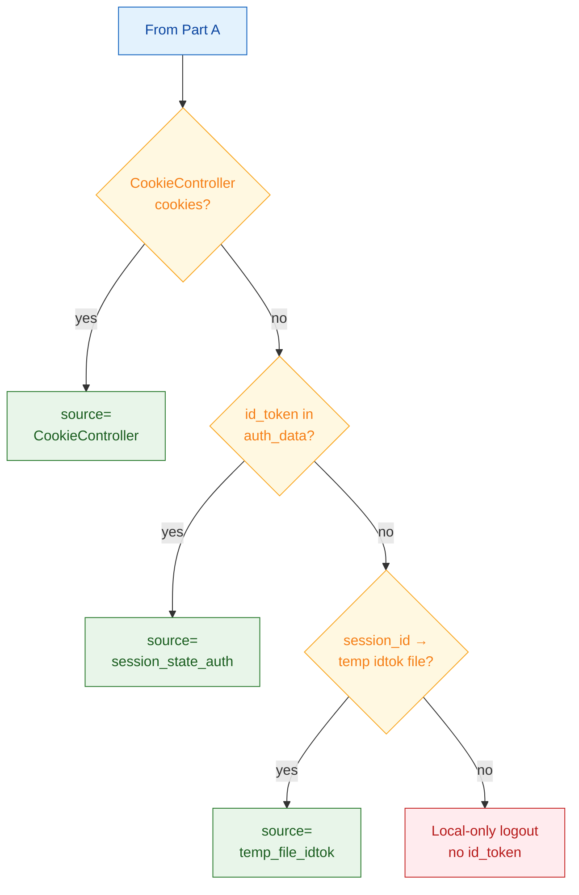
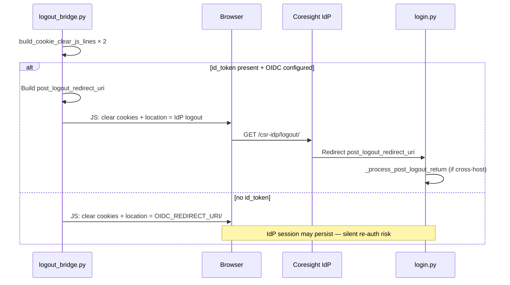
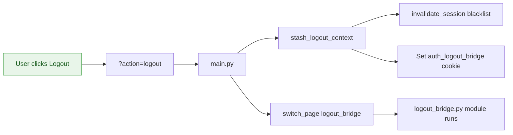
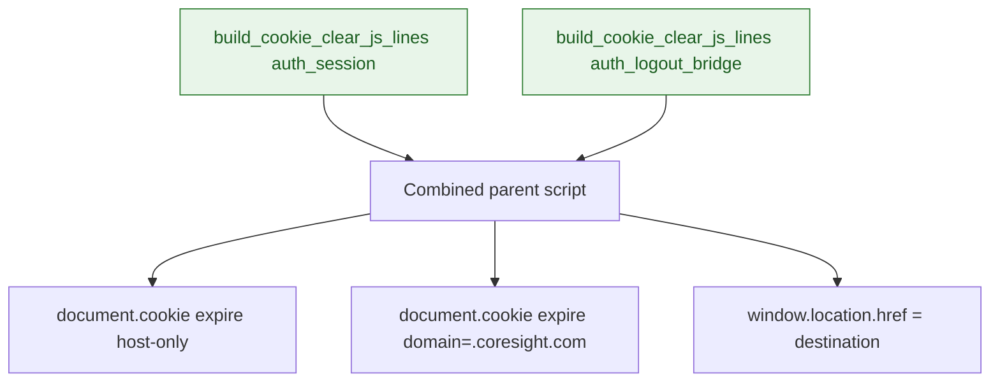
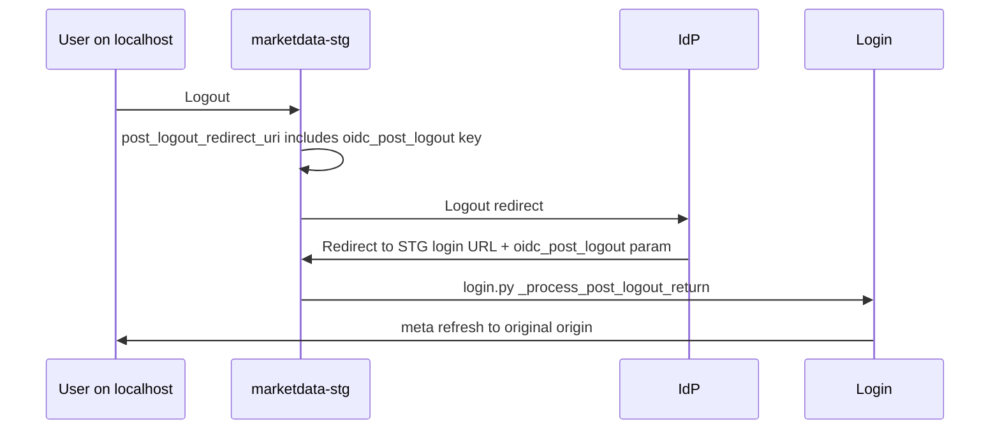

# Logout Bridge Page — Technical Documentation

**Source:** `app/pages/logout_bridge.py`  
**URL:** `/logout_bridge`  
**Purpose:** Invisible backend handler that performs **RP-initiated OpenID Connect (OIDC) logout** — recovers `id_token`, clears local auth state and cookies, then redirects the browser to the Coresight Identity Provider (IdP) logout endpoint.

> **Important:** This page intentionally has **minimal visible User Interface (UI)** ("Logging out…"). Do not add interactive Streamlit widgets here.

---

## Overview

When a user clicks **Logout** in the navigation header (`?action=logout`), `main.py` calls `stash_logout_context()` and routes to this page. `logout_bridge.py` then:

1. **Recovers** `id_token_hint` from multiple sources (before any clearing).
2. **Clears** server-side session state and sets `__just_logged_out`.
3. **Injects** parent-frame JavaScript to atomically clear browser cookies and navigate to either:
   - IdP logout URL (with `id_token_hint` + `post_logout_redirect_uri`), or
   - Login page (local-only fallback when no `id_token`).

The page exists because Streamlit 1.54+ strips `<script>` via DOMPurify in `st.html()`, and `components.html()` iframes cannot top-navigate reliably. The solution uses **parent-document script injection** (same pattern as login Single Sign-On (SSO) button and auth cookie handoff).

---

## URL / Route

| Route | Access |
|-------|--------|
| `/logout_bridge` | Via `st.switch_page` from `main.py` (`?action=logout`) or `auth_manager.logout()` |

**Not linked in navigation** — `st.navigation` registers it with `position="hidden"`.

**Query parameters:** None required; all context comes from session state and cookies.

---

## Dependencies

### Python modules

| Import | Role |
|--------|------|
| `core.auth_environment.is_production_deploy` | Chooses `OIDC_REDIRECT_URI` host |
| `core.auth_manager.build_cookie_clear_js_lines` | JS lines to expire cookies (host + `.coresight.com`) |
| `streamlit` / `streamlit.components.v1` | Minimal UI + iframe script injection |
| `utils.server_logger` | `log_warning`, `log_error`, `log_timing` |
| `dotenv.load_dotenv` | Environment loading |

### Constants (must match `login.py`)

| Constant | Value |
|----------|-------|
| `IDP_BASE_URL` | `https://coresight.com` |
| `OIDC_REDIRECT_URI` | `https://marketdata.coresight.com` (prod) or `https://marketdata-stg.coresight.com` (non-prod) |
| `OIDC_CLIENT_ID` | `market-data` |
| `COOKIE_NAME` | `auth_session` |
| `LOGOUT_BRIDGE_COOKIE_NAME` | `auth_logout_bridge` |
| `OIDC_RETURN_CONTEXT_MAX_AGE_SECONDS` | 900 (default) |
| `LOGOUT_COOKIE_SYNC_WAIT_MS` | 250 (defined, legacy) |
| `LOGOUT_COOKIE_SYNC_POLL_MS` | 50 (defined, legacy) |

### External integrations

| Integration | Usage |
|-------------|-------|
| Coresight IdP logout | `GET https://coresight.com/csr-idp/logout/?id_token_hint=...&post_logout_redirect_uri=...` |
| Browser cookies | Read then clear `auth_session`, `auth_logout_bridge` |
| `/tmp` id_token files | `_oidc_idtok_{hash}.json` fallback when slim cookie has no `id_token` |

---

## UI Components

### Visible UI (intentionally minimal)

| Element | Description |
|---------|-------------|
| Inline CSS | Hides `stHeader`, footer, `#MainMenu`, sidebar |
| Centered text | "Logging out…" — full viewport flex center |
| Background | White `#fff` |

**No** Streamlit buttons, forms, or sidebar. The page should appear as a brief transitional screen before browser navigation.

### Invisible machinery

| Element | Purpose |
|---------|---------|
| `streamlit.components.v1.html` | Zero-height iframe injecting parent-frame script |
| Parent script | Cookie clear lines + `window.location.href = dest` |

---

## Session State Keys

### Read

| Key | Purpose |
|-----|---------|
| `__logout_bridge_data` | Primary source: `{id_token, user_email, created_at}` from `stash_logout_context` |
| `auth_data` | Fallback `id_token` / `session_id` |
| `__logout_oidc_redirect_started` | Guard against duplicate renders |

### Written / cleared

| Key | Action |
|-----|--------|
| `__just_logged_out` | Set `True` — login page sets `__logout_guard` |
| `__logout_oidc_redirect_started` | Set when IdP redirect path taken |
| **Cleared:** | `auth_data`, `authenticated`, `_auth_invalidated`, `__completed_oidc_code`, `__completed_oidc_token_data`, `__oidc_cb_*`, `__oidc_exchange_result`, `__logout_bridge_data`, handoff keys, `__completed_oidc_post_logout_key` |

---

## Data Layer

### No database queries

This page performs **zero** MySQL operations. Session invalidation happens earlier in `stash_logout_context()` via temp-file blacklist (`invalidate_session` in `auth_manager.py`).

### Ephemeral files

| Operation | File | Purpose |
|-----------|------|---------|
| Write | `_oidc_logout_return_{hash}.json` | Stores origin for cross-host post-logout return |
| Read | `_oidc_idtok_{hash}.json` | Recover `id_token` from `session_id` (slim cookie deployments) |

**`_build_post_logout_redirect_uri` logic:**

- If current origin is allowed and differs from canonical `OIDC_REDIRECT_URI`, append `oidc_post_logout={return_key}` to redirect URI
- `login.py` `_process_post_logout_return()` consumes this and meta-refreshes browser back to original host

---

## Business Logic

### Step 1 — Recover `id_token` (priority order)

Logout bridge walks a fixed priority list of session, cookie, and temp-file sources to recover `id_token_hint`.

**Figure 1 Part A — Priority sources 1–3 (session & cookies)**



**Figure 1 Part B — Priority sources 4–6 (fallbacks)**



Logs `OIDC_LOGOUT_BRIDGE_RECOVER` timing with `source` and `has_id_token`.

### Step 2 — Clear session state

Sets `__just_logged_out` and pops all auth/OIDC keys (see table above).

### Step 3 — Atomic JS clear + redirect

Parent-frame JavaScript clears cookies atomically, then navigates to IdP logout or login fallback.



**IdP logout URL shape:**

```
https://coresight.com/csr-idp/logout/?id_token_hint={jwt}&post_logout_redirect_uri={encoded}
```

**Duplicate render guard:** If `__logout_oidc_redirect_started` already set at page entry → log and `st.stop()`.

**Fallback:** On JS injection exception → `st.switch_page("pages/login.py")`.

---

## Error Handling

| Scenario | Behavior |
|----------|----------|
| Duplicate page render | `st.stop()` immediately |
| `id_token` not found in any source | Local-only logout to login URL; warning logged |
| JS injection fails | `switch_page(login.py)` |
| Bridge cookie parse error | Log warning; try next source |
| Temp file read error | Log warning; continue to local-only |
| Unsafe post-logout origin | Ignored in `login.py` handler |

**Local-only logout implication:** Without `id_token_hint`, the IdP WordPress session is **not** destroyed. User may be silently re-authenticated on next SSO attempt. This is the documented safe fallback.

---

## Access Control List (ACL) / Permissions

No ACL check — any authenticated user reaching this page via `?action=logout` may log out. The page is not directly bookmarkable for harm: without prior `stash_logout_context`, `id_token` recovery may fail (local-only logout).

---

## Flowcharts

### Entry from navigation

User logout starts in navigation, stashes OIDC context in `main.py`, then routes to the invisible logout bridge page.



### Cookie clearing (JS)

Both auth cookies are expired on host-only and `.coresight.com` paths before redirect.



### Cross-host post-logout return

Cross-host logout stores return origin in a temp file; login page meta-refreshes the browser back to the original host.



---

### Key code references

| Section | Lines (approx.) |
|---------|-----------------|
| Module docstring / design rationale | 1–20 |
| Ephemeral cache helpers | 58–74 |
| Origin helpers | 77–149 |
| `_build_post_logout_redirect_uri` | 152–177 |
| Minimal UI CSS | 180–191 |
| Duplicate guard | 198–200 |
| Step 1 id_token recovery | 203–333 |
| Step 2 session clear | 347–359 |
| Step 3 JS clear + redirect | 361–422 |

---

### Related documentation

- [App Bootstrap and Auth](../00-infrastructure/00-app-bootstrap-and-auth.md) — `stash_logout_context`, logout routing in `main.py`
- [Login Page](./login.md) — `_process_post_logout_return`, OIDC callback

---

*Generated from source analysis of `app/pages/logout_bridge.py`.*
