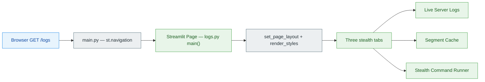
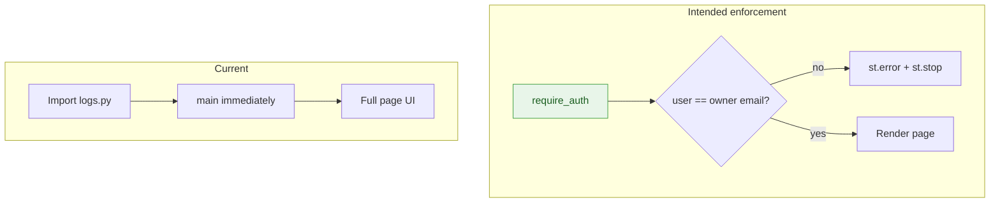
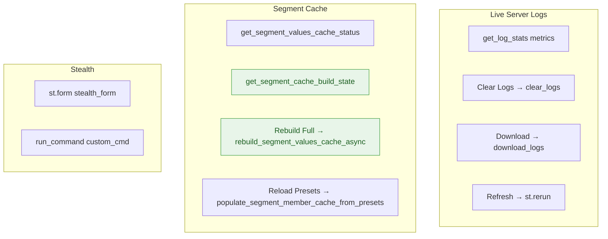
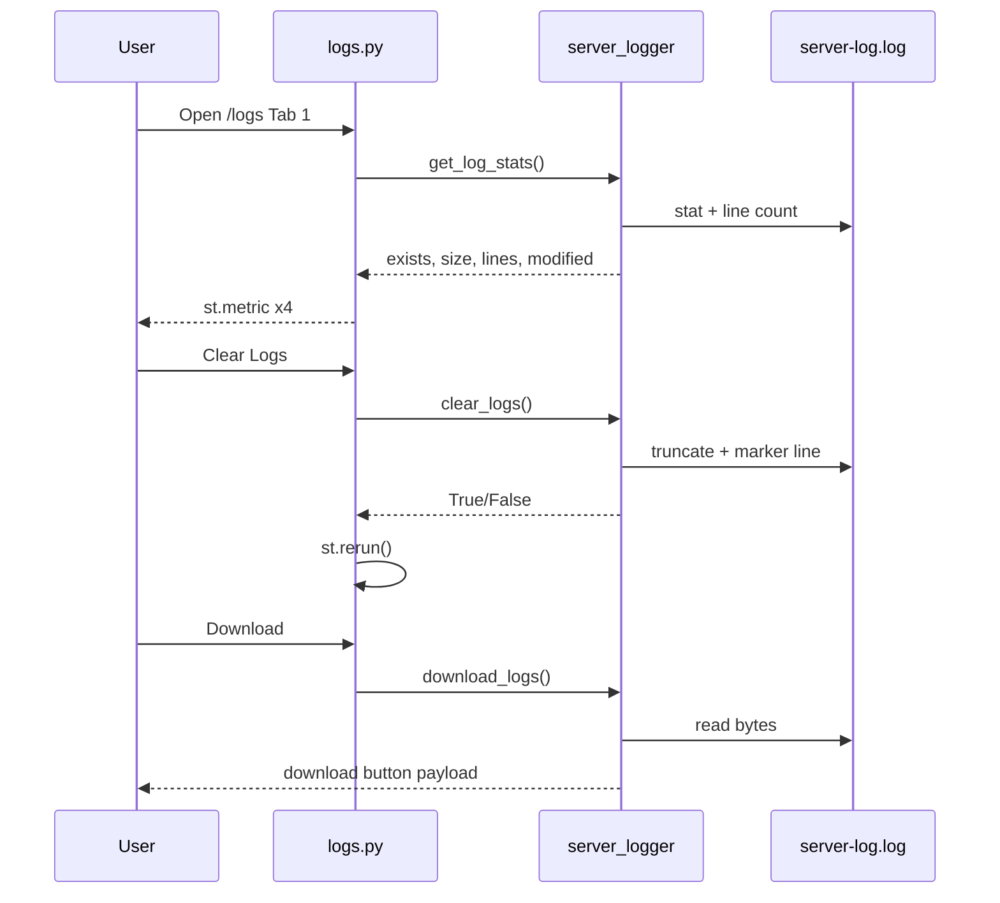
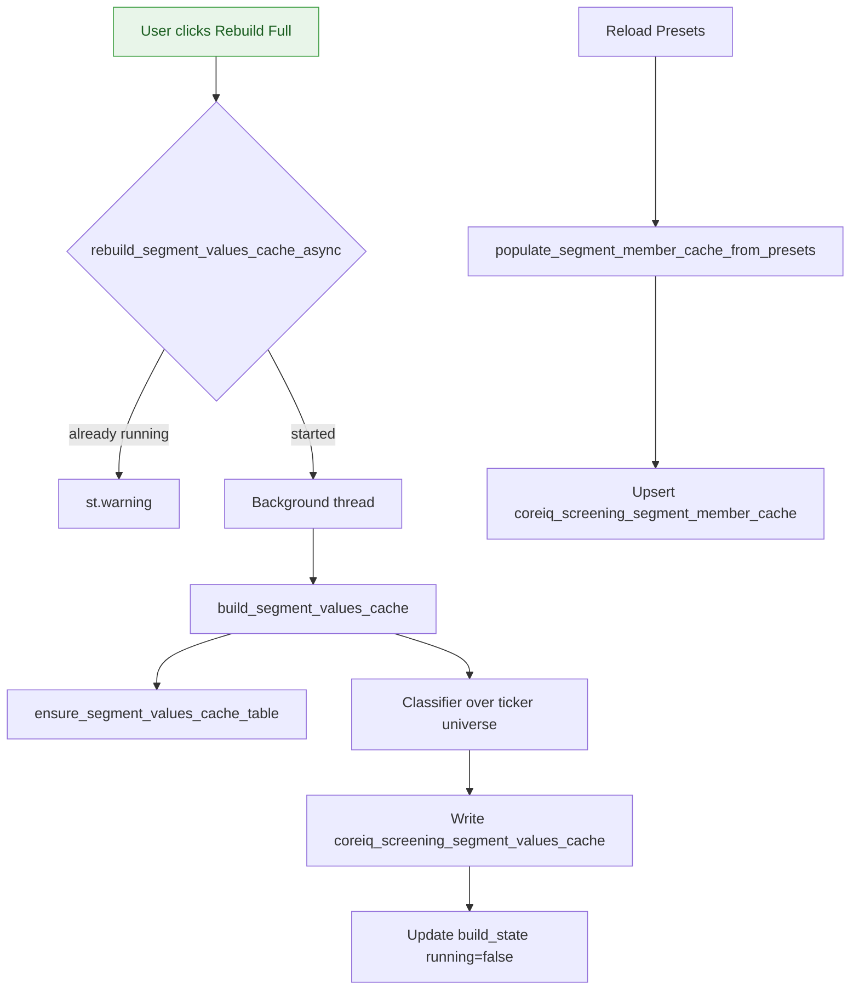
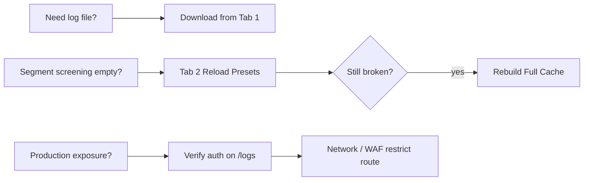
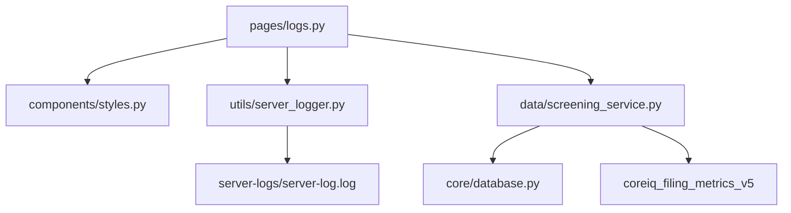

# Logs Page — Technical Documentation

**Application:** Market Data Portal (MDP)  
**Source:** `app/pages/logs.py`  
**URL path:** `/logs` (registered in `app/main.py` as hidden navigation)  
**Purpose:** Internal server log viewer, screening segment-cache admin panel, and stealth shell command runner.  
**Audience:** Platform operators and engineers with direct URL access.

---

## Overview

The Logs page is a **debug / operations** surface for the Market Data Portal (MDP). It is **not linked from the main navigation** (`st.navigation(..., position="hidden")` in `main.py`). Users reach it only by navigating directly to `/logs`.

**Security note:** This hidden route does not enforce page-level `require_auth()` or ACL. Restrict reachability via network controls and monitor access in production.

---

## Registration & Routing

| Property | Value |
|----------|-------|
| File | `app/pages/logs.py` |
| `st.Page` title | `Logs` |
| `url_path` | `logs` |
| Default page | No |
| Sidebar | Hidden via `hide_sidebar()` |

Hidden route: `/logs` is registered but not linked from navigation — direct URL access only.



---

## Authentication & Access Control

### Design

1. **`require_auth()`** — OpenID Connect (OIDC) session check at page entry.
2. **Owner-only gate** — restrict to authorized operator email or admin role.

### Current behavior

- No `AccessControlManager` check.
- No `UserRolesManager` check.
- Page renders for any visitor who can hit the Streamlit route.



**Recommendation for operators:** Enforce `require_auth()` and gate via `UserRolesManager.is_admin()` or a dedicated `coreiq_page_access_control` row for page `logs`.

---

## UI Structure

### Layout

- `set_page_layout(header_full_width=True, footer_full_width=True, body_padding="20px 40px", max_content_width="1400px")`
- `render_styles()` from `components.styles`
- Custom CSS hides the **third tab label** (stealth tab) — invisible 2–6px wide tab button aligned to the far right.

### Tabs

| Tab label (visible) | Internal key | Function |
|---------------------|--------------|----------|
| Live Server Logs | `tab1` | Metrics, clear/download/refresh log file |
| Segment Cache | `tab_seg` | Screening segment cache rebuild UI |
| `·` (stealth) | `tab2` | Shell command form |



---

## Tab 1 — Live Server Logs

### Dependencies

| Module | Symbols used |
|--------|----------------|
| `utils.server_logger` | `clear_logs`, `download_logs`, `get_log_stats`, `log_structured_error`, `SERVER_LOG_FILE` |
| `components.styles` | `hide_sidebar`, `render_styles`, `set_page_layout` |

### Log file location

- Directory: `server-logs/` (repo root, sibling of `app/`)
- File: `server-log.log` (`SERVER_LOG_FILE` in `server_logger.py`)

### Log format (written by `server_logger`)

```
{timestamp} | {level} | {rerun_id} | page={page} | {filename}:{funcName} | {message}
```

### User actions

| Button | Handler | Side effect |
|--------|---------|-------------|
| Clear Logs | `clear_logs()` | Stops queue listener, truncates file, writes IST "Logs cleared" marker |
| Download Logs | `st.download_button(data=download_logs())` | Full file bytes, filename `server-logs-{YYYYMMDD_HHMMSS}.log` |
| Refresh Now | `st.rerun()` | Re-reads stats |

### Metrics displayed

- File size (bytes)
- Total line count
- Last modified timestamp
- Static label `server-log.log`

**Note:** Tab 1 does **not** render inline log tail content in the current UI — only file metadata and actions. Full content is available via download. `get_log_content()` exists in `server_logger` but is unused on this page.



---

## Tab 2 — Segment Cache Manager

Powers the **Business / Geographical Segments** screening filter. Data lives in MySQL tables managed by `app/data/screening_service.py`.

### Imported functions

```python
from data.screening_service import (
    get_segment_values_cache_status,
    get_segment_cache_build_state,
    rebuild_segment_values_cache_async,
    populate_segment_member_cache_from_presets,
)
```

### Database tables

| Table | Role |
|-------|------|
| `coreiq_screening_segment_values_cache` | Per-ticker segment metric values for screening |
| `coreiq_screening_segment_member_cache` | Segment member label options (presets + derived) |

### Status metrics

- `total_rows` — rows in values cache
- `distinct_tickers` — unique tickers covered
- `business_rows_count` / `geographical_rows_count`
- `last_updated_timestamp`

### Build state (`st.session_state` + module lock)

Module-level `_segment_cache_build_state` dict:

| Key | Meaning |
|-----|---------|
| `running` | Background thread active |
| `progress` | Current step |
| `total` | Total steps (typically 2) |
| `last_error` | Last failure message |

### Actions

1. **Rebuild Full Segment Cache** — `rebuild_segment_values_cache_async()`  
   - Replays segment classifier over full company universe (~15–25 min).  
   - Uses `coreiq_filing_metrics_v5` (per UI help text).  
   - Non-blocking background thread.

2. **Reload Preset Members** — `populate_segment_member_cache_from_presets()`  
   - Instant upsert of hardcoded preset labels (~0 ms).



---

## Tab 3 — Stealth Command Runner

### UX

- Third tab styled invisible (1px font, transparent).
- `st.form("stealth_form")` with collapsed text input.
- Submit button hidden via CSS (`opacity: 0; height: 0`).
- Output: `st.code(stdout)` or `st.error(stderr)`.

### `run_command(cmd, timeout=15)`

- Executes `subprocess.run(cmd, shell=True, ...)`.
- Docstring claims only predefined commands — **implementation accepts any string** from the form.
- Timeout: 15 seconds default.

### Security implications

This is effectively a **remote shell** if the page is reachable without auth. Path traversal guards exist in `list_directory` / `read_file_safe` helpers, but those helpers are **not wired to the stealth tab** in current `main()`.

### Unused helpers (present in file)

The module defines extensive Linux diagnostics helpers not rendered in `main()`:

- `get_system_info`, `get_environment_vars`, `get_meminfo`, `get_cpu_info`
- `parse_df`, `parse_ps`, `parse_network_interfaces`, `parse_open_ports`
- `list_directory`, `read_file_safe`, `get_file_download_bytes`
- etc.

These appear to be legacy from a fuller "System Logs Explorer" and may be re-enabled in future tabs.

---

## Session State

| Key | Set by | Purpose |
|-----|--------|---------|
| `stealth_cmd` | Streamlit widget | Last command typed in stealth form |

No other `st.session_state` keys are used on this page. Segment build state lives in **module globals** inside `screening_service.py`, not Streamlit session.

---

## Error Handling

All major blocks wrap `try/except` and call:

```python
log_structured_error(e, page="logs", component="...", operation="...")
```

Components: `module_init`, `run_command`, `main`, `_render_log_body`, etc.

---

## Related Documentation

- Shell commands reference: `docs/market-data-commands.md` (cited in stealth tab comment)
- Logging standard: `CLAUDE.md` → Logging section
- Segment cache implementation: `app/data/screening_service.py` (~lines 1530–2900)

---

## Operational Checklist



---

## File Dependency Graph



---

*Generated from source analysis of the Market Data Portal (MDP). Last reviewed against codebase structure as of project documentation pass.*
