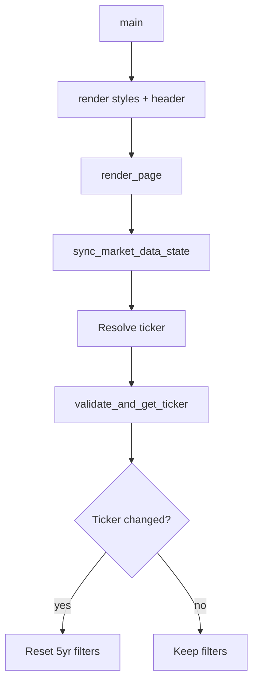
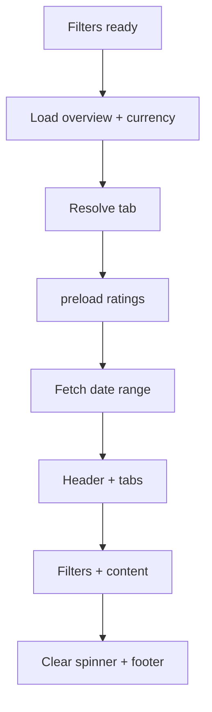
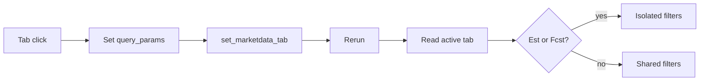
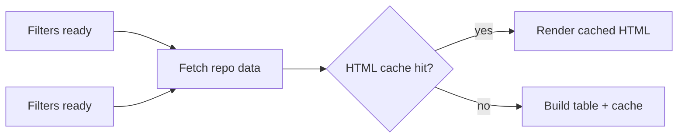
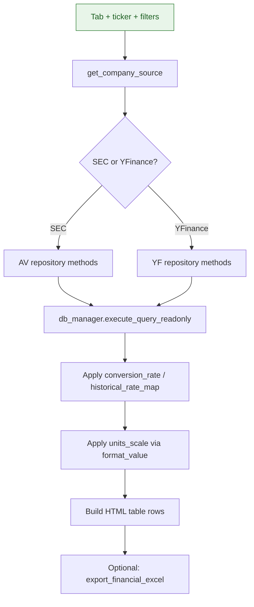
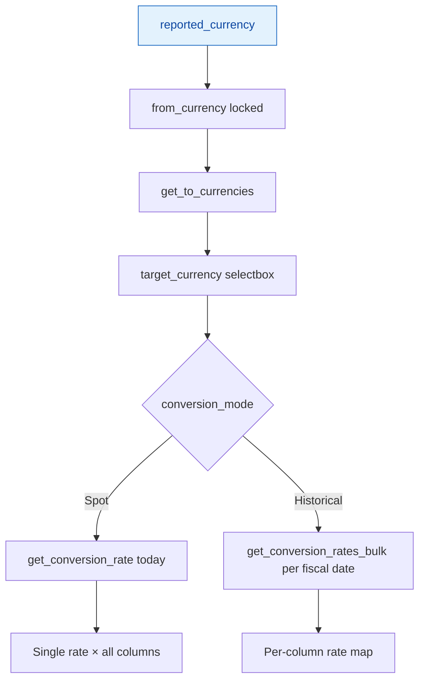
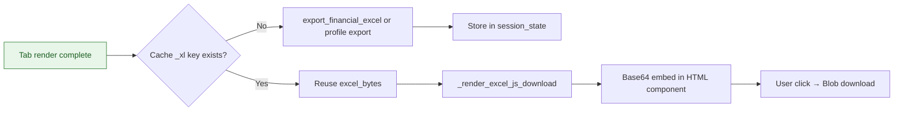
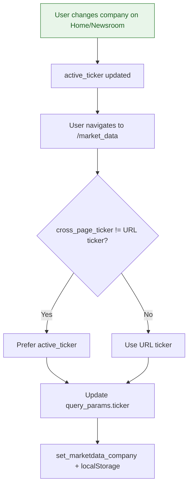

# Market Data — Technical Documentation

**Application:** Market Data Portal (MDP)  
**Page module:** `app/pages/market_data.py` (~4,163 lines)  
**URL route:** `/market_data`  
**Registered in:** `app/main.py` as `st.Page("pages/market_data.py", title="Market Data", url_path="market_data")`

---

## 1. Overview

The Market Data page is the primary financial dashboard for a single selected company. It presents ten sub-tabs covering company profile, financial statements, derived metrics, analyst estimates, model forecasts, segment breakdowns, and supplemental ratings/store data. The User Interface (UI) is built to match Coresight Figma specifications: custom HyperText Markup Language (HTML) tables (not `st.dataframe`), Roboto typography, Coresight red (`#D62E2F`), sticky first columns, and client-side Excel downloads.

**Data sources:** Pre-ingested Alpha Vantage (AV) and Yahoo Finance (YF) tables in Azure MySQL. No live vendor Application Programming Interface (API) calls. Routing between U.S. Securities and Exchange Commission (SEC) and YFinance sources is automatic per ticker via `source_router.get_company_source()`.

**Key design choices:**

- Shared filter bar (period, dates, sort, currency, units) across most financial tabs
- Isolated filter state for **Estimates** and **Forecasting** tabs (do not overwrite shared date/period keys)
- Session-state HTML caching keyed by ticker + filter inputs (avoids re-rendering large tables on reruns)
- Cross-page ticker sync via `active_ticker` and browser `localStorage` (`sip_app_state`)
- Financial values stored in Database (DB) at **millions** scale; User Interface (UI) applies units scaling (mm / bn / k) and FX conversion

### URL and deep-linking

**Base URL:** `/market_data`

**Query parameters:**

| Parameter | Values | Purpose |
|-----------|--------|---------|
| `ticker` | Valid symbol (e.g. `WMT`, `ADS.DE`) | Selected company; validated against `coreiq_companies` |
| `tab` | See tab keys below | Active sub-tab; default `company_profile` |
| `period_type` | `Annual` \| `Quarterly` | Shared period type (financial tabs) |
| `start_dt` | ISO date `YYYY-MM-DD` | Shared range start |
| `end_dt` | ISO date `YYYY-MM-DD` | Shared range end |
| `sort_ord` | `Earliest` \| `Latest` | Column sort direction |
| `to_curr` | Currency code | Target display currency |
| `conv_mode` | `Today's Spot Rate` \| `Historical` | FX conversion mode |
| `units_sel` | `Millions (mm)` \| `Billions (bn)` \| `Thousands (k)` | Display units |

**Example deep link:** `/market_data?ticker=WMT&tab=income_statement&period_type=Annual&start_dt=2020-01-01&end_dt=2025-12-31`

**Tab keys** (`render_tabs` in `app/components/toolbar.py`):

| Key | UI label | Dev badge |
|-----|----------|-----------|
| `company_profile` | Company Profile | — |
| `key_stats` | Key Stats | — |
| `income_statement` | Income Statement | — |
| `balance_sheet` | Balance Sheet | — |
| `cash_flow` | Cash Flow | — |
| `ratios` | Ratios | — |
| `estimates` | Estimates | — |
| `forecasting` | Forecasting | Testing in Progress |
| `segment_data` | Segment | Testing in Progress |
| `ratings` | Additional Data | Testing in Progress |

---

## 2. Dependencies

### 2.1 Page entry and layout

| Module | Symbols | Role |
|--------|---------|------|
| `components.styles` | `hide_sidebar`, `render_styles`, `set_page_layout`, `COLORS` | Global CSS tokens; sidebar hidden at import |
| `components.navigation` | `render_header`, `render_coresight_footer`, `render_company_header` | App header, company selector, footer |
| `components.toolbar` | `render_tabs` | 10-tab navigation row |
| `components.companyProfile` | `get_company_css`, `get_profile_rows_for_excel`, `render_info_table`, `render_business_description`, `render_reference_table` | Company Profile tab HTML + Excel rows |

### 2.2 Core infrastructure

| Module | Symbols | Role |
|--------|---------|------|
| `core.auth_manager` | `require_auth` | Optional at page level; identity via `main.py` cookie hydrate |
| `core.database` | `db_manager` | Inline Structured Query Language (SQL) (period-type probe, shares/market cap for Excel) |

### 2.3 Data layer

| Module | Symbols | Role |
|--------|---------|------|
| `data.repository` | `CompanyOverviewRepository`, `IncomeStatementRepository`, `BalanceSheetRepository`, `CashFlowRepository`, `KeyStatsRepository`, `RatiosRepository`, `AnalystEstimatesRepository`, `ModelForecastsRepository`, `ForexRepository`, `StockQuoteRepository`, `SegmentDataRepository`, `RatingsDataRepository`, `ExecutiveCompensationRepository`, `preload_edgartools_ratings` | All financial data access |
| `data.source_router` | `get_company_source` | SEC vs YFinance routing (lazy import in page) |
| `data.models` | `IncomeStatementData`, `Company`, `BalanceSheetData` | Imported but unused in page logic |

### 2.4 Utilities

| Module | Symbols | Role |
|--------|---------|------|
| `utils.server_logger` | `log_structured_error`, `log_error`, `new_rerun_id`, `log_timing` | Structured logging + perf timings |
| `utils.local_storage` | `get/set_marketdata_company`, `get/set_marketdata_tab`, `get/set_marketdata_date_range` | Python-side persistence |
| `utils.local_storage_manager` | `sync_market_data_state`, `save_market_data_state`, `get/set_persistent_state` | Browser `localStorage` sync |
| `utils.ticker_utils` | `validate_and_get_ticker`, `DEFAULT_FALLBACK_TICKER` | Ticker validation |
| `utils.constants` | `get_currency_symbol`, `format_currency_display`, `SEGMENT_METRIC_GROUPS` | Currency display; segment metric order |
| `utils.excel_export` | `export_financial_excel`, `export_company_profile_simple_excel` | XLSX generation |

### 2.5 Third-party

- **Streamlit** — UI, `st.cache_data`, query params, widgets
- **Plotly** (`plotly.graph_objects`, `make_subplots`) — stock price chart on Company Profile
- **concurrent.futures.ThreadPoolExecutor** — parallel DB fetches

---

## 3. UI Components

### 3.1 Page chrome

```
main()
  ├── new_rerun_id("market_data")
  ├── render_styles() + set_page_layout()
  ├── render_header(current_page="market_data")
  ├── render_page()
  └── render_coresight_footer()
```

`render_company_header()` (inside `render_page`) provides:

- Page title: **CORESIGHT MARKET DATA**
- Company `selectbox` (`key="company_selector_header"`)
- **Company Documents** button → `/company_filings?ticker=…`
- Writes `active_ticker` and `selected_ticker_market_data` on change

### 3.2 Tab bar (`render_tabs`)

- Two-row layout: dev labels above Segment / Additional Data / Forecasting
- Active tab: red underline + bold label (HTML)
- Inactive tabs: `st.button` with `on_click` → sets `st.query_params["tab"]` + `set_marketdata_tab()`
- Horizontal rule separator below tabs

### 3.3 Filter row (financial tabs)

Rendered for all tabs **except** Company Profile. Hidden or simplified per tab:

| Control | Widget key | Notes |
|---------|------------|-------|
| Period Type | `period_type_select_shared` | Hidden for Ratings, Forecasting; disabled when only one type available |
| Start Date | `start_dt_shared` | Month labels from `available_dates` |
| End Date | `end_dt_shared` | |
| Sort | `sort_order_select_shared` | Earliest / Latest |
| Conversion | `conversion_mode_select` | Hidden for Ratios, Ratings |
| From Currency | `currency_from_unified` | Locked to reported currency |
| To Currency | `currency_to_unified` | Reported + `ForexRepository.get_to_currencies()` |
| Units | `units_select` | Millions / Billions / Thousands |

**Estimates / Forecasting:** use isolated keys `_period_type_isolated_{tab}` and `_dr_isolated_{tab}_{annual|quarterly}` so filter changes do not mutate shared `date_range_market_data_shared` or URL date params.

### 3.4 Tables

Custom HTML `<table class="data-table">` via `st.html()`:

- Sticky first column (line item labels)
- Indent levels for subtotals (Income Statement, Balance Sheet, Cash Flow)
- Bold subtotals, grey separators, underlines per Figma (`is_bold_row`, `has_grey_separator`, `has_underline`, `get_indent_level`)
- `format_value()` applies conversion rate, units scale, comma formatting

### 3.5 Charts

**Company Profile only:** `render_stock_quote()` → Plotly line chart, ~60 months (`days=1825`) of daily close prices from `StockQuoteRepository.get_price_history()`. Left panel: quote metrics (close, open, change, 52-week H/L, market cap, shares, dividend yield).

### 3.6 Key Stats badges

Columns may be tagged **A** (Actual), **E** (Estimate), **F** (Forecast) with legend. Forecast columns link to `/forecasting?ticker=…`.

### 3.7 Excel export

`_render_excel_js_download(excel_bytes, filename, label)` — client-side Blob download via `streamlit.components.v1.html`. Bypasses Streamlit `/media/` (fails on some proxied deployments). Uses Material Symbols "table" icon and Coresight red border styling.

Per-tab builders:

- Financial tabs → `export_financial_excel()`
- Company Profile → `export_company_profile_simple_excel()` (profile + price history + shares/market cap + compensation)

### 3.8 Loading indicator

`_tab_loading_hint` spinner shown at start of `render_page()`; cleared after tab content renders.

---

## 4. Session State

### 4.1 Ticker and navigation

| Key | Purpose |
|-----|---------|
| `active_ticker` | Cross-page company sync |
| `selected_ticker_market_data` | Page-local ticker |
| `selected_tab_market_data` | Active tab |
| `_prev_ticker_market_data` | Detect company change → reset filters |
| `_prev_rendered_tab` | Tab change logging |
| `_md_run_counter` | Rerun storm guard (>80 logs warning) |

### 4.2 Shared filters

| Key | Purpose |
|-----|---------|
| `date_range_market_data_shared` | `(start_iso, end_iso)` tuple |
| `sort_order_market_data_shared` | `Earliest` / `Latest` |
| `period_type_market_data_shared` | `Annual` / `Quarterly` |
| `target_currency`, `from_currency` | FX display |
| `conversion_mode` | Spot vs Historical |
| `units` | Millions / Billions / Thousands |
| `start_dt_shared`, `end_dt_shared` | Date widget keys |
| `sort_order_select_shared`, `period_type_select_shared` | Widget keys |
| `conversion_mode_select`, `currency_from_unified`, `currency_to_unified`, `units_select` | Widget keys |

### 4.3 localStorage race-fix keys (`_mdlc_*`)

`_mdlc_date_range`, `_mdlc_sort`, `_mdlc_period`, `_mdlc_conv`, `_mdlc_from_curr`, `_mdlc_to_curr`, `_mdlc_units` — prevent browser hydration from overwriting in-flight widget state.

### 4.4 Isolated state (Estimates / Forecasting)

| Pattern | Purpose |
|---------|---------|
| `_period_type_isolated_{tab}` | Period without affecting shared state |
| `_dr_isolated_{tab}_{annual\|quarterly}` | Date range per tab + period |

### 4.5 HTML cache keys (input-hash suffixes)

| Pattern | Tab |
|---------|-----|
| `_bs_html_{…}` | Balance Sheet |
| `_cf_html_{…}` | Cash Flow |
| `_seg_html_{…}` | Segment |
| `_ratings_html_{…}` | Ratings |
| `_is_html_{…}` (+ `_xl`) | Income Statement |
| `_ks_html_v2_{…}` (+ `_xl`) | Key Stats |
| `_ratios_html_{…}` (+ `_notes`, `_xl`) | Ratios |
| `_est_html_{…}` | Estimates |
| `_fcst_html_v3_{…}` | Forecasting |

---

## 5. Data Layer

### 5.1 Source routing (`app/data/source_router.py`)

```python
@st.cache_data(ttl=600)
def get_company_source(ticker: str) -> Optional[Literal['SEC', 'YFinance']]
```

- Reads `coreiq_companies.source`
- Composite tickers (`TSCO.L`) resolved via `exchange_acronym`
- Returns `None` if company not found

### 5.2 Repository classes used

| Repository | Primary methods |
|------------|-----------------|
| `CompanyOverviewRepository` | `get_company_overview(ticker)` |
| `IncomeStatementRepository` | `get_date_range`, `get_available_dates`, `get_income_statement_data`, `get_reported_currency` |
| `BalanceSheetRepository` | `get_date_range`, `get_available_dates`, `get_balance_sheet_data` |
| `CashFlowRepository` | `get_date_range`, `get_available_dates`, `get_cash_flow_data` |
| `KeyStatsRepository` | `get_date_range`, `get_available_dates`, `get_key_stats_data` |
| `RatiosRepository` | `get_date_range`, `get_available_dates`, `get_ratios_data` |
| `AnalystEstimatesRepository` | `get_date_range`, `get_available_dates`, `get_estimates_data` |
| `ModelForecastsRepository` | `get_date_range`, `get_available_dates`, `get_forecasts_data` |
| `ForexRepository` | `get_conversion_rate`, `get_to_currencies`, `get_conversion_rates_bulk` |
| `SegmentDataRepository` | `has_quarterly_segment_data`, `get_date_range`, `get_available_dates`, `get_segment_data` |
| `RatingsDataRepository` | `get_date_range`, `get_available_dates`, `get_ratings_data` |
| `StockQuoteRepository` | `get_latest_quote`, `get_price_history`, `get_overview_data` |
| `ExecutiveCompensationRepository` | `get_sec_latest_compensation`, `get_yf_latest_compensation` |

**Read path:** `db_manager.execute_query_readonly` (AUTOCOMMIT read engine, ~1 RTT on Azure).

**SEC pattern:** Wide tables with `report_type`, `fiscal_date_ending`, column-per-metric.

**YFinance pattern:** Long-format pivoted with `MAX(CASE WHEN line_item = …)` grouped by `period_end`, `frequency`. Composite tickers use `yf_symbol` column.

### 5.3 Database tables

| Table | Usage |
|-------|--------|
| `coreiq_companies` | Source routing; `name_coresight` for display |
| `coreiq_av_company_overview` | SEC company profile |
| `coreiq_yf_company_overview` | Yahoo Finance (YF) company profile + officers JSON |
| `coreiq_av_financials_income_statement` | SEC income + key stats base |
| `coreiq_yf_financials_income_statement` | YF income |
| `coreiq_av_financials_balance_sheet` | SEC balance sheet |
| `coreiq_yf_financials_balance_sheet` | YF balance sheet |
| `coreiq_av_financials_cash_flow` | SEC cash flow |
| `coreiq_yf_financials_cash_flow` | YF cash flow |
| `coreiq_av_financials_earnings_estimates` | SEC analyst estimates |
| `coreiq_yf_financials_earnings_estimates` | YF analyst estimates |
| `coreiq_model_forecasts` | Revenue model forecasts |
| `coreiq_av_forex_daily` | FX conversion rates |
| `coreiq_av_time_series_daily` / `coreiq_yf_time_series_daily` | Stock prices |
| `coreiq_av_shares_outstanding` / `coreiq_yf_shares_outstanding` | Shares for market cap Excel |
| `coreiq_filing_metrics_v5` | Segment data + ratings/store counts |
| `coreiq_executives_compensation` | SEC executive compensation |

---

## 6. Business Logic

### 6.1 Ticker resolution priority

1. `active_ticker` if newer than URL (cross-page change)
2. URL `ticker` query param
3. `active_ticker` alone
4. `localStorage` stored ticker
5. `DEFAULT_FALLBACK_TICKER`

On change: reset to **5-year default** date window, Annual period, reported currency 1:1; clear legacy per-tab keys and HTML caches (new hash inputs).

### 6.2 Period type fallback

`get_available_period_types(ticker, tab)` probes DB for annual/quarterly availability. If user selects Quarterly but tab has no quarterly data → `st.info()` + snap to Annual.

### 6.3 Currency conversion

- **From:** locked to `reported_currency` (`_get_company_reported_currency`, cached 300s)
- **To:** reported + forex list
- **Spot:** single `ForexRepository.get_conversion_rate(from, to, today)`
- **Historical:** `get_conversion_rates_bulk(from, to, fiscal_dates_in_range)` applied per column

### 6.4 Units scaling

| UI label | `units_scale` |
|----------|---------------|
| Millions (mm) | 1.0 |
| Billions (bn) | 0.001 |
| Thousands (k) | 1000.0 |

DB values are in millions; `format_value(value, conversion_rate, units_scale)` multiplies before display.

### 6.5 Tab-specific behavior

| Tab | Filters | Data source | Export |
|-----|---------|-------------|--------|
| Company Profile | None | Overview + quote + compensation | Profile Excel |
| Income Statement | Full shared | `IncomeStatementRepository` | Yes |
| Balance Sheet | Full shared | `BalanceSheetRepository` | Yes |
| Cash Flow | Full shared | `CashFlowRepository` | Yes |
| Key Stats | Full shared | `KeyStatsRepository` (A/E/F columns) | Yes |
| Ratios | Dates + sort only | `RatiosRepository` (derived) | Yes |
| Estimates | Isolated dates/period | `AnalystEstimatesRepository` | Yes |
| Forecasting | Isolated; annual only | `ModelForecastsRepository` | Yes |
| Segment | Full shared | `SegmentDataRepository` + `SEGMENT_METRIC_GROUPS` | Yes |
| Additional Data | Annual only; no FX | `RatingsDataRepository` + edgartools preload | Yes |

### 6.6 Background preload

`preload_edgartools_ratings(ticker)` runs on every tab load (daemon thread, in-process cache). Powers ratings/store/square-footage sections without blocking UI.

---

## 7. Structured Query Language (SQL) and Query Patterns

### 7.1 Period type probe (in-page)

```sql
SELECT DISTINCT frequency  -- or report_type for SEC
FROM coreiq_{yf|av}_financials_{table}
WHERE ticker = :ticker  -- or yf_symbol for composite
  AND frequency IN ('annual', 'quarterly')
```

### 7.2 Shares + market cap (Company Profile Excel)

```sql
SELECT s.report_date, s.shares_outstanding_basic, s.shares_outstanding_diluted, ts.close
FROM coreiq_av_shares_outstanding s
INNER JOIN coreiq_av_time_series_daily ts
  ON ts.ticker = s.ticker AND ts.day_date = s.report_date
WHERE s.ticker = :ticker
ORDER BY s.report_date DESC
```

### 7.3 Repository patterns

- **Latest row per period:** `ROW_NUMBER() OVER (PARTITION BY ticker ORDER BY date DESC)`
- **Income statement optimization:** `_fetch_all_annual_rows` cached once, reused for date range + table body
- **Segment metrics:** `coreiq_filing_metrics_v5` with edgartools fallback in `SegmentDataRepository`
- **Access Control List (ACL):** Not applied in SQL on this page (no row-level user filter)

---

## 8. Caching

| Layer | Mechanism | TTL |
|-------|-----------|-----|
| Page | `@st.cache_data` on `_get_company_reported_currency`, `get_available_period_types` | 300s |
| Repositories | `@st.cache_data` on overview, statement fetches, key stats, ratios, estimates, ratings | 300–600s |
| `source_router` | `get_company_source` | 600s |
| Session state | HTML + Excel bytes keyed by inputs | Until inputs change |
| Module | `_edgar_ratings_cache` + preload daemon | In-process |
| Company map | `CompanyRepository.get_companies_map()` | Repository cache |

**Performance:** `_timings` dict + `log_timing("PAGE_*")` summary every `render_page()` run.

---

## 9. Error Handling

| Pattern | Behavior |
|---------|----------|
| Per-section `try/except` | `log_structured_error(e, page="market_data", component=…, operation=…)` |
| User messages | `st.error()`, `st.info("No extracted data available…")` |
| `main()` top-level | `log_exception` + re-raise |
| Defensive defaults | Currency → `"USD"`, conversion → `1.0`, format → `"-"` |
| Rerun guard | `_md_run_counter > 80` → log possible rerun storm |
| Best-effort | `preload_edgartools_ratings` swallows errors; exec comp section fails silently |

Invalid ticker → `validate_and_get_ticker` falls back to default; `st.stop()` only if default also fails.

---

## 10. Access Control List (ACL)

| Mechanism | Status |
|-----------|--------|
| `require_auth(page="market_data")` | Optional at page level |
| `AccessControlManager.check_access("market_data", …)` | **Not called** |
| `main.py` OpenID Connect (OIDC) bootstrap | Session required for background warmups; `pg.run()` unconditional |

**Effective access:** Portal-wide OIDC session (cookie + `auth_manager.is_authenticated()`). No per-page permission levels on Market Data.

---

## 11. Flowcharts

### 11.1 Page load

End-to-end user journeys on this page, from load through interaction to data fetch.

**Page load — Part A: Bootstrap & ticker resolution**



**Page load — Part B: Data fetch & tab render**



### 11.2 Tab switching

**Tab switch — Part A: Navigation & filter routing**



**Tab switch — Part B: Data fetch & HTML cache**



### 11.3 Data fetch (financial tab)



### 11.4 Currency conversion



### 11.5 Excel export



### 11.6 Cross-page ticker sync



---

## 12. Feature reference by tab

### 12.1 Company Profile

- Info table, business description, executive compensation (SEC multi-column or YF total pay)
- Stock quote metrics + Plotly 60-month chart
- "For Reference" expander (`render_reference_table`)
- No date/currency filters

### 12.2 Income Statement

- Figma row styling: bold subtotals, grey separators, underlines, indent levels
- Full filter bar + Excel export

### 12.3 Balance Sheet / Cash Flow

- `render_balance_sheet()` / `render_cash_flow()` with indent levels 0/1/2
- Full filter bar + Excel export

### 12.4 Key Stats

- Combined actuals, analyst estimates, model forecast columns
- A/E/F legend; links to `/forecasting`

### 12.5 Ratios

- Derived from cached statements; assumption notes in `st.caption`
- No currency/units filters

### 12.6 Estimates

- Analyst consensus sections; EPS in reported currency; revenue converted
- Isolated filter state

### 12.7 Forecasting

- Ensemble + scenario bands from `coreiq_model_forecasts`
- Annual only; link to full `/forecasting` page

### 12.8 Segment

- Business + Geographic tables from filing metrics
- Metrics per `SEGMENT_METRIC_GROUPS`: Revenues, Operating Profit, Assets, D&A, CapEx
- Quarterly only if `has_quarterly_segment_data`

### 12.9 Additional Data (Ratings)

- Credit ratings (S&P, Moody's, Fitch), store counts, stores by country, square footage
- Annual only; background edgartools preload

---

### Related pages

| Page | Link |
|------|------|
| Company Filings | `/company_filings?ticker=…` (Company Documents button) |
| Forecasting (full) | `/forecasting?ticker=…` (from Key Stats / Forecasting tab) |
| Home / Newsroom | Share `active_ticker` for company sync |

---

*Generated from source analysis of `app/pages/market_data.py` and traced dependencies. Last reviewed against codebase structure as of project documentation pass.*
