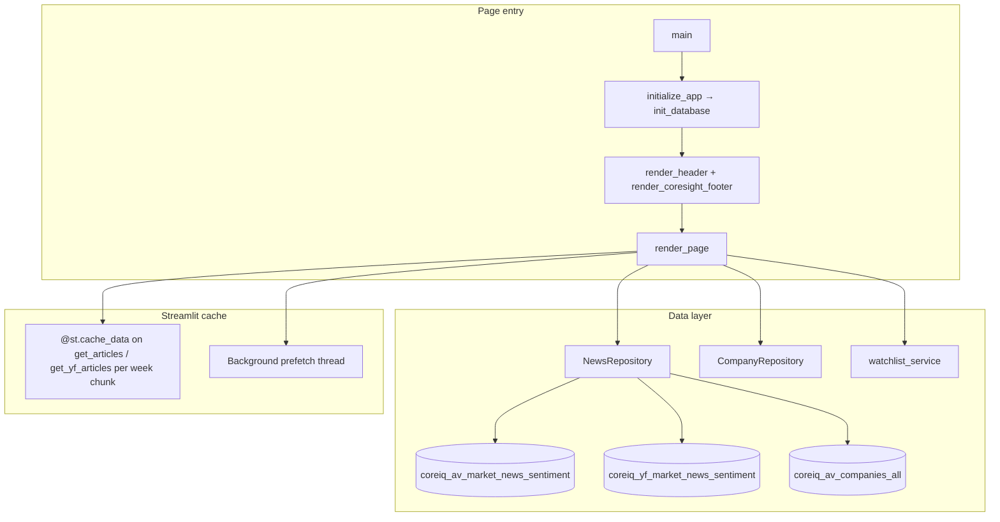
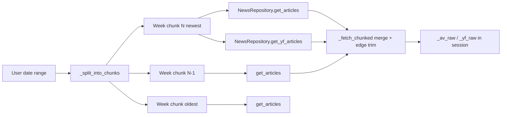
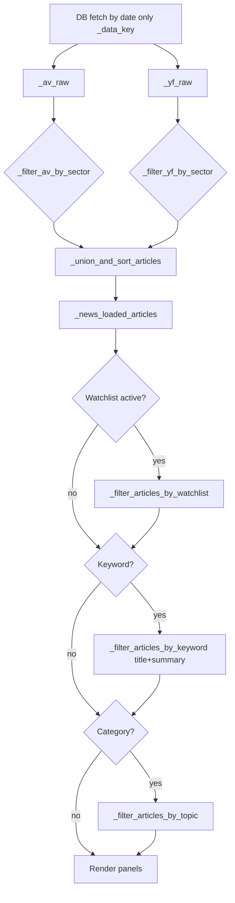
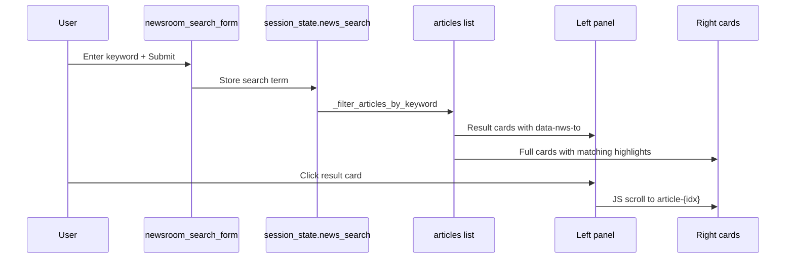
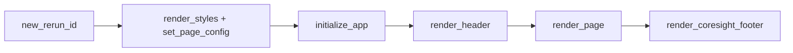

# Newsroom — Technical Documentation

**Application:** Market Data Portal (MDP)  
**Page module:** `app/pages/newsroom.py`  
**URL route:** `/newsroom`  
**Registered in:** `app/main.py` as `("pages/newsroom.py", "Newsroom", "newsroom", False)`

---

## 1. Purpose and scope

The Newsroom page is a financial news feed that merges **Alpha Vantage (AV)** and **Yahoo Finance (YF)** pre-ingested news from MySQL. It provides:

- Date-bounded article loading with **progressive week-chunked fetching** and background cache warming
- **Sentiment** display per tagged company (relevance, label, score)
- **Sector**, **category (topic)**, **watchlist**, and **keyword** filters
- A two-column UI: left **search results panel**, right **news cards**
- Cross-links from tagged companies to `/market_data?ticker=…`

The page does **not** call AV/YF APIs live; all data is read from `coreiq_*` tables.

---

## 2. Architecture overview

Page architecture: UI orchestration, data repositories, and external services for this feature.



---

## 3. Dependencies

| Import | Role |
|--------|------|
| `components.styles` | `hide_sidebar`, `set_page_layout`, `render_styles`, design tokens |
| `components.navigation` | `render_header`, `render_coresight_footer` |
| `core.auth_manager` | `require_auth`, `get_current_user` |
| `core.database` | `init_database` |
| `data.models` | `NewsArticle`, `TickerSentiment` |
| `data.repository` | `NewsRepository`, `CompanyRepository`, `_format_company_name` |
| `data.watchlist_service` | `get_user_watchlists`, `get_watchlist_companies` |
| `utils.constants` | `NEWS_TOPIC_LABELS`, `get_topic_display_label`, `merge_yf_topics` |
| `utils.server_logger` | `PageLoadTracker`, `new_rerun_id`, `log_structured_error`, `log_warning` |

---

## 4. Database tables

### 4.1 `coreiq_av_market_news_sentiment`

Primary AV news store. Key columns used by `NewsRepository.get_articles()`:

| Column | Usage |
|--------|--------|
| `id` | Article identity |
| `title`, `summary`, `url` | Card rendering |
| `source`, `source_domain` | Header metadata |
| `time_published_utc` | Sorting, date filters, relative time |
| `overall_sentiment_score`, `overall_sentiment_label` | Article-level sentiment (model field; cards emphasize per-ticker sentiment) |
| `ticker_sentiment_json` | Parsed into `List[TickerSentiment]` |
| `topics_json` | Category filter (`topics[].topic`) |
| `ticker` | Row-level ticker (deduped in repository) |
| `banner_image`, `category_within_source` | Model fields |

**Indexes (documented in repository):** `ft_av_title` (FULLTEXT on title), `idx_av_time_id`, `idx_ticker_time`, etc.

**Dedup rule:** Same title → one card; `ticker_sentiment` merged across duplicate rows (highest relevance per ticker wins).

### 4.2 `coreiq_yf_market_news_sentiment`

YF news store. `NewsRepository.get_yf_articles()`:

- Groups by `news_id` server-side (`GROUP BY` + `GROUP_CONCAT` tickers)
- No sector on rows — sector filter treats YF as **"Unknown Sector"** only
- Topics may include YF-only keys merged into `NEWS_TOPIC_LABELS` via `get_yf_topic_keys()`

### 4.3 Supporting tables

| Table | Usage |
|-------|--------|
| `coreiq_companies` | `CompanyRepository.get_companies_map()` → display names on cards |
| `coreiq_av_companies_all` | Sector dropdown + `_filter_av_by_sector()` via `get_ticker_sector_map()` |
| `coreiq_watchlists`, `coreiq_watchlist_companies` | Watchlist filter |

---

## 5. Data models

### 5.1 `NewsArticle` (`app/data/models.py`)

```python
@dataclass
class NewsArticle:
    id: int
    title: str
    summary: str
    url: str
    source: str
    source_domain: str
    time_published: datetime
    time_published_raw: str
    overall_sentiment_score: float
    overall_sentiment_label: str
    banner_image: Optional[str]
    ticker_sentiment: List[TickerSentiment]
    topics: List[Dict[str, str]]
    category_within_source: str
    source_tag: str = 'av'  # 'av' | 'yf'
```

Properties: `formatted_date`, `company_tickers`.

### 5.2 `TickerSentiment`

| Field | UI usage |
|-------|----------|
| `ticker` | Link to market data (if in company map) |
| `relevance_score` | Tooltip: "Relevance: X%" |
| `ticker_sentiment_label` | Tooltip: Bullish/Bearish/Neutral |
| `ticker_sentiment_score` | Tooltip numeric score |
| `display_name` | Optional YF override |

---

## 6. Progressive loading engine

### 6.1 Week-chunk strategy

`_CHUNK_DAYS = 7`, `_MAX_WORKERS = 6`, `_BG_PREFETCH_WEEKS = 4`.

`_split_into_chunks(d_from, d_to)` aligns chunks to **ISO weeks (Mon–Sun)** so `@st.cache_data` keys are stable across overlapping date ranges.



### 6.2 `_fetch_chunked`

- Single chunk: direct repository calls (no thread pool)
- Multiple chunks: `ThreadPoolExecutor` with up to `_MAX_WORKERS` workers; each chunk fires AV + YF in parallel
- **Edge trim:** Full-week chunks may extend past `date_from`/`date_to`; articles outside range filtered after merge
- DB fetch is always **unfiltered** (`sector=None`, `company_ticker=None`) for cache stability; sector/sort applied client-side

### 6.3 Background prefetch

`_spawn_background_prefetch()` starts a **daemon thread** after initial load:

- Prefetches `_BG_PREFETCH_WEEKS` (4) of weeks **before** `date_from`
- Only calls `@st.cache_data` repository methods (no `st.session_state`)
- Failures are logged; user gets cold query on expand

### 6.4 First-load behavior

1. Default session: last 7 days until `get_news_date_range()` returns
2. `ThreadPoolExecutor` prefetches date bounds + chunked fetch in parallel
3. Spinner shown while `_chunked_future` resolves

---

## 7. Filter pipeline

News articles pass through date chunking, ticker/sector filters, and deduplication before render.



### 7.1 Two-level cache keys

| Key | Triggers |
|-----|----------|
| `_news_data_key` | `date_from\|date_to` — DB refetch |
| `_news_view_key` | adds `query_sector\|sort_ascending` — client re-filter only |

### 7.2 Filter widgets (filter row)

| Widget | Session / state | DB vs client |
|--------|-----------------|--------------|
| Search (form) | `news_search`, `news_search_input` | Client: title + summary, min 2 chars |
| From / To | `date_from`, `date_to` | DB via chunk fetch |
| Sort | `news_sort_order` → `sort_ascending` | Client re-sort |
| Sector | `news_selected_sector` | Client on `_av_raw` / `_yf_raw` |
| Category | `news_selected_category`, URL `category`, `localStorage` | Client on `topics` |
| Watchlist | `news_active_watchlist_id`, `news_watchlist_filter` | Client ticker match |

**Company filter:** Commented out in UI; `query_company` always `None`.

### 7.3 Sector semantics

| Sector value | AV behavior | YF behavior |
|--------------|-------------|-------------|
| `All` | All articles | All articles |
| `"Unknown Sector"` | Empty (AV always has sectors) | All YF articles |
| `"None"` | Tickers with no/null sector | Empty |
| Named sector | Match via `get_ticker_sector_map()` | Empty |

### 7.4 Category (topic)

- `NEWS_TOPIC_LABELS` from `utils.constants` + dynamic YF keys
- `uncategorized` → articles with empty `topics` (typical YF)
- Persisted: `localStorage.newsroom_category` + optional URL `?category=`

### 7.5 Watchlist filtering

- `_news_ticker_variants`: exact ticker + base before `.` (e.g. `ADS.DE` → `ADS`)
- Match if any `article.ticker_sentiment` ticker variant intersects watchlist
- **Limitation:** Cannot disambiguate same symbol across companies (documented in code)

---

## 8. Search

### 8.1 Keyword search flow

Keyword search queries MySQL FULLTEXT indexes and merges AV + YFinance article sources.



- Search is **in-memory** over loaded date range (not DB FULLTEXT on newsroom page)
- `_highlight_keyword`: wraps each word in `<mark>` (brand red theme)
- Left panel shows count: `N matching (in M most recent)`
- Scroll handler: `streamlit.components.v1.html` installs click listener on `[data-nws-to]`

### 8.2 AV repository keyword path (when used)

`NewsRepository.get_articles(keyword=…)` supports FULLTEXT (`USE_AV_FULLTEXT=1`) or LIKE; newsroom passes `keyword=None` to DB and filters client-side.

---

## 9. News cards UI

### 9.1 `render_news_card`

HTML structure per article:

1. **Header:** source (left), formatted date + relative time (right)
2. **Title:** external link (`article.url`), stretched-link pattern for card hover
3. **Summary:** indented body text
4. **Tagged companies:** links to `/market_data?ticker=` with sentiment tooltips

### 9.2 Chunked rendering

`_render_cards_chunked(articles, company_map, keyword, chunk_size=500)` — multiple `st.markdown` calls to avoid single huge HTML blob.

### 9.3 CSS

`get_news_css()` — Figma-aligned Roboto/Montserrat, `content-visibility: auto` on cards, left sidebar scroll styling, keyword `<mark>` styling.

### 9.4 Layout

- Columns: `[0.25, 0.75]`, height `900px` bordered containers
- Footer caption: loaded count and day span; shows `matching / loaded` when keyword active

---

## 10. Sentiment display

Sentiment is **per tagged company**, not a single badge on the card:

```text
Tooltip: Relevance: 85.0% | Sentiment: Bullish (0.42)
```

- Active companies (in `company_name_map`): red link to Market Data
- Unknown tickers: inactive gray tag

Article-level `overall_sentiment_score` / `overall_sentiment_label` exist on the model but are not prominently rendered on cards.

---

## 11. Pagination

Historical offset pagination (`_news_offset`, `_news_has_more`, `_PAGE_SIZE = 1000`) is **disabled** for the current architecture:

- Chunked fetch loads **all articles** in the selected date range
- `_news_has_more` set to `False` after load
- `_PAGE_SIZE` remains in code but is unused for "load more"

---

## 12. Session state reference

| Key | Purpose |
|-----|---------|
| `date_from`, `date_to` | Active date range |
| `news_sort_order` | `"Latest"` \| `"Earliest"` |
| `news_search` | Active keyword |
| `news_selected_sector` | Sector filter |
| `news_selected_category` | Topic filter |
| `news_active_watchlist_id`, `news_active_watchlist_name` | Watchlist |
| `company_name_map` | Ticker → display name cache |
| `_news_data_key`, `_news_view_key` | Filter change detection |
| `_news_loaded_articles` | Merged filtered list for display pipeline |
| `_av_raw`, `_yf_raw` | Unfiltered chunk merge |
| `_yf_loaded` | YF load flag |
| `_newsroom_url_ticker` | URL ticker tracking |
| `_news_offset`, `_news_has_more`, `_news_loading_more` | Legacy pagination keys (cleared on data change) |

**Stale keys removed on render:** `news_full_search`, `news_full_search_input`, `_news_fullsearch_kw_too_short`.

---

## 13. URL query parameters

| Param | Behavior |
|-------|----------|
| `ticker` | Clears `news_company_select` when removed; header nav fallback |
| `category` | Restores category dropdown; synced from `localStorage` on first load |

---

## 14. Performance instrumentation

`PageLoadTracker("newsroom")` steps:

- `PAGE_TITLE`, `LOCALSTORAGE_RESTORE`, `PREFETCH_SETUP`, `DATE_RANGE_FETCH`
- `CSS_INJECT`, `FILTER_WIDGETS`, `DATA_LOAD`, `COMPANY_NAME_MAP`, `RENDER_LAYOUT`

---

## 15. Error handling, entry flow, and related files

- `main()` wrapped in try/except → `st.error` + `log_structured_error`; chunk fetch failures return empty lists with warning logs.
- Entry: `new_rerun_id` → styles → `initialize_app` → header → `render_page` → footer (see diagram below).



| File | Relevance |
|------|-----------|
| `app/data/repository.py` → `NewsRepository` | All SQL, caching, dedup |
| `app/utils/constants.py` | Topic labels |
| `app/utils/cache_manager.py` | App-wide warmup from `main.py` |
| `app/data/watchlist_service.py` | Watchlist reads |

---

## 16. Authentication and access control

| Check | Status |
|-------|--------|
| `require_auth(page="newsroom")` | **Commented out** at module level |
| `AccessControlManager.check_access` | Not used on this page |
| `get_current_user()` | Used for watchlist-scoped filtering when a watchlist is active |
| Identity source | `main.py` central auth bootstrap (cookie hydrate) |

No page-level ACL row is required for Newsroom in `coreiq_page_access_control`; access is implied by portal authentication and navigation visibility.

---

## 17. Design decisions (summary)

1. **Week-aligned chunks** maximize `@st.cache_data` reuse when users widen date range.
2. **Client-side sector/sort/keyword** avoid cache key explosion and extra DB round-trips.
3. **Dual-source union** presents one chronological feed; YF sector gap handled explicitly.
4. **No live APIs** — all latency is MySQL + merge + render.
