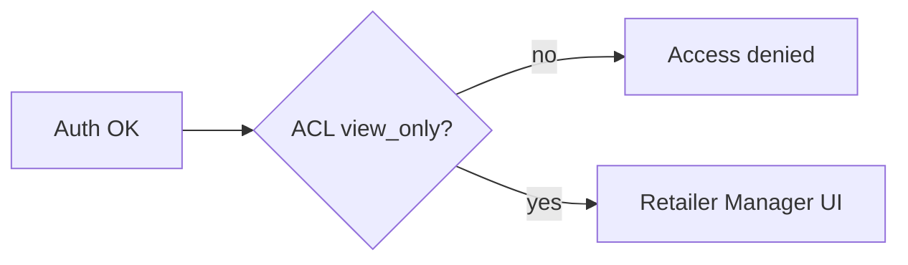
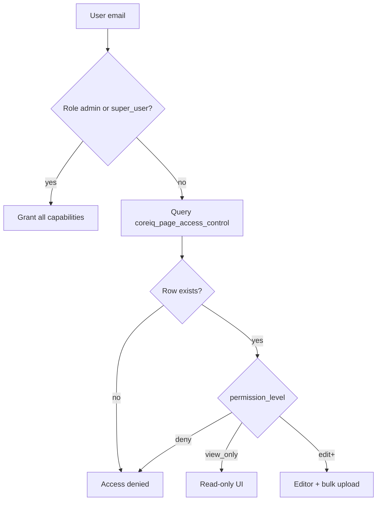
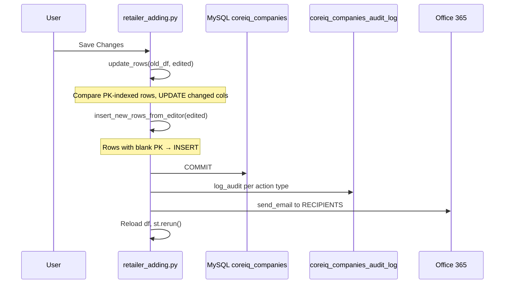
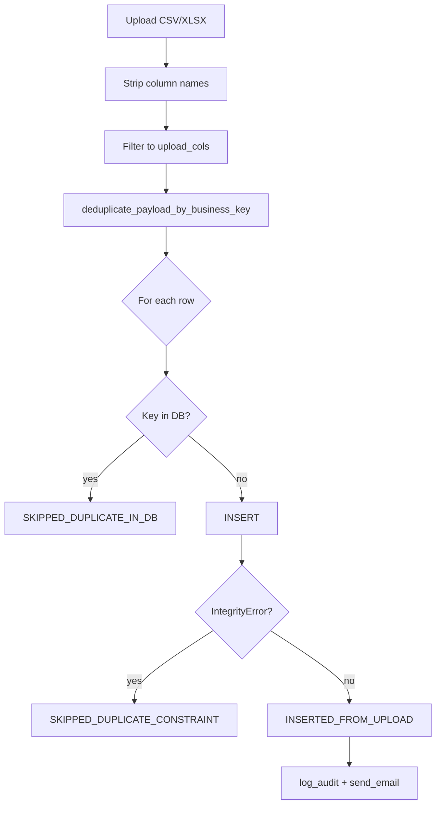
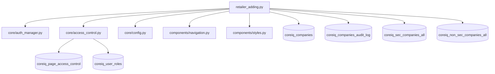

# Retailer Adding Page — Technical Documentation

**Application:** Market Data Portal (MDP)  
**Source:** `app/pages/retailer_adding.py`  
**URL path:** `/retailer_adding`  
**UI title:** Retailer Manager  
**Purpose:** CRUD and bulk upload for retail company master records in `coreiq_companies`.

---

## Overview

The Retailer Manager page lets authorized users **view, edit, insert, and bulk-upload** rows in the company master table. It is restricted to **local and staging** environments, gated by **page-level Access Control List (ACL)**, and writes an **audit trail** plus **email notifications** on successful mutations.

---

## Registration & Discovery

| Property | Value |
|----------|-------|
| Registered in `main.py` | Yes (`url_path=retailer_adding`) |
| Navigation link | Footer **Quick Links** on staging only, for `_RETAILER_ALLOWLIST` emails (`navigation.py`) |
| Header `current_page` | `retailer_manager` |

**Diagram — Part A: Route & auth**

```mermaid
%%{init: {'flowchart': {'nodeSpacing': 50, 'curve': 'basis'}}}%%
flowchart LR
    A[Footer link] --> B[/retailer_adding]
    C[Direct URL] --> B
    B --> D[require_auth]
    D --> E{LOCAL or STG?}
    E -->|no| F[→ home]
```

**Diagram — Part B: ACL gate**



---

## Authentication & Access Control

### Auth bootstrap

```python
auth_user = require_auth()
user_email = get_current_user()
```

### Environment guard

```python
if config.env not in (Environment.LOCAL, Environment.STAGING):
    st.switch_page("pages/home.py")
```

Production users are redirected to Home — the page must not run against prod DB from this entry point.

### Page ACL (`coreiq_page_access_control`)

| Check | Permission required | Effect |
|-------|---------------------|--------|
| Page entry | `view_only` | Can load page and view data |
| Edit / save / upload / download | `edit` | `CAN_EDIT_RETAILER = True` |

```python
has_access = AccessControlManager.check_access("retailer_adding", user_email, "view_only")
CAN_EDIT_RETAILER = AccessControlManager.check_access("retailer_adding", user_email, "edit")
```

**Important:** `retailer_adding` has **no default access** — users without an ACL row are denied unless they hold `admin` or `super_user` role (global bypass in `AccessControlManager.check_access`).



### Footer allowlist (navigation only)

Separate from ACL — controls **link visibility** in staging footer:

`_RETAILER_ALLOWLIST` in `navigation.py` (5 emails including `dataautomation@coresight.com`).

---

## Database Architecture

### Connection pattern

Uses **direct `pymysql`** connection — **not** `DatabaseManager` / SQLAlchemy stack used elsewhere.

| Env var | Purpose |
|---------|---------|
| `STG_DB_HOST`, `STG_DB_PORT`, `STG_DB_NAME` | MySQL target |
| `STG_DB_USER`, `STG_DB_PASSWORD` | Credentials |
| `SSL_CA`, `ENABLE_SSL` | Azure MySQL TLS |

### Primary table

**`coreiq_companies`** — company master (tickers, names, industry, exchange, source, etc.)

### Business key (unique constraint)

```text
(ticker, source, exchange_acronym)
```

Constraint name in comments: `uq_coreiq_companies_name_source`

### Audit table

**`coreiq_companies_audit_log`** — auto-created via `ensure_audit_table()` if missing.

| Column | Type | Notes |
|--------|------|-------|
| `id` | BIGINT AUTO_INCREMENT | PK |
| `event_time` | DATETIME | Default CURRENT_TIMESTAMP |
| `user_email` | VARCHAR(255) | Actor |
| `action_type` | VARCHAR(50) | e.g. UPDATE, INSERT_EDITOR, INSERT_UPLOAD |
| `table_name` | VARCHAR(255) | Default `coreiq_companies` |
| `row_count` | INT | Rows affected |
| `status` | VARCHAR(50) | SUCCESS / FAILED |
| `details` | TEXT | Truncated row summaries |
| `error_message` | TEXT | On failure |

### Reference tables (read-only union export)

| Table | Purpose |
|-------|---------|
| `coreiq_sec_companies_all` | SEC company universe |
| `coreiq_non_sec_companies_all` | Non-SEC company universe |

`build_union_df()` concatenates both with `company_source` = `SEC` / `NON_SEC` for CSV download.

---

## Column Management

### System-managed columns (never user-editable)

```python
SYSTEM_MANAGED_COLUMNS = {"data_inserted_at"}
```

Also excluded dynamically when:

- `AUTO_INCREMENT` or `GENERATED` in `INFORMATION_SCHEMA.COLUMNS.EXTRA`
- `COLUMN_DEFAULT = CURRENT_TIMESTAMP`

### Schema introspection

- `get_table_columns()` — full column metadata from `INFORMATION_SCHEMA`
- `get_primary_key_column()` — PK name (typically `id`)
- `get_pk_and_insertable_columns()` → `(pk, all_cols, upload_cols)`

`upload_cols` = insertable columns minus PK — used for bulk upload template and editor inserts.

---

## Session State

| Key | Initial | Purpose |
|-----|---------|---------|
| `df` | On load / refresh | Cached `coreiq_companies` rows |
| `df_limit` | Matches `limit` input | Invalidates cache when limit changes |
| `editor_save_in_progress` | `False` | Prevents double-submit on Save |
| `bulk_insert_in_progress` | `False` | Prevents double-submit on bulk insert |

Widget keys: `retailer_editor` (`st.data_editor`), file uploader, search input.

---

## Method 1 — Inline Editor

### Load

```python
df = load_data(int(limit))  # SELECT * FROM coreiq_companies LIMIT n
```

Default limit: 500 (UI allows 10–1000).

### Search

`filter_editor_df(df, search_text)` — case-insensitive match across all columns (stringified).

### Editor

- **`st.data_editor`** with `num_rows="dynamic"` when `CAN_EDIT_RETAILER`
- PK column disabled via `build_editor_column_config`
- Read-only `st.dataframe` for view-only users

### Save pipeline

Retailer save validates ACL, upserts company rows, and writes an audit log entry.



### `update_rows(old_df, new_df, pk, upload_cols)`

- Indexes by primary key.
- Builds `SET col=%s` for changed editable columns only.
- Normalizes compare via `normalize_for_compare()` (handles `Timestamp`, NaN, strings).

### `insert_new_rows_from_editor`

- Selects rows where PK is blank (`is_blank_value`).
- **Deduplicates** within payload by business key `(ticker, source, exchange_acronym)`.
- Skips rows already in DB (`fetch_existing_business_keys`).
- Catches `IntegrityError` for race / constraint duplicates.

### Downloads (edit permission)

| Button | Output |
|--------|--------|
| Download Screen Data (CSV) | Current edited dataframe |
| Download All SEC + NON_SEC (CSV) | `build_union_df()` |

---

## Method 2 — Bulk Upload

### Supported formats

`.xlsx`, `.csv`

### Flow

1. User uploads file → preview in `st.dataframe`
2. Invalid columns warned and ignored
3. **Insert Bulk Rows** → `insert_rows(upload_df, upload_cols)`
4. Same dedup / business-key / integrity handling as editor inserts
5. Audit + email on success

### Template

`Download Bulk Upload Template (CSV)` — empty CSV with `upload_cols` headers only.

Bulk CSV upload validates rows, inserts companies, and reports per-row results.



---

## Email Notifications

| Setting | Value |
|---------|-------|
| SMTP | `smtp.office365.com:587` |
| From | `dataautomation@coresight.com` |
| Password | `EMAIL_PASSWORD` env |
| Recipients | shashankgupta, RisthaVilinaDsa, PhilipMoore, dataautomation @ coresight.com |

Triggered on: `UPDATE`, `INSERT_EDITOR`, `INSERT_UPLOAD` when row count > 0.

Body includes action, row count, performer email, and up to 200 detail lines.

---

## UI Components

| Component | Source |
|-----------|--------|
| `hide_sidebar`, `render_styles`, `set_page_layout` | `components.styles` |
| `render_header(current_page="retailer_manager")` | `components.navigation` |
| `render_coresight_footer()` | `components.navigation` |
| Custom `.rm-card` CSS | Inline in page |

`HAS_SHARED_UI` flag — page degrades gracefully if imports fail.

---

## Error Handling

- Save failures → `log_audit(..., status="FAILED", error_message=str(e))`
- Audit logging failures → `st.warning` (non-fatal)
- Email failures → `st.warning` (non-fatal)

---

## Security Notes

1. **Staging-only env guard** — primary prod safety mechanism.
2. **ACL** — no implicit access; explicit `coreiq_page_access_control` row required (except admin/super_user).
3. **Direct pymysql** — bypasses centralized `db_manager` read/write patterns; uses manual transactions (`autocommit=False`).
4. **No DELETE UI** — users can update and insert only; no row deletion exposed.

---

## Permission Matrix

| Role / ACL | View data | Edit rows | Bulk upload | SEC+NON_SEC export |
|------------|-----------|-----------|-------------|-------------------|
| admin / super_user | Yes | Yes | Yes | Yes |
| `view_only` | Yes | No | No | No |
| `edit` / `delete_admin` / `allow` | Yes | Yes | Yes | Yes |
| No row / `deny` | No | No | No | No |

---

## Dependency Graph



---

*Generated from source analysis of the Market Data Portal (MDP). Last reviewed against codebase structure as of project documentation pass.*
