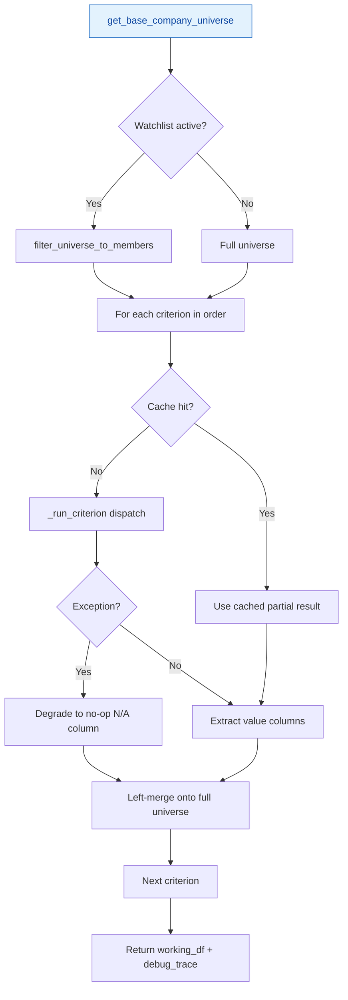
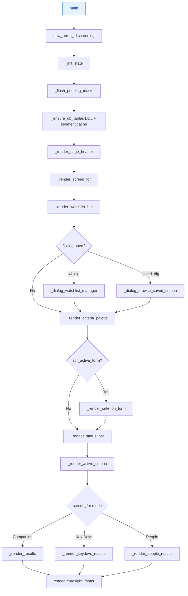
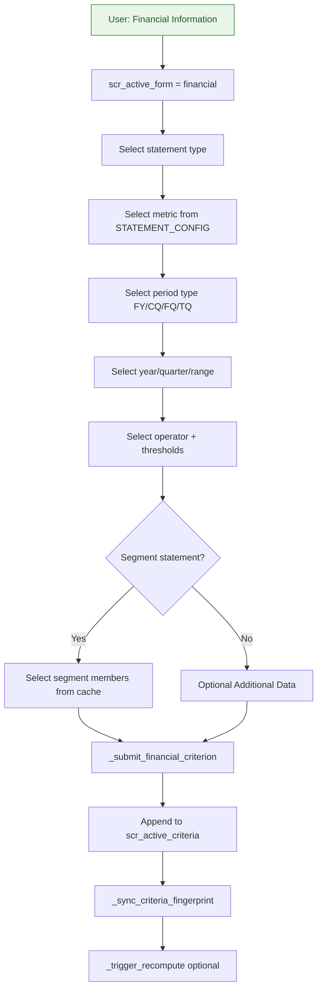
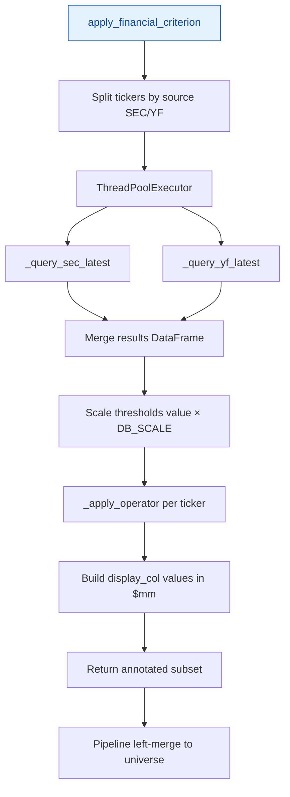
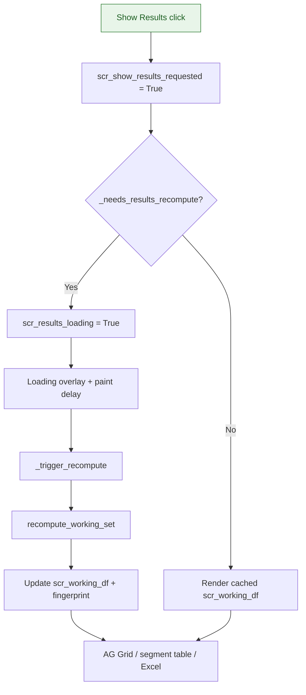
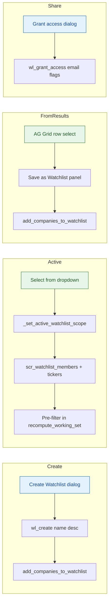
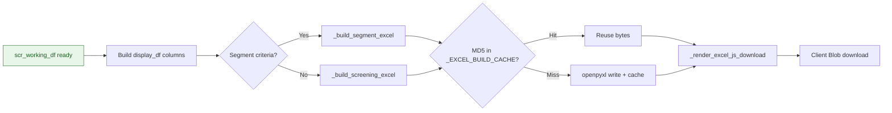
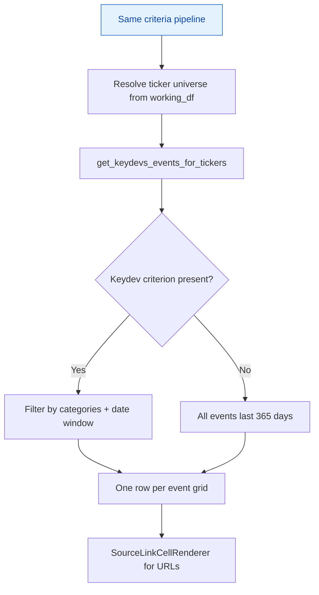
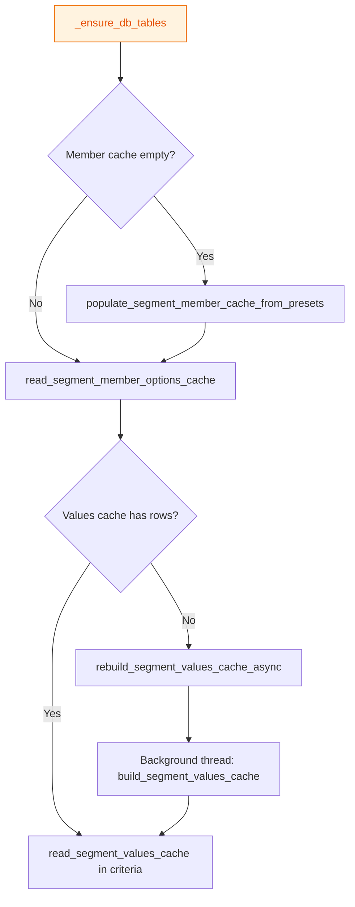

# Screening — Technical Documentation

**Application:** Market Data Portal (MDP)  
**Page module:** `app/pages/screening.py` (~6,149 lines)  
**URL route:** `/screening`  
**Registered in:** `app/main.py` as `st.Page("pages/screening.py", title="Screening", url_path="screening")`

---

## 1. Overview

The Screening page implements a **Capital IQ–style progressive screener**. Users build an ordered stack of criteria (industry, geography, financial metrics, key developments, segments, estimates, forecasts). Criteria are applied sequentially to annotate a company universe; companies that fail a filter remain in the result set with **N/A** in the metric column rather than being removed (non-filtering annotation model).

**Three active modes** (`scr_screen_for`):

| Mode | Subtitle | Results renderer |
|------|----------|------------------|
| Companies | Company Screening | `_render_results()` — AG Grid |
| Key Devs | Key Developments Screening | `_render_keydevs_results()` — event-per-row grid |
| People | People Screening | `_render_people_results()` — executive compensation table |

Additional modes (Equities, Fixed Income, Transactions, Projects/Portfolios) show a "coming soon" banner.

**Architecture principles** (from module docstring):

- All Database (DB) access delegated to `data.screening_service`
- All metric/table mappings in `data.screening_config`
- Session keys prefixed `scr_` to avoid collisions
- Criteria stack fingerprinting for cache invalidation
- Watchlists pre-filter universe before criteria run

---

## 2. URL, entry point, and dependencies

**URL:** `/screening` — no query-parameter deep linking; all state lives in `st.session_state` and optional saved-criteria database records.

**Entry point:**

```python
def main():
    new_rerun_id("screening")
    _init_state()
    _flush_pending_toasts()
    _ensure_db_tables()
    _render_page_header()
    _render_screen_for()
    # ... mode-specific UI ...
    render_coresight_footer(full_width=True, stick_to_bottom=True)

main()  # module bottom
```

### Core / auth

| Module | Symbols | Role |
|--------|---------|------|
| `core.auth_manager` | `require_auth`, `get_current_user`, `get_auth_data` | Identity via `main.py` OIDC cookie hydrate |

### Data — configuration

| Module | Symbols | Role |
|--------|---------|------|
| `data.screening_config` | `OPERATORS`, `STATEMENT_CONFIG`, `PERIOD_TYPES`, `SCREENING_YEARS`, `FORWARD_SCREENING_YEARS`, `KEYDEV_CATEGORIES_ALL`, `get_metric_labels`, `get_metric_info`, `DB_SCALE` | Single source of truth for metrics, tables, operators |

### Data — service layer

| Module | Symbols | Role |
|--------|---------|------|
| `data.screening_service` | `recompute_working_set`, `get_base_company_universe`, `apply_*_criterion`, `criteria_stack_fingerprint`, segment cache builders, key devs fetchers | All screening SQL and pipeline logic |
| `data.saved_criteria_service` | `save_criteria`, `get_user_criteria`, `update_criteria`, `delete_criteria`, grant/revoke access | Saved screening sets |
| `data.watchlist_service` | Create, Read, Update, Delete (CRUD) + access grants on watchlists | Watchlist persistence |
| `data.portal_users_service` | Portal user list | Access grant user picker |
| `data.repository` | `CompanyRepository`, `KeyStatsRepository`, `RatiosRepository`, `SegmentDataRepository`, `ExecutiveCompensationRepository` | Universe + tabular data + people mode |
| `data.source_router` | `get_company_source` | U.S. Securities and Exchange Commission (SEC) vs YFinance (service uses `companies_map["source"]` in hot path) |
| `data.segment_aliases` | `GEO_CANONICAL_GROUPS`, `canonicalize_geo_label`, `expand_geo_canonical_segments` | Geo segment normalization |
| `data.models` | `get_fiscal_quarter`, `parse_fiscal_year_end` | Fiscal Quarter (FQ) screening |

### UI components

| Module | Symbols | Role |
|--------|---------|------|
| `components.styles` | `hide_sidebar`, `set_page_layout`, `render_styles` | Layout |
| `components.navigation` | `render_header`, `render_coresight_footer` | Chrome |

**Note:** Most UI (~6k lines) is inline in `screening.py` — large `_SCREENING_CSS`, dialogs, AG Grid config, Excel builders. Only styles and navigation are shared components.

### Third-party

- `streamlit`, `pandas`, `openpyxl`
- `st_aggrid` (optional; `HAS_AGGRID` flag) — filterable grid with custom `SourceLinkCellRenderer`
- `streamlit.components.v1.html` — JS Excel download

### Utils

`utils.server_logger`: `new_rerun_id`, `log_structured_error`, `log_error`, `log_timing`, `log_info`

---

## 4. UI Components (in-page)

### 4.1 Layout regions (top → bottom)

1. **Page header** — Coresight branding; title from `_SCREEN_TITLES[scr_screen_for]`
2. **Screen For radio** — horizontal mode selector; switching resets criteria via `_reset_criteria()`
3. **Watchlist bar** — dropdown + Edit/Manage (`_render_watchlist_bar`)
4. **Dialogs** (one at a time): watchlist manager OR browse saved criteria
5. **Criteria palette** — Industry, Geography, Financial, Key Devs + "Saved Screenings"
6. **Active criterion form** — expander per type (`_render_criterion_form`)
7. **Status bar** — universe / working-set count (`_render_status_bar`)
8. **Active criteria stack** — cards with edit/remove (`_render_active_criteria`)
9. **Results** — mode-specific grid/table + Excel

### 4.2 Criteria palette (`_CRITERIA_OPTIONS`)

| Label | `type` key |
|-------|------------|
| Industry Classifications | `industry` |
| Geographic Locations | `geography` |
| Financial Information | `financial` |
| Key Developments by Category | `keydevs` |

### 4.3 Financial form (`_render_financial_form`)

Multi-step wizard:

1. Statement type (from `STATEMENT_CONFIG` keys + Key Stats, Ratios, Segments, Estimates, Forecasting)
2. Metric selectbox
3. Period type: Fiscal Year (FY), Calendar Quarter (CQ), FQ, TQ (trailing quarters)
4. Year / quarter selectors (single, range, trailing N)
5. Operator + threshold values ($mm, %, or x per metric unit)
6. Optional segment member multiselect (Business / Geographical Segments)
7. Optional **Additional Data**: Credit Ratings (S&P), Store Counts (hidden child criteria)

Widget keys: `scr_fin_stmt_sel`, `scr_fin_metric_sel`, `scr_fin_period_type_sel`, `scr_fin_year_sel`, `scr_fin_quarter_sel`, `scr_fin_op_sel`, `scr_fin_val1`, `scr_fin_val2`, etc.

### 4.4 Dialogs

| Dialog | Function | Features |
|--------|----------|----------|
| Watchlist manager | `_dialog_watchlist_manager` | Create/edit name, description, companies, sectors; per-row delete; access grants |
| Browse saved criteria | `_dialog_browse_saved_criteria` | Load, edit, delete, view detail panel |
| Save criteria | `_dialog_save_criteria` | Name + description for current stack |

### 4.5 Results grid (`_render_filterable_results_grid`)

- **AG Grid** when `HAS_AGGRID`: text filters, pinned columns (Company Name, Ticker, etc.)
- **Fallback:** `st.dataframe`
- Row selection → **Save as Watchlist** panel (`_render_save_as_watchlist_panel`)
- Segment criteria → expanded table (`_render_segment_expanded_table`) + dedicated Excel

### 4.6 Loading overlay

`_render_coresight_loading_overlay` — full-viewport Coresight logo + spinner during Show Results recompute (0.6s paint delay via `scr_results_pending_paint`).

### 4.7 Excel export

`_render_excel_download` → `_render_excel_js_download` (client-side Blob, same pattern as Market Data).

| Mode | Builder | Filename |
|------|---------|----------|
| Companies (flat) | `_build_screening_excel` | `Screening_Results_{timestamp}.xlsx` |
| Companies (segments) | `_build_segment_excel` | same |
| People | inline openpyxl | `People_Screening_{timestamp}.xlsx` |
| Key Devs | keydevs Excel builder | event export |

Module-level `_EXCEL_BUILD_CACHE` — MD5 signature keyed, bounded size.

---

## 5. Session State

All keys use `scr_` prefix unless noted.

### 5.1 Core (`_init_state` defaults)

| Key | Type | Purpose |
|-----|------|---------|
| `scr_screen_for` | str | `"Companies"` default |
| `scr_active_criteria` | list[dict] | Ordered criterion stack |
| `scr_working_df` | DataFrame \| None | Computed universe + annotation columns |
| `scr_debug_trace` | list[dict] | Per-criterion timing/metadata |
| `scr_active_form` | str \| None | Open palette form type |
| `scr_show_results` | bool | Results section visible |
| `scr_prefill` / `scr_prefill_idx` | dict / int | Edit-mode prefill |
| `scr_fin_stmt`, `scr_fin_metric`, `scr_fin_operator`, `scr_fin_timeframe` | | Financial form sub-state |
| `scr_geo_available` | bool \| None | Geography column check |
| `scr_criterion_cache` | dict | Per-criterion result cache |
| `scr_active_watchlist_id` / `scr_active_watchlist_name` | | Active watchlist scope |
| `scr_watchlist_tickers` | set \| None | Ticker set (back-compat) |
| `scr_watchlist_members` | list[(ticker, name)] | Composite identity |
| `scr_watchlist_count` | int \| None | True company count |
| `scr_db_tables_ready` | bool | DDL bootstrap once |
| `scr_results_loading` | bool | Show Results in progress |
| `scr_results_pending_paint` | bool | Overlay paint delay |
| `scr_show_results_requested` | bool | |
| `scr_results_error` | str \| None | Last pipeline error |
| `scr_criteria_fingerprint` | str \| None | Current stack hash |
| `scr_last_computed_fingerprint` | str \| None | Last successful compute hash |

### 5.2 Watchlist dialog keys

`wl_dlg_open`, `wl_dlg_mode`, `_wl_dlg_preselect`, `wl_dlg_select`, `wl_create_*`, `wl_add_co_ms_{id}`

### 5.3 Saved criteria dialog keys

`scr_saved_dlg_open`, `scr_dlg_editmode_{cid}`, `scr_dlg_confirm_del_{cid}`

### 5.4 Fallback store

`_mem_wl_data` — in-memory watchlist when DB unreachable (offline fallback)

---

## 6. Data Layer

### 6.1 `screening_config.py`

**Operators:** Greater Than, Less Than, Between, Equals, GTE, LTE → `OPERATOR_SQL` map (Between handled separately).

**Period types:** `FY`, `CQ`, `FQ`, display-only `TQ` (trailing quarters: 4, 8, 12).

**Scale:** `DB_SCALE = 1_000_000` — UI thresholds in $mm; SQL compares raw DB units.

**`STATEMENT_CONFIG`** — per statement type:

| Field | Meaning |
|-------|---------|
| `sec_table` / `yf_table` | MySQL table names |
| `sec_date_col`, `sec_period_col`, `sec_period_value` | SEC column mapping |
| `yf_date_col`, `yf_period_col`, `yf_period_value` | Yahoo Finance (YF) long-format mapping |
| `metrics[]` | `{label, sec_col, yf_item, unit}` |

**Statement types in config:**

- Income Statement, Balance Sheet, Cash Flow
- Key Stats (`tabular_market_data: True` → repository)
- Ratios
- Business Segments, Geographical Segments (`segment_statement: True`)
- Estimates, Forecasting (`forward-looking` year lists)

**Key developments:** `KEYDEV_CATEGORIES_ALL` (24 Excel-aligned DB categories), `KEYDEV_TIMEFRAMES`, alias maps for legacy migration.

### 6.2 `screening_service.py` — key functions

| Function | Role |
|----------|------|
| `get_base_company_universe()` | All companies from `CompanyRepository.get_companies_rows()` |
| `filter_universe_to_members()` | Watchlist pre-filter by `(ticker, company_name)` |
| `recompute_working_set()` | Full progressive pipeline |
| `apply_industry_criterion` / `apply_geography_criterion` | In-memory annotation |
| `apply_financial_criterion` | SEC/YF SQL + operator filter |
| `apply_key_stats_criterion` / `apply_ratios_criterion` | Repository-backed tabular |
| `apply_segment_statement_criterion` | Segment cache reads |
| `apply_estimates_criterion` / `apply_forecast_criterion` | Forward-looking tables |
| `apply_keydevs_criterion` | `coreiq_company_events` filter |
| `build_segment_values_cache` | Offline cache population |
| `get_keydevs_events_for_tickers` | Key Devs mode event fetch |
| `criteria_stack_fingerprint` | Invalidation hash |

### 6.3 `segment_aliases.py`

- `GEO_CANONICAL_GROUPS` — United States, Canada, UK, North America, Non-US, Americas
- `canonicalize_geo_label(raw)` → canonical display label
- `expand_geo_canonical_segments(canonical)` → all raw aliases for SQL `IN` clauses
- `GEO_PENSION_SKIP_LABELS` — exclude pension rows from geo revenue
- `GEO_SUPPRESSED_DROPDOWN_LABELS` — hide duplicate raw variants in UI

### 6.4 `source_router.py`

```python
get_company_source(ticker) -> 'SEC' | 'YFinance' | None
```

Composite tickers: `TSCO.L` → `ticker='TSCO'`, `exchange_acronym='L'`.

Screening service splits ticker lists by `companies_map[ticker]["source"]` and runs parallel SEC/YF queries in `ThreadPoolExecutor`.

### 6.5 Repository methods (screening-related)

| Class | Methods |
|-------|---------|
| `CompanyRepository` | `get_companies_rows()`, `get_companies_map()`, `get_all_sectors()` |
| `KeyStatsRepository` | Tabular key stats for screening |
| `RatiosRepository` | Tabular ratios |
| `SegmentDataRepository` | `_classify_segment_rows` (shared with cache build) |
| `ExecutiveCompensationRepository` | `get_sec_all_compensation()`, `get_yf_all_compensation()` |

`_get_fiscal_year_end_cached(ticker)` — FQ calendar alignment (1800s TTL).

---

## 7. Business Logic

### 7.1 Progressive pipeline (`recompute_working_set`)

Screening progressively filters the company universe — each active criterion narrows the working set.



**Non-filtering merge:** Even if `apply_financial_criterion` returns a filtered subset internally, the pipeline extracts new columns and `merge(how="left")` onto the full universe. Failed companies show **N/A**.

### 7.2 Criterion dispatch (`_run_criterion` by `type`)

| `type` | Handler |
|--------|---------|
| `industry` | `apply_industry_criterion` |
| `geography` | `apply_geography_criterion` |
| `financial` | Routed by `statement` (see below) |
| `keydevs` | `apply_keydevs_criterion` |
| `biz_segments` / `geo_segments` | Legacy segment filters |
| `additional` | `apply_additional_criterion` (credit ratings, store counts) |

**Financial `statement` routing:**

| Statement | Function |
|-----------|----------|
| Income / Balance / Cash Flow | `apply_financial_criterion` |
| Key Stats | `apply_key_stats_criterion` |
| Ratios | `apply_ratios_criterion` |
| Business / Geographical Segments | `apply_*_segments_statement_criterion` |
| Estimates | `apply_estimates_criterion` |
| Forecasting | `apply_forecast_criterion` |

### 7.3 Financial criterion dict shape

```python
{
    "type": "financial",
    "statement": "Income Statement",
    "metric_info": {...},       # from screening_config
    "metric_label": "Total Revenue",
    "operator": "Greater Than",
    "value1": 1000.0,           # $mm in UI
    "value2": 0.0,              # Between only
    "period_type": "FY",        # FY|CQ|FQ|TQ
    "quarter": "Q1",            # CQ/FQ
    "year": 2024,               # or "Latest"
    "timeframe": "FY 2024",
    "display_col": "Total Revenue FY 2024",
    "summary": "human-readable",
    # optional:
    "num_quarters": 8,            # TQ mode
    "year_range": [2020, 2024],
    "quarter_range": {...},
    "segment_type": "business",
    "selected_segments": ["North America"],
}
```

**Threshold scaling:** User $mm × `DB_SCALE` before `_apply_operator`. Equals uses $1 raw tolerance.

### 7.4 Show Results flow

1. User clicks **Show Results** → `scr_show_results_requested = True`
2. `_needs_results_recompute()` compares fingerprints
3. If stale: `_trigger_recompute()` → `recompute_working_set()`
4. Loading overlay + 0.6s paint delay
5. `_render_results()` reads `scr_working_df`

**Add Criteria** on most types triggers immediate `_trigger_recompute()` (background); financial add may defer on failure.

### 7.5 Watchlist CRUD

**DB tables:** `coreiq_watchlists`, `coreiq_watchlist_access`, `coreiq_watchlist_companies`

**Unique key:** `(watchlist_id, ticker, company_name)` — disambiguates shared tickers (JD, TSCO, LULU).

| Operation | Service function | Page wrapper |
|-----------|------------------|--------------|
| Create | `create_watchlist` | `wl_create` |
| List | `get_user_watchlists` | `wl_get_all` |
| Get companies | `get_watchlist_companies` | `wl_get_companies` |
| Add companies | `add_companies_to_watchlist` | `wl_add_companies` |
| Remove | `remove_company_from_watchlist` | `wl_remove_company` |
| Replace all | `replace_watchlist_companies` | `wl_replace_companies` |
| Update metadata | `update_watchlist` | `wl_update` |
| Delete | `delete_watchlist` | `wl_delete` |
| Grant/revoke | `grant_watchlist_access`, `revoke_watchlist_access` | `wl_grant_access`, `wl_revoke_access` |

**Access Control List (ACL) model:** All watchlists visible to logged-in users; `is_owner`, `can_edit`, `can_delete` per row. Grants via `coreiq_watchlist_access`.

**In-memory fallback:** `_InMemoryWatchlistStore` when DB unreachable.

### 7.6 Saved criteria CRUD

**DB tables:** `coreiq_saved_criteria`, `coreiq_saved_criteria_access`

- `criteria_json` stores full `scr_active_criteria` list
- Load replaces stack + `_trigger_recompute()`
- Same owner/grant ACL model as watchlists

### 7.7 Fingerprints

- `_criterion_fingerprint(criterion)` — JSON excluding ephemeral fields (`summary`, `display_col`, `quarter_cols`, `year_cols`)
- `criteria_stack_fingerprint(criteria, allowed_tickers, allowed_members)` — full stack + watchlist scope

---

## 8. Structured Query Language (SQL) and Query Patterns

### 8.1 Company universe

```sql
SELECT ticker, name, name_coresight, exchange, source, exchange_acronym,
       primary_industry_coresight, country_of_incorporation
FROM coreiq_companies;
```

### 8.2 SEC financial latest (`_query_sec_latest`)

```sql
SELECT ticker, {col} AS metric_value FROM (
  SELECT ticker, {col},
         ROW_NUMBER() OVER (PARTITION BY ticker ORDER BY {date_col} DESC) AS rn
  FROM {sec_table}
  WHERE ticker IN ({sanitized_list})
    AND {period_col} = 'annual'  -- or 'quarterly'
    AND {col} IS NOT NULL
) ranked WHERE rn = 1;
```

Variants: year `BETWEEN`, CQ with `QUARTER(date_col) = N`, FQ with fiscal year-end logic.

### 8.3 YF financial (`_query_yf_latest`)

Same `ROW_NUMBER` pattern on long-format tables:

```sql
WHERE line_item = '{yf_item}' AND frequency = 'annual'
```

### 8.4 Ticker IN safety (`_build_ticker_in_list`)

Whitelist sanitize: `[A-Za-z0-9.\-/]`, max length 20 per ticker.

### 8.5 Key developments

```sql
SELECT DISTINCT ticker FROM coreiq_company_events
WHERE ticker IN (...)
  AND event_category IN (...)
  {date_clause}
```

With headlines: `ROW_NUMBER() OVER (PARTITION BY ticker ORDER BY event_date DESC, event_id DESC)`.

### 8.6 Segment values cache

```sql
SELECT ticker, member_label, report_fiscal_year, value_mm
FROM coreiq_screening_segment_values_cache
WHERE ticker IN (...)
  AND segment_type = :type
  AND metric_key = :metric
```

**Cache build:** Bulk fetch `coreiq_filing_metrics_v5` per ticker chunk → `SegmentDataRepository._classify_segment_rows` → bulk `INSERT`.

### 8.7 People mode compensation

```sql
SELECT ticker, executive_name, position, compensation_year,
       salary, bonus, stock_awards, total_compensation
FROM coreiq_executives_compensation
WHERE ticker IN (...)
ORDER BY ticker, compensation_year DESC;
```

Parallel SEC + YF fetches via `ThreadPoolExecutor`.

### 8.8 Database tables summary

| Table | Role |
|-------|------|
| `coreiq_companies` | Universe, source, sector, country |
| `coreiq_av_financials_*` / `coreiq_yf_financials_*` | Financial criteria |
| `coreiq_model_forecasts` | Forecasting criteria |
| `coreiq_av_financials_earnings_estimates` / YF equivalent | Estimates |
| `coreiq_filing_metrics_v5` | Segment source + additional data |
| `coreiq_company_events` | Key developments |
| `coreiq_executives_compensation` | People mode |
| `coreiq_screening_segment_values_cache` | Precomputed segment metrics |
| `coreiq_screening_segment_member_cache` | Segment dropdown members |
| `coreiq_watchlists`, `coreiq_watchlist_companies`, `coreiq_watchlist_access` | Watchlists |
| `coreiq_saved_criteria`, `coreiq_saved_criteria_access` | Saved screenings |

---

## 9. Caching

### 9.1 Page-level (`screening.py`)

| Function | TTL | Purpose |
|----------|-----|---------|
| `_cached_user_criteria` | 30s | Saved criteria list |
| `_cached_user_watchlists` | 30s | Watchlist list |
| `_cached_portal_users` | 300s | Access grant picker |

Cleared via `_invalidate_criteria_cache()` / `_invalidate_watchlist_cache()` on writes.

### 9.2 Service-level (`screening_service.py`)

| Data | TTL |
|------|-----|
| `_get_segment_names_cached` | 1800s |
| `get_all_countries` | 3600s |
| `read_segment_member_options_cache` | 300s |
| `get_keydevs_events_for_tickers` | 300s |
| Estimates/forecast/additional helpers | 1800s |

### 9.3 Repository

| Function | TTL |
|----------|-----|
| `get_companies_rows()` | 3600s |
| `get_companies_map()` | 3600s (derived) |
| `_get_fiscal_year_end_cached` | 1800s |

### 9.4 Session-level

- `scr_criterion_cache` — keyed by `(criterion_fingerprint, frozenset(universe_tickers))`
- `_EXCEL_BUILD_CACHE` — module-level MD5 keyed
- Watchlist service: 120s session TTL per user email

### 9.5 Startup prewarm (`main.py`)

Background thread ensures watchlist, saved_criteria, portal_users DDL before first visit.

---

## 10. Error Handling

| Pattern | Behavior |
|---------|----------|
| `try/except` + `log_structured_error` | All major functions |
| User generic | `"Something went wrong. Please try again."` |
| Results failure | `"Could not load screening results. Please check logs."` |
| Segment cache miss | `SEGMENT_CACHE_UNAVAILABLE_MESSAGE` warning; background rebuild |
| Single criterion failure | Degrade to no-op; universe preserved |
| Watchlist DB down | `_InMemoryWatchlistStore` fallback |
| `DEBUG` enabled | Technical details in expander (diagnostics) |
| Toasts | `_queue_toast` / `_flush_pending_toasts` survive reruns |

---

## 11. ACL (Access Control)

### 11.1 Page access

- Identity via `main.py` OIDC cookie hydrate; optional `require_auth(page="screening")` at page level
- No `coreiq_page_access_control` check for `"screening"`

### 11.2 Watchlist ACL

- All active watchlists visible to authenticated users
- Owner: full edit/delete; grants via `coreiq_watchlist_access` (`can_edit`, `can_delete`)
- UI disables actions when permissions false

### 11.3 Saved criteria ACL

- Same owner/grant model as watchlists
- Non-owners get read-only **View** in browse dialog

---

## 12. Flowcharts

### 12.1 Page load

End-to-end user journeys on this page, from load through interaction to data fetch.



### 12.2 Criteria build (financial)



### 12.3 SQL execution (financial criterion)



### 12.4 Show Results / recompute



### 12.5 Watchlist CRUD



### 12.6 Export flow

Export builds a CSV from the current working set and triggers a browser download.



### 12.7 Key Devs mode



### 12.8 Segment cache lifecycle



---

## 13. Feature reference

### 13.1 Companies mode

- Progressive criteria stack with non-filtering N/A columns
- Industry (in-memory sector match), Geography (in-memory country match)
- Financial: all statement types in `STATEMENT_CONFIG` + Key Stats, Ratios, Segments, Estimates, Forecasting
- Key Devs criterion annotates/filter-marks companies with matching events
- AG Grid with filters; row selection → watchlist save
- Segment expanded view + dedicated Excel when segment criteria active

### 13.2 Key Devs mode

- Reuses company universe from criteria pipeline
- One row per event (not per company)
- Columns: date, type, company name(s), headline, summary, sources, link
- Default: last 365 days, all categories if no keydev criterion

### 13.3 People mode

- Industry + geography (+ optional financial) narrow universe
- All historical executive compensation (SEC detail + YF total pay)
- Year filter dropdown; dynamic money columns
- Excel sheet "People"

### 13.4 Saved Screenings

- Save/load/edit/delete criteria sets with sharing grants
- Detail panel with per-filter inline edit

### 13.5 Segment screening specifics

- Requires `coreiq_screening_segment_values_cache`
- Geo members canonicalized via `segment_aliases`
- Metrics: Revenues, Operating Profit Before Tax, Assets, D&A, Capex
- Admin cache status in financial form; async rebuild on empty cache

---

### Related configuration files

| File | Do not duplicate logic in page |
|------|-------------------------------|
| `app/data/screening_config.py` | All metric → table/column mappings |
| `app/data/screening_service.py` | All SQL and pipeline logic |
| `app/data/segment_aliases.py` | Geo canonical groups only |
| `app/data/watchlist_service.py` | Watchlist persistence |
| `app/data/saved_criteria_service.py` | Saved criteria persistence |

---

*Generated from source analysis of `app/pages/screening.py` and traced dependencies. Last reviewed against codebase structure as of project documentation pass.*
